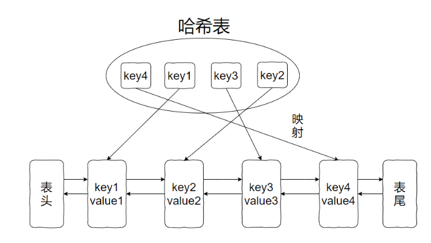

LRU 算法，全称是Least Recently Used。

翻译过来就是最近最少使用算法。

这个算法的思想就是：**如果一个数据在最近一段时间没有被访问到，那么在将来它被访问的可能性也很小。所以，当指定的空间已存满数据时，应当把最久没有被访问到的数据淘汰。**

## 实现LRU算法

如果我们想要查询和插入的时间复杂度都是 O(1)，那么我们需要一个满足下面三个条件的数据结构：

1. 首先这个数据结构必须是有时序的，以区分最近使用的和很久没有使用的数据，当容量满了之后，要删除最久未使用的那个元素。
2. 要在这个数据结构中快速找到某个 key 是否存在，并返回其对应的 value。
3. 每次访问这个数据结构中的某个 key，需要将这个元素变为最近使用的。也就是说，这个数据结构要支持在任意位置快速插入和删除元素。

查找快，我们能想到哈希表。但是哈希表的数据是乱序的。

有序，我们能想到链表，插入、删除都很快，但是查询慢。

**所以，我们得让哈希表和链表结合一下，成长一下，形成一个新的数据结构，那就是：哈希链表，LinkedHashMap。**

借助这个结构，我们再来分析一下上面的三个条件：

1. 如果每次默认从链表尾部添加元素，那么显然越靠近尾部的元素就越是最近使用的。越靠近头部的元素就是越久未使用的。
2. 对于某一个 key ，可以通过哈希表快速定位到链表中的节点，从而取得对应的 value。
3. 链表显示是支持在任意位置快速插入和删除的，修改指针就行。但是单链表无非按照索引快速访问某一个位置的元素，都是需要遍历链表的，所以这里借助哈希表，可以通过 key，快速的映射到任意一个链表节点，然后进行插入和删除。

**为什么用双链表？单链表为什么不行？**

> 因为如果要求删除操作时间复杂度为O(1)，那么删除操作需要用到前驱节点的指针，所以需要用到双链表。

**哈希表里面已经保存了 key ，那么链表中为什么还要存储 key 和 value 呢，只存入 value 不就行了？**

> 删除了链表，对应的哈希表也需要做删除操作，怎么找到需要删除的value？需要通过key

## LRU在Redis中的应用

既然是内存淘汰算法，那么我们常用的 Redis 里面必然也有对应的实现。

Redis 的内存淘汰策略有如下几种：

 - noenviction：默认策略。不继续执行写请求（DEL 请求可以处理），读请求可以继续进行。
 - volatile-lru：从已设置过期时间的数据集中挑选最近最少使用的数据淘汰。没有设置过期时间的 key 不会被淘汰。
 - volatile-random：从已设置过期时间的数据集中随机选择数据淘汰。
 - volatile-ttl：从已设置过期时间的数据集中挑选将要过期的数据淘汰。
 - allkeys-lru：和 volatile-lru 不同的是，这个策略要淘汰的 key 对象是全体的 key 集合。
 - allkeys-random：从所有数据集中随机选择数据淘汰。

这里有一个面试题：**MySQL⾥有2000w数据，Redis中只存20w的数据，如何保证Redis中的数据都是热点数据?**

这个题你说它的考点是什么？

考的就是淘汰策略，我们先指定淘汰策略为 allkeys-lru 或者 volatile-lru，然后再计算一下 100w 数据大概占用多少内存，根据算出来的内存，限定 Redis 占用的内存。

接下来的，就交给 Redis 的淘汰策略了。

搞定。

