在了解一致性哈希算法之前，最好先了解一下缓存中的一个应用场景，了解了这个应用场景之后，再来理解一致性哈希算

法，就容易多了，也更能体现出一致性哈希算法的优点，那么，我们先来描述一下这个经典的分布式缓存的应用场景。

## 场景描述

假设，我们有三台缓存服务器，用于缓存图片，我们为这三台缓存服务器编号为0号、1号、2号，现在，有3万张图片需要

缓存，我们希望这些图片被均匀的缓存到这3台服务器上，以便它们能够分摊缓存的压力。也就是说，我们希望每台服务

器能够缓存1万张左右的图片，那么，我们应该怎样做呢？

如果我们没有任何规律的将3万张图片平均的缓存在3台服务器上，可以满足我们的要求吗？可以！但是如果这样做，当我

们需要访问某个缓存项时，则需要遍历3台缓存服务器，从3万个缓存项中找到我们需要访问的缓存，遍历的过程效率太

低，时间太长，当我们找到需要访问的缓存项时，时长可能是不能被接受的，也就失去了缓存的意义，缓存的目的就是提

高速度，改善用户体验，减轻后端服务器压力，如果每次访问一个缓存项都需要遍历所有缓存服务器的所有缓存项，想想

就觉得很累，那么，我们该怎么办呢？

原始的做法是对缓存项的键进行哈希，将hash后的结果对缓存服务器的数量进行取模操作，通过取模后的结果，决定缓存

项将会缓存在哪一台服务器上，这样说可能不太容易理解，我们举例说明，仍然以刚才描述的场景为例，假设我们使用图

片名称作为访问图片的key，假设图片名称是不重复的，那么，我们可以使用如下公式，计算出图片应该存放在哪台服务

器上。

```shell
hash（图片名称）% N
```

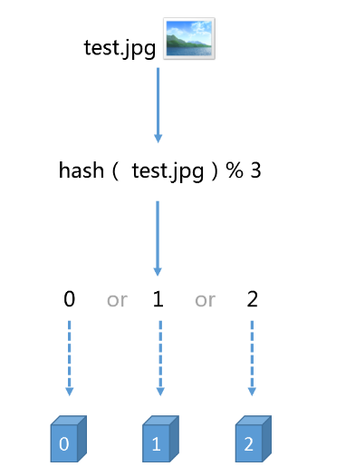

## 问题描述

但是，使用上述HASH算法进行缓存时，会出现一些缺陷，试想一下，如果3台缓存服务器已经不能满足我们的缓存需求，

那么我们应该怎么做呢？

没错，很简单，多增加两台缓存服务器不就行了，假设，我们增加了一台缓存服务器，那么缓存服务器的数量就由3台变

成了4台，此时，如果仍然使用上述方法对同一张图片进行缓存，那么这张图片所在的服务器编号必定与原来3台服务器时

所在的服务器编号不同，因为除数由3变为了4，被除数不变的情况下，余数肯定不同，这种情况带来的结果就是当服务器

数量变动时，所有缓存的位置都要发生改变，换句话说，当服务器数量发生改变时，所有缓存在一定时间内是失效的，当

应用无法从缓存中获取数据时，则会向后端服务器请求数据。

同理，假设3台缓存中突然有一台缓存服务器出现了故障，无法进行缓存，那么我们则需要将故障机器移除，但是如果移

除了一台缓存服务器，那么缓存服务器数量从3台变为2台，如果想要访问一张图片，这张图片的缓存位置必定会发生改

变，以前缓存的图片也会失去缓存的作用与意义，由于大量缓存在同一时间失效，造成了缓存的雪崩，此时前端缓存已经

无法起到承担部分压力的作用，后端服务器将会承受巨大的压力，整个系统很有可能被压垮，所以，我们应该想办法不让

这种情况发生，但是由于上述HASH算法本身的缘故，使用取模法进行缓存时，这种情况是无法避免的，为了解决这些问

题，一致性哈希算法诞生了。

我们来回顾一下使用上述算法会出现的问题。

问题1：当缓存服务器数量发生变化时，会引起缓存的雪崩，可能会引起整体系统压力过大而崩溃（大量缓存同一时间失效）。

问题2：当缓存服务器数量发生变化时，几乎所有缓存的位置都会发生改变，怎样才能尽量减少受影响的缓存呢？

其实，上面两个问题是一个问题，那么，一致性哈希算法能够解决上述问题吗？

我们现在就来了解一下一致性哈希算法。

## 一致性哈希算法的基本概念

一致性hash算法通过一个叫作**一致性hash环**的数据结构实现。这个环的起点是0，终点是2^32 - 1，并且起点与终点连

接，环的中间的整数按逆时针分布，故这个环的整数分布范围是[0, 2^32-1]，如下图3所示：

[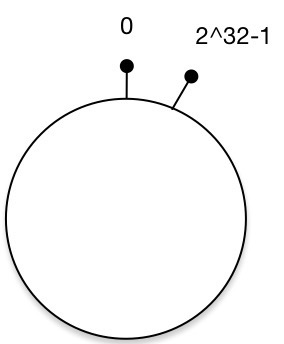](https://leehao.oss-cn-shenzhen.aliyuncs.com/2019-06-03-141908.jpg)

图3：一致性Hash环

那么，一致性哈希算法与上图中的圆环有什么关系呢？我们继续聊，仍然以之前描述的场景为例，假设我们有3台缓存服

务器，服务器A、服务器B、服务器C，那么，在生产环境中，这三台服务器肯定有自己的IP地址，我们使用它们各自的IP

地址进行哈希计算，使用哈希后的结果对2^32取模，可以使用如下公式示意。

```
hash（服务器A的IP地址） %  2^32
```

通过上述公式算出的结果一定是一个0到2^32-1之间的一个整数，我们就用算出的这个整数，代表服务器A，既然这个整数

肯定处于0到2^32-1之间，那么，上图中的hash环上必定有一个点与这个整数对应，而我们刚才已经说明，使用这个整数

代表服务器A，那么，服务器A就可以映射到这个环上，用下图示意

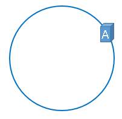

同理，服务器B与服务器C也可以通过相同的方法映射到上图中的hash环中

```
hash（服务器B的IP地址） %  2^32

hash（服务器C的IP地址） %  2^32
```

通过上述方法，可以将服务器B与服务器C映射到上图中的hash环上，示意图如下

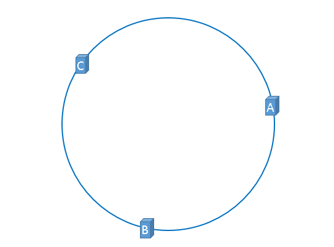

假设3台服务器映射到hash环上以后如上图所示（当然，这是理想的情况，我们慢慢聊）。 

好了，到目前为止，我们已经把缓存服务器与hash环联系在了一起，我们通过上述方法，把缓存服务器映射到了hash环

上，那么使用同样的方法，我们也可以需要缓存的对象映射到hash环上。 

假设，我们需要使用缓存服务器缓存图片，而且我们仍然使用图片的名称作为找到图片的key，那么我们使用如下公式可

以将图片映射到上图中的hash环上。

```
hash（图片名称） %  2^32
```

映射后的示意图如下，下图中的橘黄色圆形表示图片

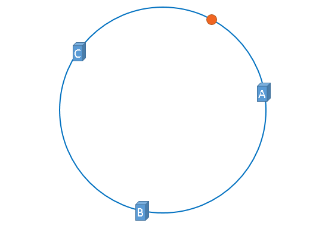

好了，现在服务器与图片都被映射到了hash环上，那么上图中的这个图片到底应该被缓存到哪一台服务器上呢？上图中的

图片将会被缓存到服务器A上，为什么呢？因为从图片的位置开始，沿顺时针方向遇到的第一个服务器就是A服务器，所

以，上图中的图片将会被缓存到服务器A上，如下图所示。

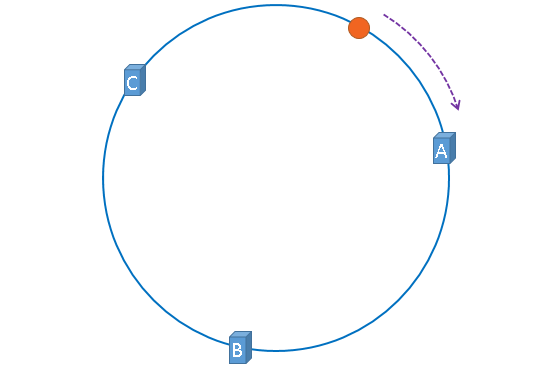

没错，一致性哈希算法就是通过这种方法，判断一个对象应该被缓存到哪台服务器上的，将缓存服务器与被缓存对象都映

射到hash环上以后，从被缓存对象的位置出发，沿顺时针方向遇到的第一个服务器，就是当前对象将要缓存于的服务器，

由于被缓存对象与服务器hash后的值是固定的，所以，在服务器不变的情况下，一张图片必定会被缓存到固定的服务器

上，那么，当下次想要访问这张图片时，只要再次使用相同的算法进行计算，即可算出这个图片被缓存在哪个服务器上，

直接去对应的服务器查找对应的图片即可。

刚才的示例只使用了一张图片进行演示，假设有四张图片需要缓存，示意图如下

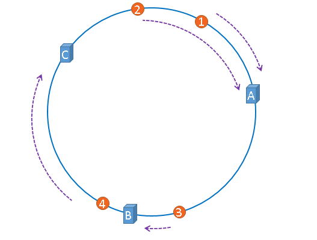

1号、2号图片将会被缓存到服务器A上，3号图片将会被缓存到服务器B上，4号图片将会被缓存到服务器C上。

## 一致性哈希算法的优点

经过上述描述，我想兄弟你应该已经明白了一致性哈希算法的原理了，但是话说回来，一致性哈希算法能够解决之前出现

的问题吗，我们说过，如果简单的对服务器数量进行取模，那么当服务器数量发生变化时，会产生缓存的雪崩，从而很有

可能导致系统崩溃，那么使用一致性哈希算法，能够避免这个问题吗？我们来模拟一遍，即可得到答案。假设，服务器B

出现了故障，我们现在需要将服务器B移除，那么，我们将上图中的服务器B从hash环上移除即可，移除服务器B以后示意

图如下。

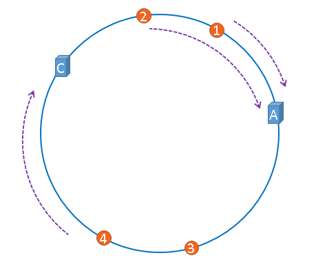

在服务器B未移除时，图片3应该被缓存到服务器B中，可是当服务器B移除以后，按照之前描述的一致性哈希算法的规

则，图片3应该被缓存到服务器C中，因为从图片3的位置出发，沿顺时针方向遇到的第一个缓存服务器节点就是服务器C，

也就是说，如果服务器B出现故障被移除时，图片3的缓存位置会发生改变

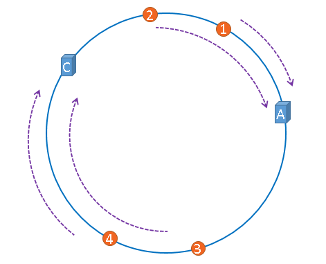

但是，图片4仍然会被缓存到服务器C中，图片1与图片2仍然会被缓存到服务器A中，这与服务器B移除之前并没有任何区

别，这就是一致性哈希算法的优点，如果使用之前的hash算法，服务器数量发生改变时，所有服务器的所有缓存在同一时

间失效了，而使用一致性哈希算法时，服务器的数量如果发生改变，并不是所有缓存都会失效，而是只有部分缓存会失

效，前端的缓存仍然能分担整个系统的压力，而不至于所有压力都在同一时间集中到后端服务器上。

这就是一致性哈希算法所体现出的优点。

## hash环的倾斜

在介绍一致性哈希的概念时，我们理想化的将3台服务器均匀的映射到了hash环上，如下图所示

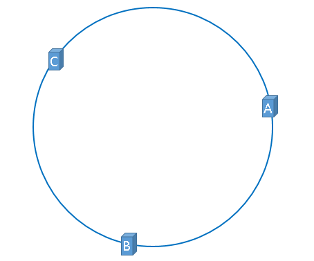

但是，理想很丰满，现实很骨感，我们想象的与实际情况往往不一样。

在实际的映射中，服务器可能会被映射成如下模样。

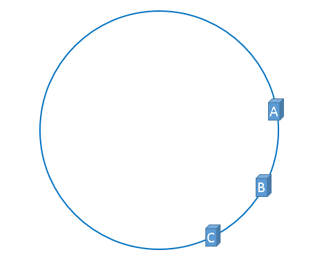

聪明如你一定想到了，如果服务器被映射成上图中的模样，那么被缓存的对象很有可能大部分集中缓存在某一台服务器

上，如下图所示。

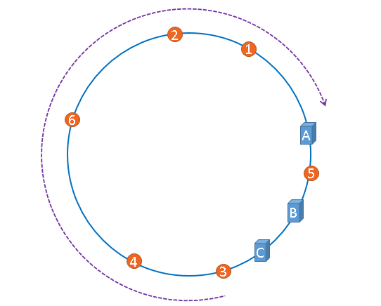

上图中，1号、2号、3号、4号、6号图片均被缓存在了服务器A上，只有5号图片被缓存在了服务器B上，服务器C上甚至没

有缓存任何图片，如果出现上图中的情况，A、B、C三台服务器并没有被合理的平均的充分利用，缓存分布的极度不均

匀，而且，如果此时服务器A出现故障，那么失效缓存的数量也将达到最大值，在极端情况下，仍然有可能引起系统的崩

溃，上图中的情况则被称之为hash环的偏斜，那么，我们应该怎样防止hash环的偏斜呢？一致性hash算法中使用”虚拟节

点”解决了这个问题，我们继续聊。

## 虚拟节点

话接上文，由于我们只有3台服务器，当我们把服务器映射到hash环上的时候，很有可能出现hash环偏斜的情况，当hash

环偏斜以后，缓存往往会极度不均衡的分布在各服务器上，聪明如你一定已经想到了，如果想要均衡的将缓存分布到3台

服务器上，最好能让这3台服务器尽量多的、均匀的出现在hash环上，但是，真实的服务器资源只有3台，我们怎样凭空的

让它们多起来呢，没错，就是凭空的让服务器节点多起来，既然没有多余的真正的物理服务器节点，我们就只能将现有

的物理节点通过虚拟的方法复制出来，这些由实际节点虚拟复制而来的节点被称为”虚拟节点”。加入虚拟节点以后的hash

环如下。“虚拟节点”是”实际节点”（实际的物理服务器）在hash环上的复制品,一个实际节点可以对应多个虚拟节点。

从上图可以看出，A、B、C三台服务器分别虚拟出了一个虚拟节点，当然，如果你需要，也可以虚拟出更多的虚拟节点。

引入虚拟节点的概念后，缓存的分布就均衡多了，上图中，1号、3号图片被缓存在服务器A中，5号、4号图片被缓存在服

务器B中，6号、2号图片被缓存在服务器C中，如果你还不放心，可以虚拟出更多的虚拟节点，以便减小hash环偏斜所带

来的影响，虚拟节点越多，hash环上的节点就越多，缓存被均匀分布的概率就越大。

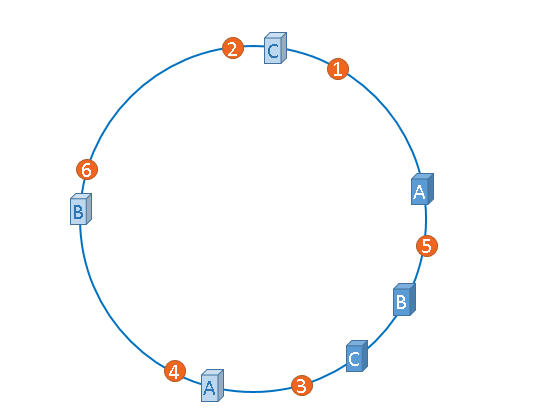

原文链接：[白话解析：一致性哈希算法 consistent hashing](https://www.zsythink.net/archives/1182)

