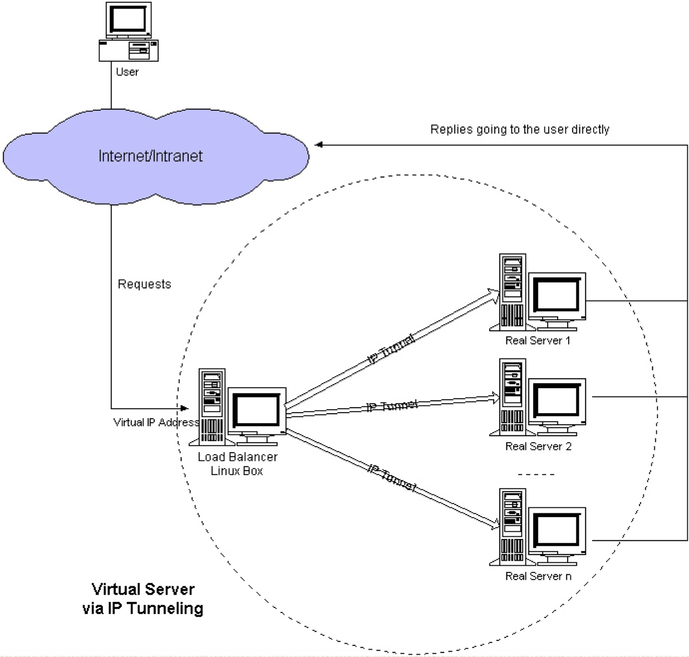

LVS自从1998年开始，发展到现在已经是一个比较成熟的技术项目了。可以利用LVS技术实现高可伸缩的、高可用的网络服务，例如WWW服务、Cache服务、DNS服务、FTP服务、MAIL服务、视频/音频点播服务等等，有许多比较著名网站和组织都在使用LVS架设的集群系统，例如：[Linux的门户网站](http://byteliu.com/2016/09/23/LVS简介及使用/www.linux.com)、向RealPlayer提供音频视频服务而闻名的[Real公司](http://byteliu.com/2016/09/23/LVS简介及使用/www.real.com)、全球最大的开源网站[sourceforge](http://byteliu.com/2016/09/23/LVS简介及使用/sourceforge.net)等。

## LVS是什么？

LVS是Linux Virtual Server的简称，也就是Linux虚拟服务器, 是一个由章文嵩博士发起的自由软件项目，它的官方站点是 [www.linuxvirtualserver.org](http://www.linuxvirtualserver.org/) 。现在LVS已经是 Linux标准内核的一部分，在Linux2.4内核以前，使用LVS时必须要重新编译内核以支持LVS功能模块，但是从Linux2.4内核以后，已经完全内置了LVS的各个功能模块，无需给内核打任何补丁，可以直接使用LVS提供的各种功能。
使用LVS技术要达到的目标是：通过LVS提供的负载均衡技术和Linux操作系统实现一个高性能、高可用的服务器群集，它具有良好可靠性、可扩展性和可操作性。从而以低廉的成本实现最优的服务性能。

## LVS能干什么？

LVS主要用于多服务器的负载均衡。它工作在网络层，可以实现高性能，高可用的服务器集群技术。它廉价，可把许多低性能的服务器组合在一起形成一个超级服务器。它易用，配置非常简单，且有多种负载均衡的方法。它稳定可靠，即使在集群的服务器中某台服务器无法正常工作，也不影响整体效果。另外可扩展性也非常好。

## Lvs的相关术语

| 简称 |        全称        |                解释                |
| :--: | :----------------: | :--------------------------------: |
|  DS  |  Director Server   |      目标服务器，即负载均衡器      |
|  RS  |    Real Server     |      真实服务器，即后端服务器      |
| VIP  | Vrtual IP Address  | 直接面向用户的IP地址，通常为公网IP |
| DIP  | Director Server IP |   主要用于和内部主机通信的IP地址   |
| RIP  |   Real Server IP   |       后端真实服务器的IP地址       |
| CIP  |     Client IP      |                                    |

## 工作原理

如上图，LVS可分为三部分：

1. Load Balancer：这是LVS的核心部分，它好比我们网站MVC模型的Controller。它负责将客户的请求按照一定的算法分发到下一层不同的服务器进行处理，自己本身不做具体业务的处理。另外该层还可用监控下一层的状态，如果下一层的某台服务器不能正常工作了，它会自动把其剔除，恢复后又可用加上。该层由一台或者几台Director Server组成。
2. Server Array：该层负责具体业务。可有WEB Server、mail Server、FTP Server、DNS Server等组成。注意，其实上层的Director Server也可以当Real server用的。
3. Shared Storage：主要是提高上一层数据和为上一层保持数据一致。

## 负载均衡机制

前面我们说了LVS是工作在网络层。相对于其它负载均衡的解决办法，比如DNS域名轮流解析、应用层负载的调度、客户端的调度等，它的效率是非常高的。LVS

的通过控制IP来实现负载均衡。IPVS是其具体的实现模块。IPVS的主要作用：安装在Director Server上面，在Director Server虚拟一个对外访问的IP（VIP）。用

户访问VIP，到达Director Server，Director Server根据一定的规则选择一个Real Server，处理完成后然后返回给客户端数据。这些步骤产生了一些具体的问题，

比如如何选择具体的Real Server，Real Server如果返回给客户端数据等等。IPVS为此有三种机制:

### VS/NAT(VIRTUAL SERVER VIA NETWORK ADDRESS TRANSLATION)

即网络地址翻转技术实现虚拟服务器。当请求来到时，Diretor server上处理的程序将数据报文中的目标地址（即虚拟IP地址）改成具体的某台Real Server,端口也

改成Real Server的端口，然后把报文发给Real Server。Real Server处理完数据后，需要返回给Diretor Server，然后Diretor server将数据包中的源地址和源端口

改成VIP的地址和端口，最后把数据发送出去。由此可以看出，用户的请求和返回都要经过Diretor Server，如果数据过多，Diretor Server肯定会不堪重负。

特点和要求：

- LVS（Director）上面需要双网卡：DIP(内网)和VIP（外网）
- 内网的Real Server主机的IP必须和DIP在同一个网络中，并且要求其网关都需要指向DIP的地址
- RIP都是私有IP地址，仅用于各个节点之间的通信
- Director位于client和Real Server之间，负载处理所有的进站、出站的通信
- 支持端口映射
- 通常应用在较大规模的应用场景中，但Director易成为整个架构的瓶颈！

### VS/TUN（VIRTUAL SERVER VIA IP TUNNELING）

即IP隧道技术实现虚拟服务器。它跟VS/NAT基本一样，但是Real server是直接返回数据给客户端，不需要经过Diretor server,这大大降低了Diretor server的压力。

- 优点：负载均衡器只负责将请求包分发给物理服务器，而物理服务器将应答包直接发给用户。所以，负载均衡器能处理很巨大的请求量，这种方式，一台负载均衡能为超过100台的物理服务器服务，负载均衡器不再是系统的瓶颈。使用VS-TUN方式，如果你的负载均衡器拥有100M的全双工网卡的话，就能使得整个Virtual Server能达到1G的吞吐量。
- 不足：这种方式需要所有的服务器支持”IP Tunneling”(IP Encapsulation)协议；

### VS/DR（VIRTUAL SERVER VIA DIRECT ROUTING）

直接路由模型，即用直接路由技术实现虚拟服务器。每个Real Server上都有两个IP：VIP和RIP，但是VIP是隐藏的，就是不能提高解析等功能，只是用来做请求回

复的源IP的，Director上只需要一个网卡，然后利用别名来配置两个IP：VIP和DIP。Director在接受到外部主机的请求的时候转发给Real Server的时候并不更改目

标地址，只是通过arp解析的MAC地址进行封装然后转给Real Server，Real Server在接受到信息以后拆除MAC帧封装，然后直接回复给CIP。跟前面两种方式，它

的报文转发方法有所不同，VS/DR通过改写请求报文的MAC地址，将请求发送到Real Server，而Real Server将响应直接返回给客户，免去了VS/TUN中的IP隧道开

销。

这种方式是三种负载调度机制中性能最高最好的，但是必须要求Director Server与Real Server都有一块网卡连在同一物理网段上。

特点和要求

- 各个集群节点必须和Director在同一个物理网络中
- RIP地址不能为私有地址，可以实现便捷的远程管理和监控
- Director仅仅负责处理入站请求，响应报文则由Real Server直接发往客户端
- 集群节点Real Server 的网关一定不能指向DIP，而是指向外部路由
- Director不支持端口映射
- Director能够支持比NAT多很多的Real Server

### 三种机制的比较

## 参考资料

- [LVS简介及使用](http://byteliu.com/2016/09/23/LVS%E7%AE%80%E4%BB%8B%E5%8F%8A%E4%BD%BF%E7%94%A8/)

- [lvs负载均衡-NAT与DR模型原理介绍](https://www.guaosi.com/2020/01/22/lvs-introduction-to-the-principle-of-NAT-and-DR-model/)

- [负载均衡的原理](https://mp.weixin.qq.com/s/NUFRX51D9Yf9yzRQnPeWlg)

