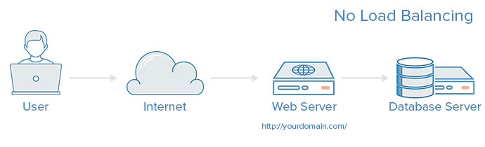
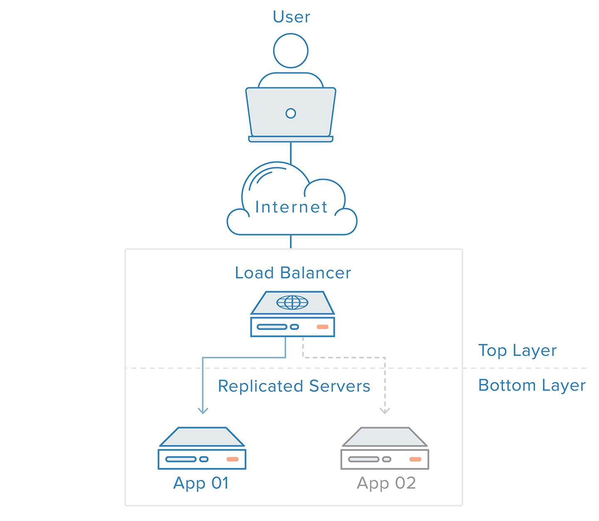
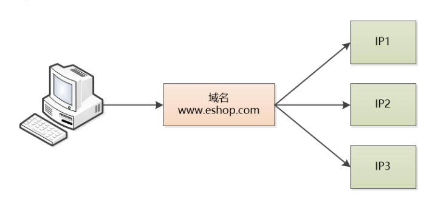
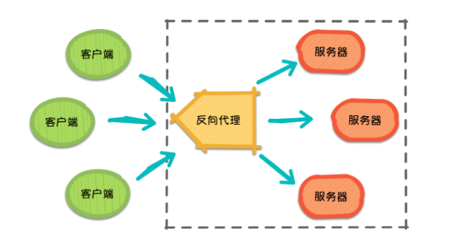
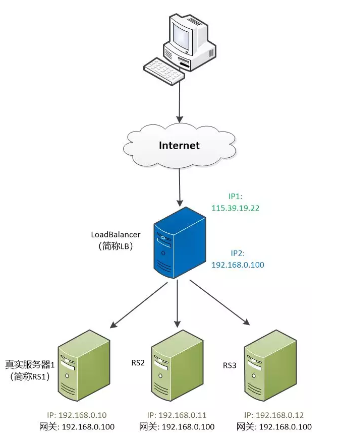
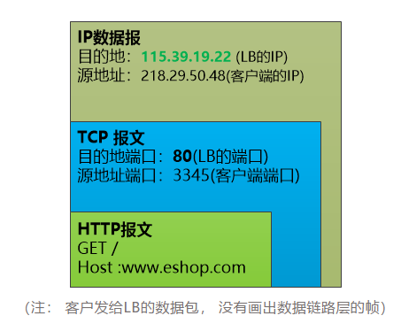
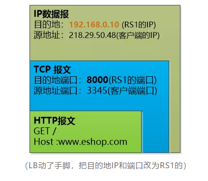
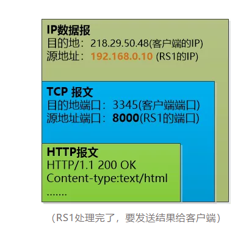
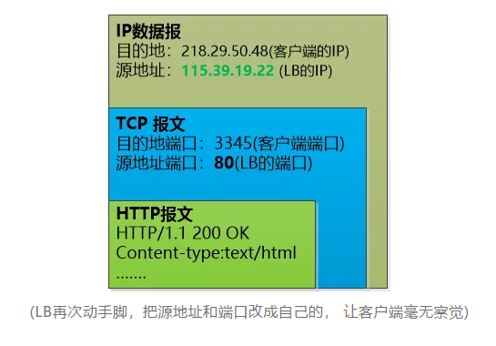
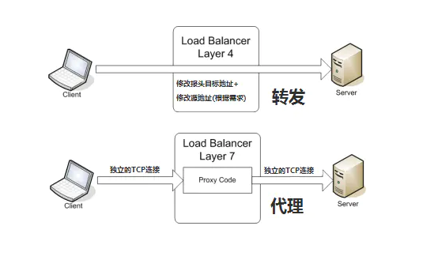

## 什么是负载均衡

负载均衡是高可用网络基础架构的关键组件，通常用于将工作负载分布到多个服务器来提高网站、应用、数据库或其他服务的性能和可靠性。

**传统架构**

在这里用户是直连到 web 服务器，如果这个服务器宕机了，那么用户自然也就没办法访问了。

另外，如果同时有很多用户试图访问服务器，超过了其能处理的极限，就会出现加载速度缓慢或根本无法连接的情况。

## 引入负载均衡

而通过在后端引入一个负载均衡器和至少一个额外的 web 服务器，可以缓解这个故障。

通常情况下，所有的后端服务器会保证提供相同的内容，以便用户无论哪个服务器响应，都能收到一致的内容。

从图里可以看到，用户访问负载均衡器，再由负载均衡器将请求转发给后端服务器。

在这种情况下，单点故障现在转移到负载均衡器上了。

这里又可以通过引入第二个负载均衡器来缓解，但在讨论之前，我们先探讨下负载均衡器的工作方式。

## 实现方式

### DNS负载均衡

让我们网站的域名映射到多个服务器的IP，用户面对的是我们系统的域名，然后我们可以采用一种轮询的方式， 用户1的机器做域名解析的时候，DNS返回IP1, 用户2的机器做域名解析的时候，DNS返回IP2...... 这样就可以实现各个机器的负载相对均衡了。

这样做有个很要命的问题，由于**DNS这个分层的系统中有缓存**，用户端的机器也有缓存，如果某个机器出故障，域名解析仍然会返回那个出问题机器的IP，那所有访问该机器的用户都会出问题， 即使我们把这个机器的IP从DNS中删除也不行， 这就麻烦了。

### 硬件负载策略

F5是硬件负载均衡，稳定性高，功能强大，但是比较贵，一般是大型公司才使用。工作原理类似，可工作在第四层或者第七层，通过一个虚拟IP接收请求然后根据一定的算法转发到后端服务器。客户发出请求到F5 VIP 时，BIGIP接收请求改掉包中的目的地址为后端选择服务器IP地址，然后发出请求，同样返回响应时把包中的源地址改为VIP发给客户端。F5 是通过pool池以及irules规则来确定哪个服务接收请求，调度的算法跟nginx的差不多都有轮询、优先级等。

### 软件负载策略

#### 反向代理

谈反向代理前，先说正向代理，正向代理（Forward Proxy）最大的特点是，客户端非常明确要访问的服务器地址，它代理客户端，替客户端发出请求。比如：科学上网，俗称翻墙。假设客户端想要访问 Google，它明确知道待访问的服务器地址是 https://www.google.com/，但由于条件限制，它找来了一个能够访问到 Google 的”朋友”：代理服务器。客户端把请求发给代理服务器，由代理服务器代替它请求 Google，最终再将响应返回给客户端。这便是一次正向代理的过程，该过程中服务器并不知道真正发出请求的是谁。

那么，随着请求量的爆发式增长，服务器觉得自己一个人始终是应付不过来，需要兄弟服务器们帮忙，于是它喊来了自己的兄弟以及代理服务器朋友。此时，来自不同客户端的所有请求实际上都发到了代理服务器处，再由代理服务器按照一定的规则将请求分发给各个服务器。

这就是反向代理（Reverse Proxy），反向代理隐藏了服务器的信息，它代理的是服务器端，代其接收请求。换句话说，反向代理的过程中，客户端并不知道具体是哪台服务器处理了自己的请求。如此一来，既提高了访问速度，又为安全性提供了保证。

在这之中，反向代理需要考虑的问题是，如何进行均衡分工，控制流量，避免出现局部节点负载过大的问题。通俗的讲，就是如何为每台服务器合理的分配请求，使其整体具有更高的工作效率和资源利用率。

反向代理可以使用nginx来实现。

根据OSI模型可将负载均衡分为：

### 二层负载均衡

一般是用虚拟mac地址方式，外部对虚拟MAC地址请求，负载均衡接收后分配后端实际的MAC地址响应。

### 三层负载均衡

一般采用虚拟IP地址方式，外部对虚拟的ip地址请求，负载均衡接收后分配后端实际的IP地址响应。

### 四层负载均衡

在OSI第4层工作，就是TCP层啦。此种Load Balance不理解应用协议（如HTTP/FTP/MySQL等等）。例子：LVS，F5。

四层负载均衡工作在OSI模型的传输层，主要工作是转发，它在接收到客户端的流量以后通过修改数据包的地址信息将流量转发到应用服务器。

Load Balancer 简称**LB** ， 有两个IP，一个对外（115.39.19.22），一个对内(192.168.0.100)。用户看到的是那个对外的IP。 后面的真正提供服务的服务器有三个，称为**RS1, RS2,RS3**， 他们的网关都指向LB。

客户端往LB发送了一个数据包，我们可以偷天换日，比如Load Balancer想把这个数据包发给RS1（192.168.0.10）, 就可以做点手脚，把这个数据包改成这样， 然后这个IP数据包就可以转发给RS1去处理了。

RS1处理完了，要返回首页的HTML，还要把HTTP报文层层封装。

由于LB是网关，它还会收到这个数据包，它就可以再次施展手段，把源地址和源端口都替换为自己的，然后发给客户就可以了。

总结一下数据的流向：

客户端 --> Load Balancer --> RS --> Load Balancer --> 客户端

**这里还有一个遗留问题就是LB该怎么选择发送给后面哪台服务器呢？**这里可以有很多种策略，后面会提。

轮询： 这个最简单，就是一个挨一个轮换。

加权轮询： 为了应对某些服务器性能好，可以让他们的权重高一点，被选中的几率大一点。

最少连接： 哪个服务器处理的连接少，就发给谁。

加权最少连接：在最少连接的基础上，也加上权重

......

这就是LVS的NAT的实现原理；具体其他TUN和DR实现可以戳[lvs简介](https://willje.github.io/posts/arccitecture/lvs%E7%AE%80%E4%BB%8B/)了解。

### 七层负载均衡

七层的负载均衡就是基于虚拟的URL或主机IP的负载均衡：在四层负载均衡的基础上（没有四层是绝对不可能有七层的），再考虑应用层的特征，比如同一个Web服务器的负载均衡，除了根据VIP加80端口辨别是否需要处理的流量，还可根据七层的URL、浏览器类别、语言来决定是否要进行负载均衡。

举个例子，如果你的Web服务器分成两组，一组是中文语言的，一组是英文语言的，那么七层负载均衡就可以当用户来访问你的域名时，自动辨别用户语言，然后选择对应的语言服务器组进行负载均衡处理。

对应的负载均衡器称为七层交换机（L7 switch），除了支持四层负载均衡以外，还有分析应用层的信息，如HTTP协议URI或Cookie信息，实现七层负载均衡。此种负载均衡器能理解应用协议，常见例子有： haproxy，MySQL Proxy。

## 四层负载均衡和七层负载均衡的区别

### 技术原理

所谓四层负载均衡，也就是主要通过报文中的目标地址和端口，再加上负载均衡设备设置的服务器选择方式，决定最终选择的内部服务器。

以常见的TCP为例，负载均衡设备在接收到第一个来自客户端的SYN 请求时，即通过上述方式选择一个最佳的服务器，并对报文中目标IP地址进行修改(改为后端服

务器IP），直接转发给该服务器。TCP的连接建立，即三次握手是客户端和服务器直接建立的，负载均衡设备只是起到一个类似路由器的转发动作。在某些部署情

况下，为保证服务器回包可以正确返回给负载均衡设备，在转发报文的同时可能还会对报文原来的源地址进行修改。

所谓七层负载均衡，也称为“内容交换”，也就是主要通过报文中的真正有意义的应用层内容，再加上负载均衡设备设置的服务器选择方式，决定最终选择的内部服务器。

以常见的TCP为例，负载均衡设备如果要根据真正的应用层内容再选择服务器，只能先代理最终的服务器和客户端建立连接(三次握手)后，才可能接受到客户端发

送的真正应用层内容的报文，然后再根据该报文中的特定字段，再加上负载均衡设备设置的服务器选择方式，决定最终选择的内部服务器。负载均衡设备在这种情

况下，更类似于一个代理服务器。负载均衡和前端的客户端以及后端的服务器会分别建立TCP连接。所以从这个技术原理上来看，七层负载均衡明显的对负载均衡

设备的要求更高，处理七层的能力也必然会低于四层模式的部署方式。

### 应用场景

**七层应用负载的好处，是使得整个网络更智能化。**例如访问一个网站的用户流量，可以通过七层的方式，将对图片类的请求转发到特定的图片服务器并可以使用缓

存技术；将对文字类的请求可以转发到特定的文字服务器并可以使用压缩技术。当然这只是七层应用的一个小案例，从技术原理上，这种方式可以对客户端的请求

和服务器的响应进行任意意义上的修改，极大的提升了应用系统在网络层的灵活性。很多在后台，例如Nginx或者Apache上部署的功能可以前移到负载均衡设备

上，例如客户请求中的Header重写，服务器响应中的关键字过滤或者内容插入等功能。

**另外一个常常被提到功能就是安全性。**网络中最常见的SYN Flood攻击，即黑客控制众多源客户端，使用虚假IP地址对同一目标发送SYN攻击，通常这种攻击会大

量发送SYN报文，耗尽服务器上的相关资源，以达到Denial of Service(*DoS*)的目的。从技术原理上也可以看出，四层模式下这些SYN攻击都会被转发到后端的服务

器上；而七层模式下这些SYN攻击自然在负载均衡设备上就截止，不会影响后台服务器的正常运营。另外负载均衡设备可以在七层层面设定多种策略，过滤特定报

文，例如SQL Injection等应用层面的特定攻击手段，从应用层面进一步提高系统整体安全。

现在的7层负载均衡，主要还是着重于应用HTTP协议，所以其应用范围主要是众多的网站或者内部信息平台等基于B/S开发的系统。 4层负载均衡则对应其他TCP应

用，例如基于C/S开发的ERP等系统。

## 负载均衡常用算法

常用的负载均衡算法分为两类：

1）一种是静态负载均衡；

2）一种是动态负载均衡。

### 静态负载均衡

#### 轮询法

将请求按顺序轮流地分配到每个节点上，不关心每个节点实际的连接数和当前的系统负载。

优点：简单高效，易于水平扩展，每个节点满足字面意义上的均衡；

缺点：没有考虑机器的性能问题，根据木桶最短木板理论，集群性能瓶颈更多的会受性能差的服务器影响。

#### 随机法

将请求随机分配到各个节点。由概率统计理论得知，随着客户端调用服务端的次数增多，其实际效果越来越接近于平均分配，也就是轮询的结果。

优缺点和轮询相似。

#### 源地址哈希法

源地址哈希的思想是根据客户端的IP地址，通过哈希函数计算得到一个数值，用该数值对服务器节点数进行取模，得到的结果便是要访问节点序号。采用源地址哈希法进行负载均衡，同一IP地址的客户端，当后端服务器列表不变时，它每次都会落到到同一台服务器进行访问。

优点：相同的IP每次落在同一个节点，可以人为干预客户端请求方向，例如灰度发布；

缺点：如果某个节点出现故障，会导致这个节点上的客户端无法使用，无法保证高可用。当某一用户成为热点用户，那么会有巨大的流量涌向这个节点，导致冷热分布不均衡，无法有效利用起集群的性能。所以当热点事件出现时，一般会将源地址哈希法切换成轮询法。

#### 加权轮询法

不同的后端服务器可能机器的配置和当前系统的负载并不相同，因此它们的抗压能力也不相同。给配置高、负载低的机器配置更高的权重，让其处理更多的请；而配置低、负载高的机器，给其分配较低的权重，降低其系统负载，加权轮询能很好地处理这一问题，并将请求顺序且按照权重分配到后端。

加权轮询算法要生成一个服务器序列，该序列中包含n个服务器。n是所有服务器的权重之和。在该序列中，每个服务器的出现的次数，等于其权重值。并且，生成的序列中，服务器的分布应该尽可能的均匀。比如序列{a, a, a, a, a, b, c}中，前五个请求都会分配给服务器a，这就是一种不均匀的分配方法，更好的序列应该是：{a, a, b, a, c, a, a}。

优点：可以将不同机器的性能问题纳入到考量范围，集群性能最优最大化；

缺点：生产环境复杂多变，服务器抗压能力也无法精确估算，静态算法导致无法实时动态调整节点权重，只能粗糙优化。

#### 加权随机法

与加权轮询法一样，加权随机法也根据后端机器的配置，系统的负载分配不同的权重。不同的是，它是按照权重随机请求后端服务器，而非顺序。

#### 键值范围法

根据键的范围进行负债，比如0到10万的用户请求走第一个节点服务器，10万到20万的用户请求走第二个节点服务器……以此类推。

优点：容易水平扩展，随着用户量增加，可以增加节点而不影响旧数据；

缺点：容易负债不均衡，比如新注册的用户活跃度高，旧用户活跃度低，那么压力就全在新增的服务节点上，旧服务节点性能浪费。而且也容易单点故障，无法满足高可用。

### 动态负载均衡

#### 最小连接数法

根据每个节点当前的连接情况，动态地选取其中当前积压连接数最少的一个节点处理当前请求，尽可能地提高后端服务的利用效率，将请求合理地分流到每一台服务器。俗称闲的人不能闲着，大家一起动起来。

优点：动态，根据节点状况实时变化；

缺点：提高了复杂度，每次连接断开需要进行计数；

实现：将连接数的倒数当权重值。

#### 最快响应速度法

根据请求的响应时间，来动态调整每个节点的权重，将响应速度快的服务节点分配更多的请求，响应速度慢的服务节点分配更少的请求，俗称能者多劳，扶贫救弱。

优点：动态，实时变化，控制的粒度更细，跟灵敏；

缺点：复杂度更高，每次需要计算请求的响应速度；

实现：可以根据响应时间进行打分，计算权重。

#### 观察模式法

观察者模式是综合了最小连接数和最快响应度，同时考量这两个指标数，进行一个权重的分配。

## 参考资料

- [负载均衡原理](https://mp.weixin.qq.com/s/NUFRX51D9Yf9yzRQnPeWlg)
- [一篇读懂分布式架构下的负载均衡技术：分类、原理、算法、常见方案等](https://segmentfault.com/a/1190000019026606)

- [负载均衡原理](https://tangocc.github.io/2018/01/18/load-balance/)

- [load balance 01-负载均衡基础知识](https://houbb.github.io/2020/06/19/load-balance-01-basic#%E8%B4%9F%E8%BD%BD%E5%9D%87%E8%A1%A1%E7%B3%BB%E5%88%97%E4%B8%93%E9%A2%98)

- [五分钟让你搞懂 Nginx 负载均衡原理及四种负载均衡算法](https://xie.infoq.cn/article/0d5386868af29dfd7e98da841)

- [LVS-NAT 原理介绍和配置实践](https://wsgzao.github.io/post/lvs-nat/)

