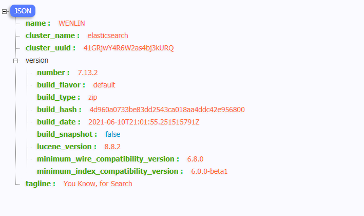
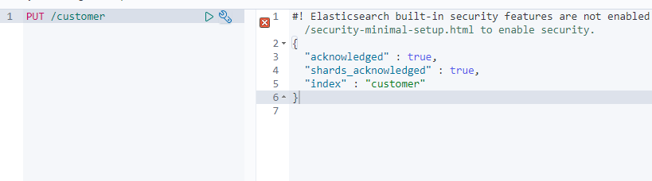
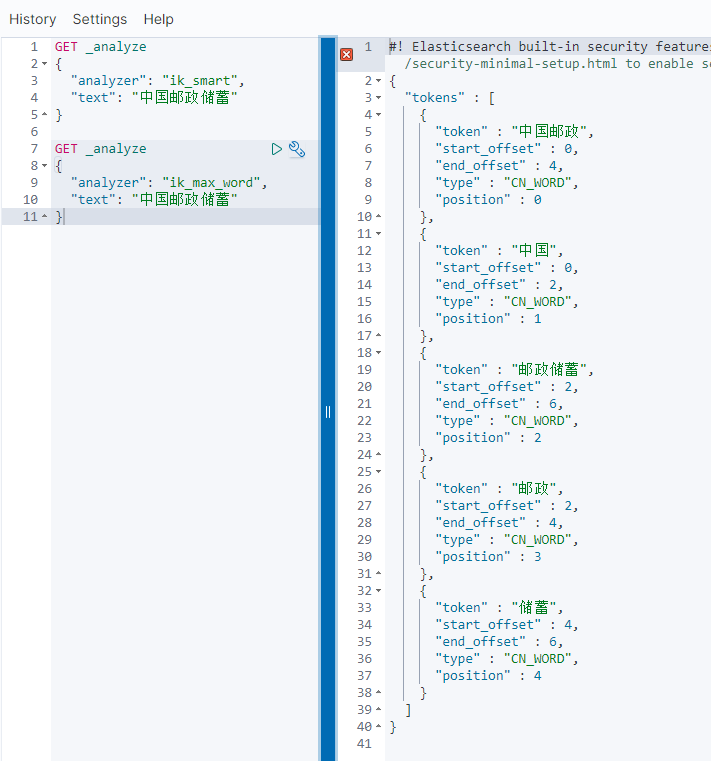

## 介绍

ELK是Elasticsearch、Logstash、Kibana三大开源框架首字母大写简称(但是后期出现的filebeat(beats中的一种)可以用来

替代logstash的数据收集功能，比较轻量级)。市面上也被成为Elastic Stack。

**Logstash**是免费且开放的服务器端数据处理管道，能够从多个来源采集数据，转换数据，然后将数据发送到您最喜欢

的“存储库”中。Logstash能够动态地采集、转换和传输数据，不受格式或复杂度的影响。利用Grok从非结构化数据中派生

出结构，从IP地址解码出地理坐标，匿名化或排除敏感字段，并简化整体处理过程。

**Elasticsearch**是Elastic Stack核心的分布式搜索和分析引擎,是一个基于Lucene、分布式、通过Restful方式进行交互的近

实时搜索平台框架。Elasticsearch为所有类型的数据提供近乎实时的搜索和分析。无论您是结构化文本还是非结构化文

本，数字数据或地理空间数据，Elasticsearch都能以支持快速搜索的方式有效地对其进行存储和索引。

**Kibana**是一个针对Elasticsearch的开源分析及可视化平台，用来搜索、查看交互存储在Elasticsearch索引中的数据。使用

Kibana，可以通过各种图表进行高级数据分析及展示。并且可以为 Logstash 和 ElasticSearch 提供的日志分析友好的 Web 

界面，可以汇总、分析和搜索重要数据日志。还可以让海量数据更容易理解。它操作简单，基于浏览器的用户界面可以快

速创建仪表板（dashboard）实时显示Elasticsearch查询动态。

### 为什么要使用ELK

日志主要包括系统日志、应用程序日志和安全日志。系统运维和开发人员可以通过日志了解服务器软硬件信息、检查配置

过程中的错误及错误发生的原因。经常分析日志可以了解服务器的负荷，性能安全性，从而及时采取措施纠正错误。

往往单台机器的日志我们使用grep、awk等工具就能基本实现简单分析，但是当日志被分散的储存不同的设备上。如果你

管理数十上百台服务器，你还在使用依次登录每台机器的传统方法查阅日志。这样是不是感觉很繁琐和效率低下。当务之

急我们使用集中化的日志管理，例如：开源的syslog，将所有服务器上的日志收集汇总。集中化管理日志后，日志的统计

和检索又成为一件比较麻烦的事情，一般我们使用grep、awk和wc等Linux命令能实现检索和统计，但是对于要求更高的

查询、排序和统计等要求和庞大的机器数量依然使用这样的方法难免有点力不从心。

一般大型系统是一个分布式部署的架构，不同的服务模块部署在不同的服务器上，问题出现时，大部分情况需要根据问题

暴露的关键信息，定位到具体的服务器和服务模块，构建一套集中式日志系统，可以提高定位问题的效率。

## 环境搭建

elk各个组件的网址可以在官网下载：https://www.elastic.co/cn/

或者在中文社区下载：https://elasticsearch.cn/download/

### ES

下载完成后解压即可，进入bin目录执行elasticsearch.bat文件服务即启动，访问localhost:9200；



Elasticsearch head是一个elasticsearch的UI界面，可以访问官网https://github.com/mobz/elasticsearch-head 安装，或者使用谷歌浏览器插件[ElasticSearch Head](https://chrome.google.com/webstore/detail/elasticsearch-head/ffmkiejjmecolpfloofpjologoblkegm/related?hl=zh-CN)。

### Kibana

还是下载解压，进入bin目录执行kibana.bat即可；

kibana默认是英语，如果需要汉化，可以在conf/kibana.yml文件中找到il8n改成zh-CN即可；

## 基础知识

### Elasticsearch

#### 几个概念

**索引（Index）**

类比mysql的database，一个索引就是一个数据库。es将数据存储在一个或多个索引中。向索引写入文档或从索引中读取文档。

**文档（document）**

文档是es中的只要实体，数据搜索，就是对文档的搜索。文档由字段构成。从客户端角度看，文档是一个JSON对象

**映射（mapping）**

类似mysql中对于表结构的定义。对index中的元信息进行存储。例如如何将输入文本分割为词条，哪些词条被过滤等等。

**类型（type）**

一个索引可以有多个类型。例如一个索引下可以有文章类型，也可以有用户类型，也可以有评论类型。在一个索引中不能再创建多个类型，在以后的版本中将删除类型的整个概念。

**节点（node）**

一个es服务实例称为一个节点

**集群（cluster）**

多个节点组成一个集群。

这个集群名称必须是唯一的，因为集群的节点是通过集群名称来加入集群的

**分片(shard)和副本**

索引可能存储大量数据，这些数据可能会c超出单个节点的硬件限制。例如，占用1TB磁盘空间的10亿个文档的单个索引可能不适合单个节点的磁盘，或者速度太慢，无法单独满足单个节点的搜索请求。

为了解决这个问题，ElasticSearch提供了将索引细分为多个片段（称为碎片）的能力。创建索引时，只需定义所需的碎片数量。每个分片（shard）本身就是一个完全功能性和独立的“索引”，可以托管在集群中的任何节点上。

> 为什么要分片?

它允许您水平拆分/缩放内容量

它允许您跨碎片（可能在多个节点上）分布和并行操作，从而提高性能/吞吐量

> 为什么要有副本？

当分片/节点发生故障时提供高可用性。因此，需要注意的是，副本分片永远不会分配到复制它的原始/主分片所在的节点上。

允许您扩展搜索量/吞吐量，因为可以在所有副本上并行执行搜索。

可以在创建索引时为每个索引定义分片和副本的数量。创建索引后，您还可以随时动态更改副本的数量。您可以使用收缩和拆分API更改现有索引的分片数量，建议在创建索引时就考虑好分片和副本的数量。

默认情况下，ElasticSearch中的每个索引都分配一个主分片和一个副本，这意味着如果集群中至少有两个节点，则索引将有一个主分片和另一个副本分片（一个完整副本），每个索引总共有两个分片。

**网关（mapping）**

在es的工作过程中，关于集群状态，索引设置的各种信息都会被收集起来，并在网关中被持久化。

#### 基础操作

查看节点健康状态

```shell
GET /_cat/health?format=json
```

查看`_cat`命令：

```shell
=^.^=
/_cat/allocation
/_cat/shards
/_cat/shards/{index}
/_cat/master
/_cat/nodes
/_cat/tasks
/_cat/indices
/_cat/indices/{index}
/_cat/segments
/_cat/segments/{index}
/_cat/count
/_cat/count/{index}
/_cat/recovery
/_cat/recovery/{index}
/_cat/health
/_cat/pending_tasks
/_cat/aliases
/_cat/aliases/{alias}
/_cat/thread_pool
/_cat/thread_pool/{thread_pools}
/_cat/plugins
/_cat/fielddata
/_cat/fielddata/{fields}
/_cat/nodeattrs
/_cat/repositories
/_cat/snapshots/{repository}
/_cat/templates
```

我们可以使用curl或者kibana提供的Dev Tools进行API测试。

ES是使用REST风格的API。

**简单的增删改查**

创建索引

>  注：实际项目里一般是不会直接这样创建 index 的，这里仅为演示。一般都是通过创建 mapping 手动定义 index 或者自动生成 index 。



查看所有索引

```shell
GET /_cat/indices?format=json
```

删除索引

```shell
DELETE /customer
```

按ID新增数据，type为_doc：type后期版本会删除，默认就是 _doc

```shell
PUT /customer/_doc/1
{
  "name": "John Doe"
}
PUT /customer/_doc/2
{
  "name": "yujc",
  "age":22
}
```

> 如果索引index不存在，直接新增数据也会同时创建index。

同时，该操作也能修改数据：

```shell
PUT /customer/_doc/2
{
  "name": "yujc2"
}
```

`name`字段会被修改，而且`_version`会被修改为2。**该操作实际是覆盖数据**：

```shell
GET /customer/_doc/2
```

结果：

```shell
{
  "_index": "customer",
  "_type": "_doc",
  "_id": "2",
  "_version": 2,
  "found": true,
  "_source": {
    "name": "yujc2"
  }
}
```

#### 复杂查询

使用query带上条件，_source指定需要查询的字段即mapping；

```shell
GET /customer/_doc/_search
{
  "query":{
    "match":{
      "name":"JAMES HARDEN"
    }
  },
  "_source":["name"]
}
```

使用sort指定mapping按升序或降序排序；

使用highlight高亮，还可以使用pre_tags自定义高亮样式；

#### ik分词器

Elasticsearch默认也能对中文进行分词。

安装IK，IK项目地址：[https://github.com/medcl/elas...](https://github.com/medcl/elasticsearch-analysis-ik/releases)

**首先需要说明的是，IK插件必须和 ElasticSearch 的版本一致，否则不兼容。**

安装方法：从 [https://github.com/medcl/elas...](https://github.com/medcl/elasticsearch-analysis-ik/releases) 下载压缩包，然后在ES的`plugins`目录创建`analysis-ik`子目录，把压缩包的内容复制到这个目录里面即可。

IK支持两种分词模式：

- ik_max_word: 会将文本做最细粒度的拆分，会穷尽各种可能的组合
- ik_smart: 会做最粗粒度的拆分

es自带了许多内置的Analyzer分析器，无需配置就可以直接在index中使用：

- 标准分词器（standard）：以单词边界切分字符串为terms，根据Unicode文本分割算法。它会移除大部分的标点符号，小写分词后的term，支持停用词。
- 简单分词器（simple）：该分词器会在遇到非字母时切分字符串，小写所有的term。
- 空格分词器（whitespace）：遇到空格字符时切分字符串，
- 停用词分词器（stop）：类似简单分词器，同时支持移除停用词。
- 关键词分词器（keyword）：无操作分词器，会输出与输入相同的内容作为一个single term。
- 模式分词器（pattern）：使用正则表达式讲字符串且分为terms。支持小写字母和停用词。
- 语言分词器（language）：支持许多基于特定语言的分词器，比如english或french。
- 签名分词器（fingerprint）：是一个专家分词器，会产生一个签名，可以用于去重检测。
- 自定义分词器：如果内置分词器无法满足你的需求，可以自定义custom分词器，根据不同的character filters，tokenizer，token filters的组合 。例如IK就是自定义分词器。

详见文档：[https://www.elastic.co/guide/...](https://www.elastic.co/guide/en/elasticsearch/reference/current/analysis-analyzers.html)

使用kibana devtools测试ik两种不同分词模式ik_smart和ik_max_word的测试



自定义分词词典

我们也可以定义自己的词典供IK使用。比如：

```shell
curl -XGET "http://localhost:9200/_analyze" -H 'Content-Type: application/json' -d'{"analyzer": "ik_smart","text": "去朝阳公园"}'
```

结果：

```json
{
  "tokens": [
    {
      "token": "去",
      "start_offset": 0,
      "end_offset": 1,
      "type": "CN_CHAR",
      "position": 0
    },
    {
      "token": "朝阳",
      "start_offset": 1,
      "end_offset": 3,
      "type": "CN_WORD",
      "position": 1
    },
    {
      "token": "公园",
      "start_offset": 3,
      "end_offset": 5,
      "type": "CN_WORD",
      "position": 2
    }
  ]
}
```

我们希望`朝阳公园`作为一个整体，这时候可以把该词加入到自己的词典里。

新建自己的词典只需要简单几步就可以完成：
1、在`elasticsearch-6.2.4/config/analysis-ik/`目录增加一个`my.dic`:

```shell
$ touch my.dic
$ echo 朝阳公园 > my.dic

$ cat my.dic
朝阳公园
```

`.dic`为词典文件，其实就是简单的文本文件，词语与词语直接需要换行。注意是UTF8编码。我们看一下自带的分词文件：

```shell
$ head -n 5 main.dic
一一列举
一一对应
一一道来
一丁
一丁不识
```

2、然后修改`elasticsearch-6.2.4/config/analysis-ik/IKAnalyzer.cfg.xml`文件：

```shell
<?xml version="1.0" encoding="UTF-8"?>
<!DOCTYPE properties SYSTEM "http://java.sun.com/dtd/properties.dtd">
<properties>
    <comment>IK Analyzer 扩展配置</comment>
    <!--用户可以在这里配置自己的扩展字典 -->
    <entry key="ext_dict">my.dic</entry>
     <!--用户可以在这里配置自己的扩展停止词字典-->
    <entry key="ext_stopwords"></entry>
    <!--用户可以在这里配置远程扩展字典 -->
    <!-- <entry key="remote_ext_dict">words_location</entry> -->
    <!--用户可以在这里配置远程扩展停止词字典-->
    <!-- <entry key="remote_ext_stopwords">words_location</entry> -->
</properties>
```

增加了`my.dic`，然后重启ES。我们再看一下效果：

```shell
GET /_analyze
{
  "analyzer": "ik_smart",
  "text": "去朝阳公园"
}
```

结果：

```shell
{
  "tokens": [
    {
      "token": "去",
      "start_offset": 0,
      "end_offset": 1,
      "type": "CN_CHAR",
      "position": 0
    },
    {
      "token": "朝阳公园",
      "start_offset": 1,
      "end_offset": 5,
      "type": "CN_WORD",
      "position": 1
    }
  ]
}
```

说明自定义词典生效了。如果有多个词典，使用英文分号隔开：

```shell
<entry key="ext_dict">my.dic;custom/single_word_low_freq.dic</entry>
```

## 集成SpringBoot

各种客户端集成可以看[官网](https://www.elastic.co/guide/en/elasticsearch/client/index.html)

## 参考资料

[Elasticsearch实践（一）：基础入门](https://segmentfault.com/a/1190000016753816)

[Elasticsearch实践（四）：IK分词](https://segmentfault.com/a/1190000017215854)

