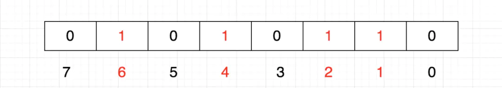
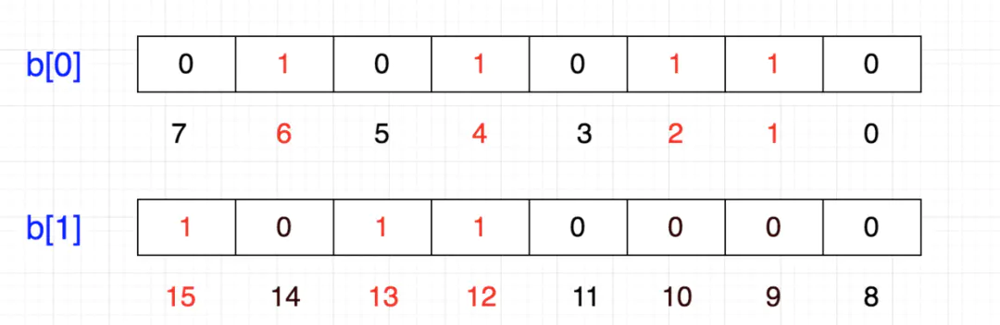
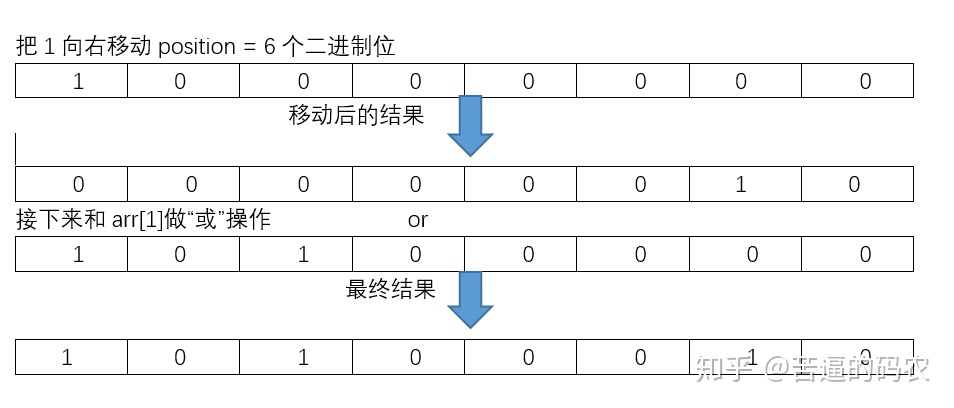

## 什么是bitmap

Bit-map的基本思想就是用一个bit位来标记某个元素对应的Value，而Key即是该元素。由于采用了Bit为单位来存储数据，

因此在存储空间方面，可以大大节省。（PS：划重点 **节省存储空间** ）

假设有这样一个需求：在20亿个随机整数中找出某个数m是否存在其中，并假设32位操作系统，4G内存

在Java中，int占4字节，1字节=8位（1 byte = 8 bit）

如果每个数字用int存储，那就是20亿个int，因而占用的空间约为(2000000000*4/1024/1024/1024)≈**7.45** G

如果按位存储就不一样了，20亿个数就是20亿位，占用空间约为 (2000000000/8/1024/1024/1024)≈**0.23** G

高下立判，无需多言。

## 基础使用

问题来了，如何表示一个数呢？

刚才说了，每一位表示一个数，0表示不存在，1表示存在，这正符合二进制

这样我们可以很容易表示{1,2,4,6}这几个数：



计算机内存分配的最小单位是字节，也就是8位，那如果要表示{12,13,15}怎么办呢？

当然是在另一个8位上表示了：



这样的话，好像变成一个二维数组了

1个int占32位，那么我们只需要申请一个int数组长度为 int tmp[1+N/32] 即可存储，其中N表示要存储的这些数中的最大值，于是乎：

tmp[0]：可以表示0~31

tmp[1]：可以表示32~63

tmp[2]：可以表示64~95

。。。

如此一来，给定任意整数M，那么M/32就得到下标，M%32就知道它在此下标的哪个位置。

### 添加

我们先来说说如何在bitmap中如何添加一个数值的问题，例如我们我们要添加n=14。

这个其实很简单，我们先找到n在arr数组中的下标index，显然index = 1。然后再找到n在arr[index]中的位置position，显然这里position = 6。

这里还是可以很容易找出index和position的公式的。即

index = n / 8 = n >> 3。

position = n % 8 = n & 0x07。

接下来我们把1向右移动position个二进制位，然后把所得的结果和arr[index]做“或(or)”操作就可以了。如下图



这里有个需要注意的地方，在画图的时候，为了方便，我们是把左边的位当作**低位**，右边的位当作**高位**来算了。不过在实际的存储中，左边的才是存高位，而右边的存的是低位。所以在我们的代码实现中，我们所说的右移对应代码的左移。

```java
//添加数据的操作
public void add(int n){
    //用>>的操作是，运算会比较快
    int index = n >> 3;
    int position = n & 0x07;
    //把1右移和做or操作两步一起
    //即 << 对应上图的右移，实际上<<是左移符。
    arr[index] |= 1 << position;
}
```

知道了add操作，其他的操作差不多类似。

当然，我们实现的add操作只是简单的实现一下，假如你要严谨地实现的话，还是需要很多异常的判断的。例如判断这个数是否是非负数，判断arr数组是否下标越界，进行容量的扩充等等。有兴趣的可以严谨去实现一下。

### 查找

我们把1右移之后，把结果和arr[index]做“与”操作，如何结果不为0，则证明存在，否则就不存在。

```java
public boolean contain(int n){
    int index = n >> 3;
    int position = n & 0x07;
    return (arr[index] & (1 << position)) != 0;
}
```

### 修改\删除

我们只需要把对应的二进制的1变成0就可以了。

我们可以把1右移(代码中对应左移)后的结果取反，然后与arr[index]做“与”操作就可以了。代码如下：

```java
public void delete(int n){
    int index = n >> 3;
    int position = n & 0x07;
    arr[index] &= ~(1 << position);
}
```

## 使用场景

大量数据的快速排序、查找、去重

假设我们要对0-7内的5个元素(4,7,2,5,3)排序（这里假设这些元素没有重复）,我们就可以采用Bit-map的方法来达到排序的目的。

要表示8个数，我们就只需要8个Bit（1Bytes），首先我们开辟1Byte的空间，将这些空间的所有Bit位都置为0，然后将对应位置为1。

最后，遍历一遍Bit区域，将该位是一的位的编号输出（2，3，4，5，7），这样就达到了排序的目的，时间复杂度O(n)。

**优点:**

- 运算效率高，不需要进行比较和移位；
- 占用内存少，比如N=10000000；只需占用内存为N/8=1250000Byte=1.25M

**缺点:**

- 所有的数据不能重复。即不可对重复的数据进行排序和查找。
- 只有当数据比较密集时才有优势

### 快速去重

20亿个整数中找出不重复的整数的个数，内存不足以容纳这20亿个整数。

首先，根据“内存空间不足以容纳这05亿个整数”我们可以快速的联想到Bit-map。下边关键的问题就是怎么设计我们的Bit-map来表示这20亿个数字的状态了。其实这个问题很简单，一个数字的状态只有三种，分别为不存在，只有一个，有重复。因此，我们只需要2bits就可以对一个数字的状态进行存储了，假设我们设定一个数字不存在为00，存在一次01，存在两次及其以上为11。那我们大概需要存储空间2G左右。

接下来的任务就是把这20亿个数字放进去（存储），如果对应的状态位为00，则将其变为01，表示存在一次；如果对应的状态位为01，则将其变为11，表示已经有一个了，即出现多次；如果为11，则对应的状态位保持不变，仍表示出现多次。

最后，统计状态位为01的个数，就得到了不重复的数字个数，时间复杂度为O(n)。

### 快速查找

这就是我们前面所说的了，int数组中的一个元素是4字节占32位，那么除以32就知道元素的下标，对32求余数（%32）就知道它在哪一位，如果该位是1，则表示存在。

## 参考

[漫画：什么是Bitmap算法？](https://juejin.cn/post/6844903769201704973#comment)

[【算法与数据结构专场】BitMap算法基本操作代码实现](https://zhuanlan.zhihu.com/p/45637038)

