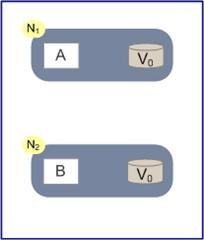
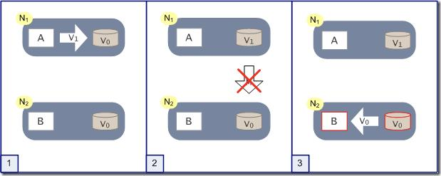

# CAP定理的证明

关于CAP这三个特性我们就介绍完了，接下来我们试着证明一下**为什么CAP不能同时满足**。

为了简化证明的过程，我们假设整个集群里只有两个N1和N2两个节点，如下图：

N1和N2当中各自有一个应用程序AB和数据库，当系统满足一致性的时候，我们认为N1和N2数据库中的数据保持一致。在满足可用性的时候，我们认为无论用户访问N1还是N2，都可以获得正确的结果，在满足分区容错性的时候，我们认为无论N1还是N2宕机或者是两者的通信中断，都不影响系统的运行。

我们假设一种极端情况，假设某个时刻N1和N2之间的**网络通信突然中断**了。如果系统满足分区容错性，那么显然可以支持这种异常。问题是在此前提下，一致性和可用性是否可以做到不受影响呢？

我们做个假象实验，如下图，突然某一时刻N1和N2之间的关联断开：

有用户向N1发送了请求更改了数据，将数据库从V0更新成了V1。由于网络断开，所以N2数据库依然是V0，如果这个时候有一个请求发给了N2，但是N2并没有办法可以直接给出最新的结果V1，这个时候该怎么办呢？

这个时候无法两种方法，**一种是将错就错，将错误的V0数据返回给用户。第二种是阻塞等待，等待网络通信恢复，N2中的数据更新之后再返回给用户**。显然前者牺牲了一致性，后者牺牲了可用性。

这个例子虽然简单，但是说明的内容却很重要。在分布式系统当中，CAP三个特性我们是无法同时满足的，必然要舍弃一个。三者舍弃一个，显然排列组合一共有三种可能。

**1. 舍弃A，保留CP**

一个系统保证了一致性和分区容错性，舍弃可用性。也就是说在极端情况下，允许出现系统无法访问的情况出现，这个时候往往会牺牲用户体验，让用户保持等待，一直到系统数据一致了之后，再恢复服务。

对于有些系统而言，一致性是安身立命之本，比如Hbase、Redis这种分布式存储，数据一致性是最基本的要求。不满足一致性的存储显然不会有用户愿意使用。 

ZooKeeper也是一样，任何时候访问ZK都可以获得一致性的结果。它的职责就是保证管辖下的服务保持同步和一致，显然不可能放弃一致性。但是在极端情况下，ZK可能会丢弃调一些请求，消费者需要重新请求才能获得结果。 

**2. 舍弃C，保留AP** 

这种是大部分的分布式系统的设计，保证高可用和分区容错，但是会牺牲一致性。比如淘宝购物以及12306购票等等，前面说过淘宝可以做到全年可用性5个9的超高级别，但是此时就无法保证数据一致性了。

举个例子，我们在12306买票的时候就经常会遇到。在我们点击购买的时候，系统并没有提示没票。等我们输入了验证码，付款的时候才会告知，已经没有票了。这就是因为我们在点击购买的时候，数据没有达成一致性，在付款校验的时候才检验出余票不足。这种设计会牺牲一些用户体验，但是可以保证高可用，让用户不至于无法访问或者是长时间等待，也算是一种取舍吧。

**3. 舍弃P，保留CA**

很遗憾，这种情况几乎不存在。因为分布式系统，网络分区是必然的。如果要舍弃P，那么就是要舍弃分布式系统，CAP也就无从谈起了。可以说P是分布式系统的前提，所以这种情况是不存在的。

比如一般的关系型数据库，像是MySQL或者是Oracle，它们都保证了一致性和可用性，但是并不是分布式系统。从这点上来说CAP并不是等价的，我们并不能通过牺牲CA来提升P。要想提升分区容错性，只能通过提升基础设施的稳定性来达到。也就是说这并不是一个软件问题。

到这里CAP的理论就介绍完了，到最后会发现这其实是一个取舍问题，并没有完美的方案。每个设计分布式系统的架构师，需要根据自身业务场景的实际特性来考量。比如，像是涉及到金钱的问题，一致性是必须的，极端情况下，哪怕用户暂时无法访问， 也不能使得相关的数据不准确。这不仅会影响一个公司的声誉，也会带来许多其他方面的困扰。