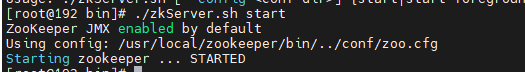
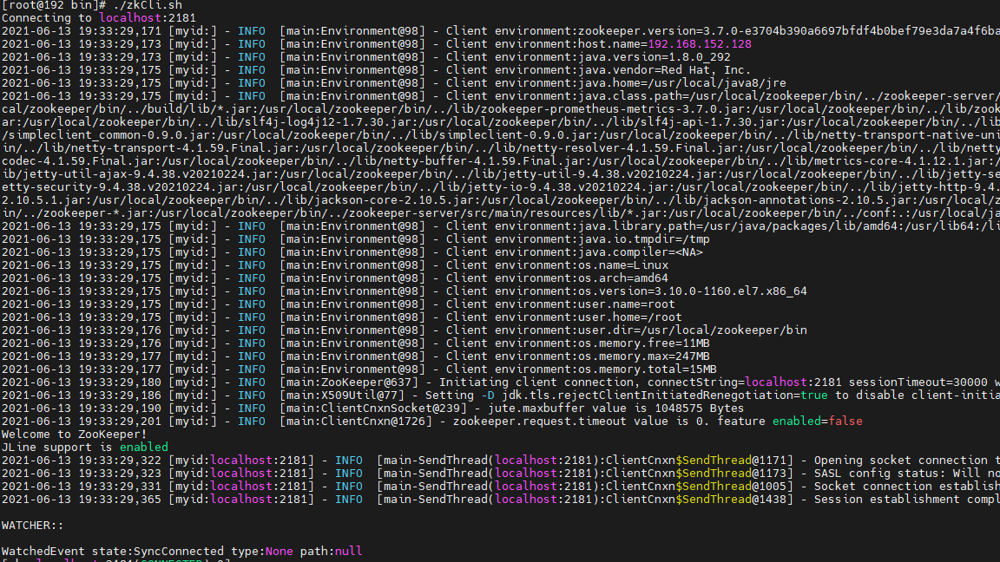
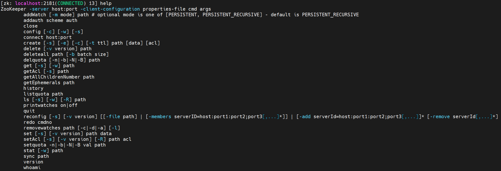
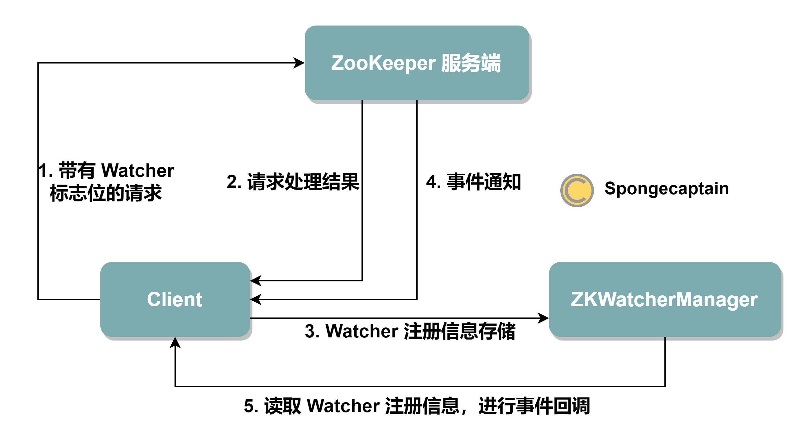
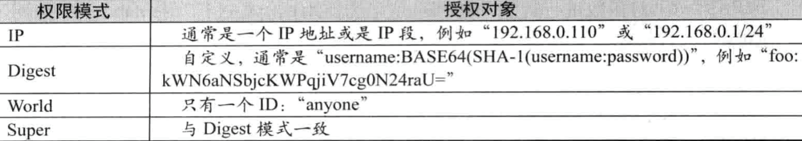

我们在虚拟机中安装zookeeper，首先要安装linux虚拟机。

## 安装linux虚拟机

1. 安装vmvare，地址[在这里](https://www.vmware.com/products/workstation-pro.html)
2. 下载centos镜像，地址[在这里](https://www.centos.org/download/)
3. 安装，这里要注意网络配置，[Centos网络设置](https://zhuanlan.zhihu.com/p/79361590)

> 我这里没有设置固定IP，因为使用的是DHCP动态分配IP，不知道明天起来IP会不会变。
>
> 补充：IP变了，于是按照下面的方法固定IP；

4. 关键点，配置网络；[vmware虚拟机centos7网络配置](https://willje.github.io/posts/net/vmware%E8%99%9A%E6%8B%9F%E6%9C%BAcentos7%E7%BD%91%E7%BB%9C%E9%85%8D%E7%BD%AE/)

## centos安装jdk8

[《CentOS安装Java JDK》](https://www.cnblogs.com/toutou/p/9670395.html)

查看是否安装了java

```shell
yum list installed | grep jdk
```

查询CentOS自带的Java相关组件
```shell
rpm -qa | grep java
```

rpm：管理套件

-qa：使用询问模式，查询所有套件

grep：查找文件里符合条件的字符串

[Centos7.5安装java8 - 简书](https://www.jianshu.com/p/0dd37861a983)

查看`java`版本库

```shell
yum search java | grep jdk
```

安装

```shell
yum install java-1.8.0-openjdk java-1.8.0-openjdk-devel
```

这里后面应该要配置环境变量的，但是我没有配置，输入

```shell
java -version
```

也显示了java版本。不知道这里是为什么？

设置环境变量是这样设置的

打开配置文件地址

```shell
vim /etc/profile
```
设置环境变量

```shell
# java enviroment
export JAVA_HOME=/usr/local/java8
export JRE_HOME=${JAVA_HOME}/jre
export CLASSPATH=.:${JAVA_HOME}/lib:${JRE_HOME}/lib
export PATH=${JAVA_HOME}/bin:$PATH
```

然后刷新配置文件

```shell
source /etc/profile
```

检查

```shell
java -version
```

## 安装zookeeper

[视频介绍](https://www.youtube.com/watch?v=cjqPBDZle9U&list=PLMUlMXMh0NUE8qh7BQreXiYcSOEgq9RM_&index=5)

博客介绍：[《安装ZooKeeper》](https://www.cnblogs.com/toutou/p/install_codis.html#install_zookeeper)

这是下载目录：https://archive.apache.org/dist/zookeeper/

下载完成之后，上传至centos服务器/home目录下，这里有一个坑：[zookeeper-3.5.5安装报错：找不到或无法加载主类org.apache ...](https://juejin.cn/post/6844903944850767886)，*.tar.gz只是源代码，而-bin.tar.gz才包含编译后的二进制文件。

解压

```shell
tar -zxvf
```

重命名为zookeeper

```shell
mv apache-zookeeper-3.7.0 zookeeper
```

移动到usr/local目录下

```shell
mv zookeeper /usr/local
```

配置环境变量

```shell
# 添加Zookeeper HOME路径
export ZOOKEEPER_HOME=/usr/local/zookeeper
# 在export PATH 下添加 ZOOKEEPER_HOME
export PATH=$PATH:${JAVA_HOME}/bin:$ZOOKEEPER_HOME/bin
```

### 修改zookeeper配置文件

首先复制一份配置文件conf/zoo_sample.cfg，后面修改针对这个复制的配置文件

```shell
cp zoo_sample.cfg zoo.cfg
```

```shell
# The number of milliseconds of each tick
tickTime=2000
# The number of ticks that the initial 
# synchronization phase can take
initLimit=10
# The number of ticks that can pass between 
# sending a request and getting an acknowledgement
syncLimit=5
# the directory where the snapshot is stored.
# do not use /tmp for storage, /tmp here is just 
# example sakes.
dataDir=/tmp/zookeeper
# the port at which the clients will connect
clientPort=2181
# the maximum number of client connections.
# increase this if you need to handle more clients
#maxClientCnxns=60
#
# Be sure to read the maintenance section of the 
# administrator guide before turning on autopurge.
#
# http://zookeeper.apache.org/doc/current/zookeeperAdmin.html#sc_maintenance
#
# The number of snapshots to retain in dataDir
#autopurge.snapRetainCount=3
# Purge task interval in hours
# Set to "0" to disable auto purge feature
#autopurge.purgeInterval=1

## Metrics Providers
#
# https://prometheus.io Metrics Exporter
#metricsProvider.className=org.apache.zookeeper.metrics.prometheus.PrometheusMetricsProvider
#metricsProvider.httpPort=7000
#metricsProvider.exportJvmInfo=true
```

新增了两行数据和日志目录

```shell
dataDir=/usr/local/zookeeper/dataDir
dataLogDir=/usr/local/zookeeper/dataLogDir
```

同理在对应目录建好目录

```shell
mkdir dataDir
mkdir dataLogDir
```

### 启动zookeeper服务

在bin目录下执行``./zkServer.sh start``



### 使用客户端连接

还是在bin目录下执行``./zkCli.sh``



## 使用zookeeper命令

[7.0 Zookeeper 客户端基础命令使用| 菜鸟教程](http://www.runoob.com/w3cnote/zookeeper-bs-command.html)

[ZooKeeper系列(2)：ZooKeeper命令行工具zkCli.sh - 骏马金龙 ...](https://www.cnblogs.com/f-ck-need-u/p/9232829.html)

``help``命令，查看所有命令；



``ls``命令

```shell
[zk: localhost:2181(CONNECTED) 1] ls
ls [-s] [-w] [-R] path
[zk: localhost:2181(CONNECTED) 2] ls /
[zookeeper]
[zk: localhost:2181(CONNECTED) 3] ls /zookeeper
[config, quota]
[zk: localhost:2181(CONNECTED) 4] ls /zookeeper/config
[]
[zk: localhost:2181(CONNECTED) 5] ls /zookeeper/quota
```

``create``命令，创建一个节点和设置值；

- ``create -e`` 是可以创建临时节点的，临时节点当client断开连接或者session持续一段时间心跳断了，server会将其删除
- ``create - s``可以创建顺序节点

``get``命令，获取当前节点的值；

``stat``命令，获取当前节点信息

``set命令``，有乐观锁，版本号的控制

## Zookeeper特性-watcher机制

[ZooKeeper Watch 机制源码解析- Spongecaptain 的个人技术博客](https://spongecaptain.cool/post/zookeeper/zookeeperwatch/)

ZooKeeper Watch 机制类似于 Java 设计模式中的观察者模式或者监听模式，唯一的不同是不再基于线程间通信，而是基于进程间通信。

ZooKeeper Watch 机制是指，客户端在所有的读命令上告知服务端：这个节点或者子节点变化时通知我，具体来说，支持的写操作有：

- getData
- getChildren
- exists

例如，我们在命令行可以输入 `get -w /foo`，其中 `-w` 参数就是用于告知 ZooKeeper 服务端，当前客户端想在 `/foo` 节点上设置一个监听器。

**注意事项**：写操作**不支持**任何形式的 watch 注册。

另一方面，ZooKeeper 支持的事件监听类型与对应的注册方法有：

- NodeCreated 节点创建：`exits()`
- NodeDataChanged 节点数据改变：`exits()`、`getData()`
- NodeDeleted 节点删除：`exits()`、`getData()` 、`getChildren()`
- NodeChildrenChanged 子节点改变：`getChildren()`

**注意事项**：自节点数据的改变并不会引发 NodeChildrenChanged 子节点改变事件。

ZooKeeper Watch 机制的两个细节：

- wactch 是一次性触发的（除了永久递归 watch），如果客户端如果在一个 watch 通知后继续收到相同节点的 watch 通知，那么必须再次注册 watch 一次；
- 服务端发给客户端的 watch 通知并不包含具体的节点数据，其起到的作用非常存粹：告知客户端其关注的节点发生了 watch 事件；

关于 ZooKeeper Watch 源码阅读，我们需要解决如下模型的实现：

- 服务端
  - 如何为带有 watch 的读请求进行事件注册；
  - 在节点的写操作发送时，如何触发事件，将事件通知发送给客户端；
- 客户端
  - 命令的发送、注册用与序列化发送；
  - 事件的监听与回调；

模型如下图所示：

[](https://spongecaptain.cool/images/img_zookeeper/ZooKeeper_Watcher_Register.png)

这里的要点是：无论是客户端还是服务端，只有将 Watcher 进行注册，才能在事件发送时进行回调，否则不进行回调。

### watcher使用场景

- 统一资源配置

## Zookeeper作用

主从高可用、统一配置、发布与订阅、分布式锁、集群管理，保证集群中数据的强一致性

## ACL权限控制

ACL(access control list)，针对节点可以设置相关的读写等权限，目的为了保证数据安全性；

命令有：``getAcl``和``setAcl``还有``addauth``

[ZooKeeper ACL权限控制- YoonPer](http://www.yoonper.com/post.php?id=47)

[zookeeper的ACL权限控制- QiaoZhi - 博客园](https://www.cnblogs.com/qlqwjy/p/10517231.html)

ACL 权限控制，使用：scheme id perm 来标识，主要涵盖 3 个方面：

- 权限模式（Scheme）：授权的策略
- 授权对象（ID）:授权的对象
- 权限（Permission）:授予的权限

其特性如下：

- ZooKeeper的权限控制是基于每个znode节点的，需要对每个节点设置权限
- 每个znode支持设置多种权限控制方案和多个权限
- 子节点不会继承父节点的权限，客户端无权访问某节点，但可能可以访问它的子节点

### 1. scheme 采用何种方式授权

　　**world：**默认方式，相当于全部都能访问
　　**auth**：代表已经认证通过的用户(cli中可以通过addauth digest user:pwd 来添加当前上下文中的授权用户)
　　**digest**：即用户名:密码这种方式认证，这也是业务系统中最常用的。用 *username:password* 字符串来产生一个MD5串，然后该串被用来作为ACL ID。认证是通过明文发送*username:password* 来进行的，当用在ACL时，表达式为*username:base64* ，base64是password的SHA1摘要的编码。
　　**ip**：使用客户端的主机IP作为ACL ID 。这个ACL表达式的格式为*addr/bits* ，此时addr中的有效位与客户端addr中的有效位进行比对。

### 2. ID  给谁授予权限

　　授权对象ID是指，权限赋予的用户或者一个实体，例如：IP 地址或者机器。授权模式 schema 与 授权对象 ID 之间



### 3. permission  授予什么权限

　　**CREATE、READ、WRITE、DELETE、ADMIN** 也就是 **增、删、改、查、管理**权限，这5种权限简写为crwda

注意:

　　**这5种权限中，delete是指对子节点的删除权限，其它4种权限指对自身节点的操作权限**

**更详细的如下:**

　　**CREATE**  c 可以创建子节点
　　**DELETE**  d 可以删除子节点（仅下一级节点）
　　**READ**    r 可以读取节点数据及显示子节点列表
　　**WRITE**   w 可以设置节点数据
　　**ADMIN**   a 可以设置节点访问控制列表权限

## Zookeeper四字命令

[8.0 Zookeeper 四字命令| 菜鸟教程](http://www.runoob.com/w3cnote/zookeeper-sc-4lw.html)

zookeeper 支持某些特定的四字命令与其交互，用户获取 zookeeper 服务的当前状态及相关信息，用户在客户端可以通过 telenet 或者 nc（netcat） 向 zookeeper 提交相应的命令。

安装 nc 命令：

```shell
$ yum install nc                # centos
或
$ sudo apt install netcat       # ubuntu
```

四字命令格式：

```shell
echo [command] | nc [ip] [port]
```

此时输入命令

```shell
echo stat | nc 192.168.152.128 2181
```

报错：

```shell
stat is not executed because it is not in the whitelist.
```

这时要将下面这段加入配置文件

```shell
4lw.commands.whitelist=stat, ruok, conf, isro
```

完成后重启Zookeeper服务即可；

## ZooKeeper集群搭建

[zookeeper 集群搭建- YSOcean - 博客园](https://www.cnblogs.com/ysocean/p/9860529.html)

这里要用到多个虚拟机，可以用之前创建好的虚拟机直接克隆即可；

## 通过JavaAPI操作ZooKeeper

[【zookeeper】第4篇：使用客户端API来操作ZK ...](https://segmentfault.com/a/1190000019265970)


## 总结

这里简单入门了一下zookeeper，是为接下来学习[dubbo](https://dubbo.apache.org/zh/)做的准备。

根据自己的学习和参考[他的理解](https://spongecaptain.cool/post/zookeeper/myunderstandingofzookeeper/)，总结下来**Zookeeper = 文件系统 + 监听通知机制**

