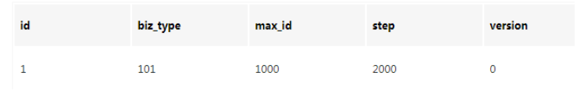

## 实现方式

### UUID

在Java的世界里，想要得到一个具有唯一性的ID，首先被想到可能就是`UUID`，毕竟它有着全球唯一的特性。那么`UUID`可以做`分布式ID`吗？**答案是可以的，但是并不推荐！**

```java
public static void main(String[] args) { 
       String uuid = UUID.randomUUID().toString().replaceAll("-","");
       System.out.println(uuid);
 }
```

`UUID`的生成简单到只有一行代码，输出结果 `c2b8c2b9e46c47e3b30dca3b0d447718`，但UUID却并不适用于实际的业务需求。像用作订单号`UUID`这样的字符串没有丝毫的意义，看不出和订单相关的有用信息；而对于数据库来说用作业务`主键ID`，它不仅是太长还是字符串，存储性能差查询也很耗时，所以不推荐用作`分布式ID`。

**优点：**

- 生成足够简单，本地生成无网络消耗，具有唯一性

**缺点：**

- 无序的字符串，不具备趋势自增特性
- 没有具体的业务含义
- 长度过长16 字节128位，36位长度的字符串，存储以及查询对MySQL的性能消耗较大，MySQL官方明确建议主键要尽量越短越好，作为数据库主键 `UUID` 的无序性会导致数据位置频繁变动，严重影响性能。

### 数据库自增ID

基于数据库的`auto_increment`自增ID完全可以充当`分布式ID`，具体实现：需要一个单独的MySQL实例用来生成ID，建表结构如下：

```java
CREATE DATABASE `SEQ_ID`;
CREATE TABLE SEQID.SEQUENCE_ID (
    id bigint(20) unsigned NOT NULL auto_increment, 
    value char(10) NOT NULL default '',
    PRIMARY KEY (id),
) ENGINE=MyISAM;
```


```java
insert into SEQUENCE_ID(value)  VALUES ('values');
```

当我们需要一个ID的时候，向表中插入一条记录返回`主键ID`，但这种方式有一个比较致命的缺点，访问量激增时MySQL本身就是系统的瓶颈，用它来实现分布式服务风险比较大，不推荐！

**优点：**

- 实现简单，ID单调自增，数值类型查询速度快

**缺点：**

- DB单点存在宕机风险，无法扛住高并发场景

### 数据库多主模式

前边说了单点数据库方式不可取，那对上边的方式做一些高可用优化，换成主从模式集群。害怕一个主节点挂掉没法用，那就做双主模式集群，也就是两个``Mysql``实例都能单独的生产自增ID。

那这样还会有个问题，两个``MySQL``实例的自增ID都从1开始，**会生成重复的ID怎么办？**

**解决方案**：设置`起始值`和`自增步长`

``MySQL_1`` 配置：

```java
set @@auto_increment_offset = 1;     -- 起始值
set @@auto_increment_increment = 2;  -- 步长
```

``MySQL_2`` 配置：

```java
set @@auto_increment_offset = 2;     -- 起始值
set @@auto_increment_increment = 2;  -- 步长
```

这样两个``MySQL``实例的自增ID分别就是：

> 1、3、5、7、9  2、4、6、8、10

那如果集群后的性能还是扛不住高并发咋办？就要进行``MySQL``扩容增加节点，这是一个比较麻烦的事。

水平扩展的数据库集群，有利于解决数据库单点压力的问题，同时为了ID生成特性，将自增步长按照机器数量来设置。

增加第三台`MySQL`实例需要人工修改一、二两台`MySQL实例`的起始值和步长，把`第三台机器的ID`起始生成位置设定在比现有`最大自增ID`的位置远一些，但必须在一、二两台`MySQL实例`ID还没有增长到`第三台MySQL实例`的`起始ID`值的时候，否则`自增ID`就要出现重复了，**必要时可能还需要停机修改**。

**优点：**

- 解决DB单点问题

**缺点：**

- 不利于后续扩容，而且实际上单个数据库自身压力还是大，依旧无法满足高并发场景。

### 号段模式

号段模式是当下分布式ID生成器的主流实现方式之一，号段模式可以理解为从数据库批量的获取自增ID，每次从数据库取出一个号段范围，例如 (1,1000] 代表1000个ID，具体的业务服务将本号段，生成1~1000的自增ID并加载到内存。表结构如下：

```java
CREATE TABLE id_generator (
  id int(10) NOT NULL,
  max_id bigint(20) NOT NULL COMMENT '当前最大id',
  step int(20) NOT NULL COMMENT '号段的布长',
  biz_type	int(20) NOT NULL COMMENT '业务类型',
  version int(20) NOT NULL COMMENT '版本号',
  PRIMARY KEY (`id`)
) 
```

biz_type ：代表不同业务类型

max_id ：当前最大的可用id

step ：代表号段的长度

version ：是一个乐观锁，每次都更新version，保证并发时数据的正确性



等这批号段ID用完，再次向数据库申请新号段，对`max_id`字段做一次`update`操作，`update max_id= max_id + step`，update成功则说明新号段获取成功，新的号段范围是`(max_id ,max_id +step]`。

```java
update id_generator set max_id = #{max_id+step}, version = version + 1 where version = # {version} and biz_type = XXX
```

由于多业务端可能同时操作，所以采用版本号`version`乐观锁方式更新，这种`分布式ID`生成方式不强依赖于数据库，不会频繁的访问数据库，对数据库的压力小很多。

### Redis

`Redis`也同样可以实现，原理就是利用`redis`的 `incr`命令实现ID的原子性自增。

```java
127.0.0.1:6379> set seq_id 1     // 初始化自增ID为1
OK
127.0.0.1:6379> incr seq_id      // 增加1，并返回递增后的数值
(integer) 2
```

用`redis`实现需要注意一点，要考虑到redis持久化的问题。`redis`有两种持久化方式`RDB`和`AOF`

- `RDB`会定时打一个快照进行持久化，假如连续自增但`redis`没及时持久化，而这会Redis挂掉了，重启Redis后会出现ID重复的情况。
- `AOF`会对每条写命令进行持久化，即使`Redis`挂掉了也不会出现ID重复的情况，但由于incr命令的特殊性，会导致`Redis`重启恢复的数据时间过长。

### 雪花算法(SonwFlake)

雪花算法（Snowflake）是twitter公司内部分布式项目采用的ID生成算法，开源后广受国内大厂的好评，在该算法影响下各大公司相继开发出各具特色的分布式生成器。

`Snowflake`生成的是Long类型的ID，一个Long类型占8个字节，每个字节占8比特，也就是说一个Long类型占64个比特。

Snowflake ID组成结构：`正数位`（占1比特）+ `时间戳`（占41比特）+ `机器ID`（占5比特）+ `数据中心`（占5比特）+ `自增值`（占12比特），总共64比特组成的一个Long类型。

- 第一个bit位（1bit）：Java中long的最高位是符号位代表正负，正数是0，负数是1，一般生成ID都为正数，所以默认为0。
- 时间戳部分（41bit）：毫秒级的时间，不建议存当前时间戳，而是用（当前时间戳 - 固定开始时间戳）的差值，可以使产生的ID从更小的值开始；41位的时间戳可以使用69年，(1L << 41) / (1000L * 60 * 60 * 24 * 365) = 69年
- 工作机器id（10bit）：也被叫做`workId`，这个可以灵活配置，机房或者机器号组合都可以。
- 序列号部分（12bit），自增值支持同一毫秒内同一个节点可以生成4096个ID

根据这个算法的逻辑，只需要将这个算法用Java语言实现出来，封装为一个工具方法，那么各个业务应用可以直接使用该工具方法来获取分布式ID，只需保证每个业务应用有自己的工作机器id即可，而不需要单独去搭建一个获取分布式ID的应用。

### 滴滴Tinyid

`Tinyid`由滴滴开发，Github地址：[github.com/didi/tinyid…](https://link.zhihu.com/?target=https%3A//github.com/didi/tinyid%E3%80%82)

`Tinyid`是基于号段模式原理实现的与`Leaf`如出一辙，每个服务获取一个号段（1000,2000]、（2000,3000]、（3000,4000]

### 百度Uidgenerator

`uid-generator`是由百度技术部开发，项目GitHub地址 [github.com/baidu/uid-g…](https://link.zhihu.com/?target=https%3A//github.com/baidu/uid-generator)

`uid-generator`是基于`Snowflake`算法实现的，与原始的`snowflake`算法不同在于，`uid-generator`支持自`定义时间戳`、`工作机器ID`和 `序列号` 等各部分的位数，而且`uid-generator`中采用用户自定义`workId`的生成策略。

`uid-generator`需要与数据库配合使用，需要新增一个`WORKER_NODE`表。当应用启动时会向数据库表中去插入一条数据，插入成功后返回的自增ID就是该机器的`workId`数据由host，port组成。

### 美团Leaf

`Leaf`由美团开发，github地址：[github.com/Meituan-Dia…](https://link.zhihu.com/?target=https%3A//github.com/Meituan-Dianping/Leaf)

`Leaf`同时支持号段模式和`snowflake`算法模式，可以切换使用。

号段模式

先导入源码 [github.com/Meituan-Dia…](https://link.zhihu.com/?target=https%3A//github.com/Meituan-Dianping/Leaf) ，在建一张表`leaf_alloc`

```java
DROP TABLE IF EXISTS `leaf_alloc`;

CREATE TABLE `leaf_alloc` (
  `biz_tag` varchar(128)  NOT NULL DEFAULT '' COMMENT '业务key',
  `max_id` bigint(20) NOT NULL DEFAULT '1' COMMENT '当前已经分配了的最大id',
  `step` int(11) NOT NULL COMMENT '初始步长，也是动态调整的最小步长',
  `description` varchar(256)  DEFAULT NULL COMMENT '业务key的描述',
  `update_time` timestamp NOT NULL DEFAULT CURRENT_TIMESTAMP ON UPDATE CURRENT_TIMESTAMP COMMENT '数据库维护的更新时间',
  PRIMARY KEY (`biz_tag`)
) ENGINE=InnoDB;
```

然后在项目中开启`号段模式`，配置对应的数据库信息，并关闭`snowflake`模式

```java
leaf.name=com.sankuai.leaf.opensource.test
leaf.segment.enable=true
leaf.jdbc.url=jdbc:mysql://localhost:3306/leaf_test?useUnicode=true&characterEncoding=utf8&characterSetResults=utf8
leaf.jdbc.username=root
leaf.jdbc.password=root

leaf.snowflake.enable=false
#leaf.snowflake.zk.address=
#leaf.snowflake.port=
```

启动`leaf-server` 模块的 `LeafServerApplication`项目就跑起来了

号段模式获取分布式自增ID的测试url ：http：[//localhost](https://link.zhihu.com/?target=https%3A//localhost/)：8080/api/segment/get/leaf-segment-test

监控号段模式：[http://localhost:8080/cache](https://link.zhihu.com/?target=http%3A//localhost%3A8080/cache)

snowflake模式

`Leaf`的snowflake模式依赖于`ZooKeeper`，不同于`原始snowflake`算法也主要是在`workId`的生成上，`Leaf`中`workId`是基于`ZooKeeper`的顺序Id来生成的，每个应用在使用`Leaf-snowflake`时，启动时都会都在`Zookeeper`中生成一个顺序Id，相当于一台机器对应一个顺序节点，也就是一个`workId`。

```java
leaf.snowflake.enable=true
leaf.snowflake.zk.address=127.0.0.1
leaf.snowflake.port=2181
```

snowflake模式获取分布式自增ID的测试url：[http://localhost:8080/api/snow](https://link.zhihu.com/?target=http%3A//localhost%3A8080/api/snowflake/get/test)

## 参考链接

[一口气说出9种分布式ID生成方式，面试官有点懵了- 知乎](https://zhuanlan.zhihu.com/p/107939861)
