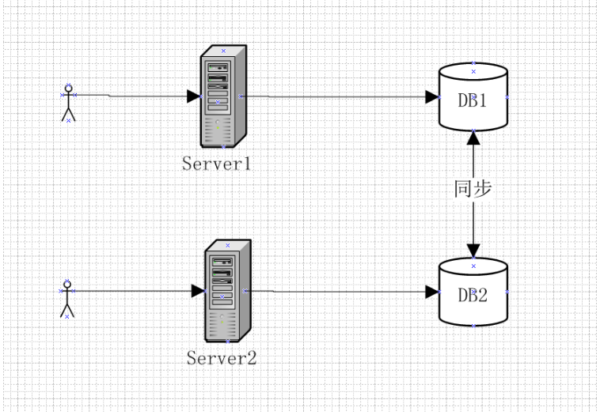

## CAP定理

在计算机科学中，CAP定理指出，对于一个分布式系统，不能同时满足一下三点，最多只能同时满足其中两点：

- 一致性(Consistency)：在分布式系统环境下，数据在多台机器上有多个副本。当对数据执行更新操作时，数据更新操作完成后，所有节点**在同一时间的数据完全一致**，客户端读取的数据永远是更新后的最新数据。
- 可用性(Availability) : 服务一直可用，即**对于客户端每次读或写请求都能在有限时间内得到正确的响应**，但不保证获取的数据为最新数据。 “有限时间内”是指对于客户端的每一个操作请求，系统必能够在指定的时间内返回对应的处理结果，如果超过了这个时间范围，系统将被认为是不可用的。
- 分区容错性(Partition tolerance) : 在**网络分区出现故障时保证系统不受影响**，仍让可以对外提供一致性和可用性服务。网络分区出现故障通常指的是节点之间的网络故障，但是节点内部网络是完好的，这种情况导致的问题就是节点之间无法进行数据复制。

#### CAP定理简单证明

由于分布式系统中多个节点分布在不同的机器（当然也可以是单台机器上的多个节点），节点之间通过网络进行通信，由于网络不完全可靠，所以在分布式系统中我们**必须要满足分区容错性**。若要舍弃分区容错性，也就是只有一个分区，何谈分布式系统，所以下面的讨论总是围绕分区容错性来讨论。当网络分区出现故障的时候，我们可以通过一定策略来达到一致性或可用性的要求。

一个简单的分布式系统如下：系统中有两个节点对外提供服务，Server1和Server2，Server1和Server2各自维护和访问自己的数据库DB1和DB2，DB1和DB2数据通过复制技术保证数据之间的同步。

在理想情况下，即同时满足CAP的情况，DB1和DB2的数据是完全一致的，Server1与Server2可以同时对外提供服务，用户不管是请求server1还是请求server2，都会得到立即响应，并且获取的数据是完全一致且为最新数据。

但是现实中不可能出现这么理想的情况，当DB1和DB2之间网络发声故障时，此时有用户向Server1发送数据更新请求，DB1数据更新后无法将最新数据同步到DB2，此时DB2中存储的任然是旧数据；这个时候，有用户向Server2发送读数据请求，由于数据还没有同步，应用程序无法将最新的数据返回给用户，这个时候有两种选择：

- 牺牲数据一致性，保证服务可用性。Server返回DB2中的旧数据给用户
- 牺牲服务可用性，保证数据一致性。阻塞服务请求，直到故障恢复，DB1与DB2数据同步完成之后再恢复提供服务。

从上面分析可以看出，分布式系统不可能同时满足CAP。在实际应用的过程中，由于不能同时满足CAP,我们必须舍弃其中之一，由于P是所有分布式系统中不许满足的，所以最后需要在C和A之间做个取舍。

在大多数的分布式数据库中（如redis、Hbase等），往往是优先保证CP，因为无论是分布式系统还是想zooKeeper这种分布式协调组件，数据一致性往往是他们最基本的要求。

对于需要保证高可用性的系统，将舍弃数据一致性而保证服务的高可用性。如12306

## Base理论

Base理论是Basically Available（基本可用）、Soft state（软状态）、Eventually consistent（最终一致性）的缩写；它基于CAP定理逐步演化来的，它是CAP中一致性和可用性权衡的结果，其核心思想是即使系统无法达到强一致性，可以**根据应用自身的业务特点，采用适当的方式来使系统达到最终一致性**。

#### 基本可用（Basically Available）

基本可用是指当分布式系统发生故障的时候，允许损失部分可用性。常见的有以下几种情况：

- 响应时间上的损失：正常情况下，一个在线搜索引擎需要再0.5秒之内返回给用户响应的查询结果，但由于出现故障，查询结果的响应时间增加到了1~2秒。
- 功能上的损失：通常的做法是**降级服务**，如对于展示一些有序元素的页面，但部分组件出现故障时，这个时候可不展示有序元素，降级为无序元素列表。

#### 软状态

软状态是指允许系统中的数据存在中间状态，并认为该中间状态的存在不影响系统的整体可用性，即允许系统不同节点的数据副本之间进行数据同步的过程中存在延时。

#### 最终一致性

最终一致性强调的是系统所有的数据副本，在经过一段时间的同步后，最终能够达到一个一致的状态。因此，最终一致性的本质是需要系统保证最终数据能够达到一致，而不需要试试保证系统数据的强一致性。 具体最终一致性的实现方法见之前一致性相关博客：[分布式系统中的数据一致性问题](https://willje.github.io/posts/distributed/%E5%88%86%E5%B8%83%E5%BC%8F%E7%B3%BB%E7%BB%9F%E4%B8%AD%E6%95%B0%E6%8D%AE%E4%B8%80%E8%87%B4%E6%80%A7%E9%97%AE%E9%A2%98/)

