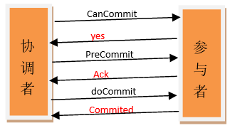

## 数据一致性

#### 数据库系统中的数据一致性

　　数据一致性问题最初是存在于数据库系统中的一个概念，数据库系统中一致性问题通常指的是**关联数据之间的逻辑是否完整和正确**，通常数据库系统会通过使用事务来保证数据的一致性和完整性。**事务本质上就是一个操作序列的有限集合，若事务中有的操作没有成功完成，则事务中的所有操作都需要被回滚，回到事务执行前的状态。**

　　比如当你在淘宝中购买商品进行付款的时候，从宏观上看有以下最基本的步骤：付款成功—->发放商品，若用户付款成功之后，发放商品失败，这个时候会导致数据不一致。解决这种问题常用的方法就是使用事务，若付款成功，发放商品失败，此时将第一个操作回滚。

#### 分布式系统中的数据一致性

　　在分布式系统中，为了达到**系统容灾和提高系统性能**，数据通常会冗余存储在不同机器，通过复制技术来进行主副本之间的数据同步。所以分布式系统中的数据一致性指的是**集群中主副本数据内容的一致性**

- 由于数据冗余在不同机器中，当集群中部分机器挂掉，也可以正常对外服务，消除单点故障
- 集群中的主副本同时对外提供服务，提高系统对外提供服务的性能

### 分布式系统数据一致性模型

　　根据对数据一致性的强弱可以将一致性划分为强一致性、弱一致性和最终一致性三种模型。可以通过一个例子来理解这三种一致性之间的区别与关联。

　　如某运营号在今日头条对一篇文章做了修改，文章存储于主副数据库，主副数据库均对外提供服务，如下：


#### 强一致性

　　强一致性指的是当对数据完成更新操作之后，所有客户端访问到的数据均为更新之后的数据，这样可以保证客户端取到的总是最新的数据。要达到强一致性，将会牺牲较大的性能。

　　对应上述今日头条文章的例子，当运营号修改文章A之后，用户不管是通过应用服务器A访问还是通过应用服务器B访问文章都将访问到最新更新的文章。

#### 弱一致性

　　弱一致性指的是当数据完成更新操作之后，系统并不保证所有的客户端访问到的数据为最新数据，但是会尽量保证在某个时间级别（如秒级或分钟级）之后，让数据达到一致性状态。

　　对应上述今日头条的例子，当运营号修改文章A之后，通过应用服务器B访问的用户并不能保证获取到的一定是最新的文章，但是可以保证在一段时间之后，访问的一定是最新的文章

#### 最终一致性

　　最终一致性是弱一致性的一种特例。当对数据更新完之后，保证没有后续更新的前提下，系统最终返回的是上一次更新操作的值。

　　对应今日头条的例子，当运营号修改文章A之后，通过应用服务器A和B访问的用户最终获取到的文章一定是更新之后的文章。

最终一致性又衍生出以下几种一致性模型：

- 因果一致性：如果A进程在更新之后向B进程通知更新的完成，那么B的访问操作将会返回更新的值。如果没有因果关系的C进程将会遵循最终一致性的规则。
- 读己所写一致性：因果一致性的特定形式。一个进程总可以读到自己更新的数据。
- 会话一致性：读己所写一致性的特定形式。进程在访问存储系统同一个会话内，系统保证该进程读己之所写。
- 单调读一致性：如果一个进程已经读取到一个特定值，那么该进程不会读取到该值以前的任何值。
- 单调写一致性：系统保证对同一个进程的写操作串行化。


## **如何实现分布式一致性？**

**二阶提交协议**和**三阶提交协议**就是最早提出解决分布式一致性的方案。

### 2PC

二阶段提交(Two-phaseCommit)是指，在计算机网络以及数据库领域内，为了使基于分布式系统架构下的所有节点在进行事务提交时保持一致性而设计的一种算法(Algorithm)。

通常，二阶段提交也被称为是一种协议(Protocol))。

在分布式系统中，每个节点虽然可以知晓自己的操作时成功或者失败，却无法知道其他节点的操作的成功或失败。当一个事务跨越多个节点时，为了保持事务的ACID特性，需要引入一个作为协调者的组件来统一掌控所有节点(称作参与者)的操作结果并最终指示这些节点是否要把操作结果进行真正的提交(比如将更新后的数据写入磁盘等等)。

因此，**二阶段提交的算法思路可以概括为：参与者将操作成败通知协调者，再由协调者根据所有参与者的反馈情报决定各参与者是否要提交操作还是中止操作。**

所谓的两个阶段是指：第一阶段：**准备阶段(投票阶段)**和第二阶段：**提交阶段（执行阶段）**。

#### 准备阶段

事务协调者(事务管理器)给每个参与者(资源管理器)发送Prepare消息，每个参与者要么直接返回失败(如权限验证失败)，要么在本地执行事务，写本地的redo和undo日志，但不提交，到达一种“万事俱备，只欠东风”的状态。

可以进一步将准备阶段分为以下三个步骤：

> 1）协调者节点向所有参与者节点询问是否可以执行提交操作(vote)，并开始等待各参与者节点的响应。
>
> 2）参与者节点执行询问发起为止的所有事务操作，并将Undo信息和Redo信息写入日志。（注意：若成功这里其实每个参与者已经执行了事务操作）
>
> 3）各参与者节点响应协调者节点发起的询问。如果参与者节点的事务操作实际执行成功，则它返回一个”同意”消息；如果参与者节点的事务操作实际执行失败，则它返回一个”中止”消息。

#### 提交阶段

如果协调者收到了参与者的失败消息或者超时，直接给每个参与者发送回滚(Rollback)消息；否则，发送提交(Commit)消息；参与者根据协调者的指令执行提交或者回滚操作，释放所有事务处理过程中使用的锁资源。(注意:必须在最后阶段释放锁资源)

接下来分两种情况分别讨论提交阶段的过程。

当协调者节点从所有参与者节点获得的相应消息都为”同意”时:

[](http://www.hollischuang.com/wp-content/uploads/2015/12/success.png)

> 1）协调者节点向所有参与者节点发出”正式提交(commit)”的请求。
>
> 2）参与者节点正式完成操作，并释放在整个事务期间内占用的资源。
>
> 3）参与者节点向协调者节点发送”完成”消息。
>
> 4）协调者节点受到所有参与者节点反馈的”完成”消息后，完成事务。

如果任一参与者节点在第一阶段返回的响应消息为”中止”，或者 协调者节点在第一阶段的询问超时之前无法获取所有参与者节点的响应消息时：

[](http://www.hollischuang.com/wp-content/uploads/2015/12/fail.png)

> 1）协调者节点向所有参与者节点发出”回滚操作(rollback)”的请求。
>
> 2）参与者节点利用之前写入的Undo信息执行回滚，并释放在整个事务期间内占用的资源。
>
> 3）参与者节点向协调者节点发送”回滚完成”消息。
>
> 4）协调者节点受到所有参与者节点反馈的”回滚完成”消息后，取消事务。

不管最后结果如何，第二阶段都会结束当前事务。

二阶段提交看起来确实能够提供原子性的操作，但是不幸的事，二阶段提交还是有几个**缺点**的：

1、**同步阻塞问题**。执行过程中，所有参与节点都是事务阻塞型的。当参与者占有公共资源时，其他第三方节点访问公共资源不得不处于阻塞状态。

2、**单点故障**。由于协调者的重要性，一旦协调者发生故障。参与者会一直阻塞下去。尤其在第二阶段，协调者发生故障，那么所有的参与者还都处于锁定事务资源的状态中，而无法继续完成事务操作。（如果是协调者挂掉，可以重新选举一个协调者，但是无法解决因为协调者宕机导致的参与者处于阻塞状态的问题）

3、**数据不一致**。在二阶段提交的阶段二中，当协调者向参与者发送commit请求之后，发生了局部网络异常或者在发送commit请求过程中协调者发生了故障，这回导致只有一部分参与者接受到了commit请求。而在这部分参与者接到commit请求之后就会执行commit操作。但是其他部分未接到commit请求的机器则无法执行事务提交。于是整个分布式系统便出现了数据部一致性的现象。

4、二阶段无法解决的问题：**极限情况下,对某一事务的不确定性！**协调者再发出commit消息之后宕机，而唯一接收到这条消息的参与者同时也宕机了。那么即使协调者通过选举协议产生了新的协调者，这条事务的状态也是不确定的，没人知道事务是否被已经提交。

由于二阶段提交存在着诸如同步阻塞、单点问题、脑裂等缺陷，所以，研究者们在二阶段提交的基础上做了改进，提出了三阶段提交。

### 3PC

> 三阶段提交（Three-phase commit），也叫三阶段提交协议（Three-phase commit protocol），是二阶段提交（2PC）的改进版本。

[](http://www.hollischuang.com/wp-content/uploads/2015/12/3.png)

与两阶段提交不同的是，三阶段提交有两个改动点。

1、引入超时机制。同时在协调者和参与者中都引入超时机制。 2、在第一阶段和第二阶段中插入一个准备阶段。保证了在最后提交阶段之前各参与节点的状态是一致的。

也就是说，除了引入超时机制之外，3PC把2PC的准备阶段再次一分为二，这样三阶段提交就有`CanCommit`、`PreCommit`、`DoCommit`三个阶段。

#### CanCommit阶段

3PC的CanCommit阶段其实和2PC的准备阶段很像。协调者向参与者发送commit请求，参与者如果可以提交就返回Yes响应，否则返回No响应。

> **1.事务询问** 协调者向参与者发送CanCommit请求。询问是否可以执行事务提交操作。然后开始等待参与者的响应。
>
> **2.响应反馈** 参与者接到CanCommit请求之后，正常情况下，如果其自身认为可以顺利执行事务，则返回Yes响应，并进入预备状态。否则反馈No

#### PreCommit阶段

协调者根据参与者的反应情况来决定是否可以记性事务的PreCommit操作。根据响应情况，有以下两种可能。

**假如协调者从所有的参与者获得的反馈都是Yes响应，那么就会执行事务的预执行。**

> **1.发送预提交请求** 协调者向参与者发送PreCommit请求，并进入Prepared阶段。
>
> **2.事务预提交** 参与者接收到PreCommit请求后，会执行事务操作，并将undo和redo信息记录到事务日志中。
>
> **3.响应反馈** 如果参与者成功的执行了事务操作，则返回ACK响应，同时开始等待最终指令。

**假如有任何一个参与者向协调者发送了No响应，或者等待超时之后，协调者都没有接到参与者的响应，那么就执行事务的中断。**

> **1.发送中断请求** 协调者向所有参与者发送abort请求。
>
> **2.中断事务** 参与者收到来自协调者的abort请求之后（或超时之后，仍未收到协调者的请求），执行事务的中断。

#### doCommit阶段

该阶段进行真正的事务提交，也可以分为以下两种情况。

**执行提交**

> **1.发送提交请求** 协调接收到参与者发送的ACK响应，那么他将从预提交状态进入到提交状态。并向所有参与者发送doCommit请求。
>
> **2.事务提交** 参与者接收到doCommit请求之后，执行正式的事务提交。并在完成事务提交之后释放所有事务资源。
>
> **3.响应反馈** 事务提交完之后，向协调者发送Ack响应。
>
> **4.完成事务** 协调者接收到所有参与者的ack响应之后，完成事务。

**中断事务** 协调者没有接收到参与者发送的ACK响应（可能是接受者发送的不是ACK响应，也可能响应超时），那么就会执行中断事务。

> **1.发送中断请求** 协调者向所有参与者发送abort请求
>
> **2.事务回滚** 参与者接收到abort请求之后，利用其在阶段二记录的undo信息来执行事务的回滚操作，并在完成回滚之后释放所有的事务资源。
>
> **3.反馈结果** 参与者完成事务回滚之后，向协调者发送ACK消息
>
> **4.中断事务** 协调者接收到参与者反馈的ACK消息之后，执行事务的中断。

## 2PC与3PC的区别

相对于2PC，3PC主要解决的单点故障问题，并减少阻塞，因为一旦参与者无法及时收到来自协调者的信息之后，他会默认执行commit。而不会一直持有事务资源并处于阻塞状态。但是这种机制也会导致数据一致性问题，因为，由于网络原因，协调者发送的abort响应没有及时被参与者接收到，那么参与者在等待超时之后执行了commit操作。这样就和其他接到abort命令并执行回滚的参与者之间存在数据不一致的情况。

## 终极办法

了解了2PC和3PC之后，我们可以发现，无论是二阶段提交还是三阶段提交都无法彻底解决分布式的一致性问题。Google Chubby的作者Mike Burrows说过，

```html
there is only one consensus protocol, and that’s Paxos” – all other approaches are just broken versions of Paxos.
```

意即**世上只有一种一致性算法，那就是Paxos**，所有其他一致性算法都是Paxos算法的不完整版。

Paxos算法太难于理解，[Raft算法](https://willje.github.io/posts/distributed/raft-%E7%AE%97%E6%B3%95/)更易理解也有具体实现。