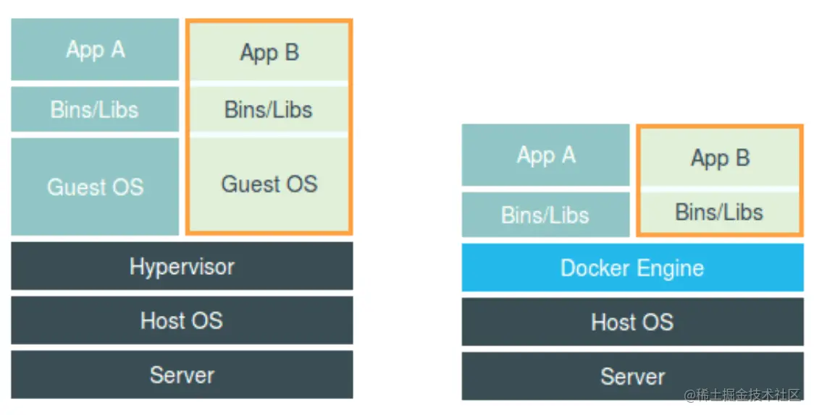
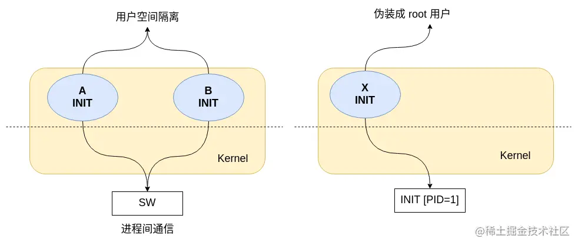
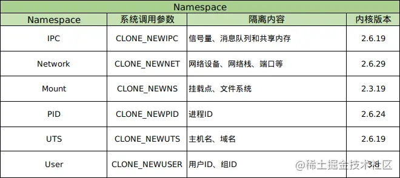
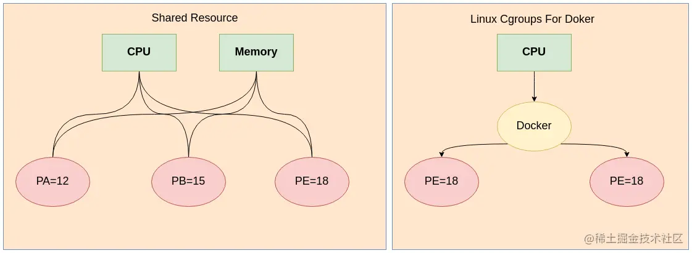

## 容器其实就是一种特殊的进程

为什么使用容器？

> 容器虚拟化可以更高效地构建应用，也更容易管理维护。

左图是虚拟机的工作原理，右图是`Docker`，所示：



容器的核心技术是**Cgroup**和**Namespace**，在此基础上还有一些其他工具共同构成容器技术。

**容器是宿主机上的进程**：

1. 容器技术通过 `Namespace` 实现资源隔离
2. 通过`Cgroup`实现资源控制
3. 通过`rootfs`实现文件系统隔离
4. 容器引擎自身的特性来管理容器的生命周期

> 补充： `Docker`早期其实就相当与`LXC`的管理引擎，`LXC`是`Cgroup`的管理工具，`Cgroup`是`Namespace`的用户空间管理接口。 `Namespace`是Linux内核在`task_struct`中对进程管理的基础机制。

## `Namespace` 资源隔离

开发`Namespace`的主要目的之一：**实现轻量级的虚拟化服务**

> 资源隔离，就会想到`chroot`命令，通过它可以实现文件系统隔离。

如图：



### `Namespace` 隔离

容器需要6种基本隔离：

如图：



1. `IPC`进程间通信，通过共享内存的方式实现。如果两个进程能直接通过`IPC`互访，那就不是隔离了，原始的`Linux ENV`中不同的进程都是可以直接通过`IPC`通信
2. 进程树和文件系统树，进程两种形式存在，一种是用户空间的`INIT`，一种是从属于某一进程。子进程由父进程创建、终止和回收。`INIT`结束之前，需要终止本用户空间所有的进程（PID映射）。
3. 用过用户来运行某一个进程（User）。每一个用户空间都需要自己的`root`，伪装一个`root`用户[不能处理别的用户空间的内容，比如删除文件]，对应在宿主机上只是一个普通的用户。
4. `Mount`，文件挂载系统，`cd /usr/bin/` 和 宿主机对比。发现是独立的文件系统
5. `UTS-hostname`
6. `Network`：`netstat -an | grep 22`

### `Namespace` 操作

对`Namespace`的操作，主要是通过 `clone`、`setns`、`unshare` 这三个系统调用来完成。

> 1. `clone` 可以用来创建新的 `Namespace`
> 2. `unshare` 调用的进程会被放进新的 `Namespace`
> 3. `setns` 将进程放到已有的 `Namespace`

查询当前进程的 `Namespace`

```sh
donald@donald-pro:~$ ls -l /proc/$$/ns
total 0
lrwxrwxrwx 1 donald donald 0 Apr 22 00:00 cgroup -> 'cgroup:[4026531835]'
lrwxrwxrwx 1 donald donald 0 Apr 22 00:00 ipc -> 'ipc:[4026531839]'
lrwxrwxrwx 1 donald donald 0 Apr 22 00:00 mnt -> 'mnt:[4026531840]'
lrwxrwxrwx 1 donald donald 0 Apr 22 00:00 net -> 'net:[4026532009]'
lrwxrwxrwx 1 donald donald 0 Apr 22 00:00 pid -> 'pid:[4026531836]'
lrwxrwxrwx 1 donald donald 0 Apr 22 00:00 pid_for_children -> 'pid:[4026531836]'
lrwxrwxrwx 1 donald donald 0 Apr 22 00:00 user -> 'user:[4026531837]'
lrwxrwxrwx 1 donald donald 0 Apr 22 00:00 uts -> 'uts:[4026531838]'
donald@donald-pro:~$ 
```

## `Cgroup`资源控制

`Cgroup` 是 `Linux` 内核提供的一种可以限制、记录、隔离进程组（`process groups`）所使用的物理资源（如：CPU、内存、IO等等）的机制

`Cgroup`有一套进程分组框架，不同资源由不同的子系统控制。 一个子系统就是一个资源控制器，比如 `CPU`子系统就是控制 `CPU`时间分配的一个控制器。

> 通过 Linux 的命名空间为新创建的进程隔离了文件系统、网络与宿主机器之间的进程互相隔离，但是命名空间并不能够为我们提供物理资源上的隔离，比如 `CPU` 或者 内存，如果在同一台机器上运行了多个彼此以及宿主机器一无所知的 [容器]，这些容器却共同占用了宿主机的物理资源。



> 在`Linux`上安装了`Docker`，你就会发现所有子系统的目录下都有一个名为 `docker`的目录。
>
> `cpu.cfs_quota_us`文件中的内容能够对`CPU`的使用作出限制。

```shell
donald@donald-pro:/sys/fs/cgroup$ ll
total 0
drwxr-xr-x 15 root root 380 Apr 22 18:05 ./
drwxr-xr-x  9 root root   0 Apr 22 18:05 ../
dr-xr-xr-x  4 root root   0 Apr 22 18:05 blkio/
lrwxrwxrwx  1 root root  11 Apr 22 18:05 cpu -> cpu,cpuacct/
lrwxrwxrwx  1 root root  11 Apr 22 18:05 cpuacct -> cpu,cpuacct/
dr-xr-xr-x  4 root root   0 Apr 22 18:05 cpu,cpuacct/
dr-xr-xr-x  2 root root   0 Apr 22 18:05 cpuset/
dr-xr-xr-x  5 root root   0 Apr 22 18:05 devices/
dr-xr-xr-x  3 root root   0 Apr 22 18:05 freezer/
dr-xr-xr-x  2 root root   0 Apr 22 18:05 hugetlb/
dr-xr-xr-x  4 root root   0 Apr 22 18:05 memory/
lrwxrwxrwx  1 root root  16 Apr 22 18:05 net_cls -> net_cls,net_prio/
dr-xr-xr-x  2 root root   0 Apr 22 18:05 net_cls,net_prio/
lrwxrwxrwx  1 root root  16 Apr 22 18:05 net_prio -> net_cls,net_prio/
dr-xr-xr-x  2 root root   0 Apr 22 18:05 perf_event/
dr-xr-xr-x  4 root root   0 Apr 22 18:05 pids/
dr-xr-xr-x  2 root root   0 Apr 22 18:05 rdma/
dr-xr-xr-x  5 root root   0 Apr 22 18:05 systemd/
dr-xr-xr-x  5 root root   0 Apr 22 18:05 unified/

donald@donald-pro:/sys/fs/cgroup/cpu/docker$ ll
total 0
drwxr-xr-x 3 root root 0 Apr 25 14:28 ./
dr-xr-xr-x 5 root root 0 Apr 25 14:28 ../
drwxr-xr-x 2 root root 0 Apr 25 14:28 c988e6a0567ccc350b18e3e2eb96cfe0dbff4edd202ab4132012916b019c2904/
-rw-r--r-- 1 root root 0 Apr 25 14:28 cgroup.clone_children
-rw-r--r-- 1 root root 0 Apr 25 14:28 cgroup.procs
-r--r--r-- 1 root root 0 Apr 25 14:28 cpuacct.stat
-rw-r--r-- 1 root root 0 Apr 25 14:28 cpuacct.usage
-r--r--r-- 1 root root 0 Apr 25 14:28 cpuacct.usage_all
-r--r--r-- 1 root root 0 Apr 25 14:28 cpuacct.usage_percpu
-r--r--r-- 1 root root 0 Apr 25 14:28 cpuacct.usage_percpu_sys
-r--r--r-- 1 root root 0 Apr 25 14:28 cpuacct.usage_percpu_user
-r--r--r-- 1 root root 0 Apr 25 14:28 cpuacct.usage_sys
-r--r--r-- 1 root root 0 Apr 25 14:28 cpuacct.usage_user
-rw-r--r-- 1 root root 0 Apr 25 14:28 cpu.cfs_period_us
-rw-r--r-- 1 root root 0 Apr 25 14:28 cpu.cfs_quota_us
-rw-r--r-- 1 root root 0 Apr 25 14:28 cpu.shares
-r--r--r-- 1 root root 0 Apr 25 14:28 cpu.stat
-rw-r--r-- 1 root root 0 Apr 25 14:28 notify_on_release
-rw-r--r-- 1 root root 0 Apr 25 14:28 tasks

donald@donald-pro:/sys/fs/cgroup/cpu/docker/c988e6a0567ccc350b18e3e2eb96cfe0dbff4edd202ab4132012916b019c2904$ sudo docker ps
CONTAINER ID        IMAGE                       COMMAND                  CREATED             STATUS              PORTS                    NAMES
c988e6a0567c        mobz/elasticsearch-head:5   "/bin/sh -c 'grunt s…"   5 months ago        Up 3 minutes        0.0.0.0:9100->9100/tcp   loving_albattani

# 配额，-1 表示不限额
donald@donald-pro:/sys/fs/cgroup/cpu/docker/c988e6a0567ccc350b18e3e2eb96cfe0dbff4edd202ab4132012916b019c2904$ cat cpu.cfs_quota_us 
-1
```

## 容器的创建过程

### （1）系统调用`clone`创建新进程，拥有自己的`Namespace`

该进程拥有自己的：`pid`、`mount`、`user`、`net`、`ipc`、`uts namespace`

```shell
root@docker:~# pid = clone(fun, stack, flags, clone_arg);
```

### （2）将`pid`写入`cgroup`子系统，就受到 `cgroup` 子系统的控制

```shell
root@docker:~# echo$pid > /sys/fs/cgroup/cpu/tasks
root@docker:~# echo$pid > /sys/fs/cgroup/cpuset/tasks
root@docker:~# echo$pid > /sys/fs/cgroup/bikio/tasks
root@docker:~# echo$pid > /sys/fs/cgroup/memory/tasks
root@docker:~# echo$pid > /sys/fs/cgroup/devices/tasks
root@docker:~# echo$pid > /sys/fs/cgroup/feezer/tasks
```

### （3）通过 `pivot_root` 系统调用

通过 `pivot_root` 系统调用，使进程进入一个新的 `rootfs`，之后通过 `exec`系统调用在新的`Namespace`、`Cgroup`、`rootfs` 中执行 `/bin/bash`

```shell
fun() {
  pivot_root("path_of_rootfs/", path);
  exec("/bin/bash");
}
```

## 参考资料

[一篇搞懂容器技术的基石： cgroup ](https://segmentfault.com/a/1190000040980305)

