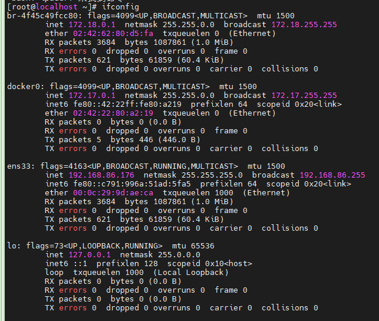
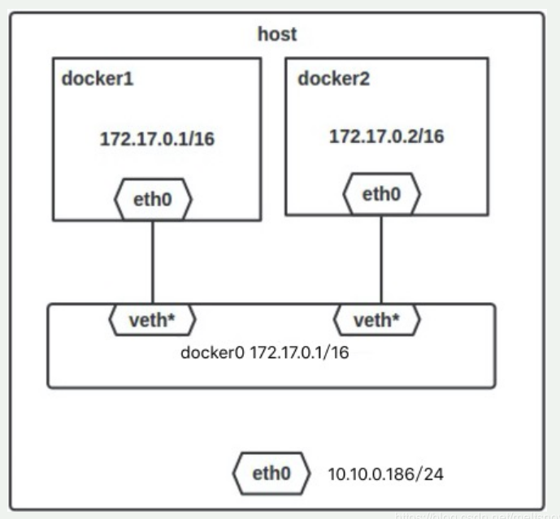
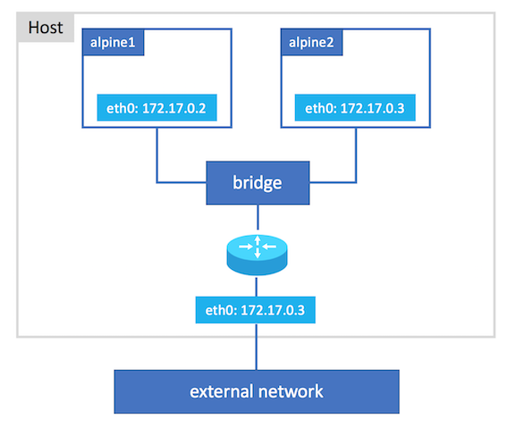
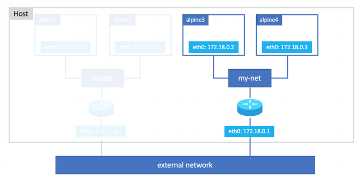

安装Docker时，它会自动创建三个网络，bridge（创建容器默认连接到此网络）、 none 、host

| 网络模式   | 简介                                                         |
| ---------- | ------------------------------------------------------------ |
| Host       | 容器将不会虚拟出自己的网卡，配置自己的IP等，而是使用宿主机的IP和端口。 |
| Bridge     | 此模式会为每一个容器分配、设置IP等，并将容器连接到一个docker0虚拟网桥，通过docker0网桥以及Iptables nat表配置与宿主机通信。 |
| None       | 该模式关闭了容器的网络功能。                                 |
| Container  | 创建的容器不会创建自己的网卡，配置自己的IP，而是和一个指定的容器共享IP、端口范围。 |
| 自定义网络 | 略                                                           |

## 一、默认网络

当你安装Docker时，它会自动创建三个网络。你可以使用以下docker network ls命令列出这些网络：

```bash
[root@server1 ~]# docker network ls
NETWORK ID          NAME                DRIVER              SCOPE
0147b8d16c64        bridge              bridge              local
2da931af3f0b        host                host                local
63d31338bcd9        none                null                local
```

Docker内置这三个网络，运行容器时，你可以使用该`--network`标志来指定容器应连接到哪些网络。

该bridge网络代表docker0所有Docker安装中存在的网络。除非你使用该`docker run --network=选项`指定，否则Docker守护程序默认将容器连接到此网络。

我们在使用docker run创建Docker容器时，可以用 `--net` 选项指定容器的网络模式，Docker可以有以下4种网络模式：

- host模式：使用 --net=host 指定。
- none模式：使用 --net=none 指定。
- bridge模式：使用 --net=bridge 指定，默认设置。
- container模式：使用 --net=container:NAME_or_ID 指定。

下面分别介绍一下Docker的各个网络模式。

## 1.1 Host模式

相当于Vmware中的桥接模式，与宿主机在同一个网络中，但没有独立IP地址。

众所周知，Docker使用了Linux的Namespaces技术来进行资源隔离，如PID Namespace隔离进程，Mount Namespace隔离文件系统，Network Namespace隔离网络等。

一个Network Namespace提供了一份独立的网络环境，包括网卡、路由、Iptable规则等都与其他的Network Namespace隔离。一个Docker容器一般会分配一个独立的Network Namespace。但如果启动容器的时候使用host模式，那么这个容器将不会获得一个独立的Network Namespace，而是和宿主机共用一个Network Namespace。容器将不会虚拟出自己的网卡，配置自己的IP等，而是使用宿主机的IP和端口。

例如，我们在172.25.6.1/24的机器上用host模式启动一个ubuntu容器

```bash
[root@server1 ~]# docker run -it --network=host ubuntu
```

可以看到，容器的网络使用的时宿主机的网络，但是，容器的其他方面，如文件系统、进程列表等还是和宿主机隔离的。

## 1.2 Container模式

在理解了host模式后，这个模式也就好理解了。这个模式指定新创建的容器和已经存在的一个容器共享一个Network Namespace，而不是和宿主机共享。新创建的容器不会创建自己的网卡，配置自己的IP，而是和一个指定的容器共享IP、端口范围等。同样，两个容器除了网络方面，其他的如文件系统、进程列表等还是隔离的。两个容器的进程可以通过lo网卡设备通信。

## 1.3 None模式

该模式将容器放置在它自己的网络栈中，但是并不进行任何配置。实际上，该模式关闭了容器的网络功能，在以下两种情况下是有用的：容器并不需要网络（例如只需要写磁盘卷的批处理任务）。

在docker1.7代码进行了重构，单独把网络部分独立出来编写，所以在docker1.8新加入的一个overlay网络模式。Docker对于网络访问的控制也是在逐渐完善的。

## 1.4 Bridge模式

相当于Vmware中的Nat模式，容器使用独立network Namespace，并连接到docker0虚拟网卡（默认模式）。通过docker0网桥以及Iptables nat表配置与宿主机通信；bridge模式是Docker默认的网络设置，此模式会为每一个容器分配Network Namespace、设置IP等，并将一个主机上的Docker容器连接到一个虚拟网桥上。下面着重介绍一下此模式。

# 二、Bridge模式

执行``ifconfig``命令查看docker0的虚拟网桥。



## 2.1 Bridge模式的拓扑

当Docker server启动时，会在主机上创建一个名为docker0的虚拟网桥，此主机上启动的Docker容器会连接到这个虚拟网桥上。虚拟网桥的工作方式和物理交换机类似，这样主机上的所有容器就通过交换机连在了一个二层网络中。接下来就要为容器分配IP了，Docker会从RFC1918所定义的私有IP网段中，选择一个和宿主机不同的IP地址和子网分配给docker0，连接到docker0的容器就从这个子网中选择一个未占用的IP使用。

如一般Docker会使用172.17.0.0/16这个网段，并将172.17.0.1/16分配给docker0网桥（在主机上使用ifconfig命令是可以看到docker0的，可以认为它是网桥的管理接口，在宿主机上作为一块虚拟网卡使用）。单机环境下的网络拓扑如下，主机地址为10.10.0.186/24。



## 2.2 Docker：网络模式详解

Docker完成以上网络配置的过程大致是这样的：

（1）在主机上创建一对虚拟网卡veth pair设备。veth设备总是成对出现的，它们组成了一个数据的通道，数据从一个设备进入，就会从另一个设备出来。因此，veth设备常用来连接两个网络设备。

（2）Docker将veth pair设备的一端放在新创建的容器中，并命名为eth0。另一端放在主机中，以veth65f9这样类似的名字命名，并将这个网络设备加入到docker0网桥中，可以通过`brctl show`命令查看。

```bash
brctl show
bridge name     bridge id               STP enabled     interfaces
docker0        8000.02425f21c208          no
```

（3）从docker0子网中分配一个IP给容器使用，并设置docker0的IP地址为容器的默认网关。

```bash
# 运行容器
[root@server1 ~]# docker run --name=nginx_bridge --net=bridge -p 80:80 -d nginx        
9582dbec7981085ab1f159edcc4bf35e2ee8d5a03984d214bce32a30eab4921a
# 查看容器
[root@server1 ~]# docker ps
CONTAINER ID        IMAGE          COMMAND                  CREATED             STATUS              PORTS                NAMES
9582dbec7981        nginx          "nginx -g 'daemon ..."   3 seconds ago       Up 2 seconds        0.0.0.0:80->80/tcp   nginx_bridge

# 查看容器网络;
[root@server1 ~]# docker inspect 9582dbec7981
"Networks": {
    "bridge": {
        "IPAMConfig": null,
        "Links": null,
        "Aliases": null,
        "NetworkID": "9e017f5d4724039f24acc8aec634c8d2af3a9024f67585fce0a0d2b3cb470059",
        "EndpointID": "81b94c1b57de26f9c6690942cd78689041d6c27a564e079d7b1f603ecc104b3b",
        "Gateway": "172.17.0.1",
        "IPAddress": "172.17.0.2",
        "IPPrefixLen": 16,
        "IPv6Gateway": "",
        "GlobalIPv6Address": "",
        "GlobalIPv6PrefixLen": 0,
        "MacAddress": "02:42:ac:11:00:02"
    }
}

# 查看网桥信息，会看到有有一个容器
[root@server1 ~]# docker network inspect bridge
[
    {
        "Name": "bridge",
        "Id": "9e017f5d4724039f24acc8aec634c8d2af3a9024f67585fce0a0d2b3cb470059",
        "Created": "2019-06-09T23:20:28.061678042-04:00",
        "Scope": "local",
        "Driver": "bridge",
        "EnableIPv6": false,
        "IPAM": {
            "Driver": "default",
            "Options": null,
            "Config": [
                {
                    "Subnet": "172.17.0.0/16"
                }
            ]
        },
        "Internal": false,
        "Attachable": false,
        "Ingress": false,
        "Containers": {
            "9582dbec7981085ab1f159edcc4bf35e2ee8d5a03984d214bce32a30eab4921a": {
                "Name": "nginx_bridge",
                "EndpointID": "81b94c1b57de26f9c6690942cd78689041d6c27a564e079d7b1f603ecc104b3b",
                "MacAddress": "02:42:ac:11:00:02",
                "IPv4Address": "172.17.0.2/16",
                "IPv6Address": ""
            }
        },
        "Options": {
            "com.docker.network.bridge.default_bridge": "true",
            "com.docker.network.bridge.enable_icc": "true",
            "com.docker.network.bridge.enable_ip_masquerade": "true",
            "com.docker.network.bridge.host_binding_ipv4": "0.0.0.0",
            "com.docker.network.bridge.name": "docker0",
            "com.docker.network.driver.mtu": "1500"
        },
        "Labels": {}
    }
]
```

## 2.3 bridge模式下容器的通信

在bridge模式下，连在同一网桥上的容器可以相互通信（若出于安全考虑，也可以禁止它们之间通信，方法是在DOCKER_OPTS变量中设置`--icc=false`，这样只有使用`--link`才能使两个容器通信）。

Docker可以开启容器间通信（意味着默认配置`--icc=false`），也就是说，宿主机上的所有容器可以不受任何限制地相互通信，这可能导致拒绝服务攻击。进一步地，Docker可以通过`--ip_forward`和`--iptables`两个选项控制容器间、容器和外部世界的通信。

容器也可以与外部通信，我们看一下主机上的Iptable规则，可以看到这么一条

```
-A POSTROUTING -s 172.17.0.0/16 ! -o docker0 -j MASQUERADE
```

这条规则会将源地址为172.17.0.0/16的包（也就是从Docker容器产生的包），并且不是从docker0网卡发出的，进行源地址转换，转换成主机网卡的地址。这么说可能不太好理解，举一个例子说明一下。假设主机有一块网卡为eth0，IP地址为10.10.101.105/24，网关为10.10.101.254。从主机上一个IP为172.17.0.1/16的容器中ping百度（180.76.3.151）。IP包首先从容器发往自己的默认网关docker0，包到达docker0后，也就到达了主机上。然后会查询主机的路由表，发现包应该从主机的eth0发往主机的网关10.10.105.254/24。接着包会转发给eth0，并从eth0发出去（主机的ip_forward转发应该已经打开）。这时候，上面的Iptable规则就会起作用，对包做SNAT转换，将源地址换为eth0的地址。这样，在外界看来，这个包就是从10.10.101.105上发出来的，Docker容器对外是不可见的。

那么，外面的机器是如何访问Docker容器的服务呢？我们首先用下面命令创建一个含有web应用的容器，将容器的80端口映射到主机的80端口。

```bash
docker run --name=nginx_bridge --net=bridge -p 80:80 -d nginx
```

然后查看Iptable规则的变化，发现多了这样一条规则：

```bash
-A DOCKER ! -i docker0 -p tcp -m tcp --dport 80 -j DNAT --to-destination 172.17.0.2:80
```

此条规则就是对主机eth0收到的目的端口为80的tcp流量进行DNAT转换，将流量发往172.17.0.2:80，也就是我们上面创建的Docker容器。所以，外界只需访问10.10.101.105:80就可以访问到容器中的服务。

除此之外，我们还可以自定义Docker使用的IP地址、DNS等信息，甚至使用自己定义的网桥，但是其工作方式还是一样的。

# 三、容器互联

我们还是通过一些小实验来理解和感受 Bridge Network。与上一节不同的是，我们将使用 [Alpine Linux](https://link.segmentfault.com/?url=https%3A%2F%2Fwww.alpinelinux.org%2F) 镜像作为实验原材料，因为：

- 非常轻量小巧（整个镜像仅 5MB 左右）
- 功能丰富，比“瑞士军刀” [Busybox](https://link.segmentfault.com/?url=https%3A%2F%2Fwww.busybox.net%2F) 还要完善

网桥网络可分为两类：

1. 默认网络（Docker 运行时自带，不推荐用于生产环境）
2. 自定义网络（推荐使用）

让我们分别实践一下吧。

### 3.1 默认网络



我们会在默认的 `bridge` 网络上连接两个容器 `alpine1` 和 `alpine2`。 运行以下命令，查看当前已有的网络：

```bash
docker network ls
```

应该会看到以下输出（注意你机器上的 ID 很有可能不一样）：

```bash
NETWORK ID          NAME                DRIVER              SCOPE
cb33efa4d163        bridge              bridge              local
010deedec029        host                host                local
772a7a450223        none                null                local
```

这三个默认网络分别对应上面的 `bridge`、`host` 和 `none` 网络类型。接下来我们将创建两个容器，分别名为 `alpine1` 和 `alpine2`，命令如下：

```bash
docker run -dit --name alpine1 alpine
docker run -dit --name alpine2 alpine
```

`-dit` 是 `-d`（后台模式）、`-i`（交互模式）和 `-t`（虚拟终端）三个选项的合并。通过这个组合，我们可以让容器保持在后台运行而不会退出（没错，相当于是在“空转”）。

用 `docker ps` 命令确定以上两个容器均在后台运行：

```bash
CONTAINER ID        IMAGE               COMMAND             CREATED             STATUS              PORTS               NAMES
501559d2fab7        alpine              "/bin/sh"           2 seconds ago       Up 1 second                             alpine2
18bed3178732        alpine              "/bin/sh"           3 seconds ago       Up 2 seconds                            alpine1
```

通过以下命令查看默认的 `bridge` 网络的详情：

```bash
docker network inspect bridge
```

应该会输出 JSON 格式的网络详细数据：

```bash
[
  {
    "Name": "bridge",
    "Id": "cb33efa4d163adaa61d6b80c9425979650d27a0974e6d6b5cd89fd743d64a44c",
    "Created": "2020-01-08T07:29:11.102566065Z",
    "Scope": "local",
    "Driver": "bridge",
    "EnableIPv6": false,
    "IPAM": {
      "Driver": "default",
      "Options": null,
      "Config": [
        {
          "Subnet": "172.17.0.0/16",
          "Gateway": "172.17.0.1"
        }
      ]
    },
    "Internal": false,
    "Attachable": false,
    "Ingress": false,
    "ConfigFrom": {
      "Network": ""
    },
    "ConfigOnly": false,
    "Containers": {
      "18bed3178732b5c7a37d7ad820c111fac72a6b0f47844401d60a18690bd37ee5": {
        "Name": "alpine1",
        "EndpointID": "9c7d8ee9cbd017c6bbdfc023397b23a4ce112e4957a0cfa445fd7f19105cc5a6",
        "MacAddress": "02:42:ac:11:00:02",
        "IPv4Address": "172.17.0.2/16",
        "IPv6Address": ""
      },
      "501559d2fab736812c0cf181ed6a0b2ee43ce8116df9efbb747c8443bc665b03": {
        "Name": "alpine2",
        "EndpointID": "da192d61e4b2df039023446830bf477cc5a9a026d32938cb4a350a82fea5b163",
        "MacAddress": "02:42:ac:11:00:03",
        "IPv4Address": "172.17.0.3/16",
        "IPv6Address": ""
      }
    },
    "Options": {
      "com.docker.network.bridge.default_bridge": "true",
      "com.docker.network.bridge.enable_icc": "true",
      "com.docker.network.bridge.enable_ip_masquerade": "true",
      "com.docker.network.bridge.host_binding_ipv4": "0.0.0.0",
      "com.docker.network.bridge.name": "docker0",
      "com.docker.network.driver.mtu": "1500"
    },
    "Labels": {}
  }
]
```

我们重点要关注的是两个字段：

- `IPAM`：IP 地址管理信息（IP Address Management），可以看到网关地址为 `172.17.0.1`（由于篇幅有限，想要了解**网关**的同学可自行查阅计算机网络以及 TCP/IP 协议方面的资料）
- `Containers`：包括此网络上连接的所有容器，可以看到我们刚刚创建的 `alpine1` 和 `alpine2`，它们的 IP 地址分别为 `172.17.0.2` 和 `172.17.0.3`（后面的 `/16` 是子网掩码，暂时不用考虑）

> **提示**
>
> 如果你熟悉 Go 模板语法，可以通过 `-f`（`format`）参数过滤掉不需要的信息。例如我们只想查看 `bridge` 的网关地址：
>
> ```bash
> $ docker network inspect --format '{{json .IPAM.Config }}' bridge
> [{"Subnet":"172.17.0.0/16","Gateway":"172.17.0.1"}]
> ```

让我们进入 `alpine1` 容器中：

```bash
docker attach alpine1
```

> 注意
>
> `attach` 命令只能进入设置了交互式运行的容器（也就是在启动时加了 `-i` 参数）。

如果你看到前面的命令提示符变成 `/ #`，说明我们已经身处容器之中了。我们通过 `ping` 命令测试一下网络连接情况，首先 ping 一波图雀社区的主站 tuture.co（`-c` 参数代表发送数据包的数量，这里我们设为 5）：

```bash
/ # ping -c 5 tuture.co
PING tuture.co (150.109.19.98): 56 data bytes
64 bytes from 150.109.19.98: seq=2 ttl=37 time=65.294 ms
64 bytes from 150.109.19.98: seq=3 ttl=37 time=65.425 ms
64 bytes from 150.109.19.98: seq=4 ttl=37 time=65.332 ms

--- tuture.co ping statistics ---
5 packets transmitted, 3 packets received, 40% packet loss
round-trip min/avg/max = 65.294/65.350/65.425 ms
```

OK，虽然丢了几个包，但是可以连上（取决于你的网络环境，全丢包也是正常的）。由此可见，**容器内可以访问主机所连接的全部网络**（包括 localhost）。

接下来测试能否连接到 `alpine2`，在刚才 `docker network inspect` 命令的输出中找到 `alpine2` 的 IP 为 `172.17.0.3`，尝试能否 ping 通：

```bash
/ # ping -c 5 172.17.0.3
PING 172.17.0.3 (172.17.0.3): 56 data bytes
64 bytes from 172.17.0.3: seq=0 ttl=64 time=0.147 ms
64 bytes from 172.17.0.3: seq=1 ttl=64 time=0.103 ms
64 bytes from 172.17.0.3: seq=2 ttl=64 time=0.102 ms
64 bytes from 172.17.0.3: seq=3 ttl=64 time=0.125 ms
64 bytes from 172.17.0.3: seq=4 ttl=64 time=0.125 ms

--- 172.17.0.3 ping statistics ---
5 packets transmitted, 5 packets received, 0% packet loss
round-trip min/avg/max = 0.102/0.120/0.147 ms
```

完美！我们能够从 `alpine1` 中访问 `alpine2` 容器。作为练习，你可以自己尝试一下能否从 `alpine2` 容器中 ping 通 `alpine1` 哦。

> 注意
>
> 如果你不想让 `alpine1` 停下来，记得通过 Ctrl + P + Ctrl + Q（按住 Ctrl，然后依次按 P 和 Q 键）“脱离”（detach，也就是刚才 `attach` 命令的反义词）容器，而不是按 Ctrl + D 哦。

### 3.2 自定义网络

如果你跟着上面一路试下来，会发现默认的 bridge 网络存在一个很大的问题：**只能通过 IP 地址相互访问**。这毫无疑问是非常麻烦的，当容器数量很多的时候难以管理，而且每次的 IP 都可能发生变化。

而自定义网络则很好地解决了这一问题。**在同一个自定义网络中，每个容器能够通过彼此的名称相互通信**，因为 Docker 为我们搞定了 DNS 解析工作，这种机制被称为**服务发现**（Service Discovery）。具体而言，我们将创建一个自定义网络 `my-net`，并创建 `alpine3` 和 `alpine4` 两个容器，连上 `my-net`，如下图所示。



让我们开始动手吧。首先创建自定义网络 `my-net`：

```bash
docker network create my-net
# 由于默认网络驱动为 bridge，因此相当于以下命令
# docker network create --driver bridge my-net
```

查看当前所有的网络：

```bash
docker network ls
```

可以看到刚刚创建的 `my-net`：

```bash
NETWORK ID          NAME                DRIVER              SCOPE
cb33efa4d163        bridge              bridge              local
010deedec029        host                host                local
feb13b480be6        my-net              bridge              local
772a7a450223        none                null                local
```

创建两个新的容器 `alpine3` 和 `alpine4`：

```bash
docker run -dit --name alpine3 --network my-net alpine
docker run -dit --name alpine4 --network my-net alpine
```

可以看到，我们通过 `--network` 参数指定容器想要连接的网络（也就是刚才创建的 `my-net`）。

> **提示**
>
> 如果在一开始创建并运行容器时忘记指定网络，那么下次再想指定网络时，可以通过 `docker network connect` 命令再次连上（第一个参数是网络名称 `my-net`，第二个是需要连接的容器 `alpine3`）：
>
> ```bash
> docker network connect my-net alpine3
> ```

进入到 `alpine3` 中，测试能否 ping 通 `alpine4`：

```bash
$ docker attach alpine3
/ # ping -c 5 alpine4
PING alpine4 (172.19.0.3): 56 data bytes
64 bytes from 172.19.0.3: seq=0 ttl=64 time=0.247 ms
64 bytes from 172.19.0.3: seq=1 ttl=64 time=0.176 ms
64 bytes from 172.19.0.3: seq=2 ttl=64 time=0.180 ms
64 bytes from 172.19.0.3: seq=3 ttl=64 time=0.176 ms
64 bytes from 172.19.0.3: seq=4 ttl=64 time=0.161 ms

--- alpine4 ping statistics ---
5 packets transmitted, 5 packets received, 0% packet loss
round-trip min/avg/max = 0.161/0.188/0.247 ms
```

可以看到 `alpine4` 被自动解析成了 `172.19.0.3`。我们可以通过 `docker network inspect` 来验证一下：

```bash
$ docker network inspect --format '{{range .Containers}}{{.Name}}: {{.IPv4Address}} {{end}}' my-net
alpine4: 172.19.0.3/16 alpine3: 172.19.0.2/16
```

可以看到 `alpine4` 的 IP 的确为 `172.19.0.3`，解析是正确的！

## 参考资料

[Docker 筑梦师系列（一）：实现容器互联- SegmentFault 思否](https://segmentfault.com/a/1190000022193679)