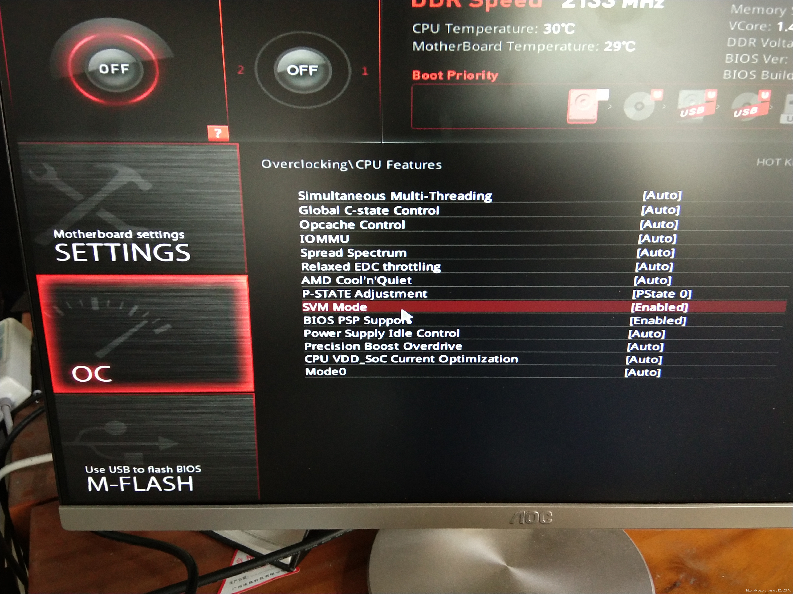
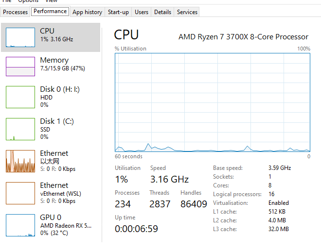

# 安装

主要是安装docker和wsl，先去[docker官网](https://docs.docker.com/docker-for-windows/install/#system-requirements-for-wsl-2-backend)下载安装包，注意查看系统要求，虚拟化和[安装WSL（Windows Subsystem for Linux）](https://docs.microsoft.com/en-us/windows/wsl/)。

具体可以看这个中文的：[wsl官方文档](https://docs.microsoft.com/zh-cn/windows/wsl/)。

主要的坑在Bios启用虚拟化：3700x启用虚拟化：



看virtualisation：enabled状态



# 配置镜像加速

具体看这里[镜像加速器](https://yeasy.gitbook.io/docker_practice/install/mirror)，对于使用 `Windows 10` 的用户，在任务栏托盘 Docker 图标内右键菜单选择 `Settings`，打开配置窗口后在左侧导航菜单选择 `Docker Engine`，在右侧像下边一样编辑 json 文件，之后点击 `Apply & Restart` 保存后 Docker 就会重启并应用配置的镜像地址了。

# 使用ubuntu连接docker

之前安装docker的时候安装了wsl2，安装了ubuntu，所以可以连接docker desktop，具体可以看[微软官方地址](https://docs.microsoft.com/en-us/windows/wsl/tutorials/wsl-containers)。

打开ubuntu，检查版本，输入：

```bash
docker --version
```

列出所有镜像

```bash
docker image ls
```

**此时遇到了问题，Got permission denied while trying to connect to the Docker daemon socket at unix:///var/run/docker.sock: Get** [**http://%2Fvar%2Frun%2Fdocker.sock/v1.24/containers/json:**](http://%2Fvar%2Frun%2Fdocker.sock/v1.24/containers/json:) **dial unix /var/run/docker.sock: connect: permission denied。**

在[这里](https://stackoverflow.com/questions/48957195/how-to-fix-docker-got-permission-denied-issue)找到了解决办法。总结就是没有把你当前登录用户加入docker用户组。

1. Create the docker group if it does not exist

```bash
$ sudo groupadd docker
```

1. Add your user to the docker group.

```
$ sudo usermod -aG docker $USER
```

1. Run the following command or Logout and login again and run (that doesn't work you may need to reboot your machine first)

```bash
$ newgrp docker
```

1. Check if docker can be run without root

```bash
$ docker run hello-world
```

Reboot if still got error

```bash
$ reboot
```

Taken from the docker official documentation: [manage-docker-as-a-non-root-user](https://docs.docker.com/install/linux/linux-postinstall/#manage-docker-as-a-non-root-user)