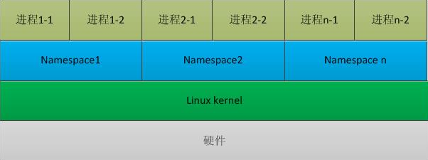
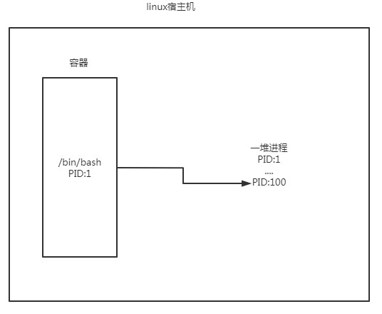
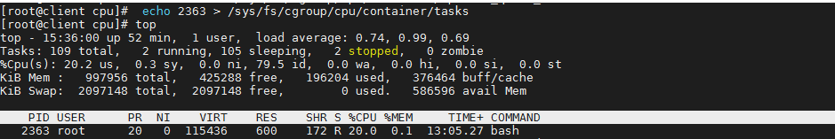

## 容器

容器其实是一种沙盒技术。顾名思义，沙盒就是能够像一个集装箱一样，把你的应用“装”起来的技术。这样，应用与应用之间，就因为有了边界而不至于相互干扰；而被装进集装箱的应用，也可以被方便地搬来搬去。

那么，这个边界怎么产生的呢？对于Docker项目来说它最核心的原理实际上就是为待创建的用户进程：

1. 启用 Linux Namespace 配置；

2. 设置指定的 Cgroups 参数；

3. 切换进程的根目录（Change Root）。

这样一个完整的边界就完成了。

### Cgroups(Control Groups)

它最主要的作用，就是限制一个进程组能够使用的资源上限，包括 CPU、内存、磁盘、网络带宽等等。

### Namespace

namespace 是 Linux 内核用来隔离内核资源的方式。通过 namespace 可以让一些进程只能看到与自己相关的一部分资源，而另外一些进程也只能看到与它们自己相关的资源，这两拨进程根本就感觉不到对方的存在。

linux支持的namespace：

1. IPC用于隔离系统消息队列;
2. Network隔离网络;
3. Mount隔离挂载点;
4. PID隔离进程;
5. User隔离用户和用户组;
6. UTS隔离主机名nis域名

通过这些隔离机制，PID,IPC,Network等系统资源不再是全局性的，而是属于某个特定的Namespace。每个namespace下的资源对于其他namespace下的资源都是不可见的。因此在操作系统层面上看，就会出现多个相同pid的进程。系统中可以同时存在两个进程号为0,1,2的进程，由于属于不同的namespace，所以它们之间并不冲突。而在用户层面上只能看到属于用户自己namespace下的资源，例如使用ps命令只能列出自己namespace下的进程。这样每个namespace看上去就像一个单独的Linux系统。



### 容器主角--进程

对于进程来说，它的静态表现就是程序，平常都安安静静地待在磁盘上；而一旦运行起来，它就变成了计算机里的数据和状态的总和，这就是它的动态表现。而容器技术的核心功能，就是通过约束和修改进程的动态表现，从而为其创造出一个“边界”。对于docker等大多数linux容器来说，

Cgroups 技术是用来制造约束的主要手段，而 Namespace 技术则是用来修改进程视图的主要方法。简而言之就是Cgroups做资源限制，Namespace做资源隔离。

## Namespace隔离

**1.首先，运行一个容器：**

```shell
[root@client /]# docker run -it busybox /bin/sh
/ #
```

`-i` 选项指示 docker 要在容器上打开一个标准的输入接口，`-t` 指示 docker 要创建一个 tty 终端，连接容器的标准输入接口，之后用户就可以通过终端进行输入。上面这条指令翻译成人类的语言就是：请帮我启动一个容器，在容器里执行 /bin/sh，并且给我分配一个命令行终端跟这个容器交互。

**2.执行ps指令**

```shell
/ # ps
PID   USER     TIME  COMMAND
    1 root      0:00 /bin/sh
    6 root      0:00 ps
```

可以看到，在 Docker 里最开始执行的 /bin/sh，就是这个容器内部的第 1 号进程（PID=1），而这个容器里一共只有两个进程在运行。这就意味着，前面执行的 /bin/sh，以及刚刚执行的 ps，已经被 Docker 隔离在了一个跟宿主机完全不同的世界当中。

本来，每当在宿主机上运行了一个 /bin/sh 程序，操作系统都会给它分配一个进程编号，比如 PID=100。这个编号是进程的唯一标识，就像员工的工牌一样。所以 PID=100，可以粗略地理解为这个 /bin/sh 是我们公司里的第 100 号员工。而现在，要通过 Docker 把这个 /bin/sh 程序运行在一个容器当中。这时候，Docker 就会在这个第 100 号员工入职时给他施一个“障眼法”，让他永远看不到前面的其他 99 个员工，他就会错误地以为自己就是公司里的第 1 号员工。这种机制，其实就是对被隔离应用的进程空间做了手脚，使得这些进程只能看到重新计算过的进程编号，比如 PID=1。可实际上，他们在宿主机的操作系统里，还是原来的第 100 号进程。



**这种技术，就是 Linux 里面的 Namespace 机制。**

而 Namespace 的使用方式也非常有意思：它其实只是 Linux 创建新进程的一个可选参数。在 Linux 系统中创建线程的系统调用是 clone()，比如：

```shell
int` `pid = clone(main_function, stack_size, SIGCHLD, NULL);
```

这个系统调用就会为我们创建一个新的进程，并且返回它的进程号 pid。而当我们用 clone() 系统调用创建一个新进程时，可以在参数中指定 CLONE_NEWPID 参数，比如：

```shell
int` `pid = clone(main_function, stack_size, CLONE_NEWPID | SIGCHLD, NULL);
```

这时，新创建的这个进程将会“看到”一个全新的进程空间，在这个进程空间里，它的 PID 是 1。之所以说“看到”，是因为这只是一个“障眼法”，在宿主机真实的进程空间里，这个进程的 PID 还是真实的数值，比如 100。当然，我们还可以多次执行上面的 clone() 调用，这样就会创建多个 PID Namespace，而每个 Namespace 里的应用进程，都会认为自己是当前容器里的第 1 号进程，它们既看不到宿主机里真正的进程空间，也看不到其他 PID Namespace 里的具体情况。

比如，Mount Namespace，用于让被隔离进程只看到当前 Namespace 里的挂载点信息；Network Namespace，用于让被隔离进程看到当前 Namespace 里的网络设备和配置。docker默认启用了IPC（CLONE_NEWIPC），Network（CLONE_NEWNET），Mount（CLONE_NEWNS），PID，User（CLONE_NEWUSER），UTS（CLONE_NEWUTS）这六种Namespace。

**这，就是 Linux 容器最基本的实现原理了。**

所以，Docker 容器这个听起来玄而又玄的概念，实际上是在创建容器进程时，指定了这个进程所需要启用的一组 Namespace 参数。这样，容器就只能“看”到当前 Namespace 所限定的资源、文件、设备、状态，或者配置。而对于宿主机以及其他不相关的程序，它就完全看不到了。所以说，容器，其实是一种特殊的进程而已。**

## Cgroups资源限制

已经通过 Linux Namespace 创建了一个“容器”，为什么还需要对容器做“限制”呢？以 PID Namespace 为例，虽然容器内的第 1 号进程在“障眼法”的干扰下只能看到容器里的情况，但是宿主机上，它作为第 100 号进程与其他所有进程之间依然是平等的竞争关系。这就意味着，虽然第 100 号进程表面上被隔离了起来，但是它所能够使用到的资源（比如 CPU、内存），却是可以随时被宿主机上的其他进程（或者其他容器）占用的。当然，这个 100 号进程自己也可能把所有资源吃光。这些情况，显然都不是一个“沙盒”应该表现出来的合理行为。

在 Linux 中，Cgroups 给用户暴露出来的操作接口是文件系统，即它以文件和目录的方式组织在操作系统的 /sys/fs/cgroup 路径下。如下：

```shell
[root@client /]# mount -t cgroup
cgroup on /sys/fs/cgroup/systemd type cgroup (rw,nosuid,nodev,noexec,relatime,seclabel,xattr,release_agent=/usr/lib/systemd/systemd-cgroups-agent,name=systemd)
cgroup on /sys/fs/cgroup/net_cls,net_prio type cgroup (rw,nosuid,nodev,noexec,relatime,seclabel,net_prio,net_cls)
cgroup on /sys/fs/cgroup/cpu,cpuacct type cgroup (rw,nosuid,nodev,noexec,relatime,seclabel,cpuacct,cpu)
cgroup on /sys/fs/cgroup/perf_event type cgroup (rw,nosuid,nodev,noexec,relatime,seclabel,perf_event)
cgroup on /sys/fs/cgroup/cpuset type cgroup (rw,nosuid,nodev,noexec,relatime,seclabel,cpuset)
cgroup on /sys/fs/cgroup/memory type cgroup (rw,nosuid,nodev,noexec,relatime,seclabel,memory)
cgroup on /sys/fs/cgroup/devices type cgroup (rw,nosuid,nodev,noexec,relatime,seclabel,devices)
cgroup on /sys/fs/cgroup/blkio type cgroup (rw,nosuid,nodev,noexec,relatime,seclabel,blkio)
cgroup on /sys/fs/cgroup/hugetlb type cgroup (rw,nosuid,nodev,noexec,relatime,seclabel,hugetlb)
cgroup on /sys/fs/cgroup/pids type cgroup (rw,nosuid,nodev,noexec,relatime,seclabel,pids)
cgroup on /sys/fs/cgroup/freezer type cgroup (rw,nosuid,nodev,noexec,relatime,seclabel,freezer)
```

可以看到，在 /sys/fs/cgroup 下面有很多诸如 cpuset、cpu、 memory 这样的子目录，也叫子系统。这些都是我这台机器当前可以被 Cgroups 进行限制的资源种类。而在子系统对应的资源种类下，你就可以看到该类资源具体可以被限制的方法。比如，对 CPU 子系统来说，我们就可以看到如下几个配置文件，这个指令是：

```shell
[root@localhost ~]# ls /sys/fs/cgroup/cpu
cgroup.clone_children  cgroup.procs          cpuacct.stat   cpuacct.usage_percpu  cpu.cfs_quota_us  cpu.rt_runtime_us  cpu.stat  notify_on_release  system.slice  user.slice
cgroup.event_control   cgroup.sane_behavior  cpuacct.usage  cpu.cfs_period_us     cpu.rt_period_us  cpu.shares         docker    release_agent      tasks
```

例如 cfs_period_us 和 cfs_quota_us这两个参数组合使用，可以用来限制进程在长度为 cfs_period_us 的一段时间内，只能被分配到总量为 cfs_quota_us的 CPU 时间。而这样的配置文件又如何使用呢？你需要在对应的子系统下面创建一个目录，比如，我们现在进入 /sys/fs/cgroup/cpu 目录下：

```shell
[root@client /]# cd /sys/fs/cgroup/cpu
[root@client cpu]# ls
cgroup.clone_children  cgroup.procs          cpuacct.stat   cpuacct.usage_percpu  cpu.cfs_quota_us  cpu.rt_runtime_us  cpu.stat           release_agent  tasks
cgroup.event_control   cgroup.sane_behavior  cpuacct.usage  cpu.cfs_period_us     cpu.rt_period_us  cpu.shares         notify_on_release  system.slice   user.slice
[root@client cpu]# mkdir container
[root@client cpu]# ls container/
cgroup.clone_children  cgroup.procs  cpuacct.usage         cpu.cfs_period_us  cpu.rt_period_us   cpu.shares  notify_on_release
cgroup.event_control   cpuacct.stat  cpuacct.usage_percpu  cpu.cfs_quota_us   cpu.rt_runtime_us  cpu.stat    tasks
```

这个目录就称为一个“控制组”。你会发现，操作系统会在你新创建的 container 目录下，自动生成该子系统对应的资源限制文件。现在，我们在后台执行这样一条脚本：

```shell
[root@client cpu]# while : ; do : ; done &
[1] 2363
```

显然，它执行了一个死循环，可以把计算机的 CPU 吃到 100%，根据它的输出，我们可以看到这个脚本在后台运行的进程号（PID）是 2363。这样，我们可以用 top 指令来确认一下 CPU 有没有被打满：


在输出里可以看到，CPU 的使用率已经 99.9% 了，而此时，我们可以通过查看 container 目录下的文件，看到 container 控制组里的 CPU quota 还没有任何限制（即：-1），CPU period 则是默认的 100 ms（100000 us）：

```shell
[root@client cpu]#  cat /sys/fs/cgroup/cpu/container/cpu.cfs_quota_us
-1
[root@client cpu]# cat /sys/fs/cgroup/cpu/container/cpu.cfs_period_us
100000
```

接下来，我们可以通过修改这些文件的内容来设置限制。比如，向 container 组里的 cfs_quota 文件写入 20 ms（20000 us），它意味着在每 100 ms 的时间里，被该控制组限制的进程只能使用 20 ms 的 CPU 时间，也就是说这个进程只能使用到 20% 的 CPU 带宽。

```shell
[root@client cpu]#  echo 20000 > /sys/fs/cgroup/cpu/container/cpu.cfs_quota_us
```

接下来，我们把被限制的进程的 PID 写入 container 组里的 tasks 文件，上面的设置就会对该进程生效了：



可以看到，计算机的 CPU 使用率立刻降到了 20%。除 CPU 子系统外，Cgroups 的每一个子系统都有其独有的资源限制能力，**比如：blkio，为块设备设定I/O 限制，一般用于磁盘等设备；cpuset，为进程分配单独的 CPU 核和对应的内存节点；memory，为进程设定内存使用的限制。**

**Linux Cgroups 的设计还是比较易用的，简单粗暴地理解呢，它就是一个子系统目录加上一组资源限制文件的组合。**而对于 Docker 等 Linux 容器项目来说，它们只需要在每个子系统下面，为每个容器创建一个控制组（即创建一个新目录），然后在启动容器进程之后，把这个进程的 PID 填写到对应控制组的 tasks 文件中就可以了。而至于在这些控制组下面的资源文件里填上什么值，就靠用户执行 docker run 时的参数指定了，比如这样一条命令：

```shell
docker run -it --cpu-period=100000 --cpu-quota=20000 ubuntu /bin/bash
```

在启动这个容器后，我们可以通过查看 Cgroups 文件系统下，CPU 子系统中，“docker”这个控制组里的资源限制文件的内容来确认：

```shell
[root@client /]#  ls /sys/fs/cgroup/cpu/docker/
c127c27d0e64a8b7a3f146b949abbc3beec92dea4df6d344baa351dc33ea74bb  cgroup.event_control  cpuacct.stat   cpuacct.usage_percpu  cpu.cfs_quota_us  cpu.rt_runtime_us  cpu.stat           tasks
cgroup.clone_children                                             cgroup.procs          cpuacct.usage  cpu.cfs_period_us     cpu.rt_period_us  cpu.shares         notify_on_release
[root@client /]# cat  /sys/fs/cgroup/cpu/docker/c127c27d0e64a8b7a3f146b949abbc3beec92dea4df6d344baa351dc33ea74bb/cpu.cfs_quota_us
20000
[root@client /]# cat  /sys/fs/cgroup/cpu/docker/c127c27d0e64a8b7a3f146b949abbc3beec92dea4df6d344baa351dc33ea74bb/cpu.cfs_period_us
100000
[root@client /]# cat  /sys/fs/cgroup/cpu/docker/c127c27d0e64a8b7a3f146b949abbc3beec92dea4df6d344baa351dc33ea74bb/tasks
3195
```

通过以上讲述，你现在应该能够理解，一个正在运行的 Docker 容器，其实就是一个启用了多个 **Linux Namespace** 的应用进程，而这个进程能够使用的资源量，则受 **Cgroups** 配置的限制。

## roofts(根文件系统)

而正如前面所说的，Namespace 的作用是“隔离”，它让应用进程只能看到该 Namespace 内的“世界”；而 Cgroups 的作用是“限制”，它给这个“世界”围上了一圈看不见的墙。这么一折腾，进程就真的被“装”在了一个与世隔绝的房间里。可是，还有一个问题：这个房间四周虽然有了墙，但是如果容器进程低头一看地面，又是怎样一副景象呢？换句话说，**容器里的进程看到的文件系统又是什么样子的呢？**可能你立刻就能想到，这一定是一个关于 Mount Namespace 的问题：容器里的应用进程，理应看到一份完全独立的文件系统。这样，它就可以在自己的容器目录（比如 /tmp）下进行操作，而完全不会受宿主机以及其他容器的影响。

那么，真实情况是这样吗？下面，我们不妨使用它来验证一下刚刚提到的问题：

```c
#define _GNU_SOURCE
#include <sys/mount.h>
#include <sys/types.h>
#include <sys/wait.h>
#include <stdio.h>
#include <sched.h>
#include <signal.h>
#include <unistd.h>
#define STACK_SIZE (1024 * 1024)
static char container_stack[STACK_SIZE];
char* const container_args[] = {
  "/bin/bash",
  NULL
};
 
int container_main(void* arg)
{ 
  printf("Container - inside the container!\n");
  execv(container_args[0], container_args);
  printf("Something's wrong!\n");
  return 1;
}
 
int main()
{
  printf("Parent - start a container!\n");
  int container_pid = clone(container_main, container_stack+STACK_SIZE, CLONE_NEWNS | SIGCHLD , NULL);
  waitpid(container_pid, NULL, 0);
  printf("Parent - container stopped!\n");
  return 0;
}
```

这段代码的功能是：在 main 函数里，通过 clone() 系统调用创建了一个新的子进程 container_main，并且声明要为它启用 Mount Namespace（即：CLONE_NEWNS 标志）。而这个子进程执行的，是一个“/bin/bash”程序，也就是一个 shell。所以这个 shell 就运行在了 Mount Namespace 的隔离环境中。编译这个程序：

```sh
[root@client /]# gcc -o ns ns.c
[root@client /]# ./ns
Parent - start a container!
Container - inside the container!
[root@client /]# ls /tmp
systemd-private-04867ffe5ca0409fa77d4fadbd1a882f-ceph-radosgw@rgw.client.service-Fqagb1  systemd-private-04867ffe5ca0409fa77d4fadbd1a882f-chronyd.service-kaS4A3
```

这样，就进入了这个“容器”当中。可是，如果在“容器”里执行一下 ls 指令的话，我们就会发现一个有趣的现象： /tmp 目录下的内容跟宿主机的内容是一样的。

仔细思考一下，这其实并不难理解：Mount Namespace 修改的，是容器进程对文件系统“挂载点”的认知。但是，这也就意味着，只有在“挂载”这个操作发生之后，进程的视图才会被改变。而在此之前，新创建的容器会直接继承宿主机的各个挂载点。这时，有一个解决办法：创建新进程时，除了声明要启用 Mount Namespace 之外，还可以告诉容器进程，有哪些目录需要重新挂载，就比如这个 /tmp 目录。于是，我们在容器进程执行前可以添加一步重新挂载 /tmp 目录的操作：

```c
int container_main(void* arg)
{
  printf("Container - inside the container!\n");
  // 如果你的机器的根目录的挂载类型是shared，那必须先重新挂载根目录
  // mount("", "/", NULL, MS_PRIVATE, "");
  mount("none", "/tmp", "tmpfs", 0, "");
  execv(container_args[0], container_args);
  printf("Something's wrong!\n");
  return 1;
}
```

编译后执行结果：

```shell
[root@client /]# gcc -o ns ns.c
[root@client /]# ./ns
Parent - start a container!
Container - inside the container!
[root@client /]# ls tmp
```

可以看到，这次 /tmp 变成了一个空目录，这意味着重新挂载生效了。可以用 mount -l 检查一下：

```shell
[root@client /]# mount -l | grep tmpfs
none on /tmp type tmpfs (rw,relatime,seclabel)
```

退出容器后在宿主机查看则发现这个挂载是不存在的。

```shell
[root@client /]# exit
Parent - container stopped!
[root@client /]# mount -l | grep tmpfs
devtmpfs on /dev type devtmpfs (rw,nosuid,seclabel,size=486708k,nr_inodes=121677,mode=755)
tmpfs on /dev/shm type tmpfs (rw,nosuid,nodev,seclabel)
tmpfs on /run type tmpfs (rw,nosuid,nodev,seclabel,mode=755)
tmpfs on /sys/fs/cgroup type tmpfs (ro,nosuid,nodev,noexec,seclabel,mode=755)
tmpfs on /run/user/0 type tmpfs (rw,nosuid,nodev,relatime,seclabel,size=99796k,mode=700)
```

这就是 Mount Namespace 跟其他 Namespace 的使用略有不同的地方：它对容器进程视图的改变，一定是伴随着挂载操作（mount）才能生效。

可是，作为一个普通用户，我们希望的是一个更友好的情况：每当创建一个新容器时，我希望容器进程看到的文件系统就是一个独立的隔离环境，而不是继承自宿主机的文件系统。怎么才能做到这一点呢？不难想到，我们可以在容器进程启动之前重新挂载它的整个根目录“/”。而由于 Mount Namespace 的存在，这个挂载对宿主机不可见，所以容器进程就可以在里面随便折腾了。在 Linux 操作系统里，有一个名为 chroot 的命令可以帮助你在 shell 中方便地完成这个工作。顾名思义，它的作用就是帮你“change root file system”，即改变进程的根目录到你指定的位置。用法也非常简单。

假设，现在有一个/test 目录，想要把它作为一个 /bin/bash 进程的根目录。首先，创建一个 test 目录和几个 lib 文件夹：

```shell
[root@client /]# mkdir test
[root@client /]# mkdir -p test/{bin,lib64,lib}
```

然后，把 bash 命令拷贝到 test 目录对应的 bin 路径下：

```shell
[root@client /] cp -v /bin/{bash,ls} /test/bin
```

接下来，把 bash 命令需要的所有 so 文件，也拷贝到 test 目录对应的 lib 路径下。找到 so 文件可以用 ldd 命令：

```shell
[root@client /]# ldd /bin/ls
        linux-vdso.so.1 =>  (0x00007ffc33dac000)
        libselinux.so.1 => /lib64/libselinux.so.1 (0x00007f8fa7fcc000)
        libcap.so.2 => /lib64/libcap.so.2 (0x00007f8fa7dc7000)
        libacl.so.1 => /lib64/libacl.so.1 (0x00007f8fa7bbe000)
        libc.so.6 => /lib64/libc.so.6 (0x00007f8fa77f0000)
        libpcre.so.1 => /lib64/libpcre.so.1 (0x00007f8fa758e000)
        libdl.so.2 => /lib64/libdl.so.2 (0x00007f8fa738a000)
        /lib64/ld-linux-x86-64.so.2 (0x00007f8fa81f3000)
        libattr.so.1 => /lib64/libattr.so.1 (0x00007f8fa7185000)
        libpthread.so.0 => /lib64/libpthread.so.0 (0x00007f8fa6f69000)
```

最后，执行 chroot 命令，告诉操作系统，我们将使用 /test 目录作为 /bin/bash 进程的根目录，这时，你如果执行 "ls /"，就会看到，它返回的都是 /test 目录下面的内容，而不是宿主机的内容。

```shell
[root@client /]# chroot /test /bin/bash
[root@client /]# ls
bin  lib  lib64
```

更重要的是，对于被 chroot 的进程来说，它并不会感受到自己的根目录已经被“修改”成 /test 了。这种视图被修改的原理，是不是跟之前介绍的 Linux Namespace 很类似呢？没错！实际上，Mount Namespace 正是基于对 chroot 的不断改良才被发明出来的，它也是 Linux 操作系统里的第一个 Namespace。当然，为了能够让容器的这个根目录看起来更“真实”，一般会在这个容器的根目录下挂载一个完整操作系统的文件系统，比如Centos 7 的 ISO。这样，在容器启动之后，我们在容器里通过执行 "ls /" 查看根目录下的内容，就是Centos 7 的所有目录和文件。而这个挂载在容器根目录上、用来为容器进程提供隔离后执行环境的文件系统，就是所谓的“容器镜像”。它还有一个更为专业的名字，叫作：**rootfs（根文件系统）**。所以，一个最常见的 rootfs，或者说容器镜像，会包括如下所示的一些目录和文件，比如 /bin，/etc，/proc 等等：

```shell
[root@client /]# docker run -it busybox /bin/sh
/ # ls
bin   dev   etc   home  proc  root  sys   tmp   usr   var
```

现在，应该可以理解，对 Docker 项目来说，它最核心的原理实际上就是为待创建的用户进程：**启用 Linux Namespace 配置**；**设置指定的 Cgroups 参数**；**切换进程的根目录（Change Root）。**这样，一个完整的容器就诞生了。不过，Docker 项目在最后一步的切换上会优先使用 pivot_root 系统调用，如果系统不支持，才会使用 chroot。