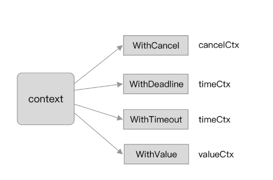
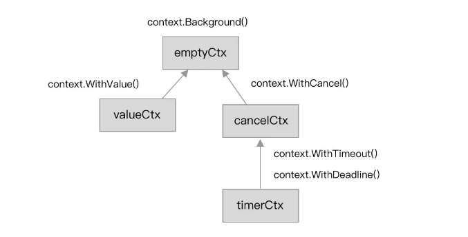
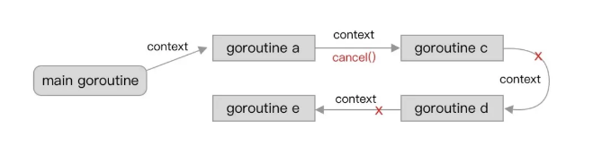
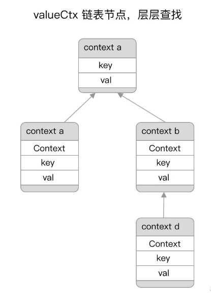

## 背景

上下文（Context）是 Go 语言中非常有特色的一个特性， 在 Go 1.7 版本中正式引入新标准库 context。

其主要的作用是在 goroutine 中进行上下文的传递，而在传递信息中又包含了 goroutine 的运行控制、上下文信息传递等功能。

## 使用

在 Go context 用法中，我们常常将其与 select 关键字结合使用，用于监听其是否结束、取消等。

代码如下：

```go
func main() {
 parentCtx := context.Background()
 ctx, cancel := context.WithTimeout(parentCtx, 1*time.Millisecond)
 defer cancel()

 select {
 case <-time.After(1 * time.Second):
  fmt.Println("overslept")
 case <-ctx.Done():
  fmt.Println(ctx.Err())
 }
}
```

输出结果：

```go
context deadline exceeded
```

如果是更进一步结合 goroutine 的话，常见的例子是：

```go
 func(ctx context.Context) <-chan int {
  dst := make(chan int)
  n := 1
  go func() {
   for {
    select {
    case <-ctx.Done():
     return
    case dst <- n:
     n++
    }
   }
  }()
  return dst
 }
```

我们平时工程中会起很多的 goroutine，这时候会在 goroutine 内结合 for+select，针对 context 的事件进行处理，达到跨 goroutine 控制的目的。

## Context本质

在 Go 标准库 context 中具有以下派生 context 的标准方法：



- WithCancel：基于父级 context，创建一个可以取消的新 context。
- WithDeadline：基于父级 context，创建一个具有截止时间（Deadline）的新 context。
- WithTimeout：基于父级 context，创建一个具有超时时间（Timeout）的新 context。
- Background：创建一个空的 context，一般常用于作为根的父级 context。
- TODO：创建一个空的 context，一般用于未确定时的声明使用。
- WithValue：基于某个 context 创建并存储对应的上下文信息。

上面我们看到有不少context 的方法，其基本大同小异。看上去似乎不难，接下来我们看看其底层的基本原理和设计。

context 相关函数的标准返回如下：

```go
func WithXXXX(parent Context, xxx xxx) (Context, CancelFunc)
```

其返回值分别是 `Context` 和 `CancelFunc`，接下来我们将进行分析这两者的作用。

### 接口

#### Context接口

[`context.Context`](https://draveness.me/golang/tree/context.Context) 是 Go 语言在 1.7 版本中引入标准库的接口[1](https://draveness.me/golang/docs/part3-runtime/ch06-concurrency/golang-context/#fn:1)，该接口定义了四个需要实现的方法，其中包括：

1. `Deadline` — 返回 [`context.Context`](https://draveness.me/golang/tree/context.Context) 被取消的时间，也就是完成工作的截止日期；
2. `Done` — 返回一个 Channel，这个 Channel 会在当前工作完成或者上下文被取消后关闭，多次调用 `Done` 方法会返回同一个 Channel；
3. Err返回`context.Context`结束的原因，它只会在``Done``方法对应的 Channel 关闭时返回非空的值；
   1. 如果 [`context.Context`](https://draveness.me/golang/tree/context.Context) 被取消，会返回 `Canceled` 错误；
   2. 如果 [`context.Context`](https://draveness.me/golang/tree/context.Context) 超时，会返回 `DeadlineExceeded` 错误；
4. `Value` — 从 [`context.Context`](https://draveness.me/golang/tree/context.Context) 中获取键对应的值，对于同一个上下文来说，多次调用 `Value` 并传入相同的 `Key` 会返回相同的结果，该方法可以用来传递请求特定的数据；

```go
type Context interface {
	Deadline() (deadline time.Time, ok bool)
	Done() <-chan struct{}
	Err() error
	Value(key interface{}) interface{}
}
```

#### Canceler接口

```go
type canceler interface {
 cancel(removeFromParent bool, err error)
 Done() <-chan struct{}
}
```

- cancel：调用当前 context 的取消方法。
- Done：与前面一致，可用于识别当前 channel 是否已经被关闭。

### 基础结构

在标准库 context 的设计上，一共提供了四类 context 类型来实现上述接口。分别是 `emptyCtx`、`cancelCtx`、`timerCtx` 以及 `valueCtx`。



#### emptyCtx

在日常使用中，常常使用到的 `context.Background` 方法，又或是 `context.TODO` 方法。

源码如下：

```go
var (
 background = new(emptyCtx)
 todo       = new(emptyCtx)
)

func Background() Context {
 return background
}

func TODO() Context {
 return todo
}
```

其本质上都是基于 `emptyCtx` 类型的基本封装。而 `emptyCtx` 类型本质上是实现了 Context 接口：

```go
type emptyCtx int

func (*emptyCtx) Deadline() (deadline time.Time, ok bool) {
 return
}

func (*emptyCtx) Done() <-chan struct{} {
 return nil
}

func (*emptyCtx) Err() error {
 return nil
}

func (*emptyCtx) Value(key interface{}) interface{} {
 return nil
}
```

实际上 `emptyCtx` 类型的 context 的实现非常简单，因为他是空 context 的定义，因此没有 deadline，更没有 timeout，可以认为就是一个基础空白 context 模板。

#### cancelCtx

在调用 `context.WithCancel` 方法时，我们会涉及到 `cancelCtx` 类型，其主要特性是取消事件。源码如下：

```go
func WithCancel(parent Context) (ctx Context, cancel CancelFunc) {
 c := newCancelCtx(parent)
 propagateCancel(parent, &c)
 return &c, func() { c.cancel(true, Canceled) }
}

func newCancelCtx(parent Context) cancelCtx {
 return cancelCtx{Context: parent}
}
```

其中的 `newCancelCtx` 方法将会生成出一个可以取消的新 context，如果该 context 执行取消，与其相关联的子 context 以及对应的 goroutine 也会收到取消信息。

首先 main goroutine 创建并传递了一个新的 context 给 goroutine b，此时 goroutine b 的 context 是 main goroutine context 的子集：



传递过程中，goroutine b 再将其 context 一个个传递给了 goroutine c、d、e。最后在运行时 goroutine b 调用了 `cancel` 方法。使得该 context 以及其对应的子集均接受到取消信号，对应的 goroutine 也进行了响应。

接下来我们针对 `cancelCtx` 类型来进一步看看：

```go
type cancelCtx struct {
 Context

 mu       sync.Mutex            // protects following fields
 done     chan struct{}         // created lazily, closed by first cancel call
 children map[canceler]struct{} // set to nil by the first cancel call
 err      error                 // set to non-nil by the first cancel call
}
```

该结构体所包含的属性也比较简单，主要是 `children` 字段，其包含了该 context 对应的所有子集 context，便于在后续发生取消事件的时候进行逐一通知和关联。

而其他的属性主要用于并发控制（互斥锁）、取消信息和错误的写入：

``children``的key值``canceler``是接口类型，实现该接口的有``cancelCtx``和``timerCtx``。

```go
// A canceler is a context type that can be canceled directly. The
// implementations are *cancelCtx and *timerCtx.
type canceler interface {
	cancel(removeFromParent bool, err error)
	Done() <-chan struct{}
}
```

```go
func (c *cancelCtx) Value(key interface{}) interface{} {
 if key == &cancelCtxKey {
  return c
 }
 return c.Context.Value(key)
}

func (c *cancelCtx) Done() <-chan struct{} {
 c.mu.Lock()
 if c.done == nil {
  c.done = make(chan struct{})
 }
 d := c.done
 c.mu.Unlock()
 return d
}

func (c *cancelCtx) Err() error {
 c.mu.Lock()
 err := c.err
 c.mu.Unlock()
 return err
}
```

在上述代码中可以留意到，`done` 属性（只读 channel）是在真正调用到 `Done` 方法时才会去创建。需要配合 `select-case` 来使用。

#### timerCtx

在调用 `context.WithTimeout` 方法时，我们会涉及到 `timerCtx` 类型，其主要特性是 Timeout 和 Deadline 事件，源码如下：

```go
func WithTimeout(parent Context, timeout time.Duration) (Context, CancelFunc) {
 return WithDeadline(parent, time.Now().Add(timeout))
}

func WithDeadline(parent Context, d time.Time) (Context, CancelFunc) {
 ...
 c := &timerCtx{
  cancelCtx: newCancelCtx(parent),
  deadline:  d,
 }
}
```

你可以发现 `timerCtx` 类型是基于 `cancelCtx` 类型的。我们再进一步看看 `timerCtx` 结构体：

```go
type timerCtx struct {
 cancelCtx
 timer *time.Timer // Under cancelCtx.mu.
 deadline time.Time
}
```

其实 timerCtx 类型也就是 `cancelCtx` 类型，加上 `time.Timer` 和对应的 Deadline，也就是包含了时间属性的控制。

我们进一步看看其配套的 cancel 方法，思考一下其是如何进行取消动作的：

```go
func (c *timerCtx) Deadline() (deadline time.Time, ok bool) {
 return c.deadline, true
}

func (c *timerCtx) cancel(removeFromParent bool, err error) {
 c.cancelCtx.cancel(false, err)
 if removeFromParent {
  removeChild(c.cancelCtx.Context, c)
 }
 c.mu.Lock()
 if c.timer != nil {
  c.timer.Stop()
  c.timer = nil
 }
 c.mu.Unlock()
}
```

先会调用 `cancelCtx` 类型的取消事件。若存在父级节点，则移除当前 context 子节点，最后停止定时器并进行定时器重置。而 Deadline 或 Timeout 的行为则由 `timerCtx` 的 `WithDeadline` 方法实现：

```go
func WithTimeout(parent Context, timeout time.Duration) (Context, CancelFunc) {
	return WithDeadline(parent, time.Now().Add(timeout))
}

func WithDeadline(parent Context, d time.Time) (Context, CancelFunc) {
	if cur, ok := parent.Deadline(); ok && cur.Before(d) {
		return WithCancel(parent)
	}
	c := &timerCtx{
		cancelCtx: newCancelCtx(parent),
		deadline:  d,
	}
	propagateCancel(parent, c)
	dur := time.Until(d)
	if dur <= 0 {
		c.cancel(true, DeadlineExceeded) // 已经过了截止日期
		return c, func() { c.cancel(false, Canceled) }
	}
	c.mu.Lock()
	defer c.mu.Unlock()
	if c.err == nil {
		c.timer = time.AfterFunc(dur, func() {
			c.cancel(true, DeadlineExceeded)
		})
	}
	return c, func() { c.cancel(true, Canceled) }
}
```

`context.WithDeadline` 在创建 `context.timerCtx`的过程中判断了父上下文的截止日期与当前日期，并通过 `time.AfterFunc`创建定时器，当时间超过了截止日期后会调用` context.timerCtx.cancel`同步取消信号。

#### valueCtx

在调用 `context.WithValue` 方法时，我们会涉及到 `valueCtx` 类型，其主要特性是涉及上下文信息传递，源码如下：

```go
func WithValue(parent Context, key, val interface{}) Context {
	if key == nil {
		panic("nil key")
	}
	if !reflectlite.TypeOf(key).Comparable() {
		panic("key is not comparable")
	}
	return &valueCtx{parent, key, val}
}
```

你会发现 `valueCtx` 结构体也非常的简单，核心就是键值对：

```go
type valueCtx struct {
 Context
 key, val interface{}
}
```

其在配套方法上也不会太复杂，基本就是要求可比较，接着就是存储匹配：

```go
func (c *valueCtx) Value(key interface{}) interface{} {
 if c.key == key {
  return c.val
 }
 return c.Context.Value(key)
}
```

这时候你可能又有疑问了，那多个父子级 context 是如何实现跨 context 的上下文信息获取的？

这秘密其实在上面的 `valueCtx` 和 `Value` 方法中有所表现：



本质上 `valueCtx` 类型是一个单向链表，会在调用 `Value` 方法时先查询自己的节点是否有该值。若无，则会通过自身存储的上层父级节点的信息一层层向上寻找对应的值，直到找到为止。

而在实际的工程应用中，你会发现各大框架，例如：gin、grpc 等。他都是有自己再实现一套上下文信息的传输的二次封装，本意也是为了更好的管理和观察上下文信息。

### 取消信号

在我们针对 context 的各类延伸类型和源码进行了分析后。我们进一步提出一个疑问点，**context 是如何实现跨 goroutine 的取消事件并传播开来的，是如何实现的**？

这个问题的答案就在于 `WithCancel` 和 `WithDeadline` 都会涉及到 `propagateCancel` 方法，其作用是构建父子级的上下文的关联关系，若出现取消事件时，就会进行处理：

```go
func WithCancel(parent Context) (ctx Context, cancel CancelFunc) {
	c := newCancelCtx(parent)
	propagateCancel(parent, &c)
	return &c, func() { c.cancel(true, Canceled) }
}
```

- `context.newCancelCtx `将传入的上下文包装成私有结构体 `context.cancelCtx`；
- `context.propagateCancel `会构建父子上下文之间的关联，当父上下文被取消时，子上下文也会被取消：

```go
func propagateCancel(parent Context, child canceler) {
	done := parent.Done()
	if done == nil {
		return // 父上下文不会触发取消信号
	}
	select {
	case <-done:
		child.cancel(false, parent.Err()) // 父上下文已经被取消
		return
	default:
	}

	if p, ok := parentCancelCtx(parent); ok {
		p.mu.Lock()
		if p.err != nil {
			child.cancel(false, p.err)
		} else {
			p.children[child] = struct{}{}
		}
		p.mu.Unlock()
	} else {
		go func() {
			select {
			case <-parent.Done():
				child.cancel(false, parent.Err())
			case <-child.Done():
			}
		}()
	}
}
```

上述函数总共与父上下文相关的三种不同的情况：

1. 当 `parent.Done() == nil`，也就是 `parent` 不会触发取消事件时，当前函数会直接返回；
2. 当`child`的继承链包含可以取消的上下文时，会判断`parent`是否已经触发了取消信号；
   - 如果已经被取消，`child` 会立刻被取消；
   - 如果没有被取消，`child` 会被加入 `parent` 的 `children` 列表中，等待 `parent` 释放取消信号；
3. 当父上下文是开发者自定义的类型、实现了`context.Context` 接口并在`Done()`方法中返回了非空的管道时；
   1. 运行一个新的 Goroutine 同时监听 `parent.Done()` 和 `child.Done()` 两个 Channel；
   2. 在 `parent.Done()` 关闭时调用 `child.cancel` 取消子上下文；

`context.propagateCancel`的作用是在 `parent` 和 `child` 之间同步取消和结束的信号，保证在 `parent` 被取消时，`child` 也会收到对应的信号，不会出现状态不一致的情况。

`context.cancelCtx 实现的几个接口方法也没有太多值得分析的地方，该结构体最重要的方法是 `context.cancelCtx.cancel，该方法会关闭上下文中的 Channel 并向所有的子上下文同步取消信号：

```go
func (c *cancelCtx) cancel(removeFromParent bool, err error) {
	c.mu.Lock()
	if c.err != nil {
		c.mu.Unlock()
		return
	}
	c.err = err
	if c.done == nil {
		c.done = closedchan
	} else {
		close(c.done)
	}
	for child := range c.children {
		child.cancel(false, err)
	}
	c.children = nil
	c.mu.Unlock()

	if removeFromParent {
		removeChild(c.Context, c)
	}
}
```

## 示例

### 监听取消事件

举例来说，假设一个`HTTP`服务器需要花费两秒钟来处理一个请求。如果在处理完成之前请求被取消，我们想让程序能立即中断不再继续执行下去：

```go
func main() {
    http.ListenAndServe(":8000", http.HandlerFunc(func(w http.ResponseWriter, r *http.Request) {
        ctx := r.Context()
        fmt.Fprint(os.Stdout, "processing request\n")
        select {
        case <-time.After(2 * time.Second):
            w.Write([]byte("request processed"))
        case <-ctx.Done():
            fmt.Fprint(os.Stderr, "request cancelled\n")
        }
    }))
}
```

你可以通过运行服务器并在浏览器中打开`localhost:8000`进行测试。如果你在2秒钟前关闭浏览器，则应该在终端窗口上看到“request cancelled”字样。

### 发出取消事件

如果你有一个可以取消的操作，则必须通过`context`发出取消事件。可以通过`context`包的`WithCancel`函数返回的取消函数来完成此操作（`withCancel`还会返回一个支持取消功能的上下文对象）。该函数不接受参数也不返回任何内容，当需要取消上下文时会调用该函数，发出取消事件。

考虑有两个相互依赖的操作的情况。在这里，“依赖”是指如果其中一个失败，那么另一个就没有意义，而不是第二个操作依赖第一个操作的结果（那种情况下，两个操作不能并行）。在这种情况下，如果我们很早就知道其中一个操作失败，那么我们就会希望能取消所有相关的操作。

```go
func operation1(ctx context.Context) error {
    time.Sleep(100 * time.Millisecond)
    return errors.New("failed")
}

func operation2(ctx context.Context) {
    select {
    case <-time.After(500 * time.Millisecond):
        fmt.Println("done")
    case <-ctx.Done():
        fmt.Println("halted operation2")
    }
}

func main() {
    ctx := context.Background()
    ctx, cancel := context.WithCancel(ctx)
    go func() {
      operation2(ctx)
    }()
  
  err := operation1(ctx)
    if err != nil {
        cancel()
        fmt.Println("cancel all goroutine with ctx")
    }
}
/**
cancel all goroutine with ctx
```

### 基于时间的取消

```go
func main() {
    ctx := context.Background()
    ctx, _ = context.WithTimeout(ctx, 100*time.Millisecond)

    req, _ := http.NewRequest(http.MethodGet, "http://google.com", nil)
    // 将超时上下文关联到创建的请求上
    req = req.WithContext(ctx)

    // 创建一个HTTP客户端并执行请求
    client := &http.Client{}
    res, err := client.Do(req)
    // 如果请求失败了，记录到STDOUT
    if err != nil {
        fmt.Println("Request failed:", err)
        return
    }
    // 请求成功后打印状态码
    fmt.Println("Response received, status code:", res.StatusCode)
}
```

根据`Google`主页响应你请求的速度，你将收到：

```shell
Response received, status code: 200
```

或者：

```shell
Request failed: Get http://google.com: context deadline exceeded
```

对于我们来说通常都会收到第二条消息

### 传递值

可以使用context在方法中传递数据，例如执行一个方法需要调用多个方法，我们需要记录下这个方法的执行日志，正常我们会这么写：

```go
func main() {
	// create a random integer as the ID
	rand.Seed(time.Now().Unix())
	id := rand.Int()
	operation1(id)
}

func operation1(id int64) {
	// do some work
	log.Println("operation1 for id:", id, " completed")
	operation2(id)
}

func operation2(id int64) {
	// do some work
	log.Println("operation2 for id:", id, " completed")
}
```

如果使用context，则可以这么写

```go
const keyID = "id"

func main() {
	rand.Seed(time.Now().Unix())
	ctx := context.WithValue(context.Background(), keyID, rand.Int())
	operation1(ctx)
}

func operation1(ctx context.Context) {
	log.Println("operation1 for id:", ctx.Value(keyID), " completed")
	operation2(ctx)
}

func operation2(ctx context.Context) {
	log.Println("operation2 for id:", ctx.Value(keyID), " completed")
}
```

## 使用场景

- 主要作用还是在多个 Goroutine 组成的树中同步取消信号以减少对资源的消耗和占用

- 使用传值的常用使用场景：传递请求对应用户的认证令牌或者用于进行分布式追踪的请求 ID

## 参考资料

- [Go 语言并发编程与Context | Go 语言设计与实现 - 面向信仰编程](https://draveness.me/golang-context/)
- [一文吃透 Go 语言解密之上下文 context|煎鱼](https://mp.weixin.qq.com/s/A03G3_kCvVFN3TxB-92GVw)
- [Using Context in Golang - Cancellation, Timeouts and Values ...](https://www.sohamkamani.com/golang/context-cancellation-and-values/)

