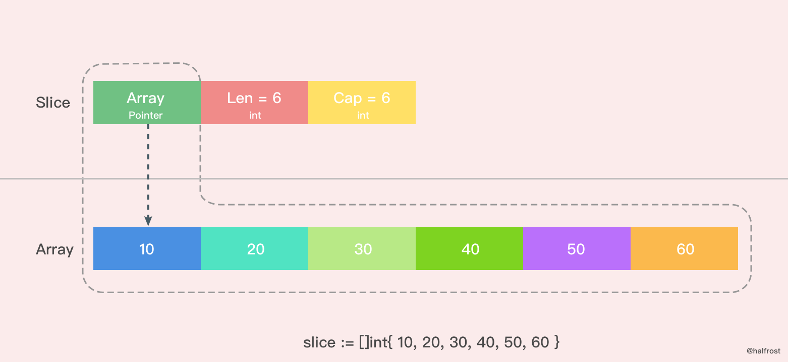
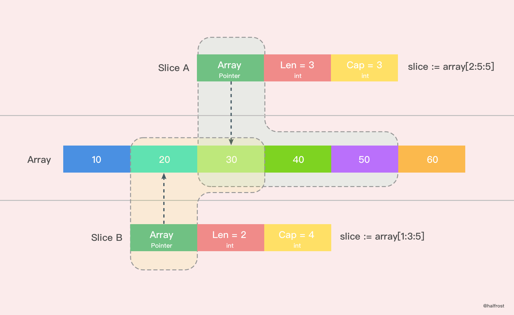
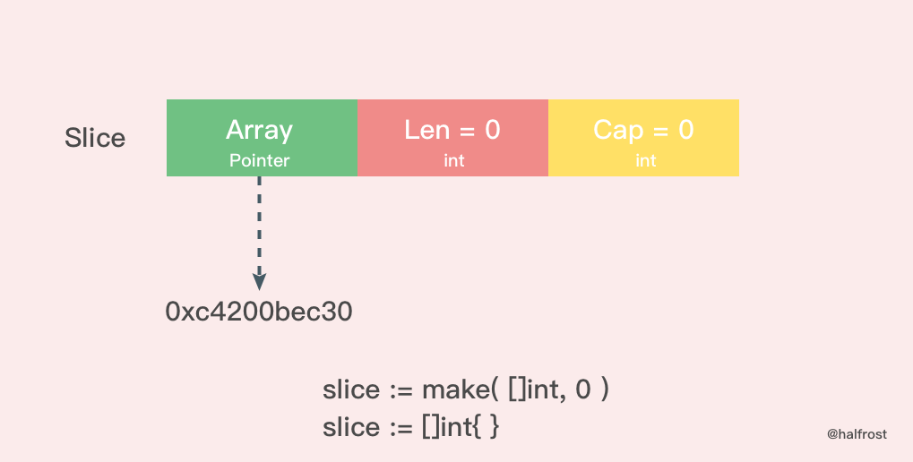
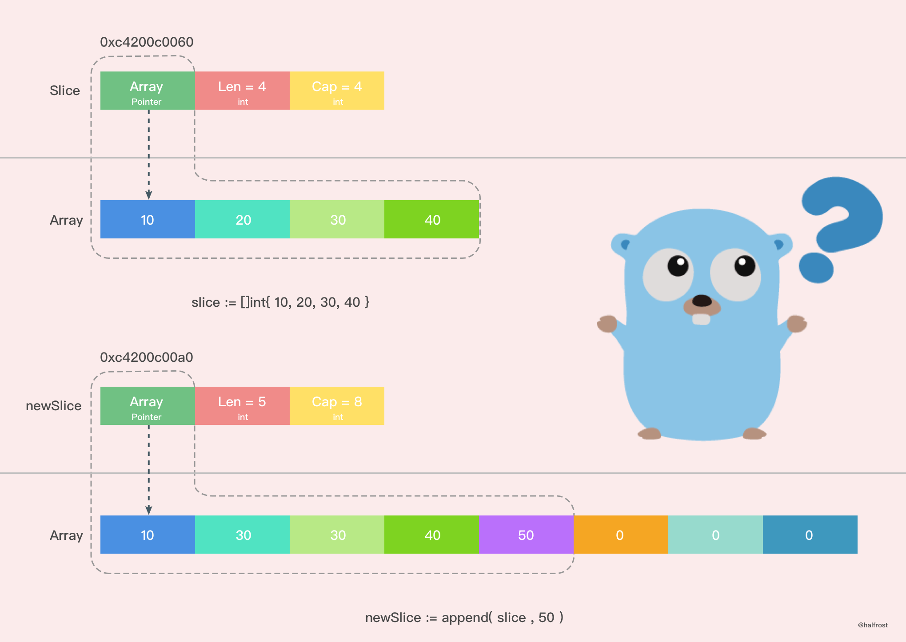
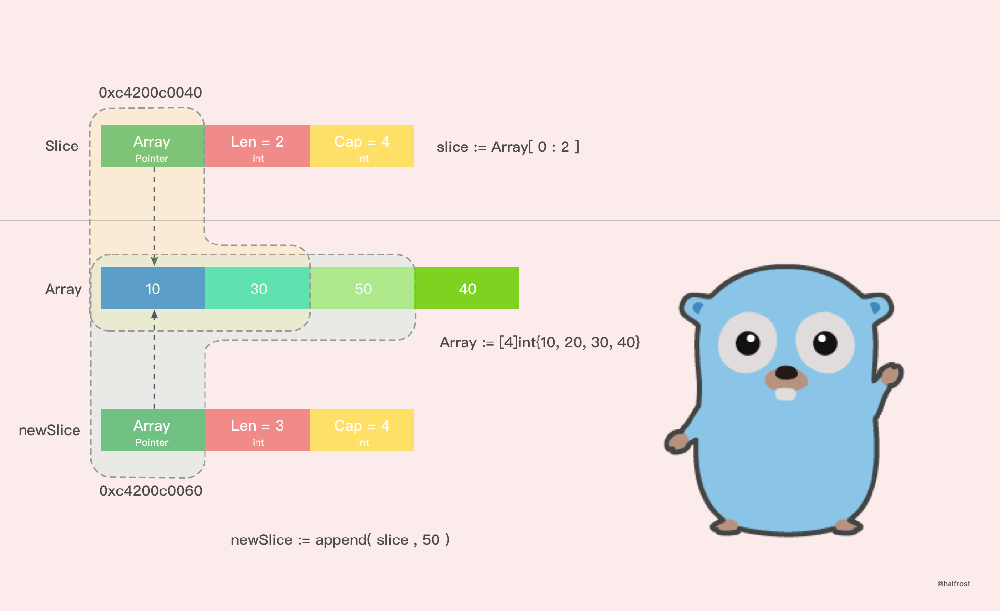

## 一. 切片和数组

关于切片和数组怎么选择？接下来好好讨论讨论这个问题。

在 Go 中，与 C 数组变量隐式作为指针使用不同，Go 数组是值类型，赋值和函数传参操作都会复制整个数组数据。

```go
func main() {
	arrayA := [2]int{100, 200}
	var arrayB [2]int

	arrayB = arrayA

	fmt.Printf("arrayA : %p , %v\n", &arrayA, arrayA)
	fmt.Printf("arrayB : %p , %v\n", &arrayB, arrayB)

	testArray(arrayA)
}

func testArray(x [2]int) {
	fmt.Printf("func Array : %p , %v\n", &x, x)
}
```

打印结果：

```go
arrayA : 0xc4200bebf0 , [100 200]
arrayB : 0xc4200bec00 , [100 200]
func Array : 0xc4200bec30 , [100 200]
```

可以看到，三个内存地址都不同，这也就验证了 Go 中数组赋值和函数传参都是值复制的。那这会导致什么问题呢？

假想每次传参都用数组，那么每次数组都要被复制一遍。如果数组大小有 100万，在64位机器上就需要花费大约 800W 字节，即 8MB 内存。这样会消耗掉大量的内存。于是乎有人想到，函数传参用数组的指针。

```go
func main() {
	arrayA := [2]int{100, 200}
	testArrayPoint1(&arrayA) // 1.传数组指针
	arrayB := arrayA[:]
	testArrayPoint2(&arrayB) // 2.传切片
	fmt.Printf("arrayA : %p , %v\n", &arrayA, arrayA)
}

func testArrayPoint1(x *[2]int) {
	fmt.Printf("func Array : %p , %v\n", x, *x)
	(*x)[1] += 100
}

func testArrayPoint2(x *[]int) {
	fmt.Printf("func Array : %p , %v\n", x, *x)
	(*x)[1] += 100
}
```

打印结果：

```go
func Array : 0xc4200b0140 , [100 200]
func Array : 0xc4200b0180 , [100 300]
arrayA : 0xc4200b0140 , [100 400]
```

这也就证明了数组指针确实到达了我们想要的效果。现在就算是传入10亿的数组，也只需要再栈上分配一个8个字节的内存给指针就可以了。这样更加高效的利用内存，性能也比之前的好。

不过传指针会有一个弊端，从打印结果可以看到，第一行和第三行指针地址都是同一个，万一原数组的指针指向更改了，那么函数里面的指针指向都会跟着更改。

切片的优势也就表现出来了。用切片传数组参数，既可以达到节约内存的目的，也可以达到合理处理好共享内存的问题。打印结果第二行就是切片，切片的指针和原来数组的指针是不同的。

由此我们可以得出结论：

把第一个大数组传递给函数会消耗很多内存，采用切片的方式传参可以避免上述问题。切片是引用传递，所以它们不需要使用额外的内存并且比使用数组更有效率。

## 二. 切片的数据结构

切片本身并不是动态数组或者数组指针。它内部实现的数据结构通过指针引用底层数组，设定相关属性将数据读写操作限定在指定的区域内。**切片本身是一个只读对象，其工作机制类似数组指针的一种封装**。

切片（slice）是对数组一个连续片段的引用，所以切片是一个引用类型（因此更类似于 C++ 中的 Vector 类型，或者 Python 中的 list 类型）。这个片段可以是整个数组，或者是由起始和终止索引标识的一些项的子集。需要注意的是，终止索引标识的项不包括在切片内。切片提供了一个与指向数组的动态窗口。

给定项的切片索引可能比相关数组的相同元素的索引小。和数组不同的是，切片的长度可以在运行时修改，最小为 0 最大为相关数组的长度：切片是一个长度可变的数组。

Slice 的数据结构定义如下:

```go
type slice struct {
	array unsafe.Pointer
	len   int
	cap   int
}
```

切片的结构体由3部分构成，Pointer 是指向一个数组的指针，len 代表当前切片的长度，cap 是当前切片的容量。cap 总是大于等于 len 的。

如果想从 slice 中得到一块内存地址，可以这样做：

```go
s := make([]byte, 200)
ptr := unsafe.Pointer(&s[0])
```

## 三. 创建切片

make 函数允许在运行期动态指定数组长度，绕开了数组类型必须使用编译期常量的限制。

创建切片有两种形式，make 创建切片，空切片。


上图是用 make 函数创建的一个 len = 4， cap = 6 的切片。内存空间申请了6个 int 类型的内存大小。由于 len = 4，所以后面2个暂时访问不到，但是容量还是在的。这时候数组里面每个变量都是0 。

除了 make 函数可以创建切片以外，字面量也可以创建切片。



这里是用字面量创建的一个 len = 6，cap = 6 的切片，这时候数组里面每个元素的值都初始化完成了。**需要注意的是 [ ] 里面不要写数组的容量，因为如果写了个数以后就是数组了，而不是切片了。**



还有一种简单的字面量创建切片的方法。如上图。上图就 Slice A 创建出了一个 len = 3，cap = 3 的切片。从原数组的第二位元素(0是第一位)开始切，一直切到第四位为止(不包括第五位)。同理，Slice B 创建出了一个 len = 2，cap = 4 的切片。

### 1. nil 和空切片

nil 切片和空切片也是常用的。

```go
var slice []int
```

nil 切片被用在很多标准库和内置函数中，描述一个不存在的切片的时候，就需要用到 nil 切片。比如函数在发生异常的时候，返回的切片就是 nil 切片。nil 切片的指针指向 nil。

空切片一般会用来表示一个空的集合。比如数据库查询，一条结果也没有查到，那么就可以返回一个空切片。

```go
silce := make( []int , 0 )
slice := []int{ }
```



空切片和 nil 切片的区别在于，空切片指向的地址不是nil，指向的是一个内存地址，但是它没有分配任何内存空间，即底层元素包含0个元素。

最后需要说明的一点是。不管是使用 nil 切片还是空切片，对其调用内置函数 append，len 和 cap 的效果都是一样的。

## 四. 切片扩容

当一个切片的容量满了，就需要扩容了。怎么扩，策略是什么？

### 1. 扩容策略

先看看扩容策略。

```go
func main() {
	slice := []int{10, 20, 30, 40}
	newSlice := append(slice, 50)
	fmt.Printf("Before slice = %v, Pointer = %p, len = %d, cap = %d\n", slice, &slice, len(slice), cap(slice))
	fmt.Printf("Before newSlice = %v, Pointer = %p, len = %d, cap = %d\n", newSlice, &newSlice, len(newSlice), cap(newSlice))
	newSlice[1] += 10
	fmt.Printf("After slice = %v, Pointer = %p, len = %d, cap = %d\n", slice, &slice, len(slice), cap(slice))
	fmt.Printf("After newSlice = %v, Pointer = %p, len = %d, cap = %d\n", newSlice, &newSlice, len(newSlice), cap(newSlice))
}
```

输出结果：

```go
Before slice = [10 20 30 40], Pointer = 0xc4200b0140, len = 4, cap = 4
Before newSlice = [10 20 30 40 50], Pointer = 0xc4200b0180, len = 5, cap = 8
After slice = [10 20 30 40], Pointer = 0xc4200b0140, len = 4, cap = 4
After newSlice = [10 30 30 40 50], Pointer = 0xc4200b0180, len = 5, cap = 8
```

用图表示出上述过程。



从图上我们可以很容易的看出，新的切片和之前的切片已经不同了，因为新的切片更改了一个值，并没有影响到原来的数组，新切片指向的数组是一个全新的数组。并且 cap 容量也发生了变化。这之间究竟发生了什么呢？

Go 中切片扩容的策略是这样的：

- 首先判断，如果新申请容量（cap）大于2倍的旧容量（old.cap），最终容量（newcap）就是新申请的容量（cap）
- 否则判断，如果旧切片的长度小于1024，则最终容量(newcap)就是旧容量(old.cap)的两倍，即（newcap=doublecap）
- 否则判断，如果旧切片长度大于等于1024，则最终容量（newcap）从旧容量（old.cap）开始循环增加原来的 1/4，即（newcap=old.cap,for {newcap += newcap/4}）直到最终容量（newcap）大于等于新申请的容量(cap)，即（newcap >= cap）
- 如果最终容量（cap）计算值溢出，则最终容量（cap）就是新申请容量（cap）

**注意：扩容扩大的容量都是针对原来的容量而言的，而不是针对原来数组的长度而言的。**

### 2. 新数组 or 老数组 ？

再谈谈扩容之后的数组一定是新的么？这个不一定，分两种情况。

情况一：

```go
func main() {
	array := [4]int{10, 20, 30, 40}
	slice := array[0:2]
	newSlice := append(slice, 50)
	fmt.Printf("Before slice = %v, Pointer = %p, len = %d, cap = %d\n", slice, &slice, len(slice), cap(slice))
	fmt.Printf("Before newSlice = %v, Pointer = %p, len = %d, cap = %d\n", newSlice, &newSlice, len(newSlice), cap(newSlice))
	newSlice[1] += 10
	fmt.Printf("After slice = %v, Pointer = %p, len = %d, cap = %d\n", slice, &slice, len(slice), cap(slice))
	fmt.Printf("After newSlice = %v, Pointer = %p, len = %d, cap = %d\n", newSlice, &newSlice, len(newSlice), cap(newSlice))
	fmt.Printf("After array = %v\n", array)
}
```

打印输出：

```go
Before slice = [10 20], Pointer = 0xc4200c0040, len = 2, cap = 4
Before newSlice = [10 20 50], Pointer = 0xc4200c0060, len = 3, cap = 4
After slice = [10 30], Pointer = 0xc4200c0040, len = 2, cap = 4
After newSlice = [10 30 50], Pointer = 0xc4200c0060, len = 3, cap = 4
After array = [10 30 50 40]
```

把上述过程用图表示出来，如下图。



通过打印的结果，我们可以看到，在这种情况下，扩容以后并没有新建一个新的数组，扩容前后的数组都是同一个，这也就导致了新的切片修改了一个值，也影响到了老的切片了。并且 append() 操作也改变了原来数组里面的值。一个 append() 操作影响了这么多地方，如果原数组上有多个切片，那么这些切片都会被影响！无意间就产生了莫名的 bug！

这种情况，由于原数组还有容量可以扩容，所以执行 append() 操作以后，会在原数组上直接操作，所以这种情况下，扩容以后的数组还是指向原来的数组。

这种情况也极容易出现在字面量创建切片时候，第三个参数 cap 传值的时候，如果用字面量创建切片，cap 并不等于指向数组的总容量，那么这种情况就会发生。

```go
slice := array[1:2:3]
```

**上面这种情况非常危险，极度容易产生 bug 。**

建议用字面量创建切片的时候，cap 的值一定要保持清醒，避免共享原数组导致的 bug。

情况二：

情况二其实就是在扩容策略里面举的例子，在那个例子中之所以生成了新的切片，是因为原来数组的容量已经达到了最大值，再想扩容， Go 默认会先开一片内存区域，把原来的值拷贝过来，然后再执行 append() 操作。这种情况丝毫不影响原数组。

所以建议尽量避免情况一，尽量使用情况二，避免 bug 产生。

## 五. 切片拷贝

Slice 中拷贝方法有2个。

```go
func slicecopy(to, fm slice, width uintptr) int {
	// 如果源切片或者目标切片有一个长度为0，那么就不需要拷贝，直接 return 
	if fm.len == 0 || to.len == 0 {
		return 0
	}
	// n 记录下源切片或者目标切片较短的那一个的长度
	n := fm.len
	if to.len < n {
		n = to.len
	}
	// 如果入参 width = 0，也不需要拷贝了，返回较短的切片的长度
	if width == 0 {
		return n
	}
	// 如果开启了竞争检测
	if raceenabled {
		callerpc := getcallerpc(unsafe.Pointer(&to))
		pc := funcPC(slicecopy)
		racewriterangepc(to.array, uintptr(n*int(width)), callerpc, pc)
		racereadrangepc(fm.array, uintptr(n*int(width)), callerpc, pc)
	}
	// 如果开启了 The memory sanitizer (msan)
	if msanenabled {
		msanwrite(to.array, uintptr(n*int(width)))
		msanread(fm.array, uintptr(n*int(width)))
	}

	size := uintptr(n) * width
	if size == 1 { 
		// TODO: is this still worth it with new memmove impl?
		// 如果只有一个元素，那么指针直接转换即可
		*(*byte)(to.array) = *(*byte)(fm.array) // known to be a byte pointer
	} else {
		// 如果不止一个元素，那么就把 size 个 bytes 从 fm.array 地址开始，拷贝到 to.array 地址之后
		memmove(to.array, fm.array, size)
	}
	return n
}
```

在这个方法中，slicecopy 方法会把源切片值(即 fm Slice )中的元素复制到目标切片(即 to Slice )中，并返回被复制的元素个数，copy 的两个类型必须一致。slicecopy 方法最终的复制结果取决于较短的那个切片，当较短的切片复制完成，整个复制过程就全部完成了。


举个例子，比如：

```go
func main() {
	array := []int{10, 20, 30, 40}
	slice := make([]int, 6)
	n := copy(slice, array)
	fmt.Println(n,slice)
}
```

还有一个拷贝的方法，这个方法原理和 slicecopy 方法类似，不在赘述了，注释写在代码里面了。

```go
func slicestringcopy(to []byte, fm string) int {
	// 如果源切片或者目标切片有一个长度为0，那么就不需要拷贝，直接 return 
	if len(fm) == 0 || len(to) == 0 {
		return 0
	}
	// n 记录下源切片或者目标切片较短的那一个的长度
	n := len(fm)
	if len(to) < n {
		n = len(to)
	}
	// 如果开启了竞争检测
	if raceenabled {
		callerpc := getcallerpc(unsafe.Pointer(&to))
		pc := funcPC(slicestringcopy)
		racewriterangepc(unsafe.Pointer(&to[0]), uintptr(n), callerpc, pc)
	}
	// 如果开启了 The memory sanitizer (msan)
	if msanenabled {
		msanwrite(unsafe.Pointer(&to[0]), uintptr(n))
	}
	// 拷贝字符串至字节数组
	memmove(unsafe.Pointer(&to[0]), stringStructOf(&fm).str, uintptr(n))
	return n
}
```

再举个例子，比如：

```go
func main() {
	slice := make([]byte, 3)
	n := copy(slice, "abcdef")
	fmt.Println(n,slice)
}
```

输出：

```go
3 [97,98,99]
```

说到拷贝，切片中有一个需要注意的问题。

```go
func main() {
	slice := []int{10, 20, 30, 40}
	for index, value := range slice {
		fmt.Printf("value = %d , value-addr = %x , slice-addr = %x\n", value, &value, &slice[index])
	}
}
```

输出：

```go
value = 10 , value-addr = c4200aedf8 , slice-addr = c4200b0320
value = 20 , value-addr = c4200aedf8 , slice-addr = c4200b0328
value = 30 , value-addr = c4200aedf8 , slice-addr = c4200b0330
value = 40 , value-addr = c4200aedf8 , slice-addr = c4200b0338
```

从上面结果我们可以看到，如果用 range 的方式去遍历一个切片，拿到的 Value 其实是切片里面的值拷贝。所以每次打印 Value 的地址都不变。


由于 Value 是值拷贝的，并非引用传递，所以直接改 Value 是达不到更改原切片值的目的的，需要通过 `&slice[index]` 获取真实的地址。

## Reference

1. [append()](https://github.com/golang/go/blob/master/src/cmd/compile/internal/gc/ssa.go#L2386)
2. [growslice()](https://github.com/golang/go/blob/master/src/runtime/slice.go#L98)
3. [Go Slices: usage and internals](https://blog.golang.org/go-slices-usage-and-internals)
4. [Slices](https://blog.golang.org/slices)
5. [Golang slices gotcha](https://allegro.tech/2017/07/golang-slices-gotcha.html)
6. [Slices from the ground up](https://dave.cheney.net/2018/07/12/slices-from-the-ground-up)
7. [Golang中的slice, array和append](https://lvm.me/post/2018/09/slice-array-and-append/)

## 推荐阅读

1. [深入解析 Go 中 Slice 底层实现](https://halfrost.com/go_slice/)