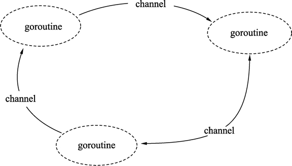

Go语言提倡使用通信的方法代替共享内存，当一个资源需要在 goroutine 之间共享时，通道在 goroutine 之间架起了一个管道，并提供了确保同步交换数据的机制。声明通道时，需要指定将要被共享的数据的类型。可以通过通道共享内置类型、命名类型、结构类型和引用类型的值或者指针。

这里通信的方法就是使用通道（channel），如下图所示。



## 创建通道

通道是引用类型，需要使用 make 进行创建，格式如下：

通道实例 := make(chan 数据类型)

- 数据类型：通道内传输的元素类型。
- 通道实例：通过make创建的通道句柄。
  请看下面的例子：

```go
ch1 := make(chan int)                 // 创建一个整型类型的通道
ch2 := make(chan interface{})         // 创建一个空接口类型的通道, 可以存放任意格式
```

上面创建的都是无缓冲的channel，有缓冲的channel创建只需在创建时指定缓冲大小即可，就像这样

```go
ch1 := make(chan int,2)
```

## 使用通道发送数据

通道创建后，就可以使用通道进行发送和接收操作。

#### 1) 通道发送数据的格式

通道的发送使用特殊的操作符`<-`，将数据通过通道发送的格式为：

通道变量 <- 值

- 通道变量：通过make创建好的通道实例。
- 值：可以是变量、常量、表达式或者函数返回值等。值的类型必须与ch通道的元素类型一致。

#### 2) 通过通道发送数据的例子

使用 make 创建一个通道后，就可以使用`<-`向通道发送数据，代码如下：

```go
// 创建一个空接口通道
ch := make(chan interface{})
// 将0放入通道中
ch <- 0
// 将hello字符串放入通道中
ch <- "hello"
```

#### 3) 发送将持续阻塞直到数据被接收

把数据往通道中发送时，如果接收方一直都没有接收，那么发送操作将持续阻塞。Go 程序运行时能智能地发现一些永远无法发送成功的语句并做出提示，代码如下：

```go
package main

func main() {    
    // 创建一个整型通道    
    ch := make(chan int)    
    // 尝试将0通过通道发送    
    ch <- 0
}
```

运行代码，报错：

```sh
fatal error: all goroutines are asleep - deadlock!
```

报错的意思是：运行时发现所有的 goroutine（包括main）都处于等待 goroutine。也就是说所有 goroutine 中的 channel 并没有形成发送和接收对应的代码。

## 使用通道接收数据

通道接收同样使用`<-`操作符，通道接收有如下特性：
① 通道的收发操作在不同的两个 goroutine 间进行。

由于通道的数据在没有接收方处理时，数据发送方会持续阻塞，因此通道的接收必定在另外一个 goroutine 中进行。

② 接收将持续阻塞直到发送方发送数据。

如果接收方接收时，通道中没有发送方发送数据，接收方也会发生阻塞，直到发送方发送数据为止。

③ 每次接收一个元素。
通道一次只能接收一个数据元素。

通道的数据接收一共有以下 4 种写法。

#### 1) 阻塞接收数据

阻塞模式接收数据时，将接收变量作为`<-`操作符的左值，格式如下：

```go
data := <-ch
```

执行该语句时将会阻塞，直到接收到数据并赋值给 data 变量。

#### 2) 非阻塞接收数据

使用非阻塞方式从通道接收数据时，语句不会发生阻塞，格式如下：

```go
data, ok := <-ch
```

- data：表示接收到的数据。未接收到数据时，data 为通道类型的零值。

- ok：表示是否接收到数据。

  

非阻塞的通道接收方法可能造成高的 CPU 占用，因此使用非常少。如果需要实现接收超时检测，可以配合 select 和计时器 channel 进行，可以参见后面的内容。

#### 3) 接收任意数据，忽略接收的数据

阻塞接收数据后，忽略从通道返回的数据，格式如下：

```go
<-ch
```

执行该语句时将会发生阻塞，直到接收到数据，但接收到的数据会被忽略。这个方式实际上只是通过通道在 goroutine 间阻塞收发实现并发同步。

使用通道做并发同步的写法，可以参考下面的例子：

```go
package main
import (
    "fmt"
)
func main() {
    // 构建一个通道
    ch := make(chan int)
    // 开启一个并发匿名函数
    go func() {
        fmt.Println("start goroutine")
        // 通过通道通知main的goroutine
        ch <- 0
        fmt.Println("exit goroutine")
    }()
    fmt.Println("wait goroutine")
    // 等待匿名goroutine
    <-ch
    fmt.Println("all done")
}
```

执行代码，输出如下：

```sh
wait goroutine
start goroutine
exit goroutine
all done
```

代码说明如下：

- 第 10 行，构建一个同步用的通道。
- 第 13 行，开启一个匿名函数的并发。
- 第 18 行，匿名 goroutine 即将结束时，通过通道通知 main 的 goroutine，这一句会一直阻塞直到 main 的 goroutine 接收为止。
- 第 27 行，开启 goroutine 后，马上通过通道等待匿名 goroutine 结束。

#### 4) 循环接收

通道的数据接收可以借用 for range 语句进行多个元素的接收操作，格式如下：

```go
for data := range ch {}
```

通道 ch 是可以进行遍历的，遍历的结果就是接收到的数据。数据类型就是通道的数据类型。通过 for 遍历获得的变量只有一个，即上面例子中的 data。

遍历通道数据的例子请参考下面的代码。

使用 for 从通道中接收数据：

```go
package main

import (
    "fmt"
    "time"
)

func main() {
    // 构建一个通道
    ch := make(chan int)
    // 开启一个并发匿名函数
    go func() {
        // 从3循环到0
        for i := 3; i >= 0; i-- {
            // 发送3到0之间的数值
            ch <- i
            // 每次发送完时等待
            time.Sleep(time.Second)
        }
    }()

    // 遍历接收通道数据
    for data := range ch {
        // 打印通道数据
        fmt.Println(data)
        // 当遇到数据0时, 退出接收循环
        if data == 0 {
           break
        }
    }
}
```

执行代码，输出如下：

```go
3
2
1
0
```

## 单向通道

Go语言的类型系统提供了单方向的 channel 类型，顾名思义，单向 channel 就是只能用于写入或者只能用于读取数据。当然 channel 本身必然是同时支持读写的，否则根本没法用。

假如一个 channel 真的只能读取数据，那么它肯定只会是空的，因为你没机会往里面写数据。同理，如果一个 channel 只允许写入数据，即使写进去了，也没有丝毫意义，因为没有办法读取到里面的数据。

所谓的单向 channel 概念，其实只是对 channel 的一种使用限制。

### 单向通道的声明格式

我们在将一个 channel 变量传递到一个函数时，可以通过将其指定为单向 channel 变量，从而限制该函数中可以对此 channel 的操作，比如只能往这个 channel 中写入数据，或者只能从这个 channel 读取数据。

单向 channel 变量的声明非常简单，只能写入数据的通道类型为`chan<-`，只能读取数据的通道类型为`<-chan`，格式如下：

```go
var intChan chan<- int   // 只能写入数据的通道
var strChan <-chan string   // 只能读取数据的通道
```

当然，使用 make 创建通道时，也可以创建一个只写入或只读取的通道：

```go
ch := make(<-chan int)
var chReadOnly <-chan int = ch
<-chReadOnly
```

上面代码编译正常，运行也是正确的。但是，一个不能写入数据只能读取的通道是毫无意义的。

## 基于select的多路复用

下面的程序会进行火箭发射的倒计时。time.Tick函数返回一个channel，程序会周期性地像一个节拍器一样向这个channel发送事件。每一个事件的值是一个时间戳，不过更有意思的是其传送方式。

```go
package main

import (
        "fmt"
        "time"
)

func launch() {
        fmt.Println("发射!")
}

func main() {

        fmt.Println("准备发射火箭...")
        //time.Tick会返回一个channel,系统会定时向这个channel发信号
        tick := time.Tick(1 * time.Second)
        for countdown := 10; countdown > 0; countdown-- {
                fmt.Println(countdown)
                //从tick channel中取数据,没阻塞1s 返回一次
                <-tick
        }
        launch()

}
```

执行结果

```go
准备发射火箭...
10
9
8
7
6
5
4
3
2
1
发射!
```

现在我们让这个程序支持在倒计时中，用户按下回车键时直接中断发射流程。首先，我们启动一个goroutine，这个goroutine会尝试从标准输入中读入一个单独的byte并且，如果成功了，会向名为abort的channel发送一个值。

```go
abort := make(chan struct{})
go func() {
    os.Stdin.Read(make([]byte, 1)) // read a single byte
    abort <- struct{}{}
}()
```

现在每一次计数循环的迭代都需要等待两个channel中的其中一个返回事件了.

我们无法做到从每一个channel中接收信息，如果我们这么做的话，如果第一个channel中没有事件发过来那么程序就会立刻被阻塞，这样我们就无法收到第二个channel中发过来的事件。这时候我们需要多路复用(multiplex)这些操作了，为了能够多路复用，我们使用了select语句。

```go
select {
case <-ch1:
    // ...
case x := <-ch2:
    // ...use x...
case ch3 <- y:
    // ...
default:
    // ...
}
```

上面是select语句的一般形式。和switch语句稍微有点相似，也会有几个case和最后的default选择分支。每一个case代表一个通信操作（在某个channel上进行发送或者接收），并且会包含一些语句组成的一个语句块。一个接收表达式可能只包含接收表达式自身（译注：不把接收到的值赋值给变量什么的），就像上面的第一个case，或者包含在一个简短的变量声明中，像第二个case里一样；第二种形式让你能够引用接收到的值。

select会等待case中有能够执行的case时去执行。当条件满足时，select才会去通信并执行case之后的语句；这时候其它通信是不会执行的。

一个没有任何case的select语句写作select{}，会永远地等待下去。

如果多个case同时就绪时，select会随机地选择一个执行，这样来保证每一个channel都有平等的被select的机会。

增加前一个例子的buffer大小会使其输出变得不确定，因为当buffer既不为满也不为空时，select语句的执行情况就像是抛硬币的行为一样是随机的。

下面让我们的发射程序打印倒计时。这里的select语句会使每次循环迭代等待一秒来执行退出操作。

修改代码如下：

```go
package main

import (
        "fmt"
        "os"
        "time"
)

func launch() {
        fmt.Println("发射!")
}

func main() {
        //创建abort channel
        abort := make(chan struct{})
        go func() {
                os.Stdin.Read(make([]byte, 1))
                abort <- struct{}{}
        }()
        fmt.Println("准备发射火箭...")
        //time.Tick会返回一个channel,系统会定时向这个channel发信号
        tick := time.Tick(1 * time.Second)
        for countdown := 10; countdown > 0; countdown-- {
                fmt.Println(countdown)
                select {
                case <-tick:
                        //从tick channel中取数据,阻塞1s 返回一次
                        //...
                case <-abort:
                        fmt.Println("发射终止...")
                        return
                }
        }
        launch()
}
```

有时候我们希望能够从channel中发送或者接收值，并避免因为发送或者接收导致的阻塞，尤其是当channel没有准备好写或者读时。select语句就可以实现这样的功能。select会有一个default来设置当其它的操作都不能够马上被处理时程序需要执行哪些逻辑。

下面的select语句会在abort channel中有值时，从其中接收值；无值时什么都不做。这是一个非阻塞的接收操作；反复地做这样的操作叫做“轮询channel”。

```go
select {
case <-abort:
    fmt.Printf("Launch aborted!\n")
    return
default:
    // do nothing
}
```

channel的零值是nil。也许会让你觉得比较奇怪，nil的channel有时候也是有一些用处的。因为对一个nil的channel发送和接收操作会永远阻塞，在select语句中操作nil的channel永远都不会被select到。