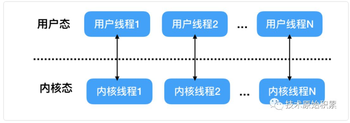
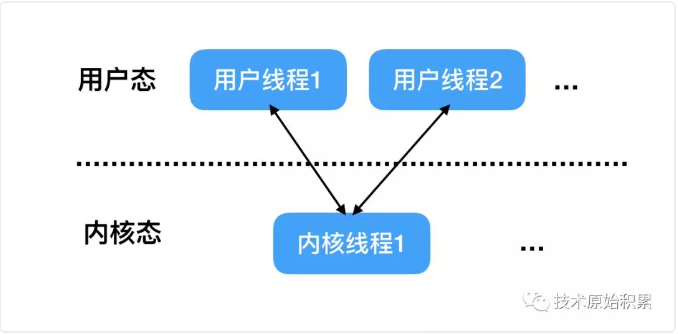

## 并发与并行

**并发是指同一个时间段内多个任务同时交叉执行，并且都没有执行结束**，**而并行是说在单位时间内多个任务同时在执行**，并发任务强调在一个时间段内同时执行，而一个时间段有多个单位时间累积而成，所以说并发的多个任务在单位时间内不一定同时在执行。

在单个cpu的时代多个任务同时运行都是并发，这是因为cpu同时只能执行一个任务，单个cpu时代多任务是共享一个cpu的，当一个任务占用cpu运行时候，其它任务就会被挂起，当占用cpu的任务时间片用完后，会把cpu让给其它任务来使用，所以在单cpu时代多线程编程是意义不大，并且线程间频繁的上下文切换还会带来开销。

## 并发编程难在哪

### 数据竞争的存在

当两个或者多个线程``（goroutine）``在没有任何同步措施的情况下同时读写同一个共享资源时候，这多个线``（goroutine）``


就处于数据竞争状态，数据竞争会导致程序的运行结果超出写代码的人的期望。下面我们来看个例子：

```go
package main

import "fmt"

func add(a, b int) {
    var c = a + b
    fmt.Printf("%d + %d = %d", a, b, c)
}

func main() {
    go add(1, 2)
}
```

在这段代码中包含了两个协程，一个是显式的，通过 `go` 关键字声明的这条语句，表示启用一个新的协程来处理加法运算，另一个是隐式的，即 `main` 函数本身也是运行在一个主协程中，该协程和调用 `add` 函数的子协程是并发运行的两个协程，就好比从 `go` 关键字开始，从主协程中叉出一条新路。

和之前不使用协程的方式相比，由此也引入了不确定性：我们不知道子协程什么时候执行完毕，运行到了什么状态。在主协程中启动子协程后，程序就退出运行了，这就意味着包含这两个协程的处理进程退出了，**所以，我们运行这段代码，不会看到子协程里运行的打印结果，因为还没来得及执行它们，进程就已经退出了**。另外，我们也不要试图从 `add` 函数返回处理结果，因为在主协程中，根本获取不到子协程的返回值，从子协程开始执行起就已经和主协程没有任何关系了，返回值会被丢弃。

如果要显示出子协程的打印结果，一种方式是在主协程中等待足够长的时间再退出，以便保证子协程中的所有代码执行完毕：

```go
package main

import (
	"fmt"
	"time"
)

func add(a, b int) {
	var c = a + b
	fmt.Printf("%d + %d = %d", a, b, c)
}

func main() {
	go add(1, 2)
	time.Sleep(time.Second)
}
//
1 + 2 = 3
```

这看起来或许有效，但是这是非常低效，并且并不是所有情况下都可以解决的。正确的做法可以使用信号量等同步措施。

### 并发执行示例

接下来，我们通过下面这段代码来验证协程的并发执行：

```go
package main

import (
	"fmt"
	"time"
)

func add(a, b int) {
	var c = a + b
	fmt.Printf("%d + %d = %d\n", a, b, c)
	time.Sleep(3 * time.Second)
}

func main() {
	for i := 0; i < 10; i++ {
		go add(i, i+1)
	}
	time.Sleep(time.Second)
}
```

很简单，我们给协程代码外层套上一个循环就可以了，这样一来，就同时启动了 10 个子协程，由于它们是并发执行的，执行的先后顺序无法保证。

可以看到每个子协程中``add``函数执行完打印语句睡眠 3 秒再退出，如果不是并发执行，那么肯定至多只能打印一条结果出来，但实际情况是，仍然是打印 10 条结果，并且没有任何延迟，证明这些加法运算是并发执行的。

### 操作的原子性

所谓原子性操作是指当执行一系列操作时候，这些操作那么全部被执行，那么全部不被执行，不存在只执行其中一部分的情况。在设计**计数器**时候一般都是先读取当前值，然后+1，然后更新，这个过程是读-改-写的过程，如果不能保证这个过程是原子性，那么就会出现线程安全问题。如下代码是线程不安全的，因为不能保证``a++``是原子性操作:

```go
package main

import (
	"fmt"
	"sync"
)

var count int32
var wg sync.WaitGroup
const ThreadNum = 5000

func main() {
	wg.Add(ThreadNum)
	for i := 0;i < ThreadNum; i++{
		go func() {
			count++
			wg.Done()
		}()
	}
	wg.Wait()//3. 等待goroutine运行结束
	fmt.Println(count)
}
```

如上代码在main函数所在为``goroutine``内创建了``THREAD_NUM``个``goroutine``，每个新的``goroutine``执行代码对变量count计数增加1。

这里创建了``THREADNUM``个信号量，用来在代码3处等待``THREADNUM``个``goroutine``执行完毕，然后输出最终计数，执行上面代码我们 期望输出1000，但是实际却不是。

这是因为a++操作本身不是原子性的，其等价于b := count;b=b+1;count=b;是三步操作，所以可能导致导致计数不准确

上面的程序需要保证``count++``的原子性才是正确的，可以使用``sync/atomic``包的一些原子性函数或者锁可以解决这个问题。

```go
package main

import (
	"fmt"
	"sync"
	"sync/atomic"
)

var count int32
var wg sync.WaitGroup
const ThreadNum = 5000
func main() {
	wg.Add(ThreadNum)
	for i := 0;i < ThreadNum; i++{
		go func() {
			//count++
			atomic.AddInt32(&count,1)
			wg.Done()
		}()
	}
	wg.Wait()
	fmt.Println(count)
}
```

### 内存访问同步

上节原子性操作第一个例子有问题是因为count++操作是被分解为类似b := count;b=b+1;count =b; 的三部操作，而多个``goroutine``同时执行``count++``时候并不是顺序执行者三个步骤的，而是可能交叉访问的。所以如果能对内存变量的访问添加同步访问措施，就可以避免这个问题：

```go
package main

import (
	"fmt"
	"sync"
)

var count int32
var wg sync.WaitGroup
var lock sync.Mutex
const ThreadNum = 5000
func main() {
	wg.Add(ThreadNum)
	for i := 0;i < ThreadNum; i++{
		go func() {
			lock.Lock()//2.1
			count++
			lock.Unlock()
			wg.Done()
		}()
	}
	wg.Wait()
	fmt.Println(count)
}
```

如上代码创建了一个互斥锁lock,然后``goroutine``内在执行count++前先获取锁，执行完毕后在释放锁。

当1000个``goroutine``同时执行到2.1时候只有一个线程可以获取到锁，其他的线程被阻塞，直到获取到锁的``goroutine``释放了锁。也就是这1000个线程的并发行使用锁转换为了串行执行，也就是对共享内存变量的访问施加了同步措施。

## 线程模型

线程的并发执行是有操作系统来进行调度的，操作系统一般都都在内核提供对线程的支持。而我们在使用高级语言编写程序时候创建的线程是用户线程，那么用户线程与内核线程是什么关系那？其实下面将要讲解的三种线程模型就是根据用户线程与内核线程关系的不同而划分的。

### 一对一模型

这种线程模型下用户线程与内核线程是一一对应的，当从程序入口点（比如main函数）启动后，操作系统就创建了一个进程，这个main函数所在的线程就是主线程，在main函数内当我们使用高级语言创建一个用户线程的时候，其实对应创建了一个内核线程，如下图：



这种线程模型优点是在多处理器上，**多个线程可以真正实现并行运行**，并且当一个线程由于网络IO等原因被阻塞时候，其他的线程不受影响。

缺点是由于一般操作系统会限制内核线程的个数，所以用户线程的个数会受到限制。另外由于用户线程与系统线程一一对应，当用户线程比如执行Io操作（执行系统调用）时候，需要从用户态的用户程序的执行切换到内核态执行内核操作，然后等执行完毕后又会从内核态切换到用户态执行用户程序，而这个切换操作开销是相对比较大的。

另外这里提下高级语言Java的线程模型就是使用的这种一对一的模型，所以Java中多线程对共享变量使用锁同步时候会导致获取锁失败的线程进行上下文切换，而JUC包提供的无锁CAS操作则不会产生上下文切换。

### 多对一模型

多对一模型是指多个用户线程对应一个内核线程，同时同一个用户线程只能对应一个内核线程，这时候对应同一个内核线程的多个用户线程的上下文切换是由用户态的运行时线程库来做的，而不是由操作系统调度系统来做的，其模型如下：



这种模型好处是由于上下文切换在用户态，所以切换速度很快，开销很小；另外可创建的用户线程的数量可以很多，只受内存大小限制。

这种模型由于多个用户线程对应一个内核线程，当该内核线程对应的一个用户线程被阻塞挂起时候，该内核线程对应的其他用户线程也不能运行了，因为这时候内核线程已经被阻塞挂起了。另外这种模型并不能很好的利用多核CPU进行并发运行。

### 多对多模型

多对多模型则结合一对一和多对一模型的特点，让大量的用户线程对应少数几个内核线程上，其模型图如下：这时候每个内核线程对应多个用户线程，每个用户线程有可以对应多个内核线程，当一个用户线程阻塞后，其对应的当前的内核线程会被阻塞，但是被阻塞的内核线程对应的其他用户线程可以切换到其他的内核线程上继续运行，所以多对多模型是可以充分利用多核CPU提升运行效能的。

另外多对多模型也对用户线程个数没有限制，理论上只要内存够用可以无限创建。

## Go的线程模型

[Go的线程模型 - 掘金](https://juejin.cn/post/6859312340630929421)

在操作系统提供的内核线程之上，Go搭建了一个特有的两级线程模型。

一个G的执行需要P和M的支持。P和M关联之后，就形成了一个有效的G运行环境（内核线程+上下文环境）。
 每个P都会包含一个可运行的G的队列，该队列中的G会被依次传递给本地P关联的当前M,并获得运行时机。

> ``KSE``: 内核调度实体，可以被内核的调度器调度的对象，也称为内核级线程，是操作系统内核最小调度单元。


M

- machine的缩写，一个M代表一个用户空间的内核线程，与内核线程``（KSE）``总是一一对应,在M的生命周期内，会且仅会与一个``KSE``产生关联。

- M刚创建之初，就会被加入到**全局M列表**。

- 有些时候，M会被停止（比如找不到可运行G时等），M会被加入到**调度器的空闲M列表**，在需要一个未被使用的M时，调度器会先尝试从该列表中获取。
- 单个Go程序所使用的M的最大值可以设置，初始值是10000

P

- processor的缩写，一个P代表执行一个Go代码片段所必需的资源（上下文环境）
- 调度器会适时的让P与不同的M建立或断开关联，使得P中的可运行G能够及时获得运行时机。
- P的数量默认等于当前cpu核数,可以利用函数``runtime.GOMAXPROCS``来改变P的数量。P的数量即为可运行G队列的数量。
- 当一个P不再与任何M关联时，且它的可运行G队列为空，会被放入**调度器的空闲P列表**，在需要一个空闲的P关联M时，会从此列表取出。
- P的包含一个自由G列表，存放一些已经运行完成的G。当增长到一定程度，运行时系统会把其中的部分G转移到**调度器的自由G列表**中。

G

- ``goroutine``的缩写，一个G代表一个go代码片段，G是对go代码的一种封装.Go的编译器会把go语句变成对内部函数``newproc``的调用，并把go函数及其参数都作为参数传递给这个函数。
- 新建的G会被首先加入**全局G列表**，初始化之后，会被加入到本地P的可运行队列，还会被存储到本地P的``runnext``字段，该字段用户存放新鲜出炉的G，以便更早的运行它。如果``runnext``已经有一个G，那么这个已有G会被踢到**该P的可运行G队列**的末尾。如果该队列已满，那么这个G就只能追加到**调度器的可运行G队列**中。
- 当go语句欲启用一个G的时候，运行时系统会先试图从相应的**P的自由G列表**中获取一个现成的G，来封装这个go函数。仅当获取不到G才有可能创建一个新G。
- 运行时系统会在发现本地P自由G太少，会尝试从调度器的自由G列表中转移一些过来。如果发现本地P的自由G队列满了，会转移一些到**调度器的自由G列表**。
- 所有的**自由G列表** 都是先进后出的。
- 一个G在被启用之后，会先被追加到某个P的可运行G队列中，以等待运行时机。

## goroutine轻量级的线程

在go中，使用go关键字跟上一个函数，就创建了一个``goroutine``，每个``goroutine``可以认为是一个轻量级的线程，其占用更少的堆栈空间，并且其需要的堆栈空间大小可以随着程序的运行需要动态增加或者空闲回收。

```go
package main

import (
	"fmt"
	"sync"
)

var wg sync.WaitGroup
func main() {
	defer fmt.Println("---main goroutine over---")
	wg.Add(1)
	go func() {
		fmt.Println("---sub goroutine running---")
		wg.Done()
	}()

	fmt.Println("---wait sub goroutine over---")
	wg.Wait()
	fmt.Println("---sub goroutine over---")
}
/**
---wait sub goroutine over---
---sub goroutine running---
---sub goroutine over---
---main goroutine over---
**/
```

另外我们也可以先创建一个函数，然后使用go关键字带上函数名就可以开启一个新``goroutine``来运行这个函数，如下代码创建了函数``printFunc``，然后使用 go ``printFunc()``来开启新``goroutine``来启动该函数：

```go
package main

import (
	"fmt"
	"sync"
)

func printFunc(){
	fmt.Println("---sub goroutine running---")
	wg.Done()
}

var wg sync.WaitGroup
func main() {
	defer fmt.Println("---main goroutine over---")
	wg.Add(1)
	go printFunc()
	fmt.Println("---wait sub goroutine over---")
	wg.Wait()
	fmt.Println("---sub goroutine over---")
}
```

另外需要注意的是在go中整个进程的生命周期是与main函数所在``goroutine``一致的，只要main函数所在``goroutine``结束了，整个进程也就是结束了，而不管是否还有其他``goroutine``在运行：

```go
package main

import (
	"fmt"
	"sync"
)

var wg sync.WaitGroup
func main() {
	defer fmt.Println("---main goroutine over---")
	wg.Add(1)
	go func() {
		fmt.Println("I'm a goroutine")
		wg.Done()
		//无限循环
		for  {
			fmt.Println("---sub goroutine running---")
		}
	}()
	fmt.Println("---wait sub goroutine over---")
	wg.Wait()
	fmt.Println("---sub goroutine over---")
}
```

如上代码在使用go关键字创建的``goroutine``内新增了for无限循环打印输出，运行上面代码后会发现随着main函数所在``gorroutine``销毁，后进程就退出了，虽然新创建的``goroutine``还没运行完毕。

``goroutine``是轻量级线程，并不是操作系统线程，``goroutine``与操作系统线程对应关系是``M：N``，也就是M个``goroutine``对应N个操作系统线程，``goroutine``内部实现与在多个操作系统线程(Os 线程)之间复用的协程(coroutines)一样。如果一个``goroutine``阻塞OS线程，例如等待输入，则该OS线程中的其他``goroutine``将迁移到其他OS线程，以便它们可以继续运行。

### 如何杀死一个goroutine

为了让一个运行中的goroutine停止，我们可以让其在一个channel上监听停止信号，如下代码：

```go
package main

import (
	"fmt"
	"sync"
	"time"
)

var wg sync.WaitGroup
func main() {
	quit := make(chan struct{})
	go func() {
		for{
			select {
			case <-quit:
				fmt.Println("sub goroutine is over")
				return
			default:
				time.Sleep(time.Second)
				fmt.Println("sub goroutine doing something")
			}
		}
	}()

	time.Sleep(3 * time.Second)

    
	//4.关闭通道quit
	fmt.Println("main goroutine start stop sub goroutine")
	close(quit)

	time.Sleep(time.Second * 10)
	fmt.Println("main goroutine is over")
}
```

如上创建了一个无缓冲通道quit用来做反向通知子线程停止；开启了一个``goroutine``，该``goroutine``内使用了无限循环，内部使用了select结构，其中第一个case是从通道quit内读取元素，由于quit通道一开始没有元素，所以这个case分支不会被执行，而是转向执行defalut分支；defalut分支里面用来执行具体的业务，这里是休眠1s然后打印输出，这个``goroutine``的作用就是间隔1s执行打印输出，并且等quit通道内有元素时候执行return退出当前``goroutine``

代码4关闭通道，关闭通道后回向通道内写入一个零值元素，这里先让主``goroutine``休眠3秒是为了在关闭quit通道前让子``goroutine``有机会执行一些时间。

代码4关闭通道后，子``goroutine``内的select语句的第一个case就会从quit读取操作中返回，然后子``goroutine``就执行return退出了。

> 使用无缓冲通道和select结构在主``goroutine`` 内反向控制子``goroutine``的生命周期在go中是一个通用的做法。

## runtime包

Go的运行时包runtime中包含了一些列的可以设置go运行时的环境的函数，比如运行最大有多少逻辑处理器（P），最多可以创建多少OS线程（M）等。

### ``runtime.GOMAXPROCS(n int)`` 

设置逻辑处理器个数,也就是设置MPG中的P的个数，默认P的个数是逻辑cpu的个数，比如在4核双线程的机器上P默认个数是8，调用该函数会返回设置前P的个数。

```go
func GOMAXPROCS(n int) int {
	if GOARCH == "wasm" && n > 1 {
		n = 1 // WebAssembly has no threads yet, so only one CPU is possible.
	}
	lock(&sched.lock)
	ret := int(gomaxprocs)
	unlock(&sched.lock)
	if n <= 0 || n == ret {
		return ret
	}
	stopTheWorldGC("GOMAXPROCS")
	// newprocs will be processed by startTheWorld
	newprocs = int32(n)
	startTheWorldGC()
	return ret
}
```

由于调用该方法会``stopTheWorld``，所以如果要设置该值，建议尽早设置该值。

```go
package main

import (
	"fmt"
	"runtime"
	"sync"
)

var wg sync.WaitGroup
func main() {
	runtime.GOMAXPROCS(1)
	wg.Add(2)
	go func() {
		for i := 0; i < 10; i++{
			fmt.Println(i)
		}
		wg.Done()
	}()

	go func() {
		for i := 10; i < 20; i++{
			fmt.Println(i)
		}
		wg.Done()
	}()
	wg.Wait()
}
```

如上代码main函数内设置当前逻辑处理器P的个数为1，设置为1意味着所有的``goroutine``都被放到了这唯一一个P的本地队列里面了。然后main函数里面创建了两个``goroutine``来分别打印输出，执行上面代码会发现一种可能的序列为：

```bash
10
11
12
13
14
15
16
17
18
19
0
1
2
3
4
5
6
7
8
9

Process finished with the exit code 0
```

从结果看着两个``goroutine``是顺序执行的，一个执行完毕后，顺序执行第二个（其实后面会知道这是假象,这里之所以顺序输出是因为每个``goroutine``耗时太短，还没来得及做上下文切换），把上面代码修改为下面，也就是在打印一数字后休眠1s:

```go
package main

import (
	"fmt"
	"runtime"
	"sync"
	"time"
)

var wg sync.WaitGroup
func main() {
	runtime.GOMAXPROCS(1)
	wg.Add(2)
	go func() {
		for i := 0; i < 10; i++{
			fmt.Println(i)
			time.Sleep(time.Second)
		}
		wg.Done()
	}()

	go func() {
		for i := 10; i < 20; i++{
			fmt.Println(i)
			time.Sleep(time.Second)
		}
		wg.Done()
	}()
	wg.Wait()
}
```

一种可能输出是：

```bash
10
0
1
11
12
2
3
13
14
4
5
15
16
6
7
17
18
8
9
19

Process finished with the exit code 0

```

可知虽然在P为1的情况下，两个``goroutine``还是交叉运行，而不是顺序的。

### ``runtime.Gosched()``

类似Java中线程的``yeild``方法，当一个``goroutine``执行该方法时候意味着当前``goroutine``放弃当前cpu的使用权，然后运行时会调度系统会调度其他``goroutine``占用cpu进行运行，放弃CPU使用权的``goroutine``并没有被阻塞，而是处于就绪状态，可以在随时获取到cpu情况下继续运行。

前面的例子我们使用``time.sleep``方法让``goroutine``阻塞从而让出CPU让另外一个``goroutine``运行，其实也可以使用``Gosched``

### ``debug.SetMaxThreads(threads int)``

设置最多可以创建多少操作系统线程M，如果尝试创建比这个设置多的线程，应该程序将会崩溃，默认是10000个。

## 互斥锁

在go中互斥锁是在sync包提供的，其是独占锁，同时只有一个线程可以获取该锁。

当一个``goroutine``持有互斥锁时候，其他请求获取锁的``goroutine``会被阻塞挂起，等获取锁的``goroutine``释放锁后，阻塞的线程中的一个才可以被唤醒并获取锁。同时该锁是**不可重入锁**，当前``goroutine``在获取该锁后释放前再次尝试获取该锁会被阻塞。

在go中使用`` var mutex sync.Mutex``就可以创建一个开箱即用的互斥锁，调用``mutex.Lock()``尝试获取锁，调用``mutex.Unlock()``释放锁，需要注意的是释放锁时候要保证某一个``goroutine``已经获取到了锁，如果在没有获取锁的``goroutinemutex.Unlock()``的情况下，会抛出错误。

**另外需要注意的是释放锁的``goroutine``不要求与获取锁的``goroutine``是同一个**

```go
package main

import (
	"fmt"
	"sync"
)

var wg sync.WaitGroup
var lock sync.Mutex
func main() {
	wg.Add(1)
	lock.Lock()
	fmt.Println("---main goroutine lock---")
	go func() {
		fmt.Println("---sub goroutine unlock---")
		lock.Unlock()
		wg.Done()
	}()
	wg.Wait()
}
/**
---main goroutine lock---
---sub goroutine unlock---
**/
```

另外go中互斥锁分为两种模式：正常与饥饿模式。

### 正常模式

在正常模式中当多个``goroutine``同时获取同一个互斥锁时候，其中一个``goroutine``会获取到该锁，其他的``goroutine``则会被放入到与该锁维护的一个FIFO队列里面，然后被阻塞挂起。

当获取锁的``goroutine``释放锁后，该队列里面的某个等待的``goroutine``会被激活，激活的``goroutine``并不能马上获取到锁的所有权，这是因为当前可能有新创建的大量``goroutine``也需要获取该锁，这时候激活的``goroutine``就要与这些新的``goroutine``共同竞争锁的所有权，所以被激活的``goroutine``还是很有可能获取不到锁，如果发生了这种情况，则被激活的线程还是要被放到队列最前面（队首），最后如果一个被阻塞的``goroutine``尝试了``1ms``的时间还没获取到锁，则互斥锁的模式会被自动切换到饥饿模式。

### 饥饿模式

在饥饿模式下当多个``goroutine``同时获取同一个互斥锁时候，其中一个``goroutine``会获取到该锁，其他的``goroutine``则会被放入到与该锁维护的一个FIFO队列里面，然后被阻塞挂起

当获取锁的``goroutine``释放锁后，锁的所有权会被交给FIFO队列里面队首的``goroutine``,新创建的``goroutine``尝试获取锁的时候，即使发现了当前锁是空闲的也不会去尝试获取，而是被放到锁做维护的FIFO的队尾部。

如果一个激活的``goroutine``接受了锁的所有权，并且当发生了下面的某一个事情时候该锁从饥饿模式切换回正常模式：1.当前激活的``goroutine``是FIFO队列最后一个，1.当前激活的``goroutine``在``1ms``时间内就获取到了锁；

### 总结

正常模式可以提供更好的性能，因为一个``goroutine``可以在有``goroutine``处于等待锁的条件下抢占式的去获取锁，而不需要遵循先来先到的原则；而饥饿模式则可以很好的预防锁的FIFO队列队尾部的``goroutine``一直获取不到锁的情况。


## 读写锁

go语言类似Java ``JUC``包也提供了一些列用于多线程之间进行同步的措施，比如低级的同步措施有 锁、``CAS``、原子变量操作类。本节我们先来看看go中读写锁，读写锁相比互斥锁来说并发度更高，在读多写少情况下比较实用。

在go中可以使用``sync.RWMutex``获取一个读写锁，读写锁是读写互斥锁，读锁可以被任意多的读``goroutine``持有，但是写锁只能被某一个``goroutine``持有。当一个``goroutine``获取读锁后，其他``goroutine``也可以获取到读锁，但是如果这时候有``goroutine``尝试获取写锁，则获取写锁的线程将会被阻塞，这时候如果再有``goroutine``尝试获取读锁，则其也会被阻塞。

当某个``goroutine``获取到写锁后，其后尝试获取读锁的``goroutine``都会被阻塞。

读锁占用的情况会阻止写，不会阻止读，多个``goroutine``可以同时获取读锁。

另外读锁是可重入锁，也就是同一个``goroutine``在可以在持有读锁的情况下再次获取读锁。

在go中获取读锁和写锁方式如下：

```go
var rwlock sync.RWMutex
rwlock.RLock()//获取读锁
rwlock.RUnlock()//释放读锁

rwlock.Lock()//获取写锁
rwlock.Unlock()//释放写锁
```

读写锁有以下三个特性：

1. 多个``goroutine``可以同时获取读锁
2. 读写锁是互斥锁
3. 读锁是可重入锁，即一个``goroutine``可以多次获取读锁

### 读写锁实现一个并发安全的map

[Go语言实战笔记（十七）| Go 读写锁| 飞雪无情的博客](https://www.flysnow.org/2017/05/03/go-in-action-go-read-write-lock.html)

我们在做Java开发的时候，肯定知道`SynchronizedMap`这个Map，它是一个在多线程下安全的Map，我们可以通过`Collections.synchronizedMap(Map<K, V>)`来获取一个安全的Map，下面我们看看如何使用读写锁，基于Go语言来实现一个安全的Map 。

```go
package common

import (
	"sync"
)
//安全的Map
type SynchronizedMap struct {
	rw *sync.RWMutex
	data map[interface{}]interface{}
}
//存储操作
func (sm *SynchronizedMap) Put(k,v interface{}){
	sm.rw.Lock()
	defer sm.rw.Unlock()

	sm.data[k]=v
}
//获取操作
func (sm *SynchronizedMap) Get(k interface{}) interface{}{
	sm.rw.RLock()
	defer sm.rw.RUnlock()

	return sm.data[k]
}

//删除操作
func (sm *SynchronizedMap) Delete(k interface{}) {
	sm.rw.Lock()
	defer sm.rw.Unlock()

	delete(sm.data,k)
}

//遍历Map，并且把遍历的值给回调函数，可以让调用者控制做任何事情
func (sm *SynchronizedMap) Each(cb func (interface{},interface{})){
	sm.rw.RLock()
	defer sm.rw.RUnlock()

	for k, v := range sm.data {
		cb(k,v)
	}
}

//生成初始化一个SynchronizedMap
func NewSynchronizedMap() *SynchronizedMap{
	return &SynchronizedMap{
		rw:new(sync.RWMutex),
		data:make(map[interface{}]interface{}),
	}
}
```

## 条件变量

[Go并发编程之传统同步—(2)条件变量 _](https://ilifes.com/golang/ipc-cond/)

