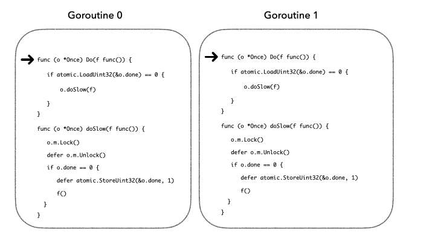

## 并发经典场景

Go 并发编程的场景中，有一个特别经典的场景，就是并发创建对象的时候。一般伪代码如下：

```go
if ( /* 如果对象不存在 */) {
    // 那么就创建对象 
}
```

因为是并发的环境，所以多个 goroutine 短时间内得出的判断都是一样的：**都判断得到对象是不存在的**，这时候大家的的行为也特别一致，每个 goroutine 磨刀霍霍就是创建。这时候如果不加以控制，那么会导致程序逻辑出问题。

会导致对象重复创建多次，并且可能不断的被替换和丢弃。

## 怎么解决？

#### 加锁互斥

最简单的方法：**加锁互斥**。保证判断和创建这两个动作是原子操作，这样就不存在并发误判的时间窗，那么就不会存在以上问题了。

```go
lock ...
{
    if ( /* 如果对象不存在 */) {
        // 那么就创建对象 
    }
}
unlock ...
```

加锁不可怕，锁冲突才可怕，如果每次都要抢一把锁，那性能就划不来了。

#### Once

在 Go 的并发库对此有另外一个实现：`sync.Once` 对象。这是一个非常小巧的实现，对象实现代码极其精简。这个库非常方便的实现 Go 的单实例设计模式。

我们换一个思路，我们不做判断，需要一个库能够提供只执行一次的语义，那么也能实现我们的目的。

没错，就是直接调用 `Once.Do` 执行创建对象，业务方甚至都不需要再做多余的判断的动作，如下：

```go
once.Do(/* 创建对象 */)
```

对，就是这么简单，上面的调用就能保证在并发的上下文中，保持正确性。那么 `sync.Once` 对外保证了什么语义呢？

**划重点：确保传入函数只被执行一次。**

这里注意思考一个点：只执行一次是针对库的还是针对实例的？

**划重点：只执行一次的语义是和具体的 once 变量绑定的。**

怎么理解？举个例子：

```go
var once1 sync.Once
var once2 sync.Once

once1.Do( f1 )
once2.Do( f2 )
```

`f1` 和 `f2` 各保证执行一次。

```go
var once1 sync.Once
var once2 sync.Once

once1.Do( f1 )
once2.Do( f2 )
```

## 单例模式

单例模式模式可以说是设计模式里最简单的了。Go 怎么实现只创建一个对象呢？

非常简单，就是借助 `sync.Once` 结构。举个完整的例子：

```go
// 全局变量（我们只希望创建一个）
var s *SomeObject
// 定义一个 once 变量
var once sync.Once
// 只希望创建一个，单例模式
func GetInstance() *SomeObject {
    once.Do(func(){
        // 创建一个对象，赋值指针给全局变量
        s = &SomeObject{}
    })
    return s
}
```

这样，我们就实现了单例模式，每次调用 `GetInstance` 函数返回的对象都只有一个。那么 `sync.Once`是怎么做到的呢？

## Once 的实现

以下就是 `Once` 实例的全部源码实现，非常的简短，也非常的有趣。

```go
package sync
import (
    "sync/atomic"
)
type Once struct {
    done uint32
    m    Mutex
}

func (o *Once) Do(f func()) {
    // 思考题：为什么这里不用 cas 来判断？
    if atomic.LoadUint32(&o.done) == 0 {
        o.doSlow(f)
    }
}

func (o *Once) doSlow(f func()) {
    o.m.Lock()
    defer o.m.Unlock()
    if o.done == 0 {
        // 思考题：为什么这里用 defer 来加计数？
        defer atomic.StoreUint32(&o.done, 1)
        f()
    }
}
```

以上的 `sync.Once` 实现非常简短，但是也有两个值得思考的地方。

1. 为什么 `Once.Do` 里面没有用 `cas` 判断？原子操作岂不是更快？
2. 为什么 `Once.doSlow` 里面用 `defer` 来加计数，而不是直接操作？

## 思考：为什么没有用 cas 原子判断？

什么是 `cas` ？

Go 里面有是 `atomic.CompareAndSwapUint32` 实现这 `cas` 的功能。`cas` 就是 Compare And Swap 的缩写，把判断和赋值包装成一个原子操作。我们看一下 cas 的伪代码实现：

```go
func cas(p : pointer to int, old : int, new : int) bool {
    // *p 不等于 old 的时候，返回 false
    if *p != old {
        return false
    }
    // *p 等于 old 的时候，赋值新值，并返回 true
    *p = new
    return true
}
```

上面的就是 `cas` 的伪代码实现，`cas` 保证上面的逻辑是原子操作。思考下，为什么 `Once` 不能用如下的实现：

```go
if atomic.CompareAndSwapUint32(&o.done, 0, 1) {
    f()
}
```

第一眼看过去，好像也能实现 `Once` 只执行一次语义？

这个代码看起来 `o.done == 0` 的时候，会赋值 `o.done==1`，然后执行 `f()`。其他并发请求的时候，`o.done == 1`，就不会再进到这个分支里，貌似也可以？

那为什么没用原子操作呢？`cas` 原子操作不是性能最好的吗？

细品下，虽然能保证只执行一次，却有个致命的缺陷：**无法在 `o.done==1` 的时候保证 `f()` 函数有执行完成**。Golang 的标准库也针对这些提到了这点。

> // Do guarantees that when it returns, f has finished. // This implementation would not implement that guarantee: // given two simultaneous calls, the winner of the cas would // call f, and the second would return immediately, without // waiting for the first's call to f to complete.

当 `o.done` 判断为 0 的时候，立即就设置成了 1 ，这个时候才走到 `f()` 函数里执行，这里的语义不再正确。

`Once` 不仅要保证只执行一次，还要保证当其他用户看到 `o.done==1` 导致 `Once.Do` 返回的时候，确保执行完成。

这个语义很重要吗？

**非常重要，这里涉及到逻辑的正确性**。举个栗子，我们用 `Once.Do` 来创建一个唯一的全局变量对象，如果是你回复了用户已经 `Once.Do` 成功，但是却 `f()` 还在执行过程，那么就会出现中间态，全局变量还没有创建出来，行为是无法定义的。

那么怎么解决？解决非常简单，两个思路：

1. 热路径：用原子读 `o.done` 的值，保证竞态条件正确；

2. 既然不能用 `cas` 原子操作，那就用锁机制来保证原子性。如果 `o.done == 0` ，那么就走慢路径，注意：**以下所有逻辑在一把大锁内**

3. 1. 先执行 `f()` 函数；
   2. 然后才去设置 `o.done` 为 1；

第一次可能在锁互斥的时候，可能会比较慢。因为要抢锁，但是只要执行过一次，就不会在走到锁内的逻辑了。都是走原子读的路径，也是非常快的。

既然提到锁，我们再来看一个死锁的例子。`Once` 内部用锁来保证代码的临界区，那么就千万不要嵌套使用，不然会死锁。如下：

```go
once1.Do( func(){
    once1.Do( func(){
        /* something */
    } )
} )
```

上面的代码会死锁在 `once1.m.Lock()` 的调用上。

**划重点：千万不要把 `sync.Once` 用的复杂，要保持简洁，嵌套很容易死锁。**

## 思考：为什么 doSlow 用 defer 来加计数，而不是 f() 之后直接操作？

`Once.doSlow` 整个是在锁内操作的，所以这段代码的操作是串行化的。如果 `o.done` 为 0，标识没有执行过 f，整个时候注册一个 `defer` 函数 `defer atomic.StoreUint32(&o.done, 1)` ，然后运行 f() 。

```go
func (o *Once) doSlow(f func()) {
    o.m.Lock()
    defer o.m.Unlock()
    if o.done == 0 {
        // 思考题：为什么这里用 defer 来加计数？
        defer atomic.StoreUint32(&o.done, 1)
        f()
    }
}
```

这里为什么要用 `defer` 来确保执行 `o.done` 赋值为 1 的操作呢？踏实把 `atomic.StoreUint32(&o.done, 1)` 放到 `f()` 之后不好吗？

不好！**因为处理不了 panic 的异常**。举个例子：

如果不用 `defer` ，当 `f()` 执行的时候出现 `panic` 的时候（被外层 recover，进程没挂），会导致没有 `o.done` 加计数，但其实 `f()` 已经执行过了，这就违反语义了。

之前我们说过，`defer` 注册的函数，就算 `f()` 内部执行出现 `panic` ，也会被执行，所以这里就保证了 Once 对外的语义：执行过一次，`o.done` 一定是非 0。

不过，我们继续思考 `panic` 场景，如果说 `f()` 因为某些原因，导致了 `panic`，可能并没有执行完，这种时候，也再不会执行 `Once.Do` 了，因为已经执行过一次了。业务自己承担这个责任，框架已经尽力了。

## Once 的语义

这里归纳出 Once 提供的语义：

1. `Once.Do` 保证只调用一次的语义，无论 `f()` 内部有没有执行完（ panic ）；
2. 只有 `f()` 执行完成，`Once.Do` 才会返回，否则阻塞等待 `f()` 的第一次执行完成；

抢锁简要演示：


最开始一轮并发的时候，需要抢锁，但是只有这一会儿，不会太久。

之后的常规操作，全都走原子读即可，非常快速：



## 总结

1. `Once` 对外提供 `f()` 只调用一次的语义;
2. `Once.Do` 返回之后，按照约定，`f()` 一定被执行过一次，并且只执行过一次。如果没有执行完，会阻塞等待 `f()` 的第一次执行完成；
3. `Once` 只执行一次的语义是跟实例绑定的关系，多个 `Once` 实例的话，每个实例都有一次的机会；
4. 内部用**锁机制**来保证逻辑的原子性，先执行 `f()` ，然后设置 `o.done` 标识位；
5. `Once` 用 `defer` 机制保证 `panic` 的场景，也能够保证 `o.done` 标识位被设置；
6. `Once` 实例千万注意，不要嵌套，内部有锁，乱用的话容易死锁；

