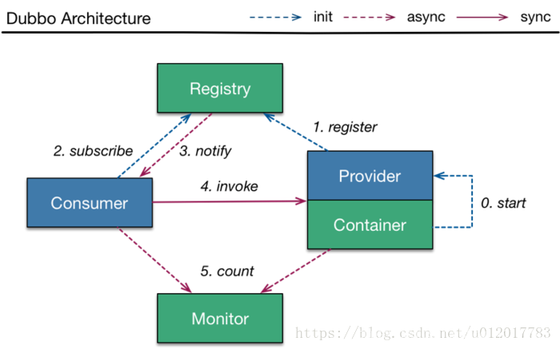
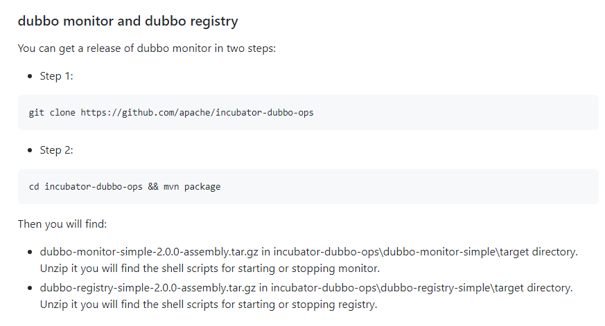
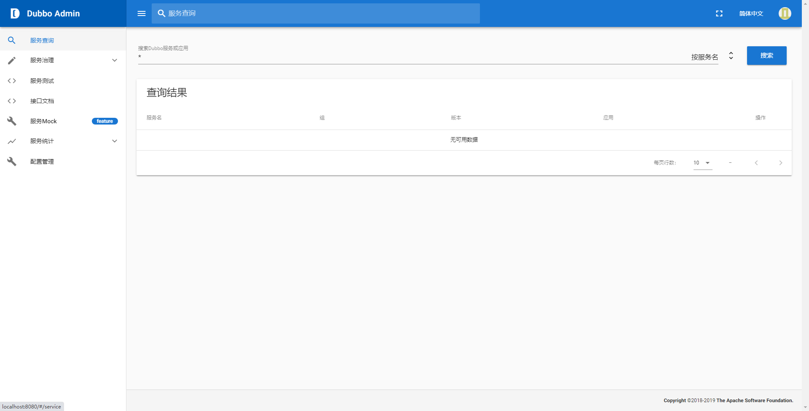

## Dubbo核心概念

Dubbo官网: https://dubbo.apache.org/zh/

Dubbo 是一款高性能、轻量级的开源Java RPC框架，它提供了三大核心能力：面向接口的远程方法调用，智能容错和负载均衡，服务自动注册和发现。分布式系统是将一个系统拆分为多个不同的服务。



该图来自Dubbo官网，描述了服务注册中心、服务提供方、服务消费方、服务监控中心之间的调用关系。

- 服务提供者（Provider）：暴露服务的服务提供方，服务提供者在启动时，向注册中心注册自己提供的服务。
- 服务消费者（Consumer）: 调用远程服务的服务消费方，服务消费者在启动时，向注册中心订阅自己所需的服务，服务消费者，从提供者地址列表中，基于软负载均衡算法，选一台提供者进行调用，如果调用失败，再选另一台调用。
- 注册中心（Registry）：注册中心返回服务提供者地址列表给消费者，如果有变更，注册中心将基于长连接推送变更数据给消费者。
- 监控中心（Monitor）：服务消费者和提供者，在内存中累计调用次数和调用时间，定时每分钟发送一次统计数据到监控中心。

## 搭建 ZooKeeper注册中心

可以参考这篇文章[Zookeeper入门](https://willje.github.io/posts/distributed/zookeeper%E5%85%A5%E9%97%A8/)

## 搭建Zookeeper监控中心

dubbo-admin下载地址 ：https://github.com/apache/dubbo-admin/tree/master



下载-解压-打包，然后运行即可；

找到``\incubator-dubbo-ops\dubbo-admin-server\target``目录下，运行

```shell
java -jar dubbo-admin-server-0.3.0-SNAPSHOT.jar
```

服务启动，账户密码：root；



## Dubbo环境搭建

### 父工程-learn_dubbo

引入依赖，值得关注的是引入springboot，dubbo-spring-boot-starter还有zookeeper。

```xml
    <parent>
        <groupId>org.springframework.boot</groupId>
        <artifactId>spring-boot-starter-parent</artifactId>
        <version>2.1.5.RELEASE</version>
        <relativePath/>
    </parent>

    <properties>
        <java.version>1.8</java.version>
        <zookeeper.version>3.4.14</zookeeper.version>
        <curator-framework.version>4.0.1</curator-framework.version>
    </properties>

    <dependencies>
        <dependency>
            <groupId>org.springframework.boot</groupId>
            <artifactId>spring-boot-starter</artifactId>
        </dependency>

        <dependency>
            <groupId>org.springframework.boot</groupId>
            <artifactId>spring-boot-starter-web</artifactId>
        </dependency>

        <dependency>
            <groupId>org.springframework.boot</groupId>
            <artifactId>spring-boot-starter-test</artifactId>
            <scope>test</scope>
        </dependency>

        <dependency>
            <groupId>com.alibaba.spring.boot</groupId>
            <artifactId>dubbo-spring-boot-starter</artifactId>
            <version>2.0.0</version>
        </dependency>

        <dependency>
            <groupId>org.apache.zookeeper</groupId>
            <artifactId>zookeeper</artifactId>
            <version>${zookeeper.version}</version>
        </dependency>

        <dependency>
            <groupId>com.101tec</groupId>
            <artifactId>zkclient</artifactId>
            <version>0.10</version>
        </dependency>

    </dependencies>
```

### dubbo-api

这是服务的API，服务的实现和消费都要依赖这个模块，以此实现生产和消费的解耦。

```java
public interface HelloService {
    String sayHello(String name);
}
```

### dubbo-provider

实现dubbo-api的接口，并注册到zookeeper中。

```java
@Service(version = "${demo.service.version}")
public class HelloServiceImpl implements HelloService {
    public String sayHello(String name) {
        return "Hello " + name + ",This is springboot-dubbo test";
    }
}
```

``@Service`` 使用dubbo家的service暴露出来,为别的工程远程调用。

暴露了服务还不够，还要开启dubbo服务，在启动类上加上注解 `@EnableDubbo`

```java
@SpringBootApplication
@EnableDubbo
public class DubboProviderApplication {

    public static void main(String[] args) {
        SpringApplication.run(DubboProviderApplication.class, args);
    }

}
```

配置文件

```yaml
spring:
  application:
    name: dubbo-provider
server:
  port: 9090

dubbo:
  application:
    name: demo-provider # 服务名
  registry:
    address: zookeeper://127.0.0.1:2181 # 注册中心地址
  protocol:
    name: dubbo # 指定通信协议
    port: 20880 # 通信端口  这里指的是与消费者间的通信协议与端口
  provider:
    timeout: 10000 # 配置全局调用服务超时时间，dubbo默认是1s，肯定不够用呀
    retries: 3 # 重试3次
    delay: -1
```

### dubbo-consumer

这就是个简单的spring-boot项目，还是要依赖dubbo-api.

```yaml
dubbo:
  application:
    name: dubbo-consumer # 消息者名字
  registry:
    address: zookeeper://127.0.0.1:2181 # 注册中心地址
spring:
  application:
    name: dubbo-consumer
server:
  port: 9091
```

通过api的形式测试dubbo-provider提供的服务

```java
@RestController
public class HelloConsumerController {
    @Reference(version = "${demo.service.version}")
    private HelloService helloService;

    @RequestMapping("/sayHello/{name}")
    public String sayHello(@PathVariable("name") String name) {
        return helloService.sayHello(name);
    }

}
```

注意这个``@Reference``的注解，服务消费者使用``@Reference``引用服务

## 测试

启动dubbo-provider及dubbo-consumer 工程
通过consumer消费者接口调用 http://127.0.0.1:9091/will 查看调用效果

> 完整代码：https://github.com/WillJE/learn_dubbo

## 参考

- [Spring-Boot集成Dubbo简单入门总结](https://tomoya92.github.io/2019/01/10/spring-boot-dubbo/)

