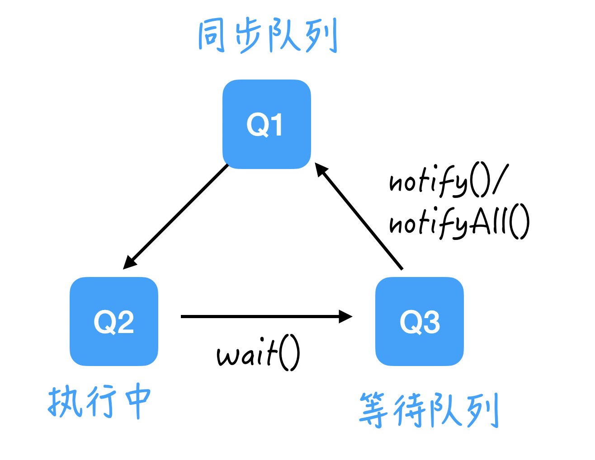

实现生产者消费者模型，可以使用阻塞队列，或者使用 `Object` 类里自带的 `wait()` 和 `notify()` 或者 `notifyAll()` 的消息通知机制。

## 实现

### wait()/notify()

接下来我们需要重点看下这个通知机制。

`wait()` 和 `notify()` 都是 Java 中的 `Object` 类自带的方法，可以用来实现线程间的通信。

在[上一节](https://mp.weixin.qq.com/s/FHyqxHcfzOtKvA1_PFtnXw)讲的 11 个 APIs 里我也提到了它，我们这里再展开讲一下。

`wait()` 方法是用来让当前线程等待，直到有别的线程调用 `notify()` 将它唤醒，或者我们可以设定一个时间让它自动苏醒。

调用该方法之前，线程必须要获得该对象的对象监视器锁，也就是只能用在加锁的方法下。

**而调用该方法之后，当前线程会释放锁。**（提示：这里很重要，也是下文代码中用 `while` 而非 `if` 的原因。）

`notify()` 方法只能通知一个线程，如果多个线程在等待，那就唤醒任意一个。

`notifyAll()` 方法是可以唤醒所有等待线程，然后加入同步队列。



这里我们用到了 2 个队列：

- 同步队列：对应于我们[上一节](https://mp.weixin.qq.com/s/FHyqxHcfzOtKvA1_PFtnXw)讲的线程状态中的 `Runnable`，也就是线程准备就绪，就等着抢资源了。
- 等待队列：对应于我们[上一节](https://mp.weixin.qq.com/s/FHyqxHcfzOtKvA1_PFtnXw)讲的线程状态中的 `Waiting`，也就是等待状态。

**这里需要注意，从等待状态线程无法直接进入 Q2，而是要先重新加入同步队列，再次等待拿锁，拿到了锁才能进去 Q2；一旦出了 Q2，锁就丢了。**

在 `Q2` 里，其实只有一个线程，因为这里我们必须要加锁才能进行操作。

```java
public class Product  {
    private String name;

    public Product(String name) {
        this.name = name;
    }

    public String getName() {
        return name;
    }

    public void setName(String name) {
        this.name = name;
    }
}
```

主函数里我设定了两类线程，并且这里选择用普通的 `ArrayDeque` 来实现 `Queue`，更简单的方式是直接用 Java 中的 `BlockingQueue` 来实现。

`BlockingQueue` 是阻塞队列，它有一系列的方法可以让线程实现自动阻塞，常用的 `BlockingQueue` 有很多，后面会单独出一篇文章来讲。

这里为了更好的理解并发协同的这个过程，我们先自己处理。

```java
public class Test {
    public static void main(String[] args) {
        Queue<Product> queue = new ArrayDeque<>();

        for (int i = 0; i < 100; i++) {
            new Thread(new Producer(queue, 100)).start();
            new Thread(new Consumer(queue, 100)).start();
        }
    }
}
```

```java
public class Producer implements Runnable{
    private Queue<Product> queue;
    private int maxCapacity;

    public Producer(Queue queue, int maxCapacity) {
        this.queue = queue;
        this.maxCapacity = maxCapacity;
    }

    @Override
    public void run() {
        synchronized (queue) {
            while (queue.size() == maxCapacity) { //一定要用 while，而不是 if，下文解释
                try {
                    System.out.println("生产者" + Thread.currentThread().getName() + "等待中... Queue 已达到最大容量，无法生产");
                    wait();
                    System.out.println("生产者" + Thread.currentThread().getName() + "退出等待");
                } catch (InterruptedException e) {
                    e.printStackTrace();
                }
            }
            if (queue.size() == 0) { //队列里的产品从无到有，需要通知在等待的消费者
                queue.notifyAll();
            }
            Random random = new Random();
            Integer i = random.nextInt();
            queue.offer(new Product("产品"  + i.toString()));
            System.out.println("生产者" + Thread.currentThread().getName() + "生产了产品：" + i.toString());
        }
    }
}
```

其实它的主逻辑很简单，我这里为了方便演示加了很多打印语句才显得有点复杂。

我们把主要逻辑拎出来看：

```java
 public void run() {
        synchronized (queue) {
            while (queue.size() == maxCapacity) { //一定要用 while，而不是 if，下文解释
                try {
                    wait();
                } catch (InterruptedException e) {
                    e.printStackTrace();
                }
            }
            if (queue.size() == 0) {
                queue.notifyAll();
            }
            queue.offer(new Product("产品"  + i.toString()));
        }
    }
}
```

### 为什么只能用 `while` 而不是 `if`

其实在这一小段，生产者线程经历了几个过程：

1. 如果队列已满，它就没法生产，那也不能占着位置不做事，所以要把锁让出来，去 `Q3 - 等待队列` 等着；
2. 在等待队列里被唤醒之后，不能直接夺过锁来，而是要先加入 `Q1 - 同步队列` 等待资源；
3. 一旦抢到资源，关门上锁，才能来到 `Q2` 继续执行 `wait()` 之后的活，但是，此时这个队列有可能又满了，所以退出 `wait()` 之后，还需要再次检查 `queue.size() == maxCapacity` 这个条件，所以要用 `while`。

**那么为什么可能又满了呢？**

因为线程没有一直拿着锁，**在被唤醒之后，到拿到锁之间的这段时间里**，有可能其他的生产者线程先拿到了锁进行了生产，所以队列又经历了一个从不满到满的过程。

总结：在使用线程的等待通知机制时，一般都要在 `while` 循环中调用 `wait()` 方法。

消费者线程是完全对称的，我们来看代码。

```java
public class Consumer implements Runnable{
    private Queue<Product> queue;
    private int maxCapacity;

    public Consumer(Queue queue, int maxCapacity) {
        this.queue = queue;
        this.maxCapacity = maxCapacity;
    }

    @Override
    public void run() {
        synchronized (queue) {
            while (queue.isEmpty()) {
                try {
                    System.out.println("消费者" + Thread.currentThread().getName() + "等待中... Queue 已缺货，无法消费");
                    wait();
                    System.out.println("消费者" + Thread.currentThread().getName() + "退出等待");
                } catch (InterruptedException e) {
                    e.printStackTrace();
                }
            }
            if (queue.size() == maxCapacity) {
                queue.notifyAll();
            }

            Product product = queue.poll();
            System.out.println("消费者" + Thread.currentThread().getName() + "消费了：" + product.getName());
        }
    }
}
```

## 参考

- [多线程必考的「生产者 - 消费者」模型](https://mp.weixin.qq.com/s?__biz=MzIzNDQ3MzgxMw==&mid=2247486208&idx=1&sn=f9fd1254209b8fb094bfa422a44767b5&chksm=e8f49b3adf83122c4c8eb84e730dc170bdbc04e2b6efc32b61fcf90c4cda4438f598dae3b33c&scene=178&cur_album_id=1499956111087616003#rd)

