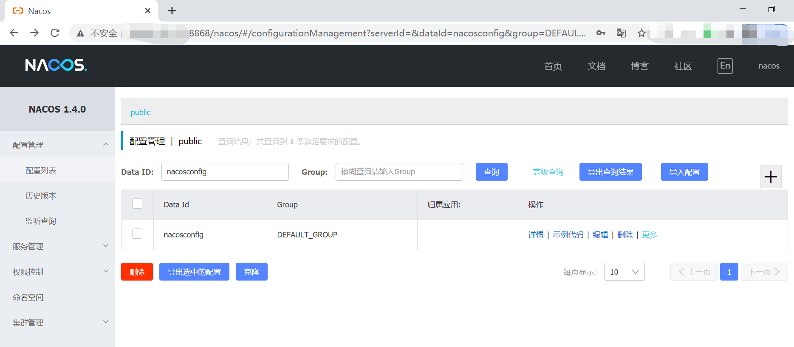
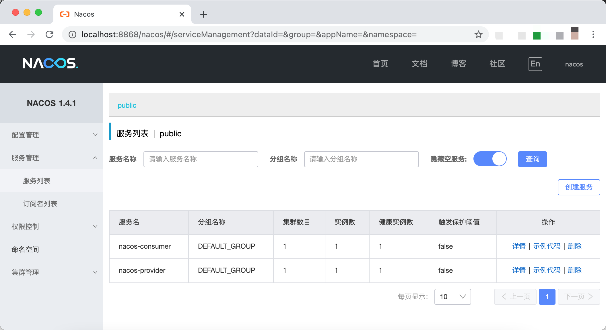

Nacos 是 Spring Cloud Alibaba 核心组件之一，可以用作 Spring Cloud 的注册中心和配置中心。

本文讲述如何在 Spring Cloud 中使用 Nacos 作为配置中心。

## 安装Nacos

与 Spring Cloud Config 和 Eureka 的使用方式不同，Nacos Server 需要独立部署。Nacos Server 的部署方式包括单机模式和集群模式，集群模式可以解决 Nacos 高可用的问题。

为简单起见，本文采用单机模式 Nacos Server 作为配置中心。单机模式搭建过程比较简单，可以通过下载源代码编译方式安装和二进制可执行文件安装。

具体安装步骤可以参考官方文档：

https://nacos.io/zh-cn/docs/quick-start.html

安装完成后，使用用户 `nacos` 和密码 `nacos` 访问 Nacos 控制台：



图中可以看到访问端口被改成了 8868，而不是 8848。Nacos Server 启动端口的修改也比较简单，修改其配置文件 `conf/application.propertie` 中端口配置 `server.port` 即可。

## 创建Spring Boot项目

利用 IntelliJ Idea 创建 Spring Boot项目，其中的父（`parent` ）项目 `springboot-nacos` 的 `pom.xml` 内容如下：

```xml
<?xml version="1.0" encoding="UTF-8"?>
<project xmlns="http://maven.apache.org/POM/4.0.0" xmlns:xsi="http://www.w3.org/2001/XMLSchema-instance"
         xsi:schemaLocation="http://maven.apache.org/POM/4.0.0 https://maven.apache.org/xsd/maven-4.0.0.xsd">
    <modelVersion>4.0.0</modelVersion>
    <groupId>com.example</groupId>
    <artifactId>springboot-nacos</artifactId>
    <packaging>pom</packaging>
    <version>1.0</version>
    <modules>
        <module>nacosprovider</module>
        <module>nacosconsumer</module>
        <module>nacosconfig</module>
    </modules>
    <dependencies>
        <dependency>
            <groupId>org.springframework.boot</groupId>
            <artifactId>spring-boot</artifactId>
        </dependency>
        <dependency>
            <groupId>org.springframework.boot</groupId>
            <artifactId>spring-boot-autoconfigure</artifactId>
        </dependency>
    </dependencies>

    <parent>
        <groupId>org.springframework.boot</groupId>
        <artifactId>spring-boot-starter-parent</artifactId>
        <version>2.3.7.RELEASE</version>
        <relativePath/> <!-- lookup parent from repository -->
    </parent>

    <properties>
        <project.build.sourceEncoding>UTF-8</project.build.sourceEncoding>
        <spring-cloud.version>Hoxton.SR9</spring-cloud.version>
        <java.version>1.8</java.version>
    </properties>

    <dependencyManagement>
        <dependencies>
            <dependency>
                <groupId>org.springframework.cloud</groupId>
                <artifactId>spring-cloud-dependencies</artifactId>
                <version>${spring-cloud.version}</version>
                <type>pom</type>
                <scope>import</scope>
            </dependency>

            <dependency>
                <groupId>com.alibaba.cloud</groupId>
                <artifactId>spring-cloud-alibaba-dependencies</artifactId>
                <version>2.2.3.RELEASE</version>
                <type>pom</type>
                <scope>import</scope>
            </dependency>
        </dependencies>
    </dependencyManagement>
</project>
```

上述内容主要三部分：

- `parent`：定义spring boot的版本
- `dependencyManagement`：spring cloud的版本以及spring cloud alibaba的版本，由于spring cloud alibaba还未纳入spring cloud的主版本管理中，所以需要自己加入
- `dependencies`：当前应用要使用的依赖内容。这里主要新加入了Nacos的服务注册与发现模块：`spring-cloud-starter-alibaba-nacos-discovery`。由于在`dependencyManagement`中已经引入了版本，所以这里就不用指定具体版本了。

**注意：**这里版本关系需要对应清楚，不然会踩很多坑。

更多版本对应关系参考：[版本说明 Wiki](https://github.com/spring-cloud-incubator/spring-cloud-alibaba/wiki/版本说明)

## 子项目-nacosconfig

父项目的 `pom.xml` 定义了 Spring Cloud 和 Spring Cloud Alibaba 依赖版本，这样，各子项目都使用同一版本下的子依赖版本。

接着创建一个名称为 `nacosconfig` 的 `module` 。`nacosconfig` 的 `pom.xml` 内容如下：

```xml
<?xml version="1.0" encoding="UTF-8"?>
<project xmlns="http://maven.apache.org/POM/4.0.0"
         xmlns:xsi="http://www.w3.org/2001/XMLSchema-instance"
         xsi:schemaLocation="http://maven.apache.org/POM/4.0.0 http://maven.apache.org/xsd/maven-4.0.0.xsd">
    <parent>
        <artifactId>springboot-nacos</artifactId>
        <groupId>com.example</groupId>
        <version>1.0</version>
    </parent>
    <modelVersion>4.0.0</modelVersion>

    <artifactId>nacosconfig</artifactId>

    <dependencies>
        <dependency>
            <groupId>com.alibaba.cloud</groupId>
            <artifactId>spring-cloud-starter-alibaba-nacos-config</artifactId>
        </dependency>
        <dependency>
            <groupId>org.springframework.boot</groupId>
            <artifactId>spring-boot-starter-web</artifactId>
        </dependency>
        <dependency>
            <groupId>org.springframework.boot</groupId>
            <artifactId>spring-boot-starter-test</artifactId>
            <scope>test</scope>
        </dependency>
    </dependencies>

    <build>
        <plugins>
            <plugin>
                <groupId>org.springframework.boot</groupId>
                <artifactId>spring-boot-maven-plugin</artifactId>
                <configuration>
                    <finalName>${project.name}</finalName>
                </configuration>
            </plugin>
        </plugins>
    </build>
</project>
```

`nacosconfig` 的 `pom.xml` 继承自 `springcloudstudy` 的 `pom.xml`。且引入依赖：

- `spring-cloud-starter-alibaba-nacos-config` ：作为 Nacos 客户端读取 Nacos 配置
- `spring-boot-starter-web`：对外提供 Web 接口

### 使用 Nacos 配置

在 `nacosconfig` 项目 `bootstrap.yml` 配置文件添加应用名称和 Nacos Server 地址：

```yaml
spring:
  application:
    name: nacosconfig
  cloud:
    nacos:
      config:
        server-addr: localhost:8848
        file-extension: yaml
```

之所以需要配置 `spring.application.name` 的名称，是因为它是构成 Nacos 配置 `Data Id` 的一部分。Nacos `Data Id` 完整格式如下:

```shell
${prefix}-${spring.profiles.active}.${file-extension}
```

- `prefix`：默认为 `spring.application.name` 的值
- `spring.profiles.active`：即当前环境对应的 profile，如果为空，则 `-${spring.profiles.active}` 为空
- `file-extension`：配置内容格式，支持 `properties` 和 `yaml` 格式

Nacos Server 有关配置：

- `server-addr`：Nacos Server 地址
- `file-extension`：Nacos Data Id 配置格式，此处配置为 `yaml` 格式

即，采用上述配置，`nacosconfig` 会从 Nacos Server 读取 Data Id 为 `nacosconfig.yaml` 的配置。

这里关于配置的更多使用可以参考：[Spring Cloud Alibaba基础教程：Nacos配置的加载规则详解](https://blog.didispace.com/spring-cloud-alibaba-nacos-config-1/)

**例子一**：如果我们不想通过服务名来加载，那么可以增加如下配置，就会加载到`Data ID=example.properties`，`Group=DEFAULT_GROUP`的配置内容了：

```shell
spring.cloud.nacos.config.prefix=example
```

**例子二**：如果我们想要加载yaml格式的内容，而不是Properties格式的内容，那么可以通过如下配置，实现加载`Data ID=example.yaml`，`Group=DEFAULT_GROUP`的配置内容了：

```shell
spring.cloud.nacos.config.prefix=example
spring.cloud.nacos.config.file-extension=yaml
```

**例子三**：如果我们对配置做了分组管理，那么可以通过如下配置，实现加载`Data ID=example.yaml`，`Group=DEV_GROUP`的配置内容了：

```shell
spring.cloud.nacos.config.prefix=example
spring.cloud.nacos.config.file-extension=yaml
spring.cloud.nacos.config.group=DEV_GROUP
```

### 从Nacos读取端口配置

在 Nacos 控制台添加一个新的配置，其中：

- Data Id：`nacosconfig`
- Group：`DEFAULT_GROUP`
- 配置格式：`YAML`

配置内容：

```yaml
server:
  port: 9080

user: will
```

启动 `nacosconfig` 项目，可以看到打印日志：

> 2021-06-06 11:00:28.146 INFO 25112 — [ main] o.s.b.w.embedded.tomcat.TomcatWebServer : Tomcat initialized with port(s): 9080 (http)

即说明 `nacosconfig` 项目监听端口从默认的 8080 改成了 9080。

### 从Nacos读取变量配置

```java
package will;

import org.springframework.beans.factory.annotation.Value;
import org.springframework.boot.SpringApplication;
import org.springframework.boot.autoconfigure.SpringBootApplication;
import org.springframework.cloud.context.config.annotation.RefreshScope;
import org.springframework.web.bind.annotation.GetMapping;
import org.springframework.web.bind.annotation.RestController;

@SpringBootApplication
public class NacosConfigApplication {
    public static void main(String[] args) {
        SpringApplication.run(NacosConfigApplication.class, args);
    }

    @RestController
    @RefreshScope
    static class TestController {

        @Value("${user}")
        private String user;

        @GetMapping("/test")
        public String hello() {
            return user;
        }
    }
}

```

通过rest接口，获取变量user的值，为实现配置自动更新，使用了注解 `@RefreshScope`。

访问 `http://localhost:9080/test`，返回：

> will

在 Nacos 控制台修改 `nacosconfig` 配置，将 `user` 值修改为 `will.change`，可以看到 `nacosconfig` 项目打印日志：

> 2021-06-07 15:44:37.651 INFO 25112 — [88.115.137_8868] c.a.n.client.config.impl.ClientWorker : [fixed-10.88.115.137_8868] [data-received] dataId=nacosconfig, group=DEFAULT_GROUP, tenant=null, md5=396057d762f85e3cfa28e2d2f450e722, content=server:
> port: 9080
> user: will.change, type=yaml

说明 `nacosconfig` 项目已接收到最新的 Nacos 配置。

访问 `http://localhost:9080/test`，返回：

> will.change

配置实现了动态更新。

## 子项目-nacosprovider

创建服务提供者 `nacosprovider` 作为子项目。

添加 `nacosprovider` 的依赖：

```xml
<dependency>
	<groupId>com.alibaba.cloud</groupId>
	<artifactId>spring-cloud-starter-alibaba-nacos-discovery</artifactId>
</dependency>
<dependency>
	<groupId>org.springframework.boot</groupId>
	<artifactId>spring-boot-starter-web</artifactId>
</dependency>
```

其中，依赖 `spring-cloud-starter-alibaba-nacos-discovery` 用于连接 Nacos Server 注册中心。

`bootstrap.yml` 配置 Nacos Server 地址，以及服务名称：

```yaml
server:
  port: 8060

spring:
  application:
    name: nacos-provider

  cloud:
    nacos:
      discovery:
        server-addr: localhost:8848
```

`spring.application.name` 用于配置服务名称，这个名称会在 Nacos 控制台服务列表上展示。

在 Spring Boot 启动主类添加 `@EnableDiscoveryClient` 注解，开启服务注册功能：

```java
@SpringBootApplication
@EnableDiscoveryClient
public class NacosproviderApplication {
    public static void main(String[] args) {
        SpringApplication.run(NacosproviderApplication.class, args);
    }
}
```

增加 controller 接口：

```java
@RestController
public class ProviderController {
    @RequestMapping(value = "/echo/{string}", method = RequestMethod.GET)
    public String echo(@PathVariable String string) {
        return "Hello Nacos Discovery " + string;
    }
}
```

## 子项目-nacosconsumer

添加服务消费者 `nacosconsumer` 的依赖：

```xml
<dependency>
	<groupId>com.alibaba.cloud</groupId>
	<artifactId>spring-cloud-starter-alibaba-nacos-discovery</artifactId>
</dependency>
<dependency>
	<groupId>org.springframework.boot</groupId>
	<artifactId>spring-boot-starter-web</artifactId>
</dependency>
<dependency>
	<groupId>org.springframework.cloud</groupId>
	<artifactId>spring-cloud-starter-openfeign</artifactId>
</dependency>
```

其中，依赖 `spring-cloud-starter-openfeign` 用于使用 feign 客户端调用服务接口。

`nacosconsumer` 的 `bootstrap.yml` 配置：

```yaml
server:
  port: 8070

spring:
  application:
    name: nacos-consumer

  cloud:
    nacos:
      discovery:
        server-addr: localhost:8848
```

其中，服务名称 `spring.application.name` 配置为 `nacos-consumer`。

### 调用服务提供者

在启动主类添加 `@EnableFeignClients` 注解启用 feign 客户端的使用，添加 `@EnableDiscoveryClient` 注解开启服务注册功能：

```java
@SpringBootApplication
@EnableDiscoveryClient
@EnableFeignClients
public class NacosconsumerApplication {
    public static void main(String[] args) {
        SpringApplication.run(NacosconsumerApplication.class, args);
    }
}
```

使用注解 `@FeignClient` 定义 feign 客户端，将远程服务 `http://nacos-provider/echo/` 映射为本地方法调用：

```java
@FeignClient("nacos-provider")
public interface ProviderClient {
    @RequestMapping(value = "/echo/{string}", method = RequestMethod.GET)
    String echo(@PathVariable String string);
}
```

Feign 客户端能将服务名称 `nacos-provider` 映射为 `nacosprovider` 的地址，这是由于 `nacosconsumer` 和 `nacosprovider` 都已经连接上了 Nacos Server 注册中心，`nacosconsumer` 可以从注册中心获取 `nacosprovider` 的 ip 和端口。

`nacosconsumer` 提供 controller 接口，以测试调用 `nacosprovider` 接口：

```java
@RestController
public class ConsumerController {
    @Autowired
    ProviderClient providerClient;

    @RequestMapping(value = "/echo/{str}", method = RequestMethod.GET)
    public String echo(@PathVariable String str) {
        return providerClient.echo(str);
    }
}
```

其中，通过 `@Autowired` 注解，使用上面定义的 feign 客户端。可以看到 ，通过 feign 客户端，调用远程服务接口就像调用本地方法一样。

启动` nacosconsumer` 和 `nacosprovider` 后，可以看到 Nacos 控制台服务列表显示出两个服务：



调用接口 `http://127.0.0.1:8070/echo/will.me`，返回：

> Hello Nacos Discovery will.me

## 附：源代码

完整的源代码请参考：

https://github.com/WillJE/spring_boot_nacos

## 参考资料

- [Nacos Spring Cloud 快速开始](https://nacos.io/zh-cn/docs/quick-start-spring-cloud.html)
- [Spring Cloud 使用 Nacos 作配置中心](https://leehao.me/Spring-Cloud-%E4%BD%BF%E7%94%A8-Nacos-%E4%BD%9C%E9%85%8D%E7%BD%AE%E4%B8%AD%E5%BF%83/)
-  [Nacos部署中的一些常见问题汇总](https://blog.didispace.com/nacos-faqs/)
- [Spring Cloud Alibaba基础教程：Sentinel使用Nacos存储规则](https://blog.didispace.com/spring-cloud-alibaba-sentinel-2-1/)
-  [Nacos配置中心原理](https://blog.didispace.com/nacos-yuanli-1/)
-  [Spring Cloud Alibaba基础教程：Nacos的集群部署](https://blog.didispace.com/spring-cloud-alibaba-5/)
- [Spring Cloud Alibaba基础教程：Nacos的数据持久化](https://blog.didispace.com/spring-cloud-alibaba-4/)
-  [Spring Cloud Alibaba基础教程：Nacos配置的多文件加载与共享配置](https://blog.didispace.com/spring-cloud-alibaba-nacos-config-3/)
- [Spring Cloud Alibaba基础教程：Nacos配置的多环境管理](https://blog.didispace.com/spring-cloud-alibaba-nacos-config-2/)
- [Nacos 集群部署模式最佳实践- 徐靖峰|个人博客](https://www.cnkirito.moe/nacos-cluster-mode/)

