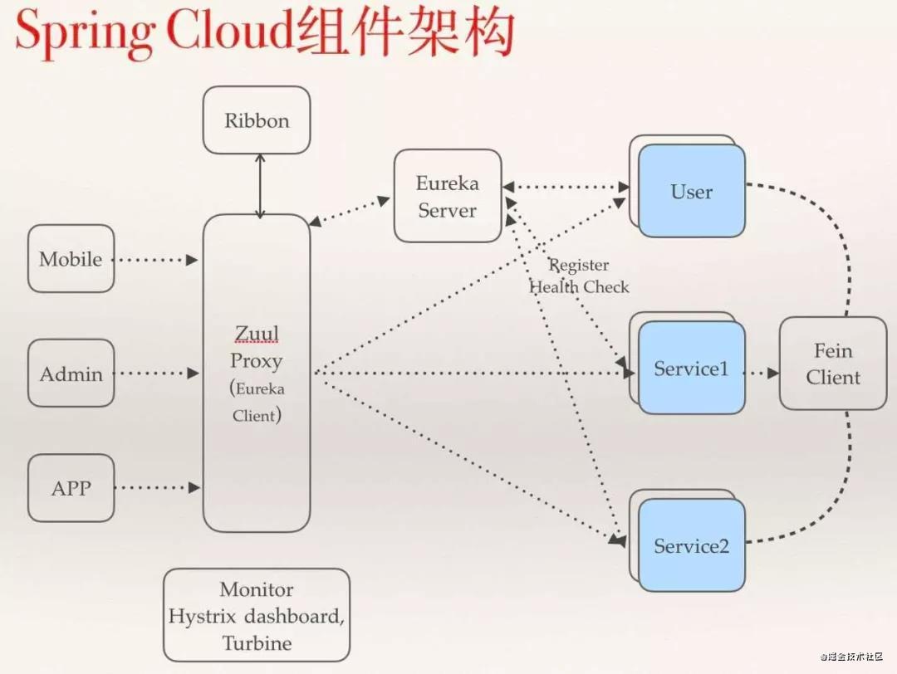
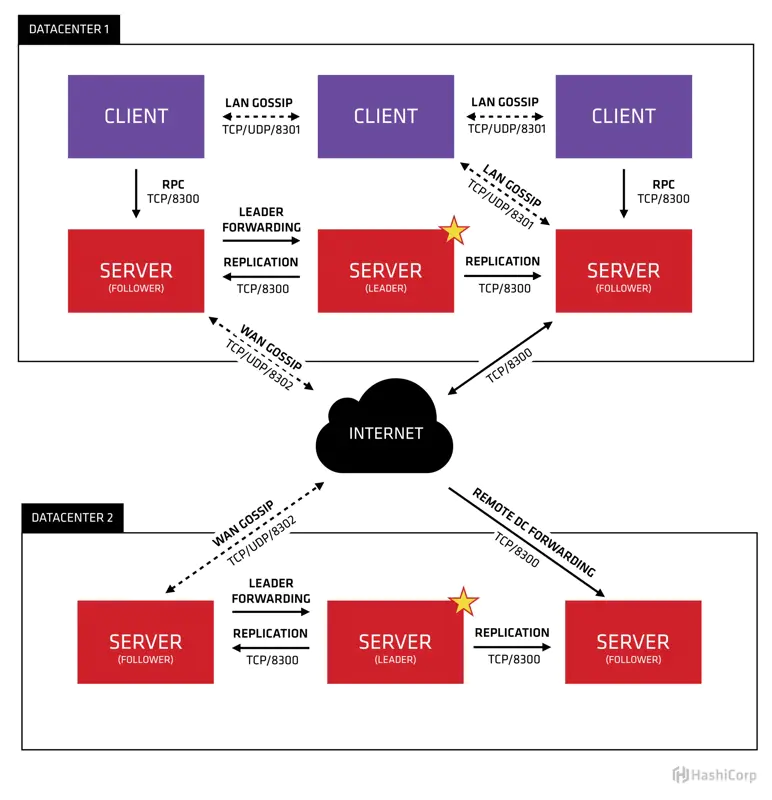
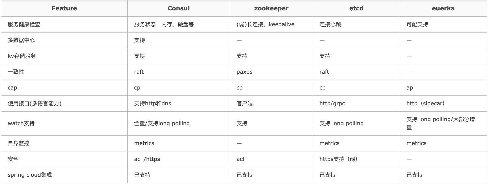

Spring Cloud是一系列框架的有序集合。它利用Spring Boot的开发便利性巧妙地简化了分布式系统基础设施的开发，如服务发现注册、配置中心、消息总线、负载均衡、断路器、数据监控等，都可以用Spring Boot的开发风格做到一键启动和部署。Spring Cloud并没有重复制造轮子，它只是将目前各家公司开发的比较成熟、经得起实际考验的服务框架组合起来，通过Spring Boot风格进行再封装屏蔽掉了复杂的配置和实现原理，最终给开发者留出了一套简单易懂、易部署和易维护的分布式系统开发工具包。

- **Spring 官网**：[spring.io](https://spring.io/)
- **Spring Cloud 官网**：[spring.io/projects/sp…](https://spring.io/projects/spring-cloud)
- **Spring Boot 官网**:[spring.io/projects/sp…](https://spring.io/projects/spring-boot/)

## 版本对应关系

可以通过Spring 官方对应版本地址：https://start.spring.io/actuator/info，找到springcloud和springboot版本对应关系：

**spring-cloud-dependencies** 版本列表可查看： 

[https://mvnrepository.com/artifact/org.springframework.cloud/spring-cloud-dependencies](https://mvnrepository.com/artifact/org.springframework.cloud/spring-cloud-dependencies)

**spring-boot-starter-parent** 版本列表可查看：

[https://mvnrepository.com/artifact/org.springframework.boot/spring-boot-starter-parent](https://mvnrepository.com/artifact/org.springframework.boot/spring-boot-starter-parent)

## 服务注册和发现

### consul

Consul 作为一种分布式服务工具，为了避免单点故障常常以集群的方式进行部署，在 Consul 集群的节点中分为 Server 和 Client 两种节点（所有的节点也被称为Agent），Server 节点保存数据，Client 节点负责健康检查及转发数据请求到 Server；Server 节点有一个 Leader 节点和多个 Follower 节点，Leader 节点会将数据同步到 Follower 节点，在 Leader 节点挂掉的时候会启动选举机制产生一个新的 Leader。

Client 节点很轻量且无状态，它以 RPC 的方式向 Server 节点做读写请求的转发，此外也可以直接向 Server 节点发送读写请求。下面是 Consul 的架构图：

[Consul学习：第一课- 简书](https://www.jianshu.com/p/aaf02d8c5081)

[Spring Cloud 学习笔记- Consul | 钢钢更新](https://wangfanggang.com/Java/consul/)

[官方文档](https://cloud.spring.io/spring-cloud-consul/reference/html/#spring-cloud-consul-install)

### eureka

服务中心，这可以说是微服务架构的核心功能了，微服务部署之后，一定要有服务注册和发现的能力，Eureka 就是担任这个角色的。如果你用过 dubbo 的话，那一定知道 dubbo 中服务注册和发现的功能是用 zookeeper 来实现的。

目前官方已停止升级，如果你的项目中还没有使用并且打算使用注册中心的话，可以直接使用 Spring Cloud Consul。

### zookeeper

### etcd

### 比较

[ZooKeeper、Eureka、Consul 、Nacos，微服务注册中心怎么选？](https://mp.weixin.qq.com/s/qUb3F42LO8dk2zja3prFyQ)

## Spring Cloud Consul

Consul 让服务注册和服务发现（通过 DNS 和 HTTP 接口）更加简单，甚至对于外部服务（例如SaaS）注册也一样。Spring Cloud Consul 可替代已有的 Spring Cloud Eureka。Eureka 2.x 版本也已经停止开发，并且 Spring Cloud 官方也建议用 Spring Cloud Consul 来替代，当然如果已经用了 Eureka 在项目中也没有关系，Eureka 已经足够稳定，正常使用没有任何问题。

Spring Cloud Consul 可替代已有的 Spring Cloud Config ，当做配置中心使用。

[服务注册发现、配置中心集一体的 Spring Cloud Consul](https://mp.weixin.qq.com/s?__biz=MzAxMjA0MDk2OA==&mid=2449469011&idx=1&sn=a6202e0f990ef4355b54879f1b598d62&chksm=8fbca034b8cb2922fd45001b4ac269c9a6df0c362c4dcce0fad0d4b2f0ecb21f6daa2d6ec9ef&scene=21#wechat_redirect)

[consul中文文档](https://kingfree.gitbook.io/consul/)

## Spring Cloud Stream

Spring Cloud Stream 是消息中间件组件，它集成了 kafka 和 rabbitmq 。如果你的系统中打算集成 kafka 或 rabbitmq，可以考虑使用 Stream 。

 

## Spring Cloud Bus

消息总线，用于在集群（例如，配置变化事件）中传播状态变化，可与Spring Cloud Config联合实现热部署。集成了 Rabbitmq 和 kafka 。刚刚上面说到的 Stream 好像也是这个功能。没错，我们可以认为 Bus 是 Stream 的进一步封装，使用更简单。而 Stream 的灵活性更高。

 

## Spring Cloud Feign

Feign是一种声明式、模板化的HTTP客户端。它可以用注解的方式简化 HTTP 请求，可以快速简单的请求服务提供接口。如果你还在使用 restTemplate 或者其他方式，不妨考虑一下 Feign。

 

## Spring Cloud Sleuth

服务日志收集和链路追踪模块，封装了 Dapper 和 log-based 追踪以及 Zipkin 和 HTrace 操作。与之功能相同的框架还有 skywalking、Pinpoint，另外国内还有美团开源的 CAT，只不过 CAT 属于代码侵入的，需要开发人员在系统中做代码埋点，不过也更加灵活，更加精细。

 

## Spring Cloud Security

可用做授权服务、单点登录等。如果服务需要做权限控制，那除非你自己实现。不然用到最多的就是 shiro 和 Spring Security 。Spring Boot 中用的比较多的就是 Security，众多授权机制中属于 OAuth2 最为流行。Spring Cloud Security 就是将 Security、OAuth2 做了集成，方便使用。

## 学习资源

- [微服务专栏-mrhelloworld](https://www.zhihu.com/column/c_1236328606852071424)

