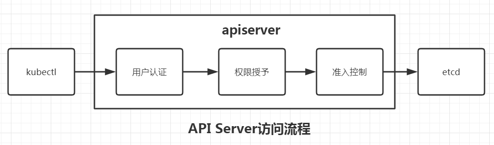
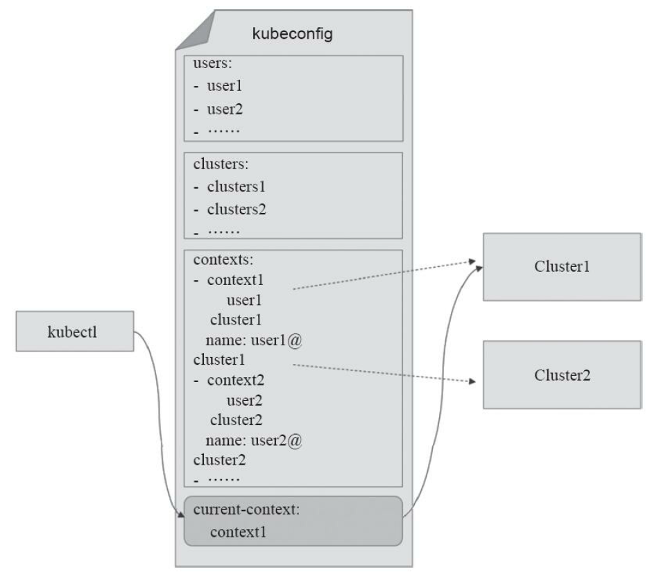

在k8s中，客户端对API Server访问的大体流程如下：



## 用户简介

在k8s中，用户具有如下基础属性：

- 用户名：标识用户的字符串
- UID：标识用户的数字
- 组：即用户组，包含若干个用户
- 额外字段：其他信息

看起来和Linux中的系统用户一模一样。。。不过基本上只需要关心用户名。

------

## 用户分类

在Kubernetes中，用户分为两类：

- 普通用户（normal user）：为Pod外的程序设计，比如说kubectl命令。
- service account：为Pod设计，方便Pod调用Kubernetes API。

这两类用户本质上并没有区别，只是service account的用户名类似于`system:serviceaccount:test:default`，表示在test命名空间的叫做default的用户。

## kubectl的认证方式

kubectl命令支持如上所有认证方式，其通过kubeconfig配置文件来存储和apiserver的通信方式以及认证所需要的数据，该文件往往存储于`~/.kube/config`中。

kubeconfig文件结构：



如图，该文件主要包含了如下几项：

- clusters: 集群列表，包含访问API Server的URL和所属集群的名称等。
- users：用户列表，包含访问API Server时的用户名和认证信息。
- contexts：kubelet的可用上下文列表，由用户列表中的某特定用户名称和集群列表中的某特定集群名称组合而成。
- current-context：kubelet当前使用的上下文名称，即上下文列表中的某个特定项。

kubeconfig文件示例：

```yaml
apiVersion: v1
clusters:
- cluster:
    certificate-authority-data: 集群CA证书的base64值
    server: https://169.254.128.15:60002
  name: kubernetes
contexts:
- context:
    cluster: kubernetes
    namespace: test
    user: test
  name: kubernetes
current-context: kubernetes
kind: Config
preferences: {}
users:
- name: test
  user:
    token: token值
```

该文件定义了名为kubernetes的cluster，名为test的user，名为kubernetes的context将cluster和user组合起来，最后当前使用的是名为kubernetes的context。

除了token外，还可以添加`client-certificate-data`和`client-key-data`字段表示使用客户端证书认证方式；添加`username`和`password`字段表示使用HTTP基本身份认证。

此外，kubectl提供了config子命令执行对kubeconfig相关的操作，比如`kubectl config view`查看当前使用的kubeconfig。

看一个config的样例

```yaml
apiVersion: v1
clusters:
- cluster:
    certificate-authority-data: LS0tLS1CRUdJTiBDRVJUSUZJQ0FURS0tLS0tCk1JSUR1RENDQXFDZ0F3SUJBZ0lVVjdwcTdqNi9RT3NuMzd2c0ZtdTl5aWhOclI0d0RRWUpLb1pJaHZjTkFRRUwKQlFBd1lURUxNQWtHQTFVRUJoTUNRMDR4RVRBUEJnTlZCQWdUQ0VoaGJtZGFhRzkxTVFzd0NRWURWUVFIRXdKWQpVekVNTUFvR0ExVUVDaE1EYXpoek1ROHdEUVlEVlFRTEV3WlRlWE4wWlcweEV6QVJCZ05WQkFNVENtdDFZbVZ5CmJtVjBaWE13SUJjTk1qRXdOREk0TURFek9UQXdXaGdQTWpFeU1UQTBNRFF3TVRNNU1EQmFNR0V4Q3pBSkJnTlYKQkFZVEFrTk9NUkV3RHdZRFZRUUlFd2hJWVc1bldtaHZkVEVMTUFrR0ExVUVCeE1DV0ZNeEREQUtCZ05WQkFvVApBMnM0Y3pFUE1BMEdBMVVFQ3hNR1UzbHpkR1Z0TVJNd0VRWURWUVFERXdwcmRXSmxjbTVsZEdWek1JSUJJakFOCkJna3Foa2lHOXcwQkFRRUZBQU9DQVE4QU1JSUJDZ0tDQVFFQTNiKzdmVzVvZllxYW9ETkdrRG1UaXB6ejVqZU8KcnRmbnp1bWs1RHZ2QzUxRnZvcTJWd1k1Rlc2azh0QWxMblRHMWpTUmlGSEtSRW9mODdMMzFkVFROSnNUeG1BdgphTmN2NHpnaCtvdXFQdVRsZmRFUHNlL2dvOGNVb2hnSkxURXJrM2grNktNMUMxSEpsRXlzbnRBYXFWNTdVNyttCnRSTDRYZjJIOVlvaS9mTWNVOTVBM0lzNVpQYzRiUU02Q29kQTlqaFcyS0pycEdjT3c2T3E2bjJOcXI0NWdFakYKOTJmd2k4SXFENlpWQUQ5QzdqYVlBdEtnZlVESm5XS2h2QmVSZHlXaWdyWWpFNEQ5cktNQzZaRlpWV3dUazkwYQpvb0ZvZ0liU3BLcjJHeE9lWGdseGtzdnZuZXVoTFh3QmxpVU44SmxUYmdRNUhuazhFMVdCcTZKTTl3SURBUUFCCm8yWXdaREFPQmdOVkhROEJBZjhFQkFNQ0FRWXdFZ1lEVlIwVEFRSC9CQWd3QmdFQi93SUJBakFkQmdOVkhRNEUKRmdRVVNMdERZUmdIMDVZU0tNUytWMjlxUjF1R0V0SXdId1lEVlIwakJCZ3dGb0FVU0x0RFlSZ0gwNVlTS01TKwpWMjlxUjF1R0V0SXdEUVlKS29aSWh2Y05BUUVMQlFBRGdnRUJBTHZhbngwZlJCVUlnNXdtQWwzcG83S3IxRTJGCi9xeXgvZjN6R1VabFhKajJIUmVjT1lWY3VTWFpXb1RBd0xsVkprQnhuNVRRT1JUajR6OGhVTHR2OVBUaUcxNEEKb0hYRWozSEp1NDlTOUFlcnpCRDVNQW9lS21KTm5IUndsWjUrS2JMT29MK3RRSWpKVllQcnJTVk0vL1djaEVXTgpFZ2NNR1hER2czYWFZYUVFUkk3enpwR1NXbFJMcnRvWVErVkYyUGErNlcwdmd6ckdLRXJWQUVZTnFnSXNXRzNICmVpZ3BGOHlzQkJFMGM2dEk3d2QwSmx3bHdaWnZ6QVg4WHpPMGs2RTkzYkxiKzJHNjJKODAxS092R2JRQk5nVUoKa2d5anNSN2YxTXYxaDkydWJzQ3kvQW9vZGI2SzR6dW9aVy8vakI3Q3hKODJQamtDM3BRQkU3SG1VTG89Ci0tLS0tRU5EIENFUlRJRklDQVRFLS0tLS0K
    server: https://172.18.100.109:6443
  name: cluster1
contexts:
- context:
    cluster: cluster1
    user: admin
  name: context-cluster1
current-context: context-cluster1
kind: Config
preferences: {}
users:
- name: admin
  user:
    client-certificate-data: LS0tLS1CRUdJTiBDRVJUSUZJQ0FURS0tLS0tCk1JSUQxekNDQXIrZ0F3SUJBZ0lVZjJRb3oxL1d3WmRzdm5ORXRrQkx0S0w0TlNNd0RRWUpLb1pJaHZjTkFRRUwKQlFBd1lURUxNQWtHQTFVRUJoTUNRMDR4RVRBUEJnTlZCQWdUQ0VoaGJtZGFhRzkxTVFzd0NRWURWUVFIRXdKWQpVekVNTUFvR0ExVUVDaE1EYXpoek1ROHdEUVlEVlFRTEV3WlRlWE4wWlcweEV6QVJCZ05WQkFNVENtdDFZbVZ5CmJtVjBaWE13SUJjTk1qRXdOREk0TURFek9UQXdXaGdQTWpBM01UQTBNVFl3TVRNNU1EQmFNR2N4Q3pBSkJnTlYKQkFZVEFrTk9NUkV3RHdZRFZRUUlFd2hJWVc1bldtaHZkVEVMTUFrR0ExVUVCeE1DV0ZNeEZ6QVZCZ05WQkFvVApEbk41YzNSbGJUcHRZWE4wWlhKek1ROHdEUVlEVlFRTEV3WlRlWE4wWlcweERqQU1CZ05WQkFNVEJXRmtiV2x1Ck1JSUJJakFOQmdrcWhraUc5dzBCQVFFRkFBT0NBUThBTUlJQkNnS0NBUUVBbTJIVlVXdFdFZHJFS0t0UE1WSEgKQVVLY056RVVDdG4ydGtXSlYwWDlvVllLVHhub2tTbWw0bGVzVURWMjNwWEVOSnhGVDd5cnRMa1QyN05pNXhTSApqLzAwcHVzcUxKeGlvN0ZiNVN1SERQRVJqNG9nbWlLLzZtQ1JTNmZZL0twVG1tM3JqZmF0aGFwV1d3RmVXeCtpClRDTmlpOVBpNi9aVFBkZDA3OW1haDAzQ2hlRzJWU3o2dWdGM3VMU0NvMWV6U25zWDNZRVZjSHRWOXZJVjRNMnMKWEZpOUdFYXJrK3o2YjViTGl2dnlaNDZQS0QwVkpkbFpQUjJJSFZRMG90TGw4ZzNiR2UwQVhkZWE1Y0k2TzBXOApIN3dwL1dLRE9weVpoSCtYRHVrdmx4TUhPbSs1d2RiU25reUM1dlZZazl5YU9vNnF2SlVBVk9RdGtQbUJrMStvCmh3SURBUUFCbzM4d2ZUQU9CZ05WSFE4QkFmOEVCQU1DQmFBd0hRWURWUjBsQkJZd0ZBWUlLd1lCQlFVSEF3RUcKQ0NzR0FRVUZCd01DTUF3R0ExVWRFd0VCL3dRQ01BQXdIUVlEVlIwT0JCWUVGUFRydTEwRG5xcE43MUFVci9iVQp6WnQvZUhvck1COEdBMVVkSXdRWU1CYUFGRWk3UTJFWUI5T1dFaWpFdmxkdmFrZGJoaExTTUEwR0NTcUdTSWIzCkRRRUJDd1VBQTRJQkFRQU9MbFg1TnRqSGR0UEZTV00zWit5NW5qdnRqaFlZN201Rm83cTlYcDRmMmN5TjVoYVEKTC9sVW5CY1QvMkY0Z2xPdjliY2d4UkJja0tJRjk0ajBuOTByT2JNK0lQaFV4aEtUdmMvZzZhQ0duMThETm54Kwp0SG5hMTJFRUxGNzNkaVM1Mk5LS3NSbjZMbzI1MTgvUGxHQXczOWN4aTZUU0E5TWtQZk11WWsvZHg4Q0g3UzhaClhRRkd1NDJkaGRnSngrY1FCdnk4U1pDSWxmbUFnaGNIWHZ1SndxVVUxZDlJQ1R3NlZKM05GY3N4WU1RbkUzUmQKYldCZ0FYb1ZuT1ZCZTJQWXFZQ3cwT2oxYVlYSkw1dWxpRXdaampWalNEbjhndHFmQk5xV3p2Rkg5SjBjdVQzdwpCWDZZMnpnVUtoWEwrRkdOVG1kRm12QkhKY3BXRnhCQmxBdWgKLS0tLS1FTkQgQ0VSVElGSUNBVEUtLS0tLQo=
    client-key-data: LS0tLS1CRUdJTiBSU0EgUFJJVkFURSBLRVktLS0tLQpNSUlFcFFJQkFBS0NBUUVBbTJIVlVXdFdFZHJFS0t0UE1WSEhBVUtjTnpFVUN0bjJ0a1dKVjBYOW9WWUtUeG5vCmtTbWw0bGVzVURWMjNwWEVOSnhGVDd5cnRMa1QyN05pNXhTSGovMDBwdXNxTEp4aW83RmI1U3VIRFBFUmo0b2cKbWlLLzZtQ1JTNmZZL0twVG1tM3JqZmF0aGFwV1d3RmVXeCtpVENOaWk5UGk2L1pUUGRkMDc5bWFoMDNDaGVHMgpWU3o2dWdGM3VMU0NvMWV6U25zWDNZRVZjSHRWOXZJVjRNMnNYRmk5R0VhcmsrejZiNWJMaXZ2eVo0NlBLRDBWCkpkbFpQUjJJSFZRMG90TGw4ZzNiR2UwQVhkZWE1Y0k2TzBXOEg3d3AvV0tET3B5WmhIK1hEdWt2bHhNSE9tKzUKd2RiU25reUM1dlZZazl5YU9vNnF2SlVBVk9RdGtQbUJrMStvaHdJREFRQUJBb0lCQUFjV0xqRjVjTUo5dE1hYQpFWkdSUmo5RGQzWjQ4WTRSSk5ScFZYczZnUGZUd2NLYnp1U1gvcTNWQzlIWXJtUTJkbTFqMXpGc3pIUUFvT3c3ClFUNkN6Qy8vLzEvQmgvbmk1QWpOTlFDOXZIb1ZvSlJvVzFaTVVXNXlHdzVWU0dzMXBYeDhtT3F2bm5oakxXOFgKSCtPT0RNdm1MVDl0V1lNamgrWmhKajh1TUlNTk1hbWdINmdxMlhrMlk2ak8wM2g3NFpOSDA2MlFHRmxmZ1NYdwpHTDB0MzVDMjJrbG5zT0pOL3N2ekVEYzNwS09NOUdodnFadVBxSW5PQjBYaHR0THozclZ6cFpPSUpGaC9JU1d1CkdpbUJBVWU2cG13aC9kdHJsQ2ttV1MwZmVtV0tNQk1Eb0QrOENUOVkzdlp6L0xxd3MwQkZDczJ0UDlRckJmcU4KVjRRaGtJRUNnWUVBeG1kbGVSODczSU95ZktTYllIWXhwRUk1MGJDWStDSjk5UWhtTmxMdndHNkZFaW9YZ05QdwprYWNuVUZJTVQwdGxkd0k3VzFBdktYY3B6SjdNMTFFcHk3VGpZNC9TL3FjdVdSanIzbHZYK3hscDQ2YkdrOXgrCmtCMEI4blVqMEFTeHFNemhFVGV2Y1ZqSE8zL2g3QiszbEpYQnBFTHl6ZWYwa1BVMCt6UzhQY0VDZ1lFQXlIMDYKeDhOalVSVFZCNmJiTDhTTENDcW1tVGhSTmhvdmhmcXY5VjdoTXJXRlRONFZub3VxYjZPMGFjL2IzV3RWWUtpRwovVTQ3eDFSVnlyOUhmeTJoRktUd3B3NzIvTWJrdWhDNy9qVlJtREdVUzhDdzFYZUVhOVlhaFdKNDdtNForTlUzClhIUTBKSm16ckZwbmc0VTh3RnVNR1N1YXM4MlBFeGhiYmdGY2lFY0NnWUVBa0VNOGFHN0treFA3bzEvNVRwR0MKbFFKR2ttOExPMW14Sm90ZDd1QXRUa25PWHAvV2lTa1NRb1k5TXMwR0FGNDlQK1NTamxubWdRc1JqS1JuSTZUegpkQmhxUXNtZ1RPUDQ4bllKZzV4YWxrMHJUb25FMkZ5NmRrVnhWZi9RODMrR1FzditWd3ViZVJwcGU1MElCQzRuCnlWVi9BTlpoUUZFSjVxRTFUZmRSYk1FQ2dZRUFoQzhVdHlwYWE5WHBVbDh2ZWtJQ1RJTWFUa0QwUWxCbmJ0VkcKZCtkellLU1BXNHU5QTBnZ09mVGIrVHVEUVd3SDRXK2JlSnpCQ3YzT2hwc3dmMmhOSUxoU3RrSkdrNGhxdTBaWApQQlpaVXBlMXAzQkc1cWNqRnBvVjZFVnhaL29OZzZMSUdsdS9HVGFCWUt4R1BVOTJLM2p3V0pRSUxtM2oyL29lCkpkd2Q3dmNDZ1lFQXMxNE9OdzRUUkV1NW5lNzlzTXNpMWNBQWZDMzNoNGVGcnFwN2VlTndheHlDM0VWNThibkEKbm9PZ0p1elo4cUZ6ZlBscG05VHBiUFI4YTArQkl6czZqRXFtb0FmaU13V3ZxTitBelVSbkZaanNYdm5BSDN5TgpIdnlMeTc3c245UDN4SGcrakFJZDIzU3N5dlJMb0ZrbExUQ1Q4WTlXa1RCTElVSWNJY0xCd2cwPQotLS0tLUVORCBSU0EgUFJJVkFURSBLRVktLS0tLQo=

```

## 参考文档

Kubernetes 中的用户与身份认证授权：https://jimmysong.io/kubernetes-handbook/guide/authentication.html

