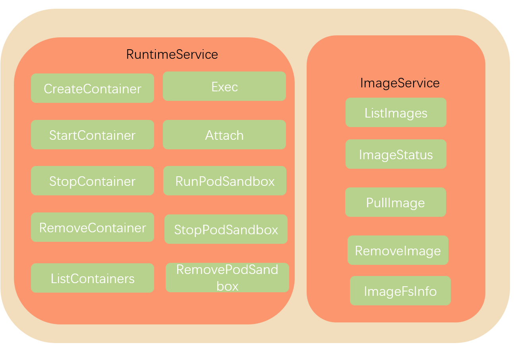

## kubelet 主要功能

在kubernetes集群中，每个Node节点都会启动kubelet进程，用来处理Master节点下发到本节点的任务，管理Pod和其中的容器。

### pod 管理

Kubelet 以 PodSpec 的方式工作。PodSpec 是描述一个 Pod 的 YAML 或 JSON 对象。 kubelet 采用一组通过各种机制提供的 PodSpecs（主要通过 apiserver），并确保这些 PodSpecs 中描述的 Pod 正常健康运行。

官方提供了4中方式来获取容器信息：

- apiserver：通过 API Server 监听 etcd 目录获取数据；
- File：启动参数 --config 指定的配置目录下的文件；
- 通过 url 从网络上某个地址来获取信息

拿apiserver来说，如果Kubelet 监听到etcd中有新的绑定到本节点的 Pod，则按照 Pod 清单的要求创建该 Pod；如果发现本地的 Pod 被修改，则 Kubelet 会做出相应的修改。

### 容器健康检查

容器健康检查这个我们在前面已经聊过，主要是通过LivenessProbe 与ReadinessProbe来判断容器是否健康。

- LivenessProbe ：用于判断容器是否健康，告诉 Kubelet 一个容器什么时候处于不健康的状态。如果 LivenessProbe 探针探测到容器不健康，则 Kubelet 将删除该容器，并根据容器的重启策略做相应的处理。如果一个容器不包含 LivenessProbe 探针，那么 Kubelet 认为该容器的 LivenessProbe 探针返回的值永远是 “Success”；
- ReadinessProbe：用于判断容器是否启动完成且准备接收请求。如果 ReadinessProbe 探针探测到失败，则 Pod 的状态将被修改。Endpoint Controller 将从 Service 的 Endpoint 中删除包含该容器所在 Pod 的 IP 地址的 Endpoint 条目。

### 容器监控

Kubelet 通过 cAdvisor 获取其所在节点及容器的数据。cAdvisor 是一个开源的分析容器资源使用率和性能特性的代理工具，集成到 Kubelet中，当Kubelet启动时会同时启动cAdvisor，且一个cAdvisor只监控一个Node节点的信息。cAdvisor 自动查找所有在其所在节点上的容器，自动采集 CPU、内存、文件系统和网络使用的统计信息。cAdvisor 通过它所在节点机的 Root 容器，采集并分析该节点机的全面使用情况。

### kubelet 工作原理

这里借用网上的一张图来说明情况：

由图我们可以看到kubelet 的工作核心，就是一个控制循环，即：SyncLoop。驱动整个控制循环的事件有：pod更新事件、pod生命周期变化、kubelet本身设置的执行周期、定时清理事件等。

在SyncLoop循环上还有很多xxManager，例如probeManager 会定时去监控 pod 中容器的健康状况，当前支持两种类型的探针：livenessProbe 和readinessProbe；statusManager 负责维护状态信息，并把 pod 状态更新到 apiserver；containerRefManager 容器引用的管理，相对简单的Manager，用来报告容器的创建，失败等事件等等。

kubelet 调用下层容器运行时的执行过程，并不会直接调用 Docker 的 API，而是通过一组叫作 CRI（Container Runtime Interface，容器运行时接口）的 gRPC 接口来间接执行的。

CRI是k8s对容器的操作抽离出的一系列的接口，kubelet 就只需要跟这个接口打交道，而不需要关注底层的容器时docker还是rkt，底层的容器只需要自己提供一个该接口的实现，然后对 kubelet 暴露出 gRPC 服务即可。有关CRI的可以内容可以看看这篇：[Introducing Container Runtime Interface](https://kubernetes.io/blog/2016/12/container-runtime-interface-cri-in-kubernetes/)。

一般来说CRI接口可以分为两组：

一组是ImageService，主要是容器镜像相关的操作，比如拉取镜像、删除镜像等。

另一组是RuntimeService，主要是跟容器相关的操作，比如创建、启动、删除Container、Exec等。

如下图（没有列全）：

## 参考

[深入k8s：kubelet工作原理及其初始化源码分析](https://www.cnblogs.com/luozhiyun/p/13699435.html)