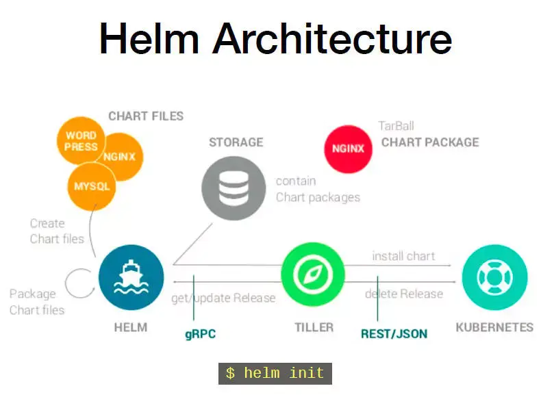
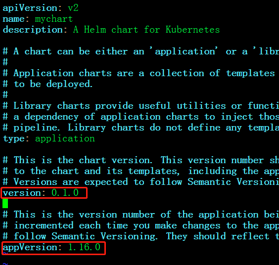
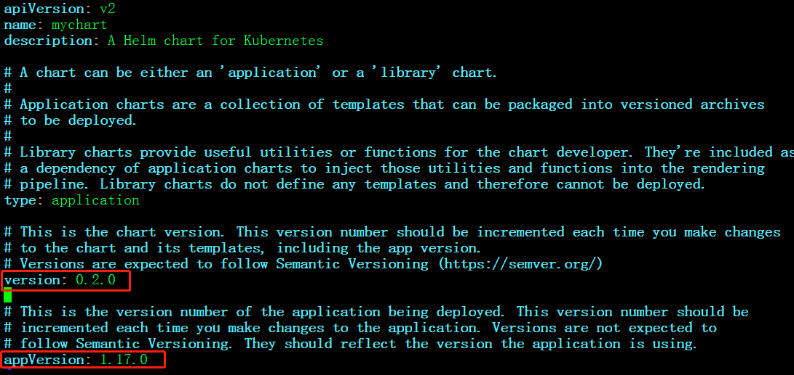
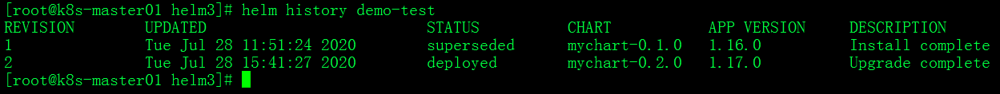
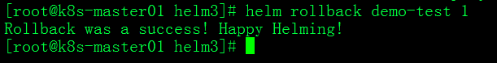

# helm介绍

## chart

Helm 的软件包，采用 TAR 格式。类似于 APT 的 DEB 包或者 YUM 的 RPM 包，其包含了一组定义 Kubernetes 资源相关的 YAML 文件。

## Repoistory

Helm 的软件仓库，Repository 本质上是一个 Web 服务器，该服务器保存了一系列的 Chart 软件包以供用户下载，并且提供了一个该 Repository 的 Chart 包的清单文件以供查询。Helm 可以同时管理多个不同的 Repository。

## Release

使用 helm install 命令在 Kubernetes 集群中部署的 Chart 称为 Release，这里的 Release 可以理解为 Helm 使用 Chart 包部署的一个应用实例。

## Tiller

Tiller 是 Helm 的服务端，部署在 Kubernetes 集群中。Tiller 用于接收 Helm 的请求，并根据 Chart 生成 Kubernetes 的部署文件（ Helm 称为 Release ），然后提交给 Kubernetes 创建应用。Tiller 还提供了 Release 的升级、删除、回滚等一系列功能。



# chart开发

[helm实战之开发Chart - 云+社区- 腾讯云](https://cloud.tencent.com/developer/article/1627270)

[helm3使用入门- —八戒— - 博客园](https://www.cnblogs.com/qiyebao/p/13389621.html)

[官网的例子](https://helm.sh/zh/docs/topics/charts/)

创建一个mychart的chart

```sh
$ helm create mychart   #创建一个helm项目
```

修改values.yaml下的信息。

完成后，检查依赖和模板是否正确

```sh
$ helm lint mychart/     #检查依赖和模版配置是否正确
==> Linting mychart/
[INFO] Chart.yaml: icon is recommended

1 chart(s) linted, 0 chart(s) failed
```

将应用打包

```sh
$ helm package mychart
Successfully packaged chart and saved it to: /root/mychart-0.1.0.tgz
```

## chart安装部署

```sh
# 在部署前使用 --dry-run 参数验证 Chart 的配置，并不执行安装
$ helm install demo-test  --dry-run --debug myrepo/mychart
```

```sh
# 方式一
$ helm install demo-test ./mychart

# 可根据不同的配置来install，默认是values.yaml
$ helm install demo-test ./mychart -f ./mychart/values-prod.yaml

# 方式二
$ helm install demo-test ./mychart-0.1.0.tgz
```

完成后查看

```sh
$ helm list
```

删除release

```sh
helm uninstall demo-test
```

## char上传到repo

将应用发布到Repository，这个仓库可以是harbor仓库，先看下helm关联的仓库

```sh
$ helm repo list
```

如果需要增加仓库

```sh
$ helm repo add reponame repourl
```

再执行更新

```sh
$ helm repo update	
```

此时再查看仓库列表``helm repo list``就能看到添加的仓库了。

推送到harbo之前需要关心一下认证的问题，具体看[官网chart repo](https://helm.sh/zh/docs/topics/chart_repository/)

```sh
$ helm push mychart/ chartrepo -u username -p password
```

推送成功之后可以查找下推送的chart

```sh
$ helm search repo will-chart
```

## chart更新

修改 mychart/Chart.yaml 文件



改成：



然后上传chart

```sh
helm push mychart/ myrepo -u test -p Test1234
```

查询一下

```sh
helm search repo mychart -l
```

此时可以看到两个版本的mychart


## chart回退

如果更新后的程序由于某些原因运行有问题，需要回退到旧版本的应用。可以使用 `helm history` 命令查看一个 Release 的所有变更记录



其次，我们可以使用下面的命令对指定的应用进行回退。



# 其他常用命令

helm list -a查看全部的release，tag “-a”是查看全部的release，包括已部署、部署失败、正在删除、已删除release等。

```sh
$ helm list -a
```

helm delete命令删除一个chart：

```sh
$ helm delete mysql
```

# 参考

- [helm中文官方文档](https://helm.sh/zh/docs/howto/charts_tips_and_tricks/)
- [Helm介绍-赵化冰的博客](https://zhaohuabing.com/2018/04/16/using-helm-to-deploy-to-kubernetes/)

