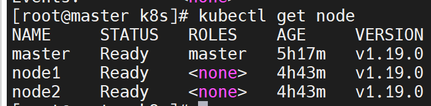
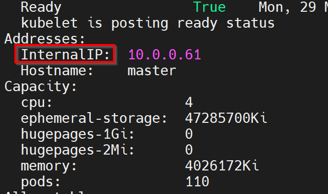
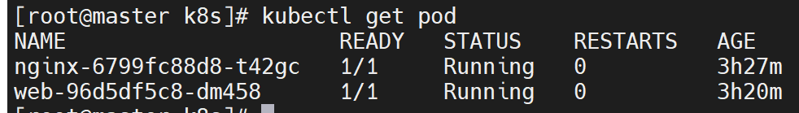
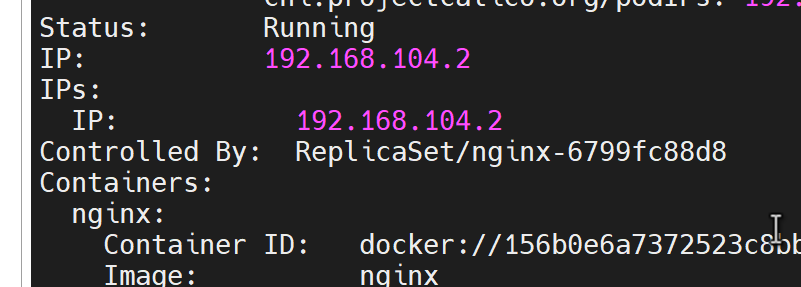
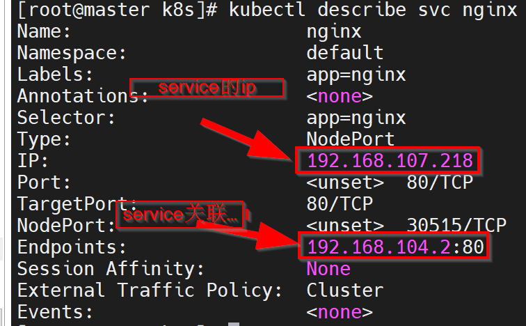
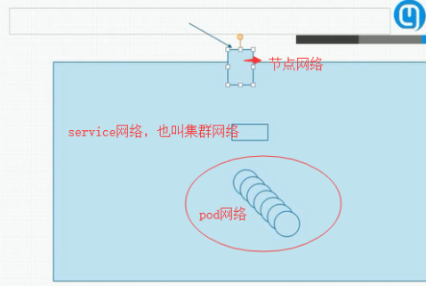
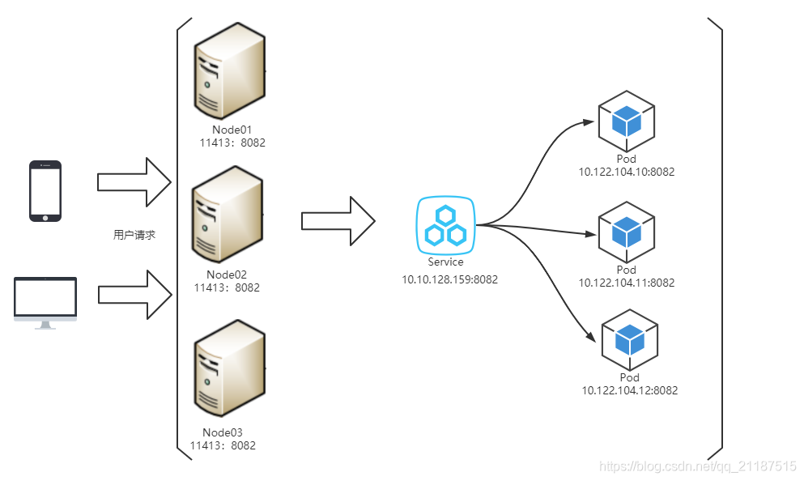

Kubernetes集群里有三种IP地址，分别如下：

Node IP：Node节点的IP地址，即物理网卡的IP地址。
Pod IP：Pod的IP地址，即docker容器的IP地址，此为虚拟IP地址。
Cluster IP：Service的IP地址，此为虚拟IP地址。

**Node IP**

可以是物理机的IP（也可能是虚拟机IP）。每个Service都会在Node节点上开通一个端口，外部可以通过NodeIP:NodePort即可访问Service里的Pod,和我们访问服务器部署的项目一样，IP:端口/项目名

在kubernetes查询Node IP
1.``kubectl get nodes``

2.``kubectl describe node nodeName``

3.显示出来的InternalIP就是NodeIP

**Pod IP**

Pod IP是每个Pod的IP地址，他是Docker Engine根据docker网桥的IP地址段进行分配的，通常是一个虚拟的二层网络

同Service下的pod可以直接根据PodIP相互通信
不同Service下的pod在集群间pod通信要借助于 cluster ip
pod和集群外通信，要借助于node ip
在kubernetes查询Pod IP
1.``kubectl get pods``

2.``kubectl describe pod podName``

**Cluster IP**

Service的IP地址，此为虚拟IP地址。外部网络无法ping通，只有kubernetes集群内部访问使用。

在kubernetes查询Cluster IP
kubectl -n 命名空间 get Service即可看到ClusterIP

Cluster IP是一个虚拟的IP，但更像是一个伪造的IP网络，原因有以下几点

Cluster IP仅仅作用于Kubernetes Service这个对象，并由Kubernetes管理和分配P地址
Cluster IP无法被ping，他没有一个“实体网络对象”来响应
Cluster IP只能结合Service Port组成一个具体的通信端口，单独的Cluster IP不具备通信的基础，并且他们属于Kubernetes集群这样一个封闭的空间。
在不同Service下的pod节点在集群间相互访问可以通过Cluster IP

**三种IP网络间的通信**

service地址和pod地址在不同网段，service地址为虚拟地址，不配在pod上或主机上，外部访问时，先到Node节点网络，再转到service网络，最后代理给pod网络。

Kubernetes在其所有节点上开放一个端口给外部访问（所有节点上都使用相同的端口号）， 并将传入的连接转发给作为Service服务对象的pod。这样我们的pod就可以被外部请求访问到

注：
k8s暴露服务给外部访问有三种方式，NodePort、LoadBalane、Ingress三种暴露服务的方式，上图是用了NodePort的方式，缺点是服务一旦多起来，NodePort 在每个节点上开启的端口数量会极其庞大，难以维护。

