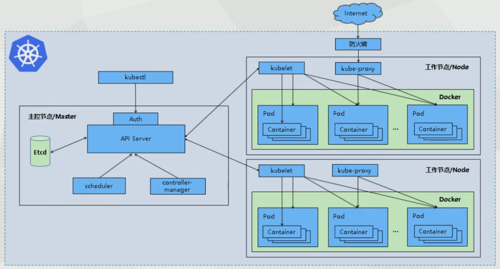
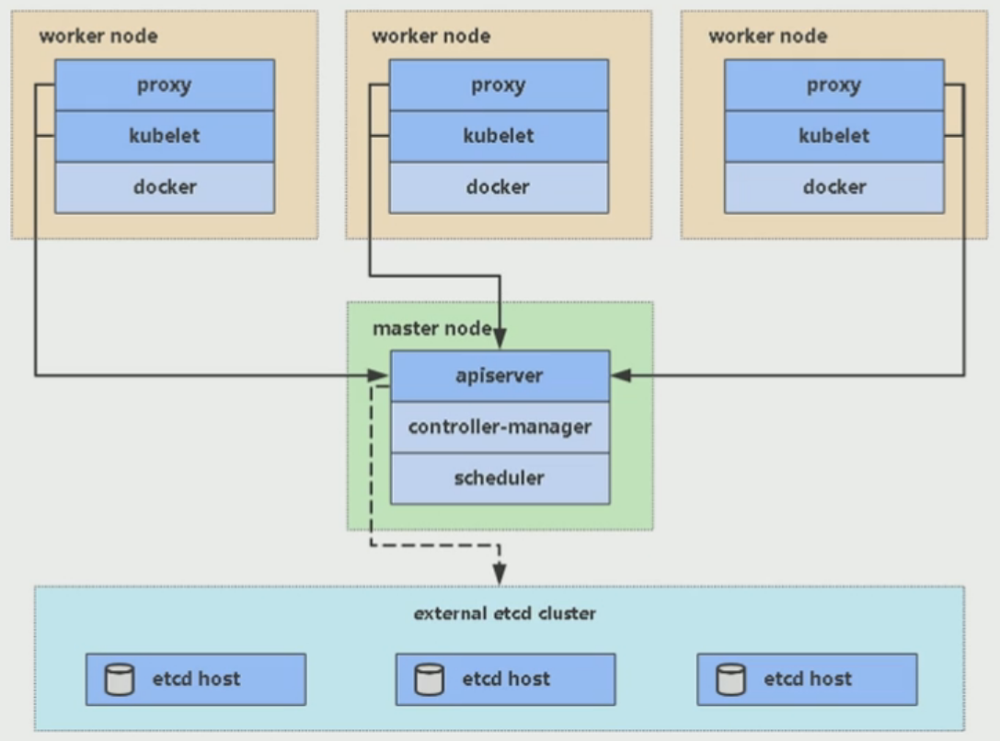
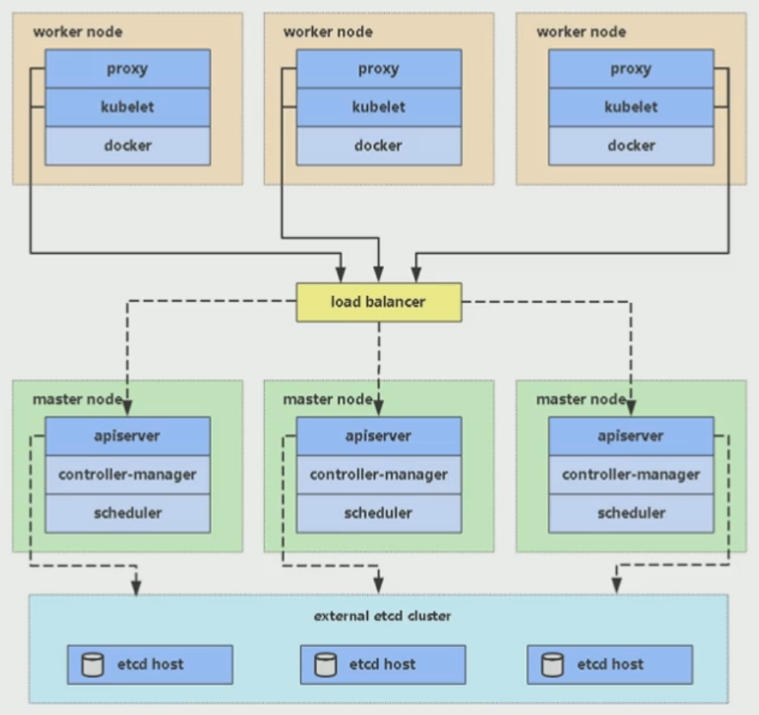

## 集群架构与组件

Kubernetes 集群架构以及相关的核心组件如下图所示：一个 Kubernetes 集群一般包含一个 Master 节点和多个 Node 节点，一个节点可以看成是一台物理机或虚拟机。

### Master

Master 是 K8S 的集群控制节点，每个 K8S 集群里需要有一个 Master 节点来负责整个集群的管理和控制，基本上 K8S 所有的控制命令都是发给它，它来负责具体的执行过程。Master 节点通常会占据一个独立的服务器，因为它太重要了，如果它不可用，那么所有的控制命令都将失效。

Master 节点上运行着以下关键组件：

① **kube-apiserver**

是集群的统一入口，各组件协调者，以 HTTP Rest 提供接口服务，所有对象资源的增、删、改、查和监听操作都交给 apiserver 处理后再提交给 Etcd 存储。

② **kube-controller-manager**

是 K8S 里所有资源对象的自动化控制中心，处理集群中常规后台任务，一个资源对应一个控制器，而 controller-manager 就是负责管理这些控制器的。

③ **kube-scheduler**

根据调度算法为新创建的 Pod 选择一个 Node 节点，可以任意部署，可以部署在同一个节点上，也可以部署在不同的节点上。

④ **etcd**

是一个分布式的，一致的 key-value 存储，主要用途是共享配置和服务发现，保存集群状态数据，比如 Pod、Service 等对象信息。

### Node

除了 Master，K8S 集群中的其它机器被称为 Node 节点，Node 节点是 K8S 集群中的工作负载节点，每个 Node 都会被 Master 分配一些工作负载，当某个 Node 宕机时，其上的工作负载会被 Master 自动转移到其它节点上去。

每个 Node 节点上都运行着以下关键组件：

① **kubelet**

kubelet 是 Master 在 Node 节点上的 Agent(代理)，与 Master 密切协作，管理本机运行容器的生命周期，负责 Pod 对应的容器的创建、启停等任务，实现集群管理的基本功能。

② **kube-proxy**

在 Node 节点上实现 Pod 网络代理，实现 Kubernetes Service 的通信，维护网络规则和四层负载均衡工作。

③ **docker engine**

Docker 引擎，负责本机的容器创建和管理工作。

Node 节点可以在运行期间动态增加到 K8S 集群中，前提是这个节点上已经正确安装、配置和启动了上述关键组件。在默认情况下 kubelet 会向 Master 注册自己，一旦 Node 被纳入集群管理范围，kubelet 就会定时向 Master 节点汇报自身的情况，例如操作系统、Docker 版本、机器的 CPU 和内存情况，以及之前有哪些 Pod 在运行等，这样 Master 可以获知每个 Node 的资源使用情况，并实现高效均衡的资源调度策略。而某个 Node 超过指定时间不上报信息时，会被 Master 判定为“失联”，Node 的状态被标记为不可用（Not Ready），随后 Master 会触发“工作负载大转移”的自动流程。

## 核心概念

**1、Pod**

Pod 是 K8S 中最重要也是最基本的概念，Pod 是最小的部署单元，是一组容器的集合。每个 Pod 都由一个特殊的根容器 Pause 容器，以及一个或多个紧密相关的用户业务容器组成。

Pause 容器作为 Pod 的根容器，以它的状态代表整个容器组的状态。K8S 为每个 Pod 都分配了唯一的 IP 地址，称之为 Pod IP。Pod 里的多个业务容器共享 Pause 容器的IP，共享 Pause 容器挂载的 Volume。

**2、Label**

标签，附加到某个资源上，用于关联对象、查询和筛选。一个 Label 是一个 key=value 的键值对，key 与 value 由用户自己指定。Label 可以附加到各种资源上，一个资源对象可以定义任意数量的 Label，同一个 Label 也可以被添加到任意数量的资源上。

我们可以通过给指定的资源对象捆绑一个或多个不同的 Label 来实现多维度的资源分组管理功能，以便于灵活、方便地进行资源分配、调度、配置、部署等工作。

K8S 通过 Label Selector（标签选择器）来查询和筛选拥有某些 Label 的资源对象。Label Selector 有基于等式（ name=label1 ）和基于集合（ name in (label1, label2) ）的两种方式。

**3、ReplicaSet（RC）**

ReplicaSet 用来确保预期的 Pod 副本数量，如果有过多的 Pod 副本在运行，系统就会停掉一些 Pod，否则系统就会再自动创建一些 Pod。

我们很少单独使用 ReplicaSet，它主要被 Deployment 这个更高层的资源对象使用，从而形成一整套 Pod 创建、删除、更新的编排机制。

**4、Deployment**

Deployment 用于部署无状态应用，Deployment 为 Pod 和 ReplicaSet 提供声明式更新，只需要在 Deployment 描述想要的目标状态，Deployment 就会将 Pod 和 ReplicaSet 的实际状态改变到目标状态。

**5、Horizontal Pod Autoscaler（HPA）**

HPA 为 Pod 横向自动扩容，也是 K8S 的一种资源对象。HPA 通过追踪分析 RC 的所有目标 Pod 的负载变化情况，来确定是否需要针对性调整目标 Pod 的副本数量。

**6、Service**

Service 定义了一个服务的访问入口，通过 Label Selector 与 Pod 副本集群之间“无缝对接”，定义了一组 Pod 的访问策略，防止 Pod 失联。

创建 Service 时，K8S会自动为它分配一个全局唯一的虚拟 IP 地址，即 Cluster IP。服务发现就是通过 Service 的 Name 和 Service 的 ClusterIP 地址做一个 DNS 域名映射来解决的。

**7、Namespace**

命名空间，Namespace 多用于实现多租户的资源隔离。Namespace 通过将集群内部的资源对象“分配”到不同的Namespace中，形成逻辑上分组的不同项目、小组或用户组。

K8S 集群在启动后，会创建一个名为 default 的 Namespace，如果不特别指明 Namespace，创建的 Pod、RC、Service 都将被创建到 default 下。

当我们给每个租户创建一个 Namespace 来实现多租户的资源隔离时，还可以结合 K8S 的资源配额管理，限定不同租户能占用的资源，例如 CPU 使用量、内存使用量等。

[回到顶部](https://www.cnblogs.com/chiangchou/p/k8s-1.html#_labelTop)

## 平台规划

K8S 环境有两种架构方式，单 Master 集群和多 Master 集群，将先搭建起单 Master 集群，再扩展为多 Master 集群。开发、测试环境可以部署单 Master 集群，生产环境为了保证高可用需部署多 Master 集群。

### **单 Master 集群架构**

单 Master 集群架构相比于多 Master 集群架构无法保证集群的高可用，因为 master 节点一旦宕机就无法进行集群的管理工作了。单 master 集群主要包含一台 Master 节点，及多个 Node 工作节点、多个 Etcd 数据库节点。

Etcd 是 K8S 集群的数据库，可以安装在任何地方，也可以与 Master 节点在同一台机器上，只要 K8S 能连通 Etcd。

### **多 Master 集群架构**

多 Master 集群能保证集群的高可用，相比单 Master 架构，需要一个额外的负载均衡器来负载多个 Master 节点，Node 节点从连接 Master 改成连接 LB 负载均衡器。

