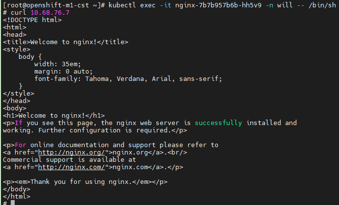
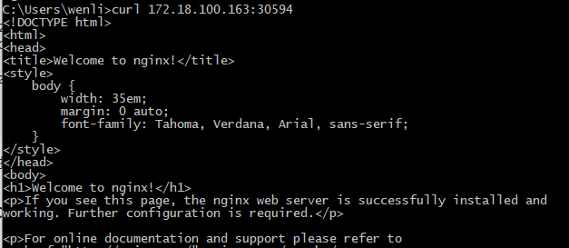
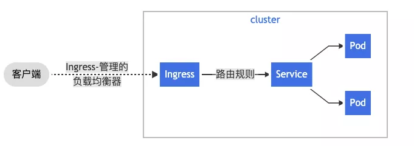
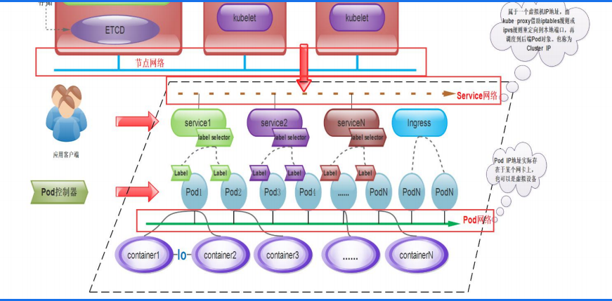
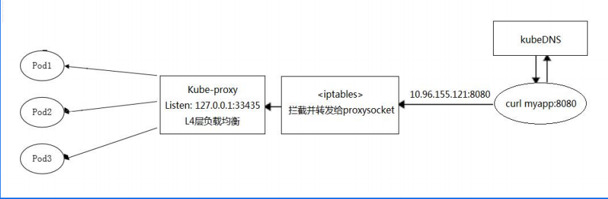
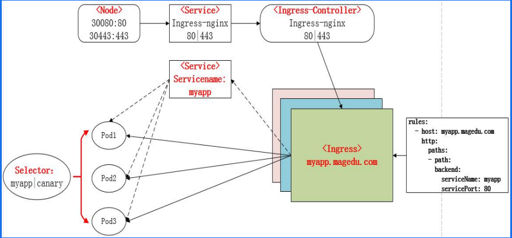
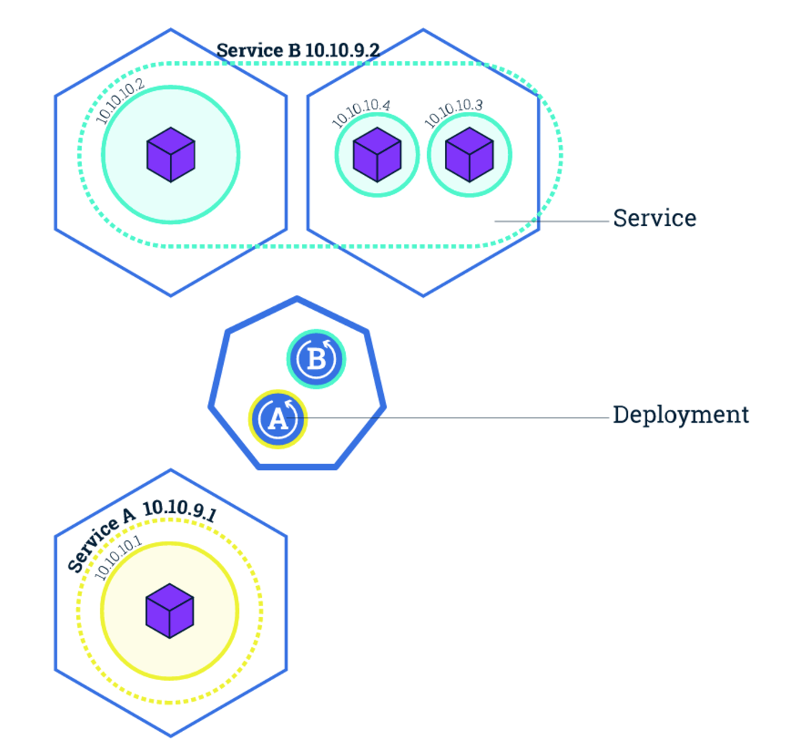
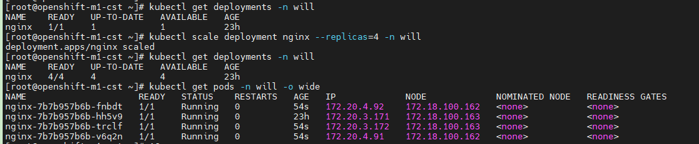

# 创建namespace

Kubernetes namespace 是用来构建虚拟的资源池；使用 kubernetes namespace，管理员可以将 kubernetes 划分成多个虚拟的区域，不同的项目或者团队可以使用不同的 namespace，达到了共享 kubernetes 集群资源的目的。此外， namespace 也被用来划分命名空间，即不同 namespace 里的资源可以取相同的名字，相同 namespace 内的资源不能重名。

## Namespaces

通过 `kubectl create -f`，我们可以轻松地创建一个 namespace：
ns.yaml文件如下：

```yaml
apiVersion: v1
kind: Namespace
metadata:
  name: will
```

```
$ kubectl create -f resources/ns.yaml
namespace "tutorial" created
```

然后通过 `kubectl get ns`，可以看到刚才创建的 namespace

```
$ kubectl get ns
NAME              STATUS   AGE
default           Active   27h
kube-node-lease   Active   27h
kube-public       Active   27h
kube-system       Active   27h
tutorial          Active   7s
```

# 创建 deployment

k8s deployment 用来部署应用。一个常见的 deployment 配置包括几个部分，详细可以参考官网有关介绍 [Deployments](https://kubernetes.io/zh/docs/concepts/workloads/controllers/deployment/)。

- spec.selector：用于定义 deployment 如何查找要管理的 pod，例如，使用在 pod 模板中定义的标签，如 app:nginx
- spec.replicas：用于定义需要启动多少个副本
- spec.template：用于定义 pod 的属性，例如，容器名称，容器镜像，labels 字段，等

完整的 `nginx-dep.yml` 文件如下：

```yaml
apiVersion: apps/v1
kind: Deployment
metadata:
  name: nginx-deployment
spec:
  selector:
    matchLabels:
      app: nginx
  replicas: 3
  template:
    metadata:
      labels:
        app: nginx
    spec:
      containers:
      - name: nginx
        image: nginx:alpine
        ports:
        - containerPort: 80
```

这里的image镜像可以选择任意网络连接的镜像仓库地址；

为了创建 deployment，执行命令：

```shell
kubectl apply -f nginx-dep.yml
```

查看 deployment 状态：

```shell
kubectl get deploy -o wide
```

可以看到，刚创建的 `nginx-deployment` 的 3 个副本均处于 `READY` 状态：

```shell
NAME               READY   UP-TO-DATE   AVAILABLE   AGE   CONTAINERS   IMAGES         SELECTOR
nginx-deployment   3/3     3            3           48s   nginx        nginx:alpine   app=nginx
```

为了进一步验证 nginx 已成功启动，进入 pod 中容器（有关如果进入 k8s 容器的命令介绍，可以参考 [链接](https://kubernetes.io/docs/tasks/debug-application-cluster/get-shell-running-container/)）：

```shell
kubectl exec -it nginx -- /bin/sh
```

进入容器后，执行命令：

```shell
curl localhost
```

可以正常打印出 nginx 启动成功的欢迎页面 html。

退出可以使用

```
exit
```

## 获取pod IP

``` 
kubectl describe pod podname
```

通过describe命令获取pod详细信息，其中包含pod的IP；

但是这个IP会因为pod的启停而变化，所以我们需要使用Service。

# Kubernetes Service

kubernetes service 有以下几个作用：

- 提供固定的 IP。由于 Pod 可以随时启停，Pod IP 可能随时都会变化，例如上面 nginx pod 重启之后 IP 可能不再是 172.17.0.11。Service 为 Pods 提供的固定 IP，其他服务可以通过 Service IP 找到提供服务的 Pods。
- 提供负载均衡。Service 由多个 Pods 组成，kubernetes 对组成 Service 的 Pods 提供的负载均衡方案，例如随机访问、基于 Client IP 的 session affinity。
- 服务发现。集群中其他服务可以通过 Service 名字访问后端服务（DNS），也可以通过环境变量访问。

下图是 kubernetes Pods, Service 的典型关系。下图有两个 Deployment: A 和 B。其中 Deployment A 创建了一个 Pods（黄色），Deployment B 创建了三个 Pod（绿色）。我们可以创建两个 Service: A 和 B。 Service A 管理由 Deployment A 创建的 Pods，Service B 管理 Deployment B 创建的 Pods。可以看到， Service A 和 Service B 都有自己独立的 IP。无论他们所管理的容器如何变化， Service 的 IP 都不会变化。


## Create service

与其他资源相同，我们可以通过 `kubectl create -f` 加文件名创建 Service。但类似 Deployment，kubernetes 提供了快捷命令让我们能快速创建 Service。

```
$ kubectl expose deployment nginx --port 80 -n tutorial
service "nginx" exposed
```

通过这个命令把创建的service的对应yaml文件保存到指定文件中

```
kubectl get service nginx -n will -o yaml > service.yaml
```

```yaml
apiVersion: v1
kind: Service
metadata:
  creationTimestamp: "2021-07-07T08:27:58Z"
  labels:
    app: nginx
  managedFields:
  - apiVersion: v1
    fieldsType: FieldsV1
    fieldsV1:
      f:metadata:
        f:labels:
          .: {}
          f:app: {}
      f:spec:
        f:ports:
          .: {}
          k:{"port":80,"protocol":"TCP"}:
            .: {}
            f:port: {}
            f:protocol: {}
            f:targetPort: {}
        f:selector:
          .: {}
          f:app: {}
        f:sessionAffinity: {}
        f:type: {}
    manager: kubectl-expose
    operation: Update
    time: "2021-07-07T08:27:58Z"
  name: nginx
  namespace: will
  resourceVersion: "22295691"
  selfLink: /api/v1/namespaces/will/services/nginx
  uid: 8cfd1ec9-a212-4b14-b81f-da862629ab27
spec:
  clusterIP: 10.68.76.7
  clusterIPs:
  - 10.68.76.7
  ports:
  - port: 80
    protocol: TCP
    targetPort: 80
  selector:
    app: nginx
  sessionAffinity: None
  type: ClusterIP
status:
  loadBalancer: {}

```

还可以通过创建yaml文件的方式生成。但不用像上面那个那么完整。

```yaml
apiVersion: v1
kind: Service
metadata:
  name: nginx-service
spec:
  selector:
    app: nginx
  ports:
  - protocol: TCP
    port: 80
    targetPort: 80
    nodePort: 30080
  type: NodePort
```

注意这里的type，这个type有四种类型：ClusterIP(默认)、NodePort，LoadBalancer、ExternalName，具体可以看这两篇文章：[k8s中的Service与Ingress](https://blog.haohtml.com/archives/19945)。[图解 Kubernetes Service](https://www.qikqiak.com/post/visually-explained-k8s-service/)

- ClusterIP顾名思义就是Service管理的（通过selector或label）pod集群对外访问。当你依次访问ClusterIP的话，会发现每次响应内容不一样，说明后端请求了不同的 pod 。原因是因为 Service 提供的是 `Round Robin `方式的负载均衡。这个IP地址 `10.0.1.175` 是当前集群的IP，俗称为 `VIP`，是 Kubernetes 自动为 Service 分配的。对于这种方式称为 `ClusterIP 模式的 Service`。

## Get service

通过 `kubectl get service` 命令可以查看 service 的详细信息：

```
$ kubectl get svc nginx -n will
NAME    TYPE        CLUSTER-IP   EXTERNAL-IP   PORT(S)   AGE   SELECTOR
nginx   ClusterIP   10.68.76.7   <none>        80/TCP    68s   app=nginx
```

可以看到，Service 具有一个固定的 IP 10.68.76.7。同样，通过 describe 可以看到更多详细的信息：

```
$ kubectl describe svc nginx -n will
Name:              nginx
Namespace:         will
Labels:            app=nginx
Annotations:       <none>
Selector:          app=nginx
Type:              ClusterIP
IP Families:       <none>
IP:                10.68.76.7
IPs:               10.68.76.7
Port:              <unset>  80/TCP
TargetPort:        80/TCP
Endpoints:         172.20.3.171:80
Session Affinity:  None
Events:            <none>
```

其中，Endpoint 表明 Service 所选中的 PodIP:PodPort。我们可以查看 Pod 信息来验证：

```
$ kubectl get pods -o wide -n will
NAME                     READY   STATUS    RESTARTS   AGE   IP            NODE       NOMINATED NODE   READINESS GATES
nginx-646b46d648-hbwg2   1/1     Running   0          14m   172.17.0.11   minikube   <none>           <none>
```

## Query service

创建 Service 后，我们可以在主机上直接访问该 Service。下面两条命令实际上访问的都是同一个后端。第一个命令通过 Service IP 访问，第二个命令通过 Pod IP 访问。

通过 Service IP 访问：

```
$ minikube ssh
$ curl 10.96.6.136
<!DOCTYPE html>
<html>
...
</html>
```

通过 Pod IP 访问：

```
$ minikube ssh
$ curl 172.17.0.11
<!DOCTYPE html>
<html>
...
</html>
```

上面的命令创建了一个名为 nginx 的 Service，并使用 80 作为服务端口。这里，我们的 nginx 容器监听的是容器的 80 端口，该端口是 Pod IP 所监听的端口；我们可以在 Service 上使用不同的端口。例如，若我们想暴露的服务端口是 8080 端口，需要使用 port 和 targetPort 选项。

首先，删除已经创建的 Service：

```
$ kubectl delete svc nginx -n tutorial
service "nginx" deleted
```

之后，创建 Service：

```
$ kubectl expose deployment nginx --port 8080 --target-port 80 -n tutorial
service "nginx" exposed
```

尝试用 8080 端口访问服务

```
$ kubectl get svc nginx -n tutorial
NAME    TYPE        CLUSTER-IP     EXTERNAL-IP   PORT(S)    AGE
nginx   ClusterIP   10.98.125.20   <none>        8080/TCP   6s

$ minikube ssh
$ curl 10.98.125.20:8080
<!DOCTYPE html>
<html>
...
</html>
```

上面是在minikube中访问，这是访问k8s集群的方式，首先进入容器，然后通过serviceIP的方式访问服务



## NodePort service

上述创建的 Service 只能被集群内部的节点和 Pod 访问，并不能被外部访问。我们可以通过两种方式暴露服务：`NodePort` 和 `LoadBalancer`。`NodePort` 通过在每个节点打开一个端口对外提供服务，`LoadBalancer` 通过创建一个外部负载均衡器（例如公有云负载均衡器）来对外提供服务。这里我们尝试使用 `NodePort`。

首先，删除已有的 Service：

```
$ kubectl delete svc nginx -n will
service "nginx" deleted
```

通过 NodePort 暴露服务，注意这里使用了 `--type NodePort`：

```
$ kubectl expose deployment nginx --port 80 --type NodePort -n will
service "nginx" exposed
```

查看 Service 的细节：

```
[root@openshift-m1-cst ~]# kubectl get svc nginx -n will
NAME    TYPE       CLUSTER-IP    EXTERNAL-IP   PORT(S)        AGE
nginx   NodePort   10.68.92.85   <none>        80:30594/TCP   51s

[root@openshift-m1-cst ~]# kubectl describe svc nginx -n will
Name:                     nginx
Namespace:                will
Labels:                   app=nginx
Annotations:              <none>
Selector:                 app=nginx
Type:                     NodePort
IP Families:              <none>
IP:                       10.68.92.85
IPs:                      10.68.92.85
Port:                     <unset>  80/TCP
TargetPort:               80/TCP
NodePort:                 <unset>  30594/TCP
Endpoints:                172.20.3.171:80
Session Affinity:         None
External Traffic Policy:  Cluster
Events:                   <none>
```

从以上输出可以看到，nginx 服务打开了节点的 30594端口（每个节点），我们可以通过 `NodeIP:NodePort` 访问服务。



```
$ curl $(minikube ip):32542
<!DOCTYPE html>
<html>
...
</html>
```

> PS：NodeIP可以通过``describe node nginx-7b7b957b6b-hh5v9 -n will``获得；

## Readings

- [kubernetes service](https://kubernetes.io/docs/concepts/services-networking/service/). Please read as much as you can, we'll come back to service again.
- [run application with service](https://kubernetes.io/docs/tasks/access-application-cluster/connecting-frontend-backend/).
- [ports in kubernetes](https://speakerdeck.com/thockin/kubernetes-a-very-brief-explanation-of-ports)

# Kubernetes Ingress

上面我们提到有一个叫作 `LoadBalancer` 类型的 `Service`，它会为你在 Cloud Provider（比如：Google Cloud 或者 OpenStack）里创建一个与该 Service 对应的负载均衡服务。但是，相信你也应该能感受到，由于每个 Service 都要有一个负载均衡服务，所以这个做法实际上既浪费成本又高。作为用户，我其实更希望看到 Kubernetes 为我内置一个全局的负载均衡器。然后，通过我访问的 URL，把请求转发给不同的后端 Service。这种全局的、为了代理不同后端 Service 而设置的负载均衡服务，就是 Kubernetes 里的 `Ingress` 服务。

Ingress 的功能其实很容易理解：所谓 Ingress 就是 Service 的“Service”，这就是它们两者的关系。

```
 	internet
        |
   [ Ingress ]
   --|-----|--
   [ Services ]
```

通过使用 Kubernetes 的 Ingress 来创建一个统一的负载均衡器，从而实现当用户访问不同的域名时，访问后端不同的服务。



假如我现在有这样一个站点：`https://cafe.example.com`。其中 `https://cafe.example.com/coffee`，对应的是“咖啡点餐系统”。而 `https://cafe.example.com/tea`，对应的则是“茶水点餐系统”。这两个系统，分别由名叫 `coffee` 和 `tea` 这样两个 Deployment 来提供服务，可以看到这是一种经典的扇出（fanout）行为。

```yaml
apiVersion: extensions/v1beta1
kind: Ingress
metadata:
  name: cafe-ingress
spec:
  tls:
  - hosts:
    - cafe.example.com
    secretName: cafe-secret
  rules:
  - host: cafe.example.com
    http:
      paths:
      - path: /tea
        backend:
          serviceName: tea-svc
          servicePort: 80
      - path: /coffee
        backend:
          serviceName: coffee-svc
          servicePort: 80
```

最值得我们关注的，是 `rules` 字段。在 Kubernetes 里，这个字段叫作：`IngressRule`。
IngressRule 的 Key，就叫做：`host`。它必须是一个标准的域名格式（Fully Qualified Domain Name）的字符串，而不能是 IP 地址。

**Ingress 规则**[ ](https://kubernetes.io/zh/docs/concepts/services-networking/ingress/#ingress-rules)

每个 HTTP 规则都包含以下信息：

- `host`。可选项。如果未指定 `host`，则该规则适用于通过指定 IP 地址的所有入站 HTTP 通信。 如果提供了 `host`，则 `rules` 适用于该 `host`。
- `paths` 路径列表 paths（例如，`/testpath`）,每个路径都有一个由 `serviceName` 和 `servicePort` 定义的关联后端。 在负载均衡器将流量定向到引用的服务之前，主机和路径都必须匹配传入请求的内容。
- `backend`（后端）是 [Service 文档](https://kubernetes.io/zh/docs/concepts/services-networking/service/)中所述的服务和端口名称的组合。 与规则的 `host` 和 `path` 匹配的对 Ingress 的 HTTP（和 HTTPS ）请求将发送到指定对应的 `backend`。

通常在 Ingress 控制器中会配置 `defaultBackend`（默认后端），以服务于任何不符合规约中 `path` 的请求。

所以在我们的例子里，我定义了两个 path，它们分别对应 `coffee` 和 `tea` 这两个 Deployment 的 Service（即 `coffee-svc` 和 `tea-svc`）。

通过上面的介绍，不难看到所谓 Ingress 对象，其实就是 Kubernetes 项目对“`反向代理`”的一种抽象。

一个 `Ingress` 对象的主要内容，实际上就是一个“反向代理”服务（比如：Nginx）的配置文件的描述。而这个代理服务对应的转发规则，就是 `IngressRule`。

这就是为什么在每条 IngressRule 里，需要有一个 host 字段来作为这条 IngressRule 的入口，然后还需要有一系列 path 字段来声明具体的转发策略。这其实跟 Nginx、HAproxy 等项目的配置文件的写法是一致的。

在实际使用中，我们一般选择一种` Ingress Controller`, 将其部署在k8s集群中，这样它就会根据我们定义的 Ingress 对象来提供对应的代理功能。

业界常用的各种反向代理项目，比如 Nginx、HAProxy、Envoy、Traefik 等，都已经为 Kubernetes 专门维护了对应的 `Ingress Controller`。

Nginx Ingress Controller 的示例请参考 https://time.geekbang.org/column/article/69214

推荐参考官方推荐脚本：https://github.com/resouer/kubernetes-ingress/tree/master/examples/complete-example

至此通过一张图来总结一下K8S的网络结构：



K8S内部的请求处理：



K8S的外部请求处理



# Kubernetes Label&Selector

Service 通过 selector & label 来选取它所管理的 Pod，同样 Deployment 也是通过 selector & label 选取它所管理的 Pod。

# Kubernetes Deployment Operations

## Scale up using kubectl

接下来我们将学习 kubernetes Deployment 的另外两个操作：水平扩展应用和更新应用。下图中，Deployment A 有一个 Pod 在运行，Service A 管理该 Pod。


通过调整 Deployment 的副本数量，我们可以将 Pod 的数量调整到 4 个。与此同时，Service 会感知到同样 label 的 Pod 被扩容到了 4 个，会将流量导到所有 Pod（而不是只有最开始的 Pod）。



接下来，我们可以通过 `kubectl scale` 子命令将 Pod 数量扩容到四个：

```shell
[root@openshift-m1-cst ~]# kubectl get deployments -n will
NAME    READY   UP-TO-DATE   AVAILABLE   AGE
nginx   1/1     1            1           23h
[root@openshift-m1-cst ~]# kubectl scale deployment nginx --replicas=4 -n will
deployment.apps/nginx scaled
[root@openshift-m1-cst ~]# kubectl get deployments -n will
NAME    READY   UP-TO-DATE   AVAILABLE   AGE
nginx   4/4     4            4           23h
[root@openshift-m1-cst ~]# kubectl get pods -n will -o wide
NAME                     READY   STATUS    RESTARTS   AGE   IP             NODE             NOMINATED NODE   READINESS GATES
nginx-7b7b957b6b-fnbdt   1/1     Running   0          54s   172.20.4.92    172.18.100.162   <none>           <none>
nginx-7b7b957b6b-hh5v9   1/1     Running   0          23h   172.20.3.171   172.18.100.163   <none>           <none>
nginx-7b7b957b6b-trclf   1/1     Running   0          54s   172.20.3.172   172.18.100.163   <none>           <none>
nginx-7b7b957b6b-v6q2n   1/1     Running   0          54s   172.20.4.91    172.18.100.162   <none>           <none>
```



可以看到目前有四个 Pods，其中 `AGE` 较小的是新生成的。

## View service

之前提到，Service 会感知到 Pods 的变化，在所有的 Pods 中负载均衡，我们可以通过 kubectl 查看。

```shell
[root@openshift-m1-cst ~]# kubectl describe service nginx -n will
Name:                     nginx
Namespace:                will
Labels:                   app=nginx
Annotations:              <none>
Selector:                 app=nginx
Type:                     NodePort
IP Families:              <none>
IP:                       10.68.92.85
IPs:                      10.68.92.85
Port:                     <unset>  80/TCP
TargetPort:               80/TCP
NodePort:                 <unset>  30594/TCP
Endpoints:                172.20.3.171:80,172.20.3.172:80,172.20.4.91:80 + 1 more...
Session Affinity:         None
External Traffic Policy:  Cluster
Events:                   <none>
```

## Scale down using kubectl

我们也可以通过同样的命令缩容（kubectl scale）。Deployment 不会区分是扩容命令或是缩容命令，它只关心将实例的数量调整到指定的数量。

```shell
[root@openshift-m1-cst ~]# kubectl scale deployments nginx --replicas=3 -n will
deployment.apps/nginx scaled
[root@openshift-m1-cst ~]# kubectl get pods -n will
NAME                     READY   STATUS    RESTARTS   AGE
nginx-7b7b957b6b-fnbdt   1/1     Running   0          5m16s
nginx-7b7b957b6b-hh5v9   1/1     Running   0          23h
nginx-7b7b957b6b-trclf   1/1     Running   0          5m16s
```

## Update deployment

接下来，我们将了解 kubernetes 如何进行应用更新。

```shell
$ kubectl set image deployments nginx nginx=cargo.caicloud.io/caicloud/nginx:1.9.3 -n tutorial
deployment.extensions/nginx image updated
```

分析一下上述命令，`kubectl set image` 将 Deployment 中的 nginx 镜像版本改为 1.9.3；运行该命令之后，发现 kubernetes 删掉了一个现有的 Pod，然后重新启动了两个新的 Pod（我们可以从一串数字中看出，"86d4667764" 是新 Pod 的 Hash 值，"d6b94d6f6" 是老 Pod 的 Hash 值）。等待一段时间后再次查询 Pods，发现所有新的 Pods 已经上线。整个过程中，我们都可以尝试去访问 nginx 服务，注意其版本的变化。

# Kubernetes Events

Kubernetes events 显示了 kubernetes 集群中所有的事件。不同于其他资源，kubernetes events 并不是由用户创建的资源，而是由 kubernetes 系统组件创建，用以提示用户集群发生的各种事件。我们可以通过 kubectl get 命令来查询集群的事件。默认情况下，event 会有 TTL，超过 TTL 之后 kubernetes 会将事件删掉。

```shell
[root@openshift-m1-cst ~]# kubectl get events -n will
LAST SEEN   TYPE     REASON              OBJECT                        MESSAGE
8m57s       Normal   Scheduled           pod/nginx-7b7b957b6b-fnbdt    Successfully assigned will/nginx-7b7b957b6b-fnbdt to 172.18.100.162
8m57s       Normal   Pulling             pod/nginx-7b7b957b6b-fnbdt    Pulling image "harbor.apusic.com/cloud/nginx"
8m49s       Normal   Pulled              pod/nginx-7b7b957b6b-fnbdt    Successfully pulled image "harbor.apusic.com/cloud/nginx" in 7.582820587s
8m49s       Normal   Created             pod/nginx-7b7b957b6b-fnbdt    Created container nginx
8m49s       Normal   Started             pod/nginx-7b7b957b6b-fnbdt    Started container nginx
8m57s       Normal   Scheduled           pod/nginx-7b7b957b6b-trclf    Successfully assigned will/nginx-7b7b957b6b-trclf to 172.18.100.163
8m57s       Normal   Pulling             pod/nginx-7b7b957b6b-trclf    Pulling image "harbor.apusic.com/cloud/nginx"
8m57s       Normal   Pulled              pod/nginx-7b7b957b6b-trclf    Successfully pulled image "harbor.apusic.com/cloud/nginx" in 62.433594ms
8m57s       Normal   Created             pod/nginx-7b7b957b6b-trclf    Created container nginx
8m57s       Normal   Started             pod/nginx-7b7b957b6b-trclf    Started container nginx
8m57s       Normal   Scheduled           pod/nginx-7b7b957b6b-v6q2n    Successfully assigned will/nginx-7b7b957b6b-v6q2n to 172.18.100.162
8m57s       Normal   Pulling             pod/nginx-7b7b957b6b-v6q2n    Pulling image "harbor.apusic.com/cloud/nginx"
8m49s       Normal   Pulled              pod/nginx-7b7b957b6b-v6q2n    Successfully pulled image "harbor.apusic.com/cloud/nginx" in 7.643466668s
8m49s       Normal   Created             pod/nginx-7b7b957b6b-v6q2n    Created container nginx
8m49s       Normal   Started             pod/nginx-7b7b957b6b-v6q2n    Started container nginx
4m10s       Normal   Killing             pod/nginx-7b7b957b6b-v6q2n    Stopping container nginx
8m57s       Normal   SuccessfulCreate    replicaset/nginx-7b7b957b6b   Created pod: nginx-7b7b957b6b-v6q2n
8m57s       Normal   SuccessfulCreate    replicaset/nginx-7b7b957b6b   Created pod: nginx-7b7b957b6b-fnbdt
8m57s       Normal   SuccessfulCreate    replicaset/nginx-7b7b957b6b   Created pod: nginx-7b7b957b6b-trclf
4m10s       Normal   SuccessfulDelete    replicaset/nginx-7b7b957b6b   Deleted pod: nginx-7b7b957b6b-v6q2n
8m57s       Normal   ScalingReplicaSet   deployment/nginx              Scaled up replica set nginx-7b7b957b6b to 4
4m10s       Normal   ScalingReplicaSet   deployment/nginx              Scaled down replica set nginx-7b7b957b6b to 3
```

Event 与资源是相联系的，因此单独查询 Event 并不是非常有用，我们可以通过获取资源的详细信息来查看 Event 信息。例如， `kubectl describe pod <pod name>` 会返回 Pod 的 event 信息。

# Kubernetes Pod Lifecycle

od 生命周期主要包括：

- Pod Phase
- Pod Condition
- Restart Policy
- Container probes

用户可以通过 `kubectl describe pods` 查看以上所有信息。Pod Phase 和 Pod Condition 比较简单，我们可以实时看到 kubernetes 的反馈。这里我们主要实践 Restart Policy 和 Container probes。

## Restart policy

Restart Policy 指定当 Pod 内容器出错或执行完毕后，是否重启。

## Container probes

Container probes 分为两种：LivenessProbe 和 ReadinessProbe。Liveness 检查应用是否依然健康无错，若有错，则 kubernetes 会根据 policy 重启或仅更新状态。ReadinessCheck 检查应用是否可以对外提供服务，若应用 Readiness 检查不通过，则 kubernetes 会将 Pod 从服务池中剔除。两者的使用方法都相同，这里我们来看看 Container probes。

```shell
apiVersion: v1
kind: Pod
metadata:
  namespace: tutorial
  name: nginx
  labels:
    app: nginx
spec:
  containers:
    - name: nginx
      image: cargo.caicloud.io/caicloud/nginx:1.9.7
      resources:
        requests:
          cpu: "0.1"
          memory: "100Mi"
        limits:
          cpu: "0.1"
          memory: "100Mi"
      livenessProbe:
        httpGet:
          path: /
          port: 80
        initialDelaySeconds: 5
        periodSeconds: 5
```

可以看到里面定义了 livenessProbe。当我们运行创建该 Pod 的时候，kubernetes 就开始为我们监控该 Pod 的 liveness 信息。

# Kubernetes ConfigMap & Secret

ConfigMap 是 kubernetes 用来管理配置信息的资源类型。我们通过单独创建 ConfigMap，再将 ConfigMap 挂载到 Pod 内的方式分离配置和应用。我们通过一个实验来学习如何正确使用 ConfigMap。

创建 ConfigMap 可以通过 yaml 文件，也可以从文件直接创建。通过 yaml 文件的方式与创建其他资源类似。

有两个文件game.properties

```properties
enemies=aliens
lives=3
enemies.cheat=true
enemies.cheat.level=noGoodRotten
secret.code.passphrase=UUDDLRLRBABAS
secret.code.allowed=true
secret.code.lives=30
```

ui.properties

```properties
color.good=purple
color.bad=yellow
allow.textmode=true
how.nice.to.look=fairlyNice
```

我们通过 kubectl 命令创建：

```shell
$ kubectl create configmap game-config --from-file=resources/game.properties --from-file=resources/ui.properties -n will
configmap/game-config created
```

创建之后，通过 kubectl get configmap 来查看创建的 ConfigMap：

```shell
$ kubectl get configmap game-config -o wide -n will
NAME          DATA      AGE
game-config   2         2m
$ kubectl describe configmap game-config -n will
Name:         game-config
Namespace:    tutorial
Labels:       <none>
Annotations:  <none>

Data
====
game.properties:
----
enemies=aliens
lives=3
enemies.cheat=true
enemies.cheat.level=noGoodRotten
secret.code.passphrase=UUDDLRLRBABAS
secret.code.allowed=true
secret.code.lives=30
ui.properties:
----
color.good=purple
color.bad=yellow
allow.textmode=true
how.nice.to.look=fairlyNice
Events:  <none>
```

查看详情：

```shell
$ kubectl get configmap game-config -o yaml -n will
apiVersion: v1
data:
  game.properties: |-
    enemies=aliens
    lives=3
    enemies.cheat=true
    enemies.cheat.level=noGoodRotten
    secret.code.passphrase=UUDDLRLRBABAS
    secret.code.allowed=true
    secret.code.lives=30
  ui.properties: |-
    color.good=purple
    color.bad=yellow
    allow.textmode=true
    how.nice.to.look=fairlyNice
kind: ConfigMap
metadata:
  creationTimestamp: "2019-06-28T08:49:20Z"
  name: game-config
  namespace: tutorial
  resourceVersion: "31335"
  selfLink: /api/v1/namespaces/tutorial/configmaps/game-config
  uid: 134781b7-5565-4037-b0b2-be42767255a0
```

创建 ConfigMap 之后，我们可以创建 Pod 来使用该 ConfigMap：

```yaml
apiVersion: v1
kind: Pod
metadata:
  namespace: tutorial
  name: pod-configmap
spec:
  restartPolicy: Never
  containers:
    - name: test-container
      image: cargo.caicloud.io/caicloud/busybox:1.26
      command: ["/bin/sh"]
      args: ["-c", "cat /etc/config/game.properties && cat /etc/config/ui.properties"]
      volumeMounts:
      - name: config-volume
        mountPath: /etc/config
      resources:
        requests:
          cpu: "0.1"
          memory: "100Mi"
        limits:
          cpu: "0.1"
          memory: "100Mi"
  volumes:
    - name: config-volume
      configMap:
        name: game-config
```

查看：

```shell
$ kubectl get pods -n will
NAME                     READY     STATUS             RESTARTS   AGE
pod-configmap            0/1       Completed          0          2m

$ kubectl logs pod-configmap -n will
enemies=aliens
lives=3
enemies.cheat=true
enemies.cheat.level=noGoodRotten
secret.code.passphrase=UUDDLRLRBABAS
secret.code.allowed=true
secret.code.lives=30color.good=purple
color.bad=yellow
allow.textmode=true
how.nice.to.look=fairlyNice
```

这里我们看到了通过挂载文件的方式使用 configmap，kubernetes 同时也支持通过环境变量的方式使用 configmap。此外，Secret 的使用方式与 Configmap 类似，但内容会被加密。

## Readings

- [kubernetes configmap](https://kubernetes.io/docs/tasks/configure-pod-container/configure-pod-configmap/)
- [distribute secret](https://kubernetes.io/docs/tasks/inject-data-application/distribute-credentials-secure/)

# 参考资料

- [kube-ladder](https://github.com/caicloud/kube-ladder)
- [kubectl export yaml OR How to generate YAML for deployed kubernetes resources](https://jhooq.com/get-yaml-for-deployed-kubernetes-resources/)
- [k8s 部署 nginx 入门](k8s入门)

