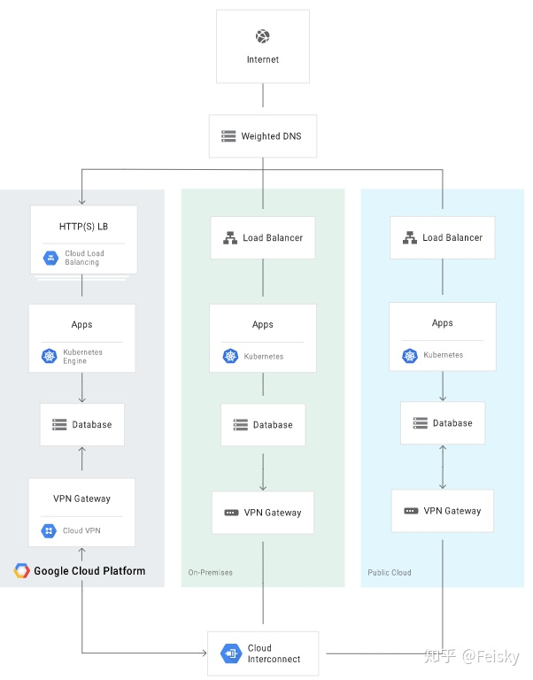
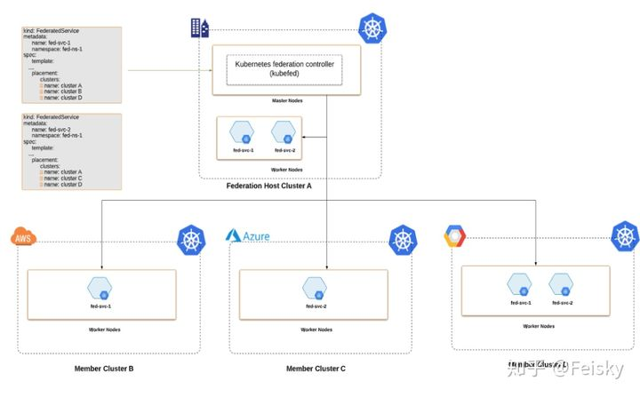

## 简化K8s开发！OAM与DAPR云原生应用的全流程研发实战

https://www.bilibili.com/video/av285507760/

### 云原生与传统应用程序的区别

- 拥抱错误，容错转移，资源调配
- 水平缩放、可用冗余；

### 云原生应用的需求

#### 快速、稳定重新发布应用

脚本-》虚拟机-》容器化

#### 动态、灵活的网络

配置脚本-》软件定义网路-》服务网格

## OpenApplicationModel

https://oam.dev

## Dapr

https://dapr.io/

 The Distributed Application Runtime

[Dapr介绍| Dapr学习笔记 - 敖小剑](https://skyao.io/learning-dapr/docs/introduction/introduction.html#:~:text=Dapr是一种可,边缘的分布式应用。&text=详细介绍是：,种语言和开发框架。)

### 工作方式

Dapr向每个计算单元注入了一个Sidecar容器/进程。Sidecar与事件触发器进行交互，并通过标准HTTP或gRPC协议与计算单元进行通信。这使Dapr能够支持所有现有和将来的编程语言，而无需您导入框架或库。

> [基于Kubernetes的多云和混合云- 知乎](https://zhuanlan.zhihu.com/p/136498020)

## **什么是多云和混合云**

伴随着Kubernetes和云原生的普及，高可用、高并发以及弹性突发等也成为很多应用程序的必备要求。而要实现这些功能，就需要应用程序不仅可以跨可用区和跨地区部署，还需要在云服务商容量不足或发生故障时自动切换到其他的云服务商或者混合云环境中去。并且，很多人也不希望把自己的所有服务都绑定到某一个云服务商中。

多云和混合云就是指应用程序可以跨本地数据中心和多家云服务商混合部署，并可以按需在它们之间进行动态调度。多云和混合云的好处包括：

- 解除云服务商锁定：不再单纯依赖于某一家云服务商或某个地域的数据中心
- 可用性保障：不仅可以跨地区和跨地域，即使某个云服务商出现故障应用程序还可以继续在其他云服务商运行
- 成本优化：可以根据云服务商的价格选择成本较低的方案，甚至是根据友商的成本去议价
- 弹性突发保障：本地数据中心或云服务商容量不足时，还可以扩展到其他云服务商中去

但是，多云和混合云的难点也很明显，最突出的结果问题是：

- 跨云网络的打通
- 跨云数据的一致性
- 海量数据的访问延迟
- 多云接口不一致带来的管理复杂度

为了解决这些问题，在 Kubernetes 诞生之前，其实就有很多云管理平台专门解决云平台资源异构的问题。这些云管理平台解决了云资源的管理、成本的优化甚至是应用的 Devops 等各种问题，但一般并不负责实际管理应用的编排，所以在很多地方也被称之为多云 1.0。

**Kubernetes催生了多云2.0**

在 Kubernetes 和容器技术诞生之前，要实现多云和混合云是相当难的，需要针对每一个云服务商进行定制化开发。由于应用程序跟云服务商的接口绑定，所以也会导致迁移云服务商时需要从基础架构到应用程序都做相应的适配。这是很多人在上云时都会碰到的痛点，这可以通过云管理平台来解决。

不过，目前的云管理平台更侧重于云资源的管理。虽然很多云管理平台也会提供应用的Deveops，但实际上只是把应用分发到不同的云平台上，并不负责应用程序的编排。比如，要想实现跨云的高可用和弹性突发，应用程序还是需要去调用不同云服务商的接口。

有了Kubernetes 和容器之后，本地数据中心和云服务商的Kubernetes集群可以提供一致的接口，这样应用程序在大部分情况下就不需要跟具体的云服务商直接绑定了。如果只考虑Kubernetes集群，云管理平台也可以进一步简化为多云的Kubernetes集群管理，再借助于Kubernetes Operator模式，很多Kubernetes应用依赖的云资源可以抽象为相同的CRD。这就进一步解耦了应用和云服务商，被很多人称之为多云 2.0。

说到Kubernetes的多云，最理想的是同一个Kubernetes集群横跨在多个不同的云平台上，通过同一个Kubernetes API去管理所有的应用。当然，由于云服务商差异、网络延迟、数据存储以及Kubernetes自身的规模限制等等，这种理想情况并不实用。

所以，现在主流的方法都是在不同的地区以及不同的云服务商运行多个集群，再在这些集群之上打通多个集群的应用。比如，最简单的是在多个集群中部署服务的副本，再通过 Consul、Linkerd 或者 Global DNS 去为它们做负载均衡。

下图是 Google Cloud 推荐的一种最简单的多集群服务发现方案：

## **多云和混合云都有哪些方案**

云管理管理平台已经解决了多云基础设施部署的问题，而 Kubernetes 实际上在各个云服务商之上成为了新的标准。自然，多云的下一步就是如何管理好多个不同 Kubernetes 集群中的应用，从而也诞生了很多开源或者商业的方案，这些方案各有侧重点。

**第一种方案是侧重解决弹性突发的问题**，典型的是 Virtual Kubelet。在本地集群容量不足时，可以把其他云服务商的容器产品作为虚拟节点接入到集群中来，从而就有了更大容量来运行应用。

**第二种方案是侧重解决服务治理和流量调度的问题**，典型的是 Service Mesh。不同集群的网络可以通过 Service Mesh（或者 Mesh Federation）打通，就可以实现网络流量的灵活调度和故障转移。实际上，也有很多应用通过隧道或者专线打通多个集群，进一步保证了多集群之间网络通信的可靠性。

**第三种方案是侧重解决跨集群资源的服务发现和编排问题**，典型的是 Kubernetes Cluster Federation V2。KubeFed 在 Kubernetes 原有的资源对象之上重新封装了可以跨集群的 CRD，控制器负责把它们分发到不同的集群中，再通过 ExternalDNS 等服务发现机制打通不同集群的应用。

前两种方案都已经有了很多实践案例，这些实践也证明了它们是行之有效的方案。而第三种方案还在早期探索阶段，个人觉得不太实用，离实际应用的场景还是离的比较远，多云之间的服务治理只靠 KubeFed 这些 CRD 还远远不够。

现在各大云平台都已经提供了托管Kubernetes服务，除去集群的创建过程，从应用程序的角度来看，绝大部分情况下没有任何区别。既然用户并不想把所有的服务都锁定在同一家云服务商中，跨云迁移就是很多用户的痛点。并且大型企业都会有跟已有应用打通的问题，所以主流的云服务商也都提供了跨云和混合云的方案，比如

- Microsoft Azure: Arc
- Google Cloud: Anthos
- AWS: Outposts
- VMware: Tanzu Mission Control
- Banzai Cloud PKE
- 阿里云 ACK

## **多云的未来**

虽然多云可以解决云服务商锁定的问题，但从前面的这些方案可以看出来，这些方案实际上只解决了某些特定的问题，而并没有很完善的方案来解决多云的所有问题。

除此之外，多云也会带来很多新的问题，比如

- 多云管理和编排比单个云要复杂得多，诸如数据同步、网络延迟、安全等都有很大挑战
- 更多的资源会带来基础设施成本的提高
- 对云基础设施的维护人员要求更高，需要熟悉多个云平台的基础设施，特别是都有哪些需要避免的坑

虽然问题还不少，但无论是开源社区还是各大云服务商都已经在大力解决多云和混合云中的种种问题。比如

- 诸如 Cilium Cluster Mesh、Istio Service Mesh 等网络方案已经支持了多集群。
- Linkerd 社区在设计如何支持Kubernetes多集群的场景 以及如何通过 Service Mirroring 支持 Kubernetes 多集群。
- Kubernetes 社区也在讨论支持 Multi-Cluster Service API。

多云和混合云的未来值得期待！

## 解决方案

[端点科技](https://duandian.com/)：[erda](https://docs.erda.cloud/1.1/manual/)

