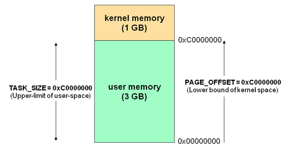
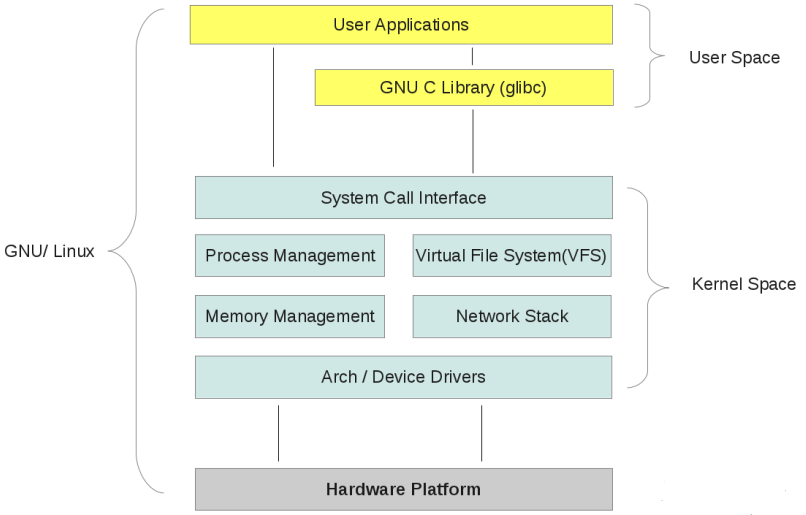
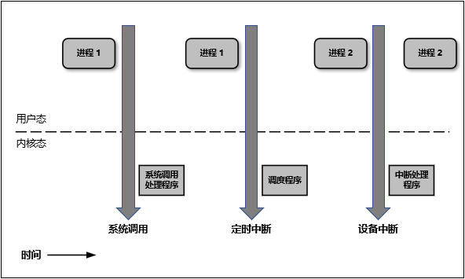

## 用户空间与内核空间

我们知道现在操作系统都是采用[虚拟存储器](https://baike.baidu.com/item/%E8%99%9A%E6%8B%9F%E5%AD%98%E5%82%A8%E5%99%A8#:~:text=%E8%99%9A%E6%8B%9F%E5%AD%98%E5%82%A8%E5%99%A8(Virtual%20Memory)%EF%BC%9A,%E7%BB%93%E6%9E%84%E5%92%8C%E5%8F%AF%E7%94%A8%E7%A3%81%E7%9B%98%E5%AE%B9%E9%87%8F%E3%80%82)，那么对32位操作系统而言，它的寻址空间（虚拟存储空间）为4G（2的32次

方）。

操心系统的核心是内核，独立于普通的应用程序，可以访问受保护的内存空间，也有访问底层硬件设备的所有权限。

为了保证用户进程不能直接操作内核，保证内核的安全，操心系统将虚拟空间划分为两部分，一部分为内核空间，一部分

为用户空间。针对linux操作系统而言，将最高的1G字节（从虚拟地址0xC0000000到0xFFFFFFFF），供内核使用，称为内

核空间，而将较低的3G字节（从虚拟地址0x00000000到0xBFFFFFFF），供各个进程使用，称为用户空间。每个进程可以

通过系统调用进入内核，因此，Linux内核由系统内的所有进程共享。于是，从具体进程的角度来看，每个进程可以拥有

4G字节的虚拟空间。空间分配如下图所示：

**有了用户空间和内核空间，整个linux内部结构可以分为三部分，从最底层到最上层依次是：硬件-->内核空间-->用户空间。**如下图所示：

## 为什么需要区分内核空间与用户空间

在 CPU 的所有指令中，有些指令是非常危险的，如果错用，将导致系统崩溃，比如清内存、设置时钟等。如果允许所有

的程序都可以使用这些指令，那么系统崩溃的概率将大大增加。

所以，CPU 将指令分为特权指令和非特权指令，对于那些危险的指令，只允许操作系统及其相关模块使用，普通应用程序

只能使用那些不会造成灾难的指令。比如 Intel 的 CPU 将特权等级分为 4 个级别：Ring0~Ring3。

其实 Linux 系统只使用了 Ring0 和 Ring3 两个运行级别(Windows 系统也是一样的)。当进程运行在 Ring3 级别时被称为运

行在用户态，而运行在 Ring0 级别时被称为运行在内核态。

## 内核态与用户态

好了我们现在需要再解释一下什么是内核态、用户态：

**当进程运行在内核空间时就处于内核态，而进程运行在用户空间时则处于用户态。**

在内核态下，进程运行在内核地址空间中，此时 CPU 可以执行任何指令。运行的代码也不受任何的限制，可以自由地访

问任何有效地址，也可以直接进行端口的访问。

在用户态下，进程运行在用户地址空间中，被执行的代码要受到 CPU 的诸多检查，它们只能访问映射其地址空间的页表

项中规定的在用户态下可访问页面的虚拟地址，且只能对任务状态段(TSS)中 I/O 许可位图(I/O Permission Bitmap)中规定

的可访问端口进行直接访问。

对于以前的 DOS 操作系统来说，是没有内核空间、用户空间以及内核态、用户态这些概念的。可以认为所有的代码都是

运行在内核态的，因而用户编写的应用程序代码可以很容易的让操作系统崩溃掉。

对于 Linux 来说，通过区分内核空间和用户空间的设计，隔离了操作系统代码(操作系统的代码要比应用程序的代码健壮很

多)与应用程序代码。即便是单个应用程序出现错误也不会影响到操作系统的稳定性，这样其它的程序还可以正常的运行

(Linux 可是个多任务系统啊！)。

**所以，区分内核空间和用户空间本质上是要提高操作系统的稳定性及可用性。**

## 如何从用户空间进入内核空间

其实所有的系统资源管理都是在内核空间中完成的。比如读写磁盘文件，分配回收内存，从网络接口读写数据等等。我们

的应用程序是无法直接进行这样的操作的。但是我们可以通过内核提供的接口来完成这样的任务。

比如应用程序要读取磁盘上的一个文件，它可以向内核发起一个 "系统调用" 告诉内核："我要读取磁盘上的某某文件"。其

实就是通过一个特殊的指令让进程从用户态进入到内核态(到了内核空间)，在内核空间中，CPU 可以执行任何的指令，当

然也包括从磁盘上读取数据。具体过程是先把数据读取到内核空间中，然后再把数据拷贝到用户空间并从内核态切换到用

户态。此时应用程序已经从系统调用中返回并且拿到了想要的数据，可以开开心心的往下执行了。

简单说就是应用程序把高科技的事情(从磁盘读取文件)外包给了系统内核，系统内核做这些事情既专业又高效。

对于一个进程来讲，从用户空间进入内核空间并最终返回到用户空间，这个过程是十分复杂的。举个例子，比如我们经常

接触的概念 "堆栈"，其实进程在内核态和用户态各有一个堆栈。运行在用户空间时进程使用的是用户空间中的堆栈，而运

行在内核空间时，进程使用的是内核空间中的堆栈。所以说，Linux 中每个进程有两个栈，分别用于用户态和内核态。

下图简明的描述了用户态与内核态之间的转换：

既然用户态的进程必须切换成内核态才能使用系统的资源，那么我们接下来就看看进程一共有多少种方式可以从用户态进

入到内核态。概括的说，有三种方式：**系统调用、软中断和硬件中断**。这三种方式每一种都涉及到大量的操作系统知

识，所以这里不做展开。

## 参考资料

- [计算机系统基础（八）虚拟存储器| Kaito's Blog](http://kaito-kidd.com/2018/09/06/computer-system-virtual-memory/)

- [Linux 内核空间与用户空间- sparkdev - 博客园](https://www.cnblogs.com/sparkdev/p/8410350.html)

