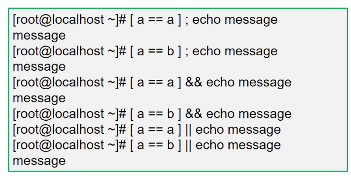

## 概述

shell是一种解释器，用来

Linux操作系统的核心是kernal（内核）！
当应用程序在执行时，需要调用计算机硬件的cpu,内存等资源！
程序将指令发送给内核执行！
为了防止程序发送一些恶意指令导致损坏内核，在内核和应用程序接口之间，设置一个中间层，称为shell!


我们可以通过 cat /etc/shells 查看系统提供的Shell解析器种类

```sh
[damon@hadoop97 ~]$ cat /etc/shells 
/bin/sh
/bin/bash
/sbin/nologin
/bin/dash
/bin/tcsh
/bin/csh
```

这里要说一下的是系统默认的解析器是bash

```sh
[damon@hadoop97 bin]$ echo $SHELL
/bin/bash
```

也可以这样查看

```sh
head -1 /etc/passwd //查看etc/passwd的第一行内容
```

每一个bash都是一个解释器，在你登录之后系统会启动默认设置的shell，也就是bash。此时在bash下再执行bash，即又开启了一个解释器。

```sh
bash //开启了一个新的解释器
pstree  //查看进程树
```


此时可以退出当前bash，使用exit命令。

## bash的优点

1. 快捷键，
   1. ctrl+A：将光标移至行首；
   2. ctrl+E：将光标移至行尾；
   3. ctrl+D：结束任务
   4. ctrl+U：删除前面所有内容
   5. ctrl+w：删除前面一个单词，以空格为界
2. 历史记录
3. 补齐命令：tab键
4. 管道|，覆盖重定向 >，追加重定向 >>

### 执行脚本的方式

赋予执行权限（``chmod +x ``脚本文件名），直接执行

- 绝对路径执行
- 相对路径执行

不需要文件有可执行的权限

- sh | bash 脚本文件名
- source 脚本文件名（不会启动子进程，可通过pstree查看进程树）

## 变量

```sh
a=1
echo $1

x=centos
echo ${x}7.1 //centos7.1
```

### 变量类型

环境变量（etc/profile或~/.bash_profile）

- 命令env可以列出所有环境变量

位置变量（存储脚本执行时的参数）

- 使用$n表示，n为数字序列号

预定义变量（用来保存脚本程序的执行信息）

- 能直接使用这些变量，但不能直接为这些变量赋值
- $0：表示当前所在的进程或脚本名
- $$：表示当前运行进程的PID号
- $?：命令执行后的返回状态，0表示正常，1或其他值表示异常
- $#：已加载的位置变量的个数
- $*：所有变量的值

### 区分多种引号的区别

- 双引号""：允许扩展，以$引用其他变量
- 单引号''：禁用扩展，即便$也视为普通字符
- 反引号``：将命令的执行输出作为变量值，$()与反引号等效


不加引号，使用``touch a b c``，会创建三个文件，而使用``touch "a b c"``则只创建了a b c这一个文件，同理在删除文件的时候也是一样的。`` rm -rf a b c``

单引号和双引号的区别


反引号使用


### read标准输入取值

read从键盘读入变量值完成赋值

- read [-p "提示信息"] 变量名
- -p可选，-t可指定超时秒数，-s设置是否在终端显示输入的内容

```sh
#!/bin/bash
read -p "请输入用户名：" name
read -p "请输入密码：" -s pass
useradd "$name"
echo "$pass" | passwd --stdin "$name"
```

### 变量的作用范围

局部变量

- 新定义的变量默认只在当前Shell环境中有效，无法在子Shell环境中使用

全局变量

- 全局变量在当前Shell及子Shell环境中均有效


## shell中的运算

使用$[]算式替换

- 格式：$[整数1 运算符 整数2]
- 计算结果替换表达式本身，可结合echo命令输出


### bc计算器

bash内建机制仅支持整数运算，不支持小数运算，可以通过计算器软件bc实现小数运算

- 如果没有该软件需要使用yum安装
- bc支持交互式和非交互式两种方式计算，scale=n可以约束小数位

```sh
yum -y install bc
```


交互执行，使用quit退出。

非交互使用，小数的大小比较

- bc支持的比较操作符：>、 >=、 <、 <=、 ==、 !=
- 表达式成立返回1，否则返回0


## echo回显

-n 选项：不换行

-e 选项：支持扩展属性


## 实例

显示服务器硬件信息脚本实例

```sh
#!bin/bash
#显示服务器硬件信息
echo -e "\033[34m------服务器硬件信息------\033[0m"
echo -e "\033[32m网卡信息如下:\033[0m"
ifconfig eth0 | grep "inet "
echo -e "\033[32m剩余内存容量信息如下：\033[0m"
grep MemAvailable /proc/meminfo
echo -e "\033[32m磁盘容量信息如下：033[0m"
df -h /
echo -e "\033[32mCPU信息如下：\033[0m"
grep "model name" /proc/cpuinfo
```

数据计算

```sh
#!bin/bash
#计算1+2+3。。。+n的和，可以使用n*(n+1)/2的公式快速计算结果
read -p "请输入一个正整数："num
sum=$[num*(num+1)]/2]
echo -e "\033[32m$num以内整数的总和是：$sum\033[0m"

# 使用三角形的底边和高计算面积：A=1/2bh
read -p "请输入三角形的底边长度"：bottom
read -p "请输入三角形的高度："high
A=$(echo "scale=1;1/2*$bottom*$high" | bc)
echo -e "\033[32m三角形面积是：$A\033[0m"
```

配置YUM源脚本

```sh
#!bin/bash
#定义yum源的路径
URL=ftp://192.168.4.1/centos

#创建YUM源配置文件
echo "[CENTOS]"
name=centos
baseurl=$URL
gpgcheck=0" > /etc/yum.repos.d/iyum.repo
```

## 条件测试

### test测试操作

test 选项 参数，使用``help test``查询帮助

### 字符串比较

- 是否为空[  -z  字符串 ]
- 等于[ 字符串1 == 字符串2 ]
- 不等于[ 字符串1 != 字符串2 ]


### 整数值比较

注意[]中，整数值1和整数值2左右需要有一个空格。


查看当前登录用户数是否大于2

```sh
[root@amesh-k8s-01 ~]# who
root     pts/0        2022-02-10 09:18 (172.21.32.106)
root     pts/1        2022-02-10 09:18 (172.21.33.160)
[root@amesh-k8s-01 ~]# who | wc -l
2
[root@amesh-k8s-01 ~]# [ $(who | wc -l) -ge 2 ]
[root@amesh-k8s-01 ~]# echo $?
0
```

### 文件状态


```sh

[root@amesh-k8s-01 ~]# [ -e /etc ]  //判断是否存在/etc
[root@amesh-k8s-01 ~]# echo $?
0
```

## 控制操作符

### 组合多个命令

使用控制符组合多个命令

- ;（两个命令顺序执行）
- &&（两个命令顺序执行，但是第二个命令需第一个命令执行成功才会执行）
- ||（或的关系，优先执行前一个命令，第一个命令失败才会执行第二个命令）



### 实例

基础命令

- ``tr -s ``删除多余重复的字符串

```sh
[root@amesh-k8s-01 ~]# echo "a   bb  cc  dd     a"|tr -s " "  #删除多余的空格
a bb cc dd a
[root@amesh-k8s-01 ~]# echo "aaaaaaaaaq" |tr -s "a"  #删除多余的a
aq
```

- `` cut``过滤数据

```sh
[root@amesh-k8s-01 ~]# head -1 /etc/passwd
root:x:0:0:root:/root:/bin/bash  # 可以看到/etc/passwd的内容是以冒号为分割的
[root@amesh-k8s-01 ~]# cut -d: -f1 /etc/passwd  #以冒号为分隔，过滤第一列
```

监控系统信息脚本

```sh
#!bin/bash
#本脚本获取系统各项性能参数指标，并与预设阈值进行比较

#time:时间，loalip:eth0网卡IP，free_mem:剩余内存大小，free_disk:剩余磁盘大小
#cpu_load:15min平均负载，login_user:登录系统的用户，procs:当前进程数量

local_time=$(date+"%Y%M%D%H:%M:%S")
local_ip=$(ifconfig eth0 | grep netmask | tr -s " " | cut -d " " -f3)
free_mem=$(cat /proc/meminfo | grep Avai | tr -s " " | cut -d " " -f2)
free_disk=$(df | grep "/$" | tr -s " " | cut -d '' -f4)  #只看根结尾目录的数据
cpu_load=$( cat /proc/loadavg | cut -d " " -f3)
login_user=$(who | wc -l)
procs=$(ps aux | wc -l)

#当剩余内存不足1GB时发送邮件给root进行报警
[$free_mem -lt 1048576] && echo "$local_time Free memory not enough.Free_men:$free_mem on $local_ip | mail -s Warning root@localhost"

#当剩余磁盘不足10GB时发送邮件给root进行报警
[$free_disk -l 10485760] && echo "$local_time Free disk not enough.root_free_disk:$free_disk on $local_ip | mail -s Warning root@localhost"

#当CPU的15min平均负载超过4时发送邮件给root进行报警
result=$(echo "$cpu_load > 4" | bc)
[$result -eq 1] && echo "$local_time CPU load too high CPU 15 averageload:$cpu_load on $local_ip | mail -s Warning root@localhost"

#当系统实时在线人数超过3人时发送邮件给root进行报警
[$login_user -gt 3] && echo "$local_time Too many user.$login_user users login to $local_ip | main -s Warning root@loalhost"

#当实时进程数量大于500时发送邮件给root进行报警
[$procs -gt 500] && echo "$local_time Too many procs.$procs proc are runing on $local_ip | mail -s Warning root@localhost"
```

## if语句

语法1

```sh
if 条件测试
	then 命令序列
else
	命令序列
fi
```

语法2

```sh
if 条件测试;then
	命令序列
else
	命令序列
fi
```

区别就是有没有写在一行，用分号分隔；

判断用户名与密码是否为空

```sh
#!/bin/bash
read -p "请输入用户名:" user
read -p -s "请输入密码:" pass
if [!-z "$user"];then
	useradd "$user"
fi
if [!-z "$pass"];then
	echo "$pass" | passwd --stdin "$user"
fi
echo  //换行
```

测试主机是否能ping通

```sh
#!/bin/bash
#ping通脚本返回up,否则返回down

if [-z "$1"];then
	echo -n "用法：脚本"
	echo -e "\033[32m域名或IP\033[0m"
	exit
else
	#-c(设置ping的次数),-i(设置ping的间隔),-w(设置超时时间),结果全部输出到/dev/null中
	ping -c2 -i0.1 -W1 "$1" &>/dev/null 
	if [$? -eq 0];then
		echo "$1 is up"
	else
		echo "$2 is down"
fi
```

注：`/dev/null` is the null file. Anything written to it is discarded.

### 多分支

语法

```sh
if 条件测试1;then
	命令序列1
elif 条件判断2;then
	命令序列2
.....
else
	命令序列
fi
```

应用案例之猜数字

```sh
#!/bin/bash
#脚本自动生成10以内的随机数，根据用户的输入，输出判断结果
clear
num=$[RANDOM%10+1]
read -p "请输入1-10之间的整数：" guess
if[$guess -eq $num];then
	echo "恭喜，猜对了，就是：$num"
elif [$guess -gt $num];then
	echo "Oops,猜大了"
else
	echo "Oops,猜小了"
fi
```

注：RANDOM是系统变量，一个随机数

## for循环

```sh
for 变量 in 值列表
do
	命令序列
done

for((初值;条件;步长))
do
	命令序列
done
```

实例

```sh
#!/bin/bash
for i in 1 8 ab 99 eq
do
	echo "I am $i"
done

for ((i=1; i<=5;i++))
do
	echo "I am $i"
done
```

注意：所以当需要多次循环时可以使用这种写法{1..10},{a..z}

```sh
[root@ado-01 ~]# echo {1..99}
1 2 3 4 5 6 7 8 9 10 11 12 13 14 15 16 17 18 19 20 21 22 23 24 25 26 27 28 29 30 31 32 33 34 35 36 37 38 39 40 41 42 43 44 45 46 47 48 49 50 51 52 53 54 55 56 57 58 59 60 61 62 63 64 65 66 67 68 69 70 71 72 73 74 75 76 77 78 79 80 81 82 83 84 85 86 87 88 89 90 91 92 93 94 95 96 97 98 99

```

读取账户名列表文件创建系统用户

```sh
more user.txt
page
ocean
book
```

```sh
#!/bin/bash
for i in $(cat user.txt)
do
	user add "$i"
	echo "123456" | passwd --stdin "$i"
done
```

循环的嵌套

```sh
#!/bin/bash
for ((i=1; i<=9;i++))
do
	for((j=1; j<=i; j++))
	do
		echo -n "$i*$j=$[i*j]"
	done
	echo
done
```

## while循环

```sh
while 条件测试
do
	命令序列
done
```

实例

```sh
#!/bin/bash
i=1
while [ $i -le 5]
do
	echo $i
	let i++
done
```

死循环写法

```sh
#!/bin/bash
while :
do
	echo hello world
done
```

猜数字改造

```sh
#!/bin/bash
#脚本自动生成10以内的随机数，根据用户的输入，输出判断结果
num=$[RANDOM%10+1]
while :
do
	read -p "请输入1-10之间的整数：" guess
	if[$guess -eq $num];then
		echo "恭喜，猜对了，就是：$num"
		exit
	elif [$guess -gt $num];then
		echo "Oops,猜大了"
	else
		echo "Oops,猜小了"
	fi
done
```

### 实例

安装ftp软件

```sh
#!/bin/bash
if rpm -q vsftpd &> /dev/null; then
	echo "vsftpd已经安装"
else
	yum -y install vsftpd
fi
systemctl restart vsftpd
```

注：``rpm -q 包名``可以查看某个软件是否安装。更多rpm的资料：https://linuxize.com/post/rpm-command-in-linux/

监控网络流量

```sh
#!/bin/bash
while :
do 
	clear
	echo '本地网卡eth0流量信息如下:'
	ifconfig eth0 | grep "RX pack" | tr -s "" | cut -d "" -f6
	ifconfig eth0 | grep "TX pack" | tr -s "" | cut -d "" -f6
	sleep 1
done
```


## linux文本三剑客

[shell三剑客实战](https://blog.windanchaos.tech/2020/05/17/shell%E4%B8%89%E5%89%91%E5%AE%A2%E5%AE%9E%E6%88%98/)

- awk：最基本的作用，按规则输出列。

- sed，用途：数据选、换、增、查。
- grep，数据查找和定位。

## 参考

- [视频学习](https://www.bilibili.com/video/BV1qA411L7XW?p=3&spm_id_from=pageDriver)

