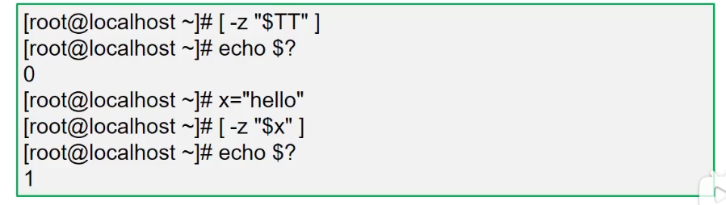

## 概述

shell是一种解释器，用来

Linux操作系统的核心是kernal（内核）！
当应用程序在执行时，需要调用计算机硬件的cpu,内存等资源！
程序将指令发送给内核执行！
为了防止程序发送一些恶意指令导致损坏内核，在内核和应用程序接口之间，设置一个中间层，称为shell!


我们可以通过 cat /etc/shells 查看系统提供的Shell解析器种类

```sh
[damon@hadoop97 ~]$ cat /etc/shells 
/bin/sh
/bin/bash
/sbin/nologin
/bin/dash
/bin/tcsh
/bin/csh
```

这里要说一下的是系统默认的解析器是bash

```sh
[damon@hadoop97 bin]$ echo $SHELL
/bin/bash
```

也可以这样查看

```sh
head -1 /etc/passwd //查看etc/passwd的第一行内容
```

每一个bash都是一个解释器，在你登录之后系统会启动默认设置的shell，也就是bash。此时在bash下再执行bash，即又开启了一个解释器。

```sh
bash //开启了一个新的解释器
pstree  //查看进程树
```


此时可以退出当前bash，使用exit命令。

## bash的优点

1. 快捷键，
   1. ctrl+A：将光标移至行首；
   2. ctrl+E：将光标移至行尾；
   3. ctrl+D：结束任务
   4. ctrl+U：删除前面所有内容
   5. ctrl+w：删除前面一个单词，以空格为界
2. 历史记录
3. 补齐命令：tab键
4. 管道|，覆盖重定向 >，追加重定向 >>

### 执行脚本的方式

赋予执行权限（``chmod +x ``脚本文件名），直接执行

- 绝对路径执行
- 相对路径执行

不需要文件有可执行的权限

- sh | bash 脚本文件名
- source 脚本文件名（不会启动子进程，可通过pstree查看进程树）

## 变量

### 变量初始化

- 变量有值，则返回该变量的值
- 变量无值，则返回初始值

格式：``${变量:-关键词}``


```sh
a=1
echo $1

x=centos
echo ${x}7.1 //centos7.1
```

### 变量类型

环境变量（etc/profile或~/.bash_profile）

- 命令env可以列出所有环境变量

位置变量（存储脚本执行时的参数）

- 使用$n表示，n为数字序列号

预定义变量（用来保存脚本程序的执行信息）

- 能直接使用这些变量，但不能直接为这些变量赋值
- $0：表示当前所在的进程或脚本名
- $$：表示当前运行进程的PID号
- $?：命令执行后的返回状态，0表示正常，1或其他值表示异常
- $#：已加载的位置变量的个数
- $*：所有变量的值

### 区分多种引号的区别

- 双引号""：允许扩展，以$引用其他变量
- 单引号''：禁用扩展，即便$也视为普通字符
- 反引号``：将命令的执行输出作为变量值，$()与反引号等效


不加引号，使用``touch a b c``，会创建三个文件，而使用``touch "a b c"``则只创建了a b c这一个文件，同理在删除文件的时候也是一样的。`` rm -rf a b c``

单引号和双引号的区别


反引号使用


### read标准输入取值

read从键盘读入变量值完成赋值

- read [-p "提示信息"] 变量名
- -p可选，-t可指定超时秒数，-s设置是否在终端显示输入的内容

```sh
#!/bin/bash
read -p "请输入用户名：" name
read -p "请输入密码：" -s pass
useradd "$name"
echo "$pass" | passwd --stdin "$name"
```

### 变量的作用范围

局部变量

- 新定义的变量默认只在当前Shell环境中有效，无法在子Shell环境中使用

全局变量

- 全局变量在当前Shell及子Shell环境中均有效


### 数组

存储多个数据的集合就是数组


### 字符串处理

#### 字串截取

``${变量:起始位置:长度}``，注意编号是从0开始。

```sh
[root@ado-01 ~]# phone=13812345678
[root@ado-01 ~]# echo ${#phone}  #统计变量长度
11
[root@ado-01 ~]# echo ${phone:0:3}
138
[root@ado-01 ~]# echo ${phone:3:3}
123
[root@ado-01 ~]# echo ${phone:4} #从第四位开始截取到末尾
2345678
[root@ado-01 ~]# echo ${phone:4:-2} #截取到末尾的倒数第二位
23456
```

#### 字串替换

- 替换一个结果

``${变量/旧字串/新字串}``

- 替换全部结果

``${变量//旧字串//新字串}``

```sh
[root@ado-01 ~]# phone=13812345678
[root@ado-01 ~]# echo ${phone/3/x}
1x812345678
[root@ado-01 ~]# echo ${phone//3//x}
1/x812/x45678
```

#### 字串掐头

- 从左向右，最短匹配删除

``${变量#关键词}``

- 从左向右，最长匹配删除

``${变量##关键词}``

```sh
[root@ado-01 ~]# A=`head -1 /etc/passwd`
[root@ado-01 ~]# echo $A
root:x:0:0:root:/root:/bin/bash
[root@ado-01 ~]# echo ${A#*:}   #*表示通配符，*:表示冒号前面所有的东西
x:0:0:root:/root:/bin/bash
[root@ado-01 ~]# echo ${A##*:}
/bin/bash
```

#### 字串去尾

- 从右向左，最短匹配删除

``${变量%关键词}``

- 从右向左，最长匹配删除

``${变量##关键词}``

```sh
[root@ado-01 ~]# A=`head -1 /etc/passwd`
[root@ado-01 ~]# echo $A
root:x:0:0:root:/root:/bin/bash
[root@ado-01 ~]# echo ${A%:*}
root:x:0:0:root:/root
[root@ado-01 ~]# echo ${A%%:*}
root
```

批量修改文件扩展名

修改文件名的命令为`` mv a.txt a.doc``，其实就是去尾，把.后面的全部删除，然后加上.doc

```sh
[root@ado-01 ~]# touch {a,b,c,d,e,f}.txt

#!/bin/bash
for i in $(ls *.txt)
do
	mv $i ${i%.*}.doc
done
```

随机密码

```sh
#!/bin/bash
#定义变量:10个数字+52个字母。用随机数对62取余数，返回的结果为【0-61】
key="abcdefghijklmnopqrstuvwxyzABCDEFGHIGKLMNOPQRSTUVWXYZ0123456789"
pass=""
for i in {1..10} //密码为10位
do
	num=$[RANDOM%${#key}]
	tmp=${key:num:1}
	pass=${pass}${tmp}
done
echo $pass
```

使用命令生成随机密码

- uuidgen
- openssl


使用随机设备文件（/dev/random、/dev/urandom）

```sh
strings /dev/random
strings /dev/urandom
```

strings命令能查看文件中可打印的字符串。


tr命令可以对数据进行替换、删除等操作。

- -c: 取反
- -d: 删除

tr 指令从标准输入设备读取数据，经过字符串转译后，将结果输出到标准输出设备。

```sh
tr -cd '0-9a-zA-Z' < /dev/urandom | head -c 10

#删除随机数据中不是数字、小写字母、大写字母的数据
#在截取出来的字串中提取前10个字符
```


## shell中的运算

使用$[]算式替换

- 格式：$[整数1 运算符 整数2]
- 计算结果替换表达式本身，可结合echo命令输出


### bc计算器

bash内建机制仅支持整数运算，不支持小数运算，可以通过计算器软件bc实现小数运算

- 如果没有该软件需要使用yum安装
- bc支持交互式和非交互式两种方式计算，scale=n可以约束小数位

```sh
yum -y install bc
```


交互执行，使用quit退出。

非交互使用，小数的大小比较

- bc支持的比较操作符：>、 >=、 <、 <=、 ==、 !=
- 表达式成立返回1，否则返回0


## echo回显

-n 选项：不换行

-e 选项：支持扩展属性


## 实例

显示服务器硬件信息脚本实例

```sh
#!bin/bash
#显示服务器硬件信息
echo -e "\033[34m------服务器硬件信息------\033[0m"
echo -e "\033[32m网卡信息如下:\033[0m"
ifconfig eth0 | grep "inet "
echo -e "\033[32m剩余内存容量信息如下：\033[0m"
grep MemAvailable /proc/meminfo
echo -e "\033[32m磁盘容量信息如下：033[0m"
df -h /
echo -e "\033[32mCPU信息如下：\033[0m"
grep "model name" /proc/cpuinfo
```

数据计算

```sh
#!bin/bash
#计算1+2+3。。。+n的和，可以使用n*(n+1)/2的公式快速计算结果
read -p "请输入一个正整数："num
sum=$[num*(num+1)]/2]
echo -e "\033[32m$num以内整数的总和是：$sum\033[0m"

# 使用三角形的底边和高计算面积：A=1/2bh
read -p "请输入三角形的底边长度"：bottom
read -p "请输入三角形的高度："high
A=$(echo "scale=1;1/2*$bottom*$high" | bc)
echo -e "\033[32m三角形面积是：$A\033[0m"
```

配置YUM源脚本

```sh
#!bin/bash
#定义yum源的路径
URL=ftp://192.168.4.1/centos

#创建YUM源配置文件
echo "[CENTOS]"
name=centos
baseurl=$URL
gpgcheck=0" > /etc/yum.repos.d/iyum.repo
```

## 条件测试

### test测试操作

test 选项 参数，使用``help test``查询帮助

### 字符串比较

- 是否为空[  -z  字符串 ]
- 等于[ 字符串1 == 字符串2 ]
- 不等于[ 字符串1 != 字符串2 ]



### 整数值比较

注意[]中，整数值1和整数值2左右需要有一个空格。


查看当前登录用户数是否大于2

```sh
[root@amesh-k8s-01 ~]# who
root     pts/0        2022-02-10 09:18 (172.21.32.106)
root     pts/1        2022-02-10 09:18 (172.21.33.160)
[root@amesh-k8s-01 ~]# who | wc -l
2
[root@amesh-k8s-01 ~]# [ $(who | wc -l) -ge 2 ]
[root@amesh-k8s-01 ~]# echo $?
0
```

### 文件状态


```sh

[root@amesh-k8s-01 ~]# [ -e /etc ]  //判断是否存在/etc
[root@amesh-k8s-01 ~]# echo $?
0
```

## 控制操作符

### 组合多个命令

使用控制符组合多个命令

- ;（两个命令顺序执行）
- &&（两个命令顺序执行，但是第二个命令需第一个命令执行成功才会执行）
- ||（或的关系，优先执行前一个命令，第一个命令失败才会执行第二个命令）


### 实例

基础命令

- ``tr -s ``删除多余重复的字符串

```sh
[root@amesh-k8s-01 ~]# echo "a   bb  cc  dd     a"|tr -s " "  #删除多余的空格
a bb cc dd a
[root@amesh-k8s-01 ~]# echo "aaaaaaaaaq" |tr -s "a"  #删除多余的a
aq
```

- `` cut``过滤数据

```sh
[root@amesh-k8s-01 ~]# head -1 /etc/passwd
root:x:0:0:root:/root:/bin/bash  # 可以看到/etc/passwd的内容是以冒号为分割的
[root@amesh-k8s-01 ~]# cut -d: -f1 /etc/passwd  #以冒号为分隔，过滤第一列
```

监控系统信息脚本

```sh
#!bin/bash
#本脚本获取系统各项性能参数指标，并与预设阈值进行比较

#time:时间，loalip:eth0网卡IP，free_mem:剩余内存大小，free_disk:剩余磁盘大小
#cpu_load:15min平均负载，login_user:登录系统的用户，procs:当前进程数量

local_time=$(date+"%Y%M%D%H:%M:%S")
local_ip=$(ifconfig eth0 | grep netmask | tr -s " " | cut -d " " -f3)
free_mem=$(cat /proc/meminfo | grep Avai | tr -s " " | cut -d " " -f2)
free_disk=$(df | grep "/$" | tr -s " " | cut -d '' -f4)  #只看根结尾目录的数据
cpu_load=$( cat /proc/loadavg | cut -d " " -f3)
login_user=$(who | wc -l)
procs=$(ps aux | wc -l)

#当剩余内存不足1GB时发送邮件给root进行报警
[$free_mem -lt 1048576] && echo "$local_time Free memory not enough.Free_men:$free_mem on $local_ip | mail -s Warning root@localhost"

#当剩余磁盘不足10GB时发送邮件给root进行报警
[$free_disk -l 10485760] && echo "$local_time Free disk not enough.root_free_disk:$free_disk on $local_ip | mail -s Warning root@localhost"

#当CPU的15min平均负载超过4时发送邮件给root进行报警
result=$(echo "$cpu_load > 4" | bc)
[$result -eq 1] && echo "$local_time CPU load too high CPU 15 averageload:$cpu_load on $local_ip | mail -s Warning root@localhost"

#当系统实时在线人数超过3人时发送邮件给root进行报警
[$login_user -gt 3] && echo "$local_time Too many user.$login_user users login to $local_ip | main -s Warning root@loalhost"

#当实时进程数量大于500时发送邮件给root进行报警
[$procs -gt 500] && echo "$local_time Too many procs.$procs proc are runing on $local_ip | mail -s Warning root@localhost"
```

## if语句

语法1

```sh
if 条件测试
	then 命令序列
else
	命令序列
fi
```

语法2

```sh
if 条件测试;then
	命令序列
else
	命令序列
fi
```

区别就是有没有写在一行，用分号分隔；

判断用户名与密码是否为空

```sh
#!/bin/bash
read -p "请输入用户名:" user
read -p -s "请输入密码:" pass
if [!-z "$user"];then
	useradd "$user"
fi
if [!-z "$pass"];then
	echo "$pass" | passwd --stdin "$user"
fi
echo  //换行
```

测试主机是否能ping通

```sh
#!/bin/bash
#ping通脚本返回up,否则返回down

if [-z "$1"];then
	echo -n "用法：脚本"
	echo -e "\033[32m域名或IP\033[0m"
	exit
else
	#-c(设置ping的次数),-i(设置ping的间隔),-w(设置超时时间),结果全部输出到/dev/null中
	ping -c2 -i0.1 -W1 "$1" &>/dev/null 
	if [$? -eq 0];then
		echo "$1 is up"
	else
		echo "$2 is down"
fi
```

注：`/dev/null` is the null file. Anything written to it is discarded.

### 多分支

语法

```sh
if 条件测试1;then
	命令序列1
elif 条件判断2;then
	命令序列2
.....
else
	命令序列
fi
```

应用案例之猜数字

```sh
#!/bin/bash
#脚本自动生成10以内的随机数，根据用户的输入，输出判断结果
clear
num=$[RANDOM%10+1]
read -p "请输入1-10之间的整数：" guess
if[$guess -eq $num];then
	echo "恭喜，猜对了，就是：$num"
elif [$guess -gt $num];then
	echo "Oops,猜大了"
else
	echo "Oops,猜小了"
fi
```

注：RANDOM是系统变量，一个随机数

## for循环

```sh
for 变量 in 值列表
do
	命令序列
done

for((初值;条件;步长))
do
	命令序列
done
```

实例

```sh
#!/bin/bash
for i in 1 8 ab 99 eq
do
	echo "I am $i"
done

for ((i=1; i<=5;i++))
do
	echo "I am $i"
done
```

注意：所以当需要多次循环时可以使用这种写法{1..10},{a..z}

```sh
[root@ado-01 ~]# echo {1..99}
1 2 3 4 5 6 7 8 9 10 11 12 13 14 15 16 17 18 19 20 21 22 23 24 25 26 27 28 29 30 31 32 33 34 35 36 37 38 39 40 41 42 43 44 45 46 47 48 49 50 51 52 53 54 55 56 57 58 59 60 61 62 63 64 65 66 67 68 69 70 71 72 73 74 75 76 77 78 79 80 81 82 83 84 85 86 87 88 89 90 91 92 93 94 95 96 97 98 99

```

读取账户名列表文件创建系统用户

```sh
more user.txt
page
ocean
book
```

```sh
#!/bin/bash
for i in $(cat user.txt)
do
	user add "$i"
	echo "123456" | passwd --stdin "$i"
done
```

循环的嵌套

```sh
#!/bin/bash
for ((i=1; i<=9;i++))
do
	for((j=1; j<=i; j++))
	do
		echo -n "$i*$j=$[i*j]"
	done
	echo
done
```

## while循环

```sh
while 条件测试
do
	命令序列
done
```

实例

```sh
#!/bin/bash
i=1
while [ $i -le 5]
do
	echo $i
	let i++
done
```

死循环写法

```sh
#!/bin/bash
while :
do
	echo hello world
done
```

猜数字改造

```sh
#!/bin/bash
#脚本自动生成10以内的随机数，根据用户的输入，输出判断结果
num=$[RANDOM%10+1]
while :
do
	read -p "请输入1-10之间的整数：" guess
	if[$guess -eq $num];then
		echo "恭喜，猜对了，就是：$num"
		exit
	elif [$guess -gt $num];then
		echo "Oops,猜大了"
	else
		echo "Oops,猜小了"
	fi
done
```

### 实例

安装ftp软件

```sh
#!/bin/bash
if rpm -q vsftpd &> /dev/null; then
	echo "vsftpd已经安装"
else
	yum -y install vsftpd
fi
systemctl restart vsftpd
```

注：``rpm -q 包名``可以查看某个软件是否安装。更多rpm的资料：https://linuxize.com/post/rpm-command-in-linux/

监控网络流量

```sh
#!/bin/bash
while :
do 
	clear
	echo '本地网卡eth0流量信息如下:'
	ifconfig eth0 | grep "RX pack" | tr -s "" | cut -d "" -f6
	ifconfig eth0 | grep "TX pack" | tr -s "" | cut -d "" -f6
	sleep 1
done
```

## case语句

```sh
case 变量 in
模式1)
	命令序列1 ;;
模式2)
	命令序列2 ;;
*)
	默认命令序列
esac
```

注意命令序列最后必须以双分号结尾

判断用户输入

```sh
#!/bin/bash
read -p "Are you sure?[y/n]:" sure
case $sure in
y|Y|yes|YES)
	echo "you enter $sure,OK";;
n|N|no|NO)
	echo "you enter $sure,OVER";;
*)
	echo "error";;
esac
```

石头剪刀布游戏

```sh
#!/bin/bash
game=(石头 剪刀 布)
num=$[RANDOW%3]
computer=${game[$num]}

#通过随机数获取计算机的出拳
#出拳的可能性保存在一个数组中：game[0],game[1],game[2]

echo "请根据下列提示选择您的出拳手势"
echo "1.石头"
echo "2.剪刀"
echo "3.布"

read -p "请选择1-3:"person
case $person in
1)
	if [$num -eq 0]; then
		echo "平局"
	if [$num -eq 1]; then
		echo "你赢"
	else
		echo "计算机赢"
	fi;;
2)
	if [$num -eq 0]; then
		echo "计算机赢"
	if [$num -eq 1]; then
		echo "平局"
	else
		echo "你赢"
	fi;;
3)
	if [$num -eq 0]; then
		echo "你赢"
	if [$num -eq 1]; then
		echo "计算机赢"
	else
		echo "平局"
	fi;;
*)
	echo "必须输入1-3的数字"
esac
```

## shell函数

### 实例

```sh
function 函数名{
	命令序列
}

函数名() {
	命令序列
}
```

```sh
[root@ado-01 ~]# imsg(){
> echo "hello world"
> echo "compute cloud"
> }
[root@ado-01 ~]# imsg
hello world
compute cloud
```

传递参数

```sh
[root@ado-01 ~]# add(){
> echo $[$1+$2]
> }
[root@ado-01 ~]# add 1 3
4
[root@ado-01 ~]#
```

带颜色的输出

```sh
#!/bin/bash
cecho(){
	echo -e "\-33[$1m$2\033[0m"
}

cecho 31 ok
cecho 32 ok
cecho 33 ok
cecho 34 ok
cecho 35 error
```


多进程版ping测试

```sh
#!/bin/bash
myping(){
	ping -c3 -i0.2 -W1 $1 &>/dev/null
	if [$? -eq 0];then
		echo "$1 is up"
    else
    	echo "$1 is down"
    fi
}

for i in {1..254}
do
	myping "192.168.4.$i" &
done
wait
```

**使用&符号，将执行的函数放入后台执行，wait等待所有后台进程结束后退出脚本**

### 中断与退出

- ``continue``可以结束单次循环
- ``break``可以结束循环体
- ``exit``可以退出脚本

双色球脚本

```sh
#!/bin/bash
#功能描述：机选双色球
red_ball=""
blue_ball=""

#每选出一个号码通过+=的方式存到变量中
#通过grep判断机选的红色号码是否已经存在-w选项过滤单词
while:
do
	clear
	echo "---机选双色球---"
	tmp=$[RANDOM%33+1] #红球是1-33中的随机数
	#下面这条命令是保证不会存在相同的红球
	echo "$red_ball" | grep -q -w $tmp && continue #-q表示查找内容并且不显示，-w表示查找指定内容的单词，
	#注意这里有一个空格，即将数字依次连接
	red_ball+=" $tmp"
	echo -en "\033[91m$red_ball\-33[0m"
	#wc -w是统计单词数，即红球的个数
	word=$(echo "$red_ball||" wc -w)
	if [$word -eq 6];then
		blue_ball=$[RANDOM%16+1] #蓝球是从1-16，取出一个蓝球
		echo -e "\033[34m $blue_ball\033[0m"
		break
	fi
	sleep 0.5
done

```

关于``grep -q -w``命令可以看这个


## 综合案例

### 进度条

```sh
#!/bin/bash
bar(){
	while:
	do
		echo -en "\033[42m\033[0m"
		sleep 0.5
	done
}
bar & cp -r $1 $2  #复制文件，&表示这个bar方法放入后台执行
kill $!  #kill杀掉的是bar这个进程 $!表示的最后一个进程的PID
echo
```


### fork炸弹

无限循环自己，消耗系统资源，执行会让电脑瞬间死机

```sh
#.(){.|.&};.  #仅需13个字符

.(){		#定义函数,函数名为.
	.|.&	#在函数内调用自己
}
.			#执行函数
```

## 正则表达式

Regular Expression（RegEx）：描述一个字符集合的表达方式，是一个模糊匹配


```sh
grep root /etc/passwd
grep ^root /ect/passwd
grep bash$ /etc/passwd
grep "[abc]" /etc/passwd
grep "[^abc]" /etc/passwd
grep . /etc/passwd
grep r.*t /etc/passwd  #r开头t结尾的内容
grep "[0-9]*" /etc/passwd
grep "[0-9]\{3,4\}" /etc/passwd
grep "[0-9]\{3\}" /etc/passwd
```


```sh
[root@localhost ~]# grep "[0-9]\{3\}" /etc/passwd
games:x:12:100:games:/usr/games:/sbin/nologin
systemd-network:x:192:192:systemd Network Management:/:/sbin/nologin
polkitd:x:999:998:User for polkitd:/:/sbin/nologin
chrony:x:998:996::/var/lib/chrony:/sbin/nologin
```

### 扩展正则


```sh
grep -E "0{2,3}" /etc/passwd  #0出现2次或者3次
grep -E "[a-z]+" /etc/passwd
grep -E "s?bin" /etc/passwd   #过滤出sbin或者bin
grep -E "(root|daemon)" /etc/passwd
```

### Perl兼容的正则


```sh
grep -P "\bbin\b" /etc/passwd
```


## linux文本三剑客

[shell三剑客实战](https://blog.windanchaos.tech/2020/05/17/shell%E4%B8%89%E5%89%91%E5%AE%A2%E5%AE%9E%E6%88%98/)

- awk：最基本的作用，按规则输出列。

- sed，用途：数据选、换、增、查。
- grep，数据查找和定位。

### grep

语法格式，用法：``grep [选项] 匹配模式 [文件]``

常用选项：

- -i 忽略大小写
- -v 取反匹配
- -w 匹配单词
- -q 静默匹配，不将结果显示在屏幕

有一个test.txt的文档，从中执行一些过滤

```sh
#过滤包含the的行
grep the test.txt
#不区分大小写过滤包含the的行
grep -i the test.txt
#过滤不包含the的行
#过滤包含数字的行
grep "[0-9]" test.txt
#过滤包含bet或者better的行
grep -E "(bet|better)" test.txt
#过滤包含两个字母o的行
grep "oo" test.txt
grep "o\{2\}" test.txt
grep -E "o" test.txt
#过滤包含一个字母o的行
#过滤不包含字母o的行
grep -v "o" test.txt
#过滤大写字母开头的行
grep "^[A-Z]" test.txt
#过滤小写字母开头的行
grep "^[a-z]" test.txt
#过滤ou前面不是th的行
grep -E "[^(th)]ou" test.txt
#过滤不以标点符号结束的行
grep "[^.]$"
#过滤空白行
grep "^$" test.txt
#过滤以.结尾的行
grep "\.$" test.txt
#过滤以数字开始的行
grep "^[0-9]" test.txt
#过滤包含两个以上z的行
grep -E "z{2,}" test.txt
#过滤所有字母
grep "[a-zA-z]" test.txt
#过滤所有标点符号
grep -P "\W" test.txt
```

### sed

Stream Editor：流式编辑器

- 非交互式(vim 是交互式)
- 逐行处理
- 可以对文本进行增删改查等操作

语法：

`` sed [选项] '[定位符]指令' 文件名``

或者通过管道，命令| `` sed [选项] '[定位符]指令' 文件名``

常用命令选项

- -n :屏蔽默认输出
- -i: 直接修改源文件
- -r: 支持扩展正则

常用sed指令

- p(print)：打印行
- d(delete)：删除行
- c(replace)：替换行
- s(substitution)：替换关键词
- =：打印行号

```sh
[root@localhost ~]# sed -n '3p' /etc/passwd  #打印第三行，3指第三行，p指打印，默认是全文打印加了-n则关闭全文打印
daemon:x:2:2:daemon:/sbin:/sbin/nologin
[root@localhost ~]# sed -n '1,3p' /etc/passwd
root:x:0:0:root:/root:/bin/bash
bin:x:1:1:bin:/bin:/sbin/nologin
daemon:x:2:2:daemon:/sbin:/sbin/nologin
```

#### 行号定位

sed可以使用行号来定位自己需要修改的数据内容

```sh
sed -n '3p' /etc/passwd			#打印第三行
sed -n '1,3p' /etc/passwd		#打印1到3行
sed -n '1~2p' /etc/passwd		#第1行开始，步长为2
sed -n '2~2p' /etc/passwd		#第2行开始，步长为2
sed -n '2,+3p'/etc/passwd		#第2行以及后面的3行
```

#### 正则定位

```sh
grep ^root /etc/passwd		#过滤root开头的行
sed -n '/^root/p' /etc/passwd	
grep "[0-9]{3}" /etc/passwd		#过滤包含3个数字的行
sed -rn '/[0-9]{3}/p' /etc/passwd #因为使用扩展正则，所以是-r
```

#### 多行文本处理

- i(insert)
- a(append)
- r(read)
- w(write)

Insert（插入，行前写入）

```sh
vim test.txt
2046 2048 2046 2046
1001 2046 2999 1888
2046 2046 2046 2046


[root@localhost ~]# sed '2i ABC_XYZ' test.txt
2046 2048 2046 2046
ABC_XYZ
1001 2046 2999 1888
2046 2046 2046 2046

[root@localhost ~]# sed '3i ABC_XYZ' test.txt
2046 2048 2046 2046
1001 2046 2999 1888
ABC_XYZ
2046 2046 2046 2046

[root@localhost ~]# sed '/2046/i ABC\nXYZ' test.txt
ABC
XYZ
2046 2048 2046 2046
ABC
XYZ
1001 2046 2999 1888
ABC
XYZ
2046 2046 2046 2046

[root@localhost ~]# sed '/1888/i ABC\nXYZ' test.txt
2046 2048 2046 2046
ABC
XYZ
1001 2046 2999 1888
2046 2046 2046 2046
```

Append（追加，行后写入）

```sh
[root@localhost ~]# sed '2a ABC_XYZ' test.txt
2046 2048 2046 2046
1001 2046 2999 1888
ABC_XYZ
2046 2046 2046 2046

```

Read（将其他文件的内容导入）

```sh
[root@localhost ~]# cat /etc/hosts
127.0.0.1   localhost localhost.localdomain localhost4 localhost4.localdomain4
::1         localhost localhost.localdomain localhost6 localhost6.localdomain6
[root@localhost ~]# sed '2r /etc/hosts' test.txt
2046 2048 2046 2046
1001 2046 2999 1888
127.0.0.1   localhost localhost.localdomain localhost4 localhost4.localdomain4
::1         localhost localhost.localdomain localhost6 localhost6.localdomain6
2046 2046 2046 2046

```

Write（将文件内容导出另存到其他文件）

```sh
#将test.txt文件的所有内容另存为一个新文件copy_test.txt
sed 'W copy_test.txt' test.txt
#将test.txt文件中所有包含1888的行另存为新文件1888.txt
sed '/1888/w 1888.txt' test.txt
#将test.txt文件的2到3行另存为新文件line.txt
sed '2,3w line.txt' test.txt
```

#### 实例

过滤数据

```sh
#过滤网卡ip地址
[root@localhost ~]# sed -n '/IPADDR/p' /etc/sysconfig/network-scripts/ifcfg-ens33
IPADDR="192.168.150.220"

#过滤内存信息
[root@localhost ~]# free
              total        used        free      shared  buff/cache   available
Mem:        1863004      229032     1485972        9852      148000     1481696
Swap:       2097148           0     2097148
[root@localhost ~]# free | sed -n '/Mem/p'
Mem:        1863004      229176     1485824        9852      148004     1481568

#过滤磁盘根分区信息(根分区是以/结尾的分区)
[root@localhost ~]# df -h
文件系统                     容量  已用  可用 已用% 挂载点
devtmpfs                     898M     0  898M    0% /dev
tmpfs                        910M     0  910M    0% /dev/shm
tmpfs                        910M  9.7M  901M    2% /run
tmpfs                        910M     0  910M    0% /sys/fs/cgroup
/dev/mapper/centos_192-root   17G  1.6G   16G   10% /
/dev/sda1                   1014M  150M  865M   15% /boot
tmpfs                        182M     0  182M    0% /run/user/0

[root@localhost ~]# df -h | sed -n '/\/$/p'
/dev/mapper/centos_192-root   17G  1.6G   16G   10% /

#显示第1、3、4行内容
[root@localhost ~]# sed -n '1p;3p;6p' /etc/passwd
root:x:0:0:root:/root:/bin/bash
daemon:x:2:2:daemon:/sbin:/sbin/nologin
sync:x:5:0:sync:/sbin:/bin/sync

#打印第2行以外的所有其他行内容
[root@localhost ~]# sed -n '2!p' /etc/hosts
127.0.0.1   localhost localhost.localdomain localhost4 localhost4.localdomain4
```

删除数据(不使用-i选项，源文件不会被修改)

```sh
#删除/etc/hosts全文，没有定位条件等于匹配所有行
sed 'd' /etc/hosts

cat /etc/fstab > /tmp/fstab #备份一下/etc/fstab文件
#不包含dev的行都删除
sed '/dev/!d' /tmp/fstab
#删除所有以符号#开头的行
sed '/^#/d' /tmp/fstab
#删除空白行
sed '/^$/d' /tmp/fstab
```

替换行

```sh
#所有行替换为123456
sed 'c 123456' /tmp/fstab

#替换IP地址
file=/etc/sysconfig/network-scripts/ifcfg-ens33
sed '/IPADDR/c IPADDR=1.1.1.1' $FILE

sed '/127/c 127.0.0.1 localhost' /etc/hosts

sed '4c xxxx' /etc/shells  #修改第四行数据改为xxxx
```

替换关键词

```sh
vim test.txt
2046 2048 2046 2046
1001 2046 2999 1888
2046 2046 2046 2046

#逐行处理，处理了第一个之后就不会处理后面的了
[root@localhost ~]# sed 's/2046/XXXX/' test.txt
XXXX 2048 2046 2046
1001 XXXX 2999 1888
XXXX 2046 2046 2046

#加了g结尾之后则每一行的所有匹配数据都会被替换
[root@localhost ~]# sed 's/2046/XXXX/g' test.txt
XXXX 2048 XXXX XXXX
1001 XXXX 2999 1888
XXXX XXXX XXXX XXXX
#替换每一行的第二个
[root@localhost ~]# sed 's/2046/XXXX/2' test.txt
2046 2048 XXXX 2046
1001 2046 2999 1888
2046 XXXX 2046 2046

#加&的表示替换的旧的内容
[root@localhost ~]# sed 's/2046/(&)/g' test.txt
(2046) 2048 (2046) (2046)
1001 (2046) 2999 1888
(2046) (2046) (2046) (2046)

#指定了第二行而不是全文替换
[root@localhost ~]# sed '2s/2046/XXXX/g' test.txt
2046 2048 2046 2046
1001 XXXX 2999 1888
2046 2046 2046 2046

#2046替换为空，就是删除了2046
[root@localhost ~]# sed '2s/2046//g' test.txt
2046 2048 2046 2046
1001  2999 1888
2046 2046 2046 2046

#加了—n其他行不显示
[root@localhost ~]# sed -n '2s/2046/XXXX/' test.txt #直接执行这个因为有-n所以不会有输出
[root@localhost ~]# sed -n '2s/2046/XXXX/p' test.txt #加了p命令所以会输出当前修改行
1001 XXXX 2999 1888

#替换符/可以换成其他字符
[root@localhost ~]# sed 's#2046#XXXX#g' test.txt
XXXX 2048 XXXX XXXX
1001 XXXX 2999 1888
XXXX XXXX XXXX XXXX

sed 's,2046,XXXX,g' test.txt #,为替换符
sed 's!2046!XXXX!g' test.txt #!为替换符
sed 's2\20462XXXX2g' test.txt #2为替换符
sed 's2\20462\20482g' test.txt #2为替换符
```

正则符号()具有保留的功能

```sh
[root@localhost ~]# echo "hello the world" | sed -r 's/^(.)(.*)(.)$/\3\2\1/'
dello the worlh
```


- (.)匹配到h
- (.*)匹配到黑色块ello the worl
- (.)匹配到d
- 替换后的内容为第三部分，第二部分，第一部分

打印行号：=关键符号

```sh
[root@localhost ~]# sed -n '1=' /etc/passwd #打印第一行的行号
1
[root@localhost ~]# sed -n '8=' /etc/passwd
8
[root@localhost ~]# sed -n '/root/=' /etc/passwd
1
10
[root@localhost ~]# sed -n '/bash$/=' /etc/passwd #以bash结尾的行号
1
```

点名器

```sh
vim name.txt
李白
杜甫
白居易
孟浩然
苏轼
```

随机点名脚本

```sh
#!/bin/bash
#功能描述：随机点名抽奖器，按ctrl+c结束脚本
name_file="name.txt"
line_file=$(sed -n '$='$name_file)
while:
	do
	clear
	tmp=$(sed -n "$[RANDOM%line_file+1]p" $name_file)
	echo -e "\033[32m	随机点名器（按ctrl+c停止]：\033[0m"
	echo -e "\033[32m##########################\033[0m"
	echo -e "\033[32m						   \033[0m"
	echo -e "\033[30m		   $tmp	           \033[0m"
	echo -e "\033[32m				   		   \033[0m"
	echo -e "\033[32m##########################\033[0m"
	sleep 0.1
done
```

抓取tmooc首页的所有图片

```sh
#!/bin/bash
#功能描述：编写脚本抓取单个网页中的图片数据 $$表示当前进程的PID
URL="/tmp/spider_$$.txt"

#将网页源代码保存到文件中 -s表示静默下载，不会有输出
curl -s http://www.tmooc.cn/ > $URL

#对文件进行过滤和清洗，获取需要的种子URL链接
echo -e "\033[32m正在获取种子URL，请稍后..\033[0m"
sed -i ' /dev/null;
then
	yum -y install wget
fi
#wget为下载工具，其参数选项描述如下：-P指定将数据下载到特定目录，-q不显示下载过程
echo -e "\033[32m正在批量下载种子数据，请稍候。。。\033[0m"
for i in $(cat $URL)
do
	wget -P /tmp/ -q $i
done
#删除临时种子列表文件
rm -rf $URL
```

### awk

#### 基础语法

- 创造者：Aho、Weinberger、Kernighan
- 基于模式匹配检查输入文本，逐行处理并输出
- 通常用在shell脚本中，获取指定数据
- 单独用时，可对文本数据做统计

格式1：前置命令 | awk [选项] '[条件]{指令}'

格式2：awk [选项] '[条件]{指令}' 文件

```sh
[root@localhost ~]# cat hello.txt
hello the world
welcome to Beijing
[root@localhost ~]# awk '{print $1,$3}' hello.txt #没有条件，直接逐行输出，$1表示第一列，$3表示第三列
hello world
welcome Beijing
```

常用选项：-F 可以指定分隔符，默认分隔符为（空格或Tab键）

```sh
[root@localhost ~]# awk -F: '{print $1,$3}' /etc/passwd  #以:作为分隔符
root 0
bin 1
```

#### awk内置变量

内置变量都有特殊含义，可直接使用


```sh
awk -F: '{print NF}' /etc/passwd #输出每行有多上列
awk -F: '{print $NF}' /etc/passwd #总是输出最后一列
awk -F: '{print $(NF-1)}' /etc/passwd #总是输出倒数第二列

awk -F: '{print NR}' /etc/passwd #输出行号，没有条件则逐行输出

[root@localhost ~]# awk -F: '{print "用户名：" $1,"UID:"$3}' /etc/passwd
用户名：root UID:0
用户名：bin UID:1
```

#### awk过滤的时机

- 在所有行前处理，BEGIN{}
  - 读入第一行文本之前执行
  - 一般用来初始化操作
- 逐行处理，{}
  - 逐行读入文本执行相应的处理
  - 是最常见的编辑指令块
- 在所有行后处理，END{}
  - 处理完最后一行文本之后执行
  - 一般用来输出处理结果

```sh
[root@localhost ~]# awk 'BEGIN {a=34;print a+12}'  #可以用来计算加减乘除
46

#共输出19行，这是没有条件的
[root@localhost ~]# awk '{x++;print x}' /etc/passwd
1
...
19

#以bash结尾的才执行X++，在所有数据处理完之后，然后输出x
[root@localhost ~]# awk 'BEGIN{x=0}/bash$/{x++}END{print x}' /etc/passwd 
1
[root@localhost ~]# awk -F: 'BEGIN {print NR} END {print NR}' /etc/passwd
0
19
[root@localhost ~]# wc -l /etc/passwd
19 /etc/passwd
```

#### 基础案例

过滤内存信息

```
```


## 参考

- [视频学习](https://www.bilibili.com/video/BV1qA411L7XW?p=3&spm_id_from=pageDriver)

