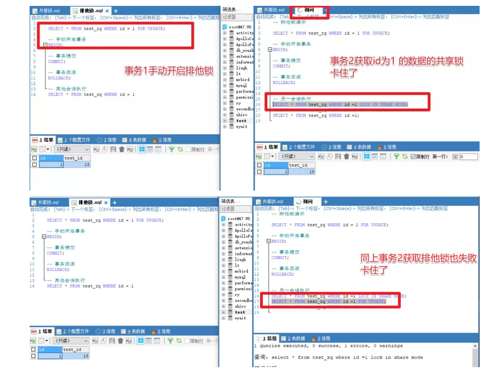
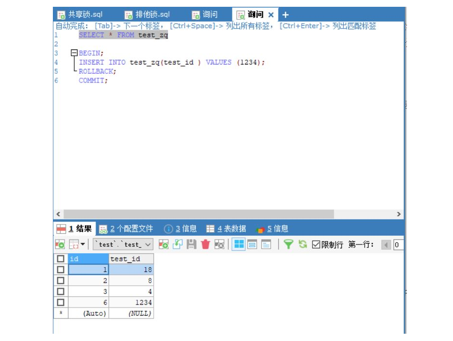
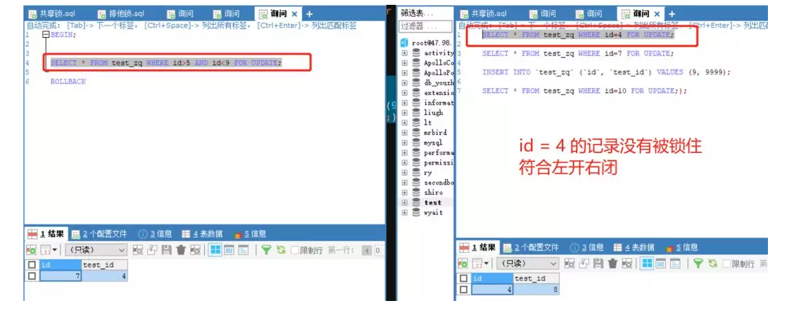
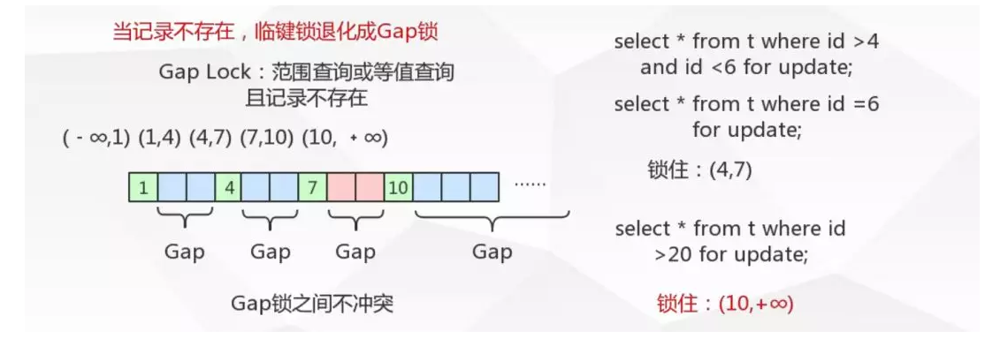

### 锁

> 锁是用于管理不同事务对共享资源的并发访问

表锁和行锁的区别：

在加锁效率、锁定粒度以及冲突概率上，表锁肯定是大于行锁的

但是在并发性能上，表锁远低于行锁。

表锁是锁定了整个表，在加锁期间，无论读写，这个表的数据都是锁定的，相反行锁只是锁定了这个表中的一条数据，其他数据仍然可以操作，这就可很好的提高了数据库的并发性能。

### MySQL_Innodb 锁类型

- 共享锁 Shared Locks  （简称 S 锁，属于行锁）
- 排他锁 Exclusive Locks（简称 X 锁，属于行锁）
- 意向共享锁 Intention Shared Locks （简称 IS 锁，属于表锁）
- 意向排他锁 Intention Exclusive Locks （简称 IX 锁，属于表锁）
- 自增锁 AUTO-INC Locks

#### 共享锁（S）与排它锁 （X）

##### 共享锁

> 又称之为 读 锁，简称 s 锁，顾名思义，共享锁就是多个事务对于同一数据可以共享一把锁，都能访问到数据库，但是只能读不能修改；

加锁方式：

```sql
select * from users where id = 1 lock in share mode;
```

释放方式：

```sql
select * from users where id = 1 lock in share mode;
```

举例：

当手动为select语句加上共享锁之后，在右边的会话中我们对该条数据执行update 操作 ，会发现一直卡住，这就是说，加了共享锁的数据，只能被其他事物读取，但是不能被修改


当我们 commit/rollback结束掉左边会话框的事务时，会发现右边会话框的update操作可以正常进行了


但是我们要注意一点，哪就是共享锁是不影响其他事物读取数据的，如下举例：


##### 排它锁

> 又称为写锁，简称 X 锁，排它锁不能与其他锁并存，如一个事务获取了一个数据行的排它锁，其他事务就不能再获取改行的锁（包括共享锁和排它锁），只有当前获取了排它锁的事务可以对数据进行读取和修改（此时其他事务要读取数据可从快照获取）

加锁方式：

```sql
delete update  insert 默认加排他锁

select * from users where id = 1 for update;
```

释放方式：

```sql
rollback/commit;
```

举例：

获取共享锁 获取排他锁 都会锁住



##### InnoDB 行锁到底锁的是什么？

我们首先来看如下一个例子：


发现在事务1中对id=1的数据行做了更新操作，但是事务未提交之前，事务2去再去更新这条数据会卡住，也就是被锁住了。

接下来我们在事务1 未做任何改变，保持事务未提交状态的情况下去更新id = 2 的数据行


结果显而易见，更新数据成功了。

综上所述：

InnoDB的行锁是通过给索引上的索引项加锁来实现的，只有通过索引条件进行数据检索，Innodb才使用行级锁。否则，将使用表锁（锁住索引的所有记录）。

借此我们是不是能联想到，如果我们的删除/修改语句是没有命中索引的，哪么，则会锁住整个表，这在性能上的影响还是挺大的。

#### 意向共享锁(IS)和意向排他锁()

##### 意向共享锁

表示事务准备给数据行加入共享锁，也就是说一个数据行在加共享锁之前必须先取得该表的IS锁。

##### 意向排他锁

表示事务准备给数据行加入排它锁，也就是说一个数据行加排它锁之前必须先取得该表的IX锁。

**意向锁是InnoDB数据操作之前自动加的，不需要用户干预**

**意向锁是表级锁**

关于这两个锁的实际演示例子本文鉴于篇幅便不再赘述，感兴趣的可以根据上边描述的共享锁和排他锁演示过程自己体验一遍，我们常说，好记性不如烂笔头，看百遍还不如自己动手撸一遍来的痛快！

这两个意向锁存在的意义是：

> 当事务想去进行锁表时，可以先判断意向锁是否存在，存在时则可快速的返回，告知该表不能启用表锁（也就是会锁住对应会话），提高了加锁的效率。

#### 自增锁 （AUTO -INC Locks）

针对自增列自增长的一个特殊的表级别锁

可以使用如下语句查看 ：

```sql
-- 默认取值1 代表连续 事务未提交则id永久丢失
SHOW VARIABLES LIKE 'innodb_autoinc_lock_mode';
```

实际演示效果如下：


执行结果如下：



#### 行锁的算法

行锁锁的是索引上的索引项

只有通过索引条件进行数据检索，Innodb才使用行级锁。否则，将使用表锁（锁住索引的所有记录）

###### 行锁的算法

- 临键锁 Next-Key locks

  当sql执行按照索引进行数据的检索时，查询条件为范围查找（between and < > 等等）并有数据命中，则测试SQL语句加上的锁为Next-Key locks,锁住索引的记录区间加下一个记录区间，这个区间是左开右闭的

- 间隙锁 Gap : 当记录不存在时，临键锁退化成Gap

  在上述检索条件下，如果没有命中记录，则退化成Gap锁，锁住数据不存在的区间（左开右开）

- 记录锁 Record Lock :唯一性索引 条件为精准匹配，退化成Record锁

  当SQL执行按照唯一性（Primary Key,Unique Key）索引进行数据的检索时，查询条件等值匹配且查询的数据存在，这是SQL语句上加的锁即为记录锁Record locks,锁住具体的索引项。

###### 行锁算法举例

**临键锁**

Next-Key locks 也是 InnoDB 引擎默认的行锁算法.

如图：我们假设一张表中的数据行的id 是 1 4 7 10


则innodb会把这个表的数据划分成如图五个区间，然后我们执行图中的SQL语句之后，会发现有两个区间被锁住了，一个是（4,7] ， 一个是 (7,10]

为了验证这个结论，我做了如下实验：

验证区间是否左开右闭：



验证当前记录行是否被锁定：


验证是否锁定下一区间：


以下两种锁只给出结论，演示过程省略，感兴趣可自行验证哈！都是同样的方法，就不赘述了

##### 间隙锁



##### 记录锁


### 总结

MySQL_的 Innodb引擎正是通过上述不同类型的锁，完成了事务隔离：

- 加 X 锁 避免了数据的脏读
- 加 S 锁 避免了数据的不可重复读
- 加上 Next Key 避免了数据的幻读