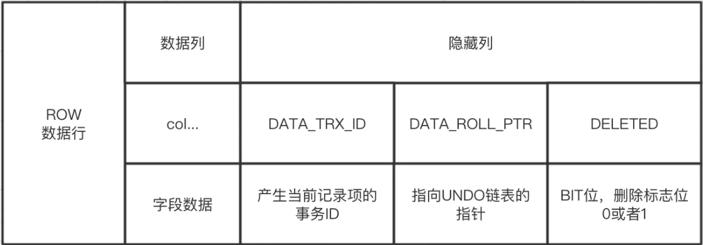
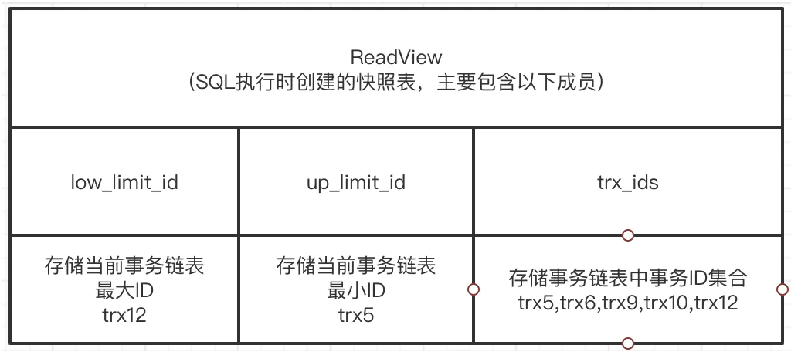

### 本文中用到的概念解释

#### 数据读取特性

- 不可重复读
  - 指一个事务范围内两个相同的查询却返回了不同数据
  - 这是由于查询时系统中其他事务修改的提交而引起的
- 幻读
  - 在两个连续的查找之间一个并发的修改事务修改了查询的数据集，导致这两个查询返回了不同的结果
  - 这是由于查询时系统中其他事务新增或者删除记录引起的

#### 事务隔离级别

- Read Commited(提交读)
  - 一个事务从开始到提交前,所作的任何修改对其他事务不可见
  - 仅能读取到已提交的记录，这种隔离级别下，每条语句都会读取已提交事务的更新，若两次查询之间有其他事务提交，则会导致两次查询结果不一致。
- Repeatable Read(可重复读)
  - 在同一个事务中，多次读取同样的记录的结果是一致的

#### 快照读与当前读

在MVCC并发控制中，读操作可以分成两类，快照读与当前读

- 快照读
  - 读取的是记录数据的可见版本（可能是过期的数据），不用加锁
  - 简单select使用该读取方式
- 当前读
  - 读取的是记录数据的最新版本，并且当前读返回的记录都会加上锁，保证其他事务不会再并发的修改这条记录
  - select ... lock in share mode
  - select ... for update
  - insert
  - update
  - delete
  - 以上查询将使用当前读

### 什么是MVCC

指多版本并发控制，让普通的select语句直接读取指定版本的值，避免加锁，来提高并发请求时的性能，配合行锁机制，在并发请求下，提高了MYSQL的性能

### MVCC解决了什么问题

1. 做到了读不影响写，写不影响读，提高了并发性能
2. 提供了一致性读的功能，避免幻读和不可重复读

### 什么时候会用到MVCC

在RC和RR隔离级别下，innodb通过快照读方式读取数据时使用

#### MVCC实现原理

通过保存数据在某个时间点的快照来实现，具有以下两个特点

不管执行多长时间，同一个事务在执行的过程中看到的数据是一致的

根据事务的开始时间不同，不同事务的对同一张表，同一时刻看到的数据可能是不一样的

### MVCC具体实现

#### 隐藏列

innodb行都设置了隐藏列（对查询不可见），和MVCC有关的包含如下

- DATA_TRX_ID： 产生这条记录的事务ID，INSERT/UPDATE/DELETE时都会更新这个记录
- DATA_ROLL_PTR： 指向该行回滚段的指针，该行上所有旧的版本，在undo中都通过链表的形式组织，该值指向undo中下一个历史记录，历史记录按照由新到旧顺序排列
- DELETED： BIT位，删除标志0或者1

#### 事务链表(当前活跃链表)

- MySQL中的事务在开始到提交这段过程中，都会被保存到一个叫trx_sys的全局事务链表中，这是一个基本的链表结构
- 事务链表中保存的都是还未提交的事务，事务一旦被提交，则会被从事务链表中摘除

#### ReadView

- 在SQL开始的时候被创建的一个数据结构，包含以下三个
- low_limit_id 表示该SQL启动时，当前事务链表中最大的事务id编号，也就是最近创建的除自身以外最大事务编号；
- up_limit_id 表示该SQL启动时，当前事务链表中最小的事务id编号，也就是当前系统中创建最早但还未提交的事务；
- trx_ids 存储当前trx_sys事务链表中的事务id集合。

#### 数据读取规则

逻辑图

流程描述

1. 先根据DATA_TRX_ID，ReadView 判断记录可见性
2. 如果可见，根据 DELETED 判断数据是否删除
3. 如果不可见，根据 DATA_ROLL_PTR 判断是否有历史版本，没有则结束，如果有则取出历史版本，重新执行这个流程，直到找到可见数据或者检查完所有历史版本

如何判断可见性

1. DATA_TRX_ID小于up_limit_id

   说明在事务开始前已经提交完成的数据，对于当前事务来说是可见的

2. DATA_TRX_ID大于low_limit_id

   说明在查询的时候，这条数据还没有提交，不可见

3. DATA_TRX_ID位于up_limit_id和low_limit_id之间

   遍历ReadView中的trx_ids，判断DATA_TRX_ID是否在其中

   如果不在，表示事务已提交，数据可见

   如果在，表示事务未提交，数据不可见

#### MVCC是如何解决幻读和不可重复读问题的

关键在于创建ReadView的时机。

在RC隔离级别下，单个事务每次执行SELECT语句时都会创建ReadView，所以两个相同条件的查询可能由于随着时间的推移，ReadView更新后可以看到更多已提交的数据，导致不可重复读和幻读。

在RR隔离级别下，单个事务只会在第一次执行SELECT查询时创建ReadView，后续不再更新，所以整个事务期间可以看到的数据都是相同的，不会出现不可重复读和幻读。