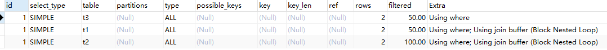

## 写在前面

日常开发中，当数据体量比较大的时候可能就会遇到慢SQL的问题，找出这些SQL并解决，就会用到`explain`这个命令来查看一个这些SQL语句的执行计划，看下该命令有没有做全表扫描，有没有走索引，这些都可以通过`explain`命令来查看。

## 性能下降原因

- 执行时间长；等待时间长
- 查询语句写的差（自身问题）；
- 索引失效（单值索引或复合索引失效）；
- 关联查询太多join（设计缺陷或不得已的需求）
- 服务器调优及各个参数设置（缓冲、线程数等）

## 索引是什么？

在关系数据库中，索引是一种单独的、物理的对数据库表中一列或多列的值进行排序的一种存储结构，它是某个表中一列或若干列值的集合和相应的指向表中物理标识这些值的数据页的逻辑指针清单。索引的作用相当于图书的目录，可以根据目录中的页码快速找到所需的内容。

**简而言之：索引就是为了增加查询和排序的速度（就像图书的目录一样）！**

一般来说索引本身也很大不可能全部存储在内存中，**因此索引往往以索引文件的形式存储在磁盘上。**

我们平常说的索引，如果没有特别指明，都是**B树（多路搜索树，并不一定是二叉的）**结构组织的索引。其中聚集索引，次要索引，覆盖索引，复合索引，前缀索引，唯一索引默认都是使用B+树索引，统称索引。当然，除了B+树这种类型的索引之外，还有哈希索引（hash index）等。

## 索引操作

### 查看索引

```sql
SHOW INDEX FROM tb_stu_info2;

SHOW INDEX FROM tb_stu_info2
```

### 删除索引

```sql
DROP INDEX index_name ON table_name;

ALTER TABLE table_name DROP INDEX index_name;
```

### 创建索引

```sql
ALTER TABLE table_name ADD [UNIQUE | FULLTEXT | SPATIAL]  INDEX | KEY  [index_name] (content [(length)] [ASC | DESC]) [USING index_method]；

CREATE  [UNIQUE | FULLTEXT | SPATIAL]  INDEX  index_name ON  table_name [USING index_method]；
```

说明：

索引类型

- UNIQUE:可选。表示索引为**唯一性索引。**

- FULLTEXT:可选。表示索引为**全文索引。**

- SPATIAL:可选。表示索引为**空间索引。**

INDEX和KEY:用于指定字段为索引，两者选择其中之一就可以了，作用是一样的。

index_name:索引名可选。给创建的索引取一个新名称。

content：字段名，指定索引对应的字段的名称，该字段必须是前面定义好的字段。

length：长度，可选。指索引的长度，必须是字符串类型才可以使用。

ASC:可选。表示升序排列。

DESC:可选。表示降序排列

**索引命名规范：**

idx_user_name（user表的name索引）

idx_user_nameAge（user表的name、age）

## 索引优势

增加查询、排序速率。

## 索引劣势

实际上索引也是一张表，该表保存了主键与索引字段，并指向实体表的记录，所以索引列也是要占用空间的。

虽然索引大大提高了查询速度，同时却会降低更新表的速度，如对表进行INSERT、UPDATE和DELETE。因为更新表时，MySQL不仅要保存数据，还要保存一下索引文件每次添加了索引列的字段，都会调整因为更新所带来的键值变化后的索引信息。

索引只是提高效率的一个因素，如果你的MySQL有大数据量的表，就需要花时间研究建立最优秀的索引，或优化查询。

## 索引分类

**单值索引**：即一个索引只包含单个列，一个表可以有多个单列索引。

**唯一索引**：索引列的值必须唯一，但允许有空值。

**复合索引**：即一个索引包含多个列。

## 哪些情况需要创建索引

1. **主键自动建立唯一索引。**
2. **频繁作为查询条件**的字段应该创建索引。
3. 查询中与其他表关联的字段，**外键关系建立索引。**
4. 频繁更新的字段不适合创建索引（因为每次更新不单单是更新了记录还会更新索引）
5. where条件里用不到的字段不创建索引。
6. 单键/组合索引的选择问题？（在高并发下倾向创建组合索引）
7. 查询中排序的字段，排序字段若通过索引去访问将大大提高排序速度。
8. 查询中统计或者分组字段。

## 哪些情况不要创建索引

1. 表记录太少。

2. 经常增删改的表。（提高了查询速度，同时却会降低更新表的速度，如对表进行INSERT、UPDATE和DELETE。因为更新表时，MySQL不仅要保存数据，还要保存一下索引文件）

3. 数据重复且分布平均的表字段，因此应该只为最经常查询和最经常排序的数据列建立索引。注意，如果某个数据列包含许多重复的内容，为它建立索引就没有太大的实际效果。

假如一个表有10万行记录，有一个字段A只有T和F两种值，且每个值得分布概率大约为50%，那么对这种表A字段建索引一般不会提高数据库的查询速度。

索引的选择性是指索引列中不同值的数目与表中记录数的比。如果一个表中有2000条记录，表索引列有1980个不同的值，那么这个索引的选择性就是1980/2000=0/99。

一个索引的选择性越接近于1，这个索引的效率就越高。

## 怎么知道查询语句是否走了索引

使用**Explain**关键字可以模拟优化器执行SQL查询语句，从而知道MySQL是如何处理你的SQL语句的。分析你的查询语句或是表结构的性能瓶颈。

**用法：explain + sql。**

注意：**explain只能用于select语句**！update、delete语句想知道是否走了索引，需要将后面的where条件单独拿出来放到select语句中，再进行分析！

## explain使用方法

使用很简单，只需在待执行的SQL语句前加上`explain`即可,通过`explain`可以分析得到以下结果：

- 表的读取顺序
- 数据读取操作的操作类型
- 哪些索引可以使用
- 哪些索引被实际使用
- 表之间的引用
- 每张表有多少行被优化器查询 以下面SQL语句为例分析以下各字段含义：

### 举个例子

表结构

```sql
CREATE TABLE `t1` (
  `id` int(11) DEFAULT NULL,
  `oname` varchar(20) DEFAULT NULL,
  `address` varchar(30) DEFAULT NULL
) ENGINE=InnoDB DEFAULT CHARSET=utf8;
 
 
INSERT INTO `t1` VALUES ('1', '一中', '青岛');
INSERT INTO `t1` VALUES ('2', '二中', '济南');
 
 
CREATE TABLE `t2` (
  `id` int(11) DEFAULT NULL,
  `name` varchar(20) DEFAULT NULL,
  `age` int(11) DEFAULT NULL
) ENGINE=InnoDB DEFAULT CHARSET=utf8;
 
 
INSERT INTO `t2` VALUES ('1', '张三', '12');
INSERT INTO `t2` VALUES ('2', '李四', '13');
 
 
CREATE TABLE `t3` (
  `id` int(11) DEFAULT NULL,
  `name` varchar(20) DEFAULT NULL,
  `phoneno` varchar(20) DEFAULT NULL
) ENGINE=InnoDB DEFAULT CHARSET=utf8;
 
 
INSERT INTO `t3` VALUES ('1', '王五', '155');
INSERT INTO `t3` VALUES ('2', '赵六', '134');
```

分析一段查询

```sql
EXPLAIN SELECT
	t2.*
FROM
	t1
LEFT JOIN t3 ON t3.id = t1.id
LEFT JOIN t2 ON t2.id = t1.id
WHERE
	t3. NAME = '';
```

得到的结果：



如上，三个表，mysql的执行顺序是t1-t3-t2。

### 字段解析

#### 1.id

- id相同时，执行顺序由上至下
- 如果是子查询，id的序号会递增，id值越大优先级越高，越先被执行
- id如果相同，可以认为是一组，从上往下顺序执行；在所有组中，id值越大，优先级越高，越先执行

#### 2.select_type

  表示查询中每个select子句的类型。

- `SIMPLE`(简单`SELECT`,不使用`UNION`或`子查询`等)
- `PRIMARY`(查询中若包含任何复杂的子部分,最外层的`select`被标记为`PRIMARY`)
-  `UNION`(`UNION`中的第二个或后面的`SELECT`语句)
-  `DEPENDENT UNION`(`UNION`中的第二个或后面的`SELECT`语句，取决于外面的查询)
-  `UNION RESULT`(`UNION`的结果)
-  `SUBQUERY`(子查询中的第一个`SELECT`)
-  `DEPENDENT SUBQUERY`(子查询中的第一个`SELECT`，取决于外面的查询)
-  `DERIVED`(派生表的`SELECT`, `FROM`子句的子查询)
-  `UNCACHEABLE SUBQUERY`(一个子查询的结果不能被缓存，必须重新评估外链接的第一行)

#### 3.table

  指当前执行的表,有时不是真实的表名字,看到的是`derivedx`(x是个数字,代表含义为第几步衍生的表)

#### 4.type

  `type`所显示的是查询使用了哪种类型，`type`包含的类型包括如下图所示的几种，从好到差依次是:

***null > system > const > eq_ref > ref > range > index > all***

```sh
const   # 查询某个唯一的索引键，找到了就立即返回。比如唯一索引
eq_ref  # 每个索引键只对应一行数据。比如唯一索引
ref     # 每个索引键可能对应多行数据
range   # 只检索索引表的某个范围。比如 where...between、in、is null
index   # 遍历了索引表
all     # 遍历了全表，效率最低
```

**一般来说，得保证查询至少达到range级别，最好能达到ref。**

- `system`： 表只有一行记录（等于系统表），这是`const`类型的特列，平时不会出现，这个也可以忽略不计
- `const`： 表示通过索引一次就找到了，`const`用于比较`primary key` 或者`unique`索引。因为只匹配一行数据，所以很快。如将主键置于`where`列表中，MySQL就能将该查询转换为一个常量。

```sql
explain select * from appadded where appid="12";
```

- `eq_ref`： 唯一性索引扫描，对于每个索引键，表中只有一条记录与之匹配。常见于主键或唯一索引扫描

```sql
explain select * from appadded ad left join app a on ad.appid=a.appid;
```

- `ref`： 非唯一性索引扫描，返回匹配某个单独值的所有行，本质上也是一种索引访问，它返回所有匹配某个单独值的行，然而，它可能会找到多个符合条件的行，所以他应该属于查找和扫描的混合体。

```sql
explain select * from appadded ad,appversion av where ad.appid=av.appid;
```

- `range`： 只检索给定范围的行，使用一个索引来选择行，key列显示使用了哪个索引，一般就是在你的where语句中出现`between、< 、>、in`等的查询，这种范围扫描索引比全表扫描要好，因为它只需要开始于索引的某一点，而结束于另一点，不用扫描全部索引。

```sql
explain select * from appadded where appid in("12","13");
```

- `index`： Full Index Scan，`Index`与`All`区别为`Index`类型只遍历索引树。这通常比`All`快，因为索引文件通常比数据文件小。（也就是说虽然`All`和`Index`都是读全表，但`Index`是从索引中读取的，而`All`是从硬盘读取的）

```sql
explain select appid from appadded;
```

- `all`： Full Table Scan 将遍历全表以找到匹配的行

```sql
explain select * from appadded;
```

#### 5.possible_keys

  显示可能应用在这张表中的索引，一个或多个。查询涉及到的字段上若存在索引，则该索引将被列出，***但不一定被查询实际使用***。

#### 6.key

  实际使用的索引，如果为NULL，则没有使用索引。（可能原因包括没有建立索引或索引失效）

#### 7.key_len

  表示索引中使用的字节数，可通过该列计算查询中使用的索引的长度（`key_len`显示的值为索引字段的最大可能长度，并非实际使用长度，即`key_len`是根据表定义计算而得，不是通过表内检索出的） 不损失精确性的情况下，长度越短越好 。

#### 8.ref

  表示上述表的连接匹配条件，即哪些列或常量被用于查找索引列上的值

#### 9.rows

  表示MySQL根据表统计信息及索引选用情况，估算的找到所需的记录所需要读取的行数

#### 10.Extra

  包含不适合在其他列中显式但十分重要的额外信息，包含以下几种情况：

- `Using where`：表明使用了`where`过滤
- `Using temporary`：使用了用临时表保存中间结果，MySQL在对查询结果排序时使用临时表。常见于排序`order by`和分组查询`group by`
- `Using filesort`：说明MySQL会对数据使用一个外部的索引排序，而不是按照表内的索引顺序进行读取。MySQL中无法利用索引完成的排序操作称为“文件排序”
- `Using join buffer`：表明使用了连接缓存,比如说在查询的时候，多表join的次数非常多，那么将配置文件中的缓冲区的join buffer调大一些。
- `Impossible where`：`where`子句的值总是`false`，不能用来获取任何元组。
- `Select tables optimized away`：在没有`GROUP BY`子句的情况下，基于索引优化`MIN/MAX`操作或者对于MyISAM存储引擎优化`COUNT(*)`操作，不必等到执行阶段再进行计算，查询执行计划生成的阶段即完成优化。
- `Using index`：表示相应的`select`操作中使用了覆盖索引（`Covering Index`），避免访问了表的数据行，效率不错。如果同时出现`using where`，表明索引被用来执行索引键值的查找；如果没有同时出现`using where`，表明索引用来读取数据而非执行查找动作。
- `Distinct`：优化`distinct`操作，在找到第一匹配的元组后即停止找同样值的动作。

可以主动控制是否使用索引，便于测试索引的效果：

```sql
explain select * from tb1 use    index(index1) where name='one';  -- 只使用某些索引
explain select * from tb1 ignore index(index1) where name='one';  -- 忽略某些索引
explain select * from tb1 force  index(index1) where name='one';  -- 强制使用某些索引
```

### 总结

- `EXPALIN`只能解释SELECT操作，其他操作要重写为SELECT后查看执行计划。
- `EXPLAIN`不会告诉你关于触发器、存储过程的信息或用户自定义函数对查询的影响情况。
- `EXPLAIN`不考虑各种`Cache`。
- `EXPLAIN`不能显示MySQL在执行查询时所作的优化工作。