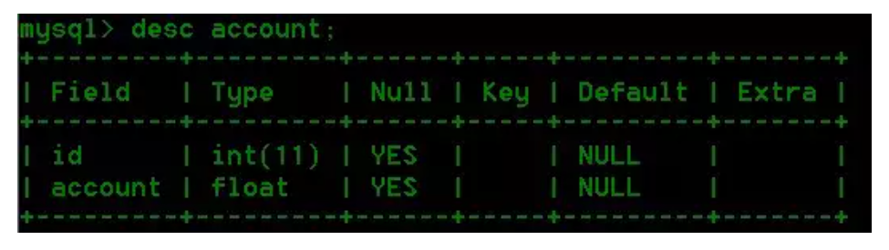
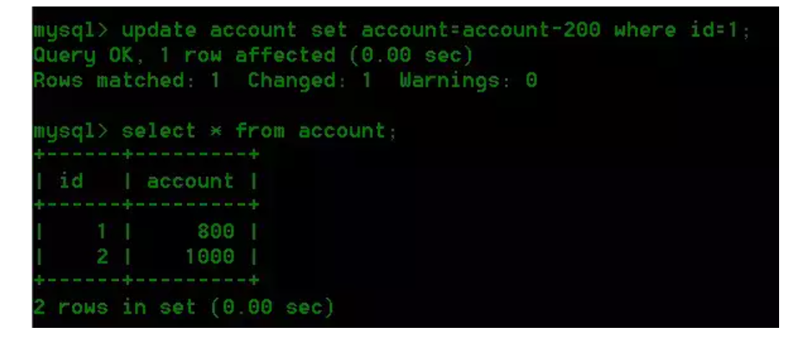
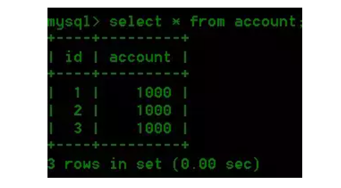
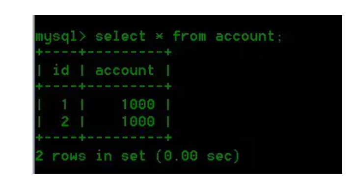
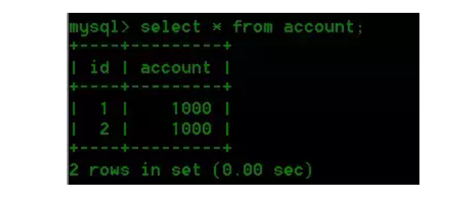
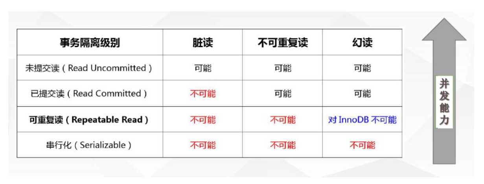

## MySQL事务隔离级别

### 什么是事务？

> 数据库操作的最小工作单元，是作为单个逻辑工作单元执行的一系列操作；事务是一组不可再分割的操作集合（工作逻辑单元）

举个栗子：

事务最经典常用的栗子可能就是转账：一个账户少钱了，哪另一个账户肯定要多钱，李永龙说过，亏本的买卖咱可不干，吃亏了不高兴！

所以，少钱和多钱这两个操作，要么同时成功，要么同时失败！

### MySQL中如何开启事务？

- 手工开启：`begin/start transaction`
- 事务提交或回滚：`commit/rollback`
- 设定事务是否自动开启：`set session autocommit = on/off`

### 事务ACID特性

- 原子性（`Atomicity`）

  最小的工作单元，要么一起成功，要么一起失败

- 一致性(`Consistency`)

  一致性也称作是完整性，就是说事务的执行不能破坏数据库的一致性，一个事务在执行后，数据库必须从一个状态转变为另一个状态

- 隔离性(`Isolation`)

  并发的事务相互隔离，互不干扰

- 持久性(`Durability`)

  持久性是指事务一旦提交，对数据库的状态就应该被永久保存

### 事务并发带来了哪些问题？

- 脏读

> 脏读就是指当一个事务正在访问数据，并且对数据进行了修改，而这种修改还没有提交到数据库中，这时，另外一个事务也访问这个数据，然后使用了这个数据。

举个栗子：

1.张三这个人工资是10000，财务将张三的工资改为了20000（但是事务未提交）；

2.张三读取自己工资的时候，发现工资变成20000，非常开心；

3.然后财务发现操作有误，自己改错了，随之回滚了事务，张三的工资又变成了10000，结果小伙那叫个伤心欲绝啊。

**以上**：张三读取到的这个20000就是个脏数据

- 幻读

> 是指当事务不是独立执行时发生的一种现象，例如第一个事务对一个表中的数据进行了修改，这种修改涉及到表中的全部数据行，同时，第二个事务也修改这个表中的数据，这种修改是向表中插入一行新数据。那么，以后就会发生操作第一个事务的用户发现表中还有没有修改的数据行，就好象发生了幻觉一样。

举个栗子：

假设某公司工资为10000的有10个人

1.事务1，读取所有工资为10000的员工，会读取到10条记录；

2.事务2此时向工资表中插入了一条员工记录，工资正好也是10000；

3.事务1再次读物所有工资为10000的员工，会发现读到了11条记录。

**以上**：就产生了幻觉，如果我们能做到在操作事务未完成数据处理之前，其他的任何事务都不可以添加新数据，则能避免该问题的发生。

- 不可重复读

> 是指在一个事务内，多次读同一数据。在这个事务还没有结束时，另外一个事务也访问该同一数据。那么，在第一个事务中的两次读数据之间，由于第二个事务的修改，那么第一个事务两次读到的的数据可能是不一样的。这样在一个事务内两次读到的数据是不一样的，因此称为是不可重复读。

举个栗子：

1.在事务1中，张三 读取了自己的工资为10000,但是操作还没有完成；

2.在事务2中，正好财务人员修改了张三的工资为20000,并提交了事务；

3.在事务1中，张三再次读取自己的工资时，工资变为了20000。

**以上**：此时相当于发生了不可重复读，如果只有在修改事务完全提交之后才可以读取数据，则可以避免该问题。

**不可重复读的重点是修改** **:**
同样的条件 ,  你读取过的数据 ,  再次读取出来发现值不一样了
**幻读的重点在于新增或者删除**
同样的条件 ,  第 1 次和第 2 次读出来的记录数不一样

为了解决上边所说的几个问题，下面介绍下MySQL对于事务处理的四种隔离级别

### 事务四种隔离级别

- `Read uncommitter`(未提交读) ： 没有解决任何问题
- `Read Committer`(提交读) ：解决了脏读问题
- `Repeatable Read`(可重复读)： 解决了不可重复读和脏读问题（ps:在Innodb情况下，也不可能发生幻读问题）
- `Serializable`(串行化) ：脏读、幻读、不可重复读三个问题全部解决了

为了更好的介绍以上四种情况，再举个栗子：

建一张表并插入两条数据：

```sql
-- 建表语句
CREATE TABLE `t_transaction` (
  `id` INT(5) NOT NULL AUTO_INCREMENT,
  `account` INT(5) NOT NULL,
  PRIMARY KEY (`id`)
) ENGINE=INNODB AUTO_INCREMENT=1 DEFAULT CHARSET=utf8mb4 ROW_FORMAT=COMPACT COMMENT='事务隔离级别测试表';
-- 插入数据
INSERT INTO t_transaction (id,account) VALUES(1,1000);
INSERT INTO t_transaction (id,account) VALUES(2,1000);
```

表结构如下：



打开两个会话，准备模拟环境。

#### Read uncommitter

然后在会话1执行如下语句：

```sql
SET SESSION TRANSACTION ISOLATION LEVEL READ UNCOMMITTED;
START TRANSACTION;
SELECT * FROM t_transaction;
```

执行结果如下：


接下来在会话2执行如下语句，把id为1的记录 account 值增加 200，但是并**没有提交事务**：

```sql
SET SESSION TRANSACTION ISOLATION LEVEL READ UNCOMMITTED;
START TRANSACTION;
UPDATE t_transaction SET account = account+200 WHERE id = 1;
```

回过头我们再在会话1执行一次查询：

```sql
SELECT * FROM t_transaction;
```

执行结果如下：


##### 结论

我们将事务隔离级别设置为read uncommitted，即便是事务没有commit，在其他会话或者说事务中我们仍然能读到未提交的数据，这是所有隔离级别中最低的一种，这种情况属于**脏读**。

这样做的话就会产生一个问题：

那就是我们在一个事务中可以随随便便读取到其他事务未提交的数据，这还是比较麻烦的，我们叫**脏读**。我不知道这个名字是怎么起的，为了增强大家的印象，可以这么想，这个事务好轻浮啊，饥渴到连别人没提交的东西都等不及，真脏，呸！

实际上我们的数据改变了吗？

*答案是否定的，因为只有事务commit后才会真正更新到数据库。*

#### Read committed

我们利用如下语句将会话2的事务隔离级别设置为`read committed`

```sql
SET SESSION TRANSACTION ISOLATION LEVEL READ COMMITTED;
```

然后在会话1中执行如下语句：

```sql
update t_transaction set account=account-200 where id=1;
```

我们将id=1的用户account减200。然后查询，发现id=1的用户account变为800。

****

在会话2中查询：

```sql
select * from t_transaction;
```


我们会发现数据并没有变，还是1000。

接着在会话A中我们将事务提交：`commit`

紧接着在会话2中查看结果如下：


###### 结论

当我们将当前会话的隔离级别设置为read committed的时候，当前会话只能读取到其他事务提交的数据，未提交的数据读不到。

我们在会话2同一个事务中，读取到两次不同的结果。这就造成了不可重复读，就是两次读取的结果不同，这种现象称之为**不可重复读**。

#### RepeatableRead

**这是MySQL默认的隔离级别**

在会话2中我们当前事务隔离级别为repeatable read。具体操作如下：

```sql
set session transaction isolation level repeatable read;
start transaction;
```

接着在会话2中查询数据：


我们在会话1中为表account添加一条数据：

```sql
insert into t_transaction(id,account) value(3,1000);
commit;
```

然后我们查询看数据插入是否成功：



回到会话2，我们查询结果：



会话2中想插入一条新数据id=3，value=1000。来我们操作下：

```sql
insert into t_transaction(id,account) value(3,1000)；
```


执行结果：


结果，问题产生了，竟然插不进去

###### 结论

此处需要注意的是，因为我们使用的Innodb引擎，所以此处不会产生幻读，其他引擎的话在这个隔离级别可能会产生幻读，至于为什么说Innodb不会，[其实MySQL 利用锁机制和MVCC避免了这个问题](https://willje.github.io/posts/mysql/mysql-mvcc%E6%9C%BA%E5%88%B6/)。

#### Serializable

同样，我们将会话2的事务隔离级别设置为serializable并开启事务。

```sql
set session transaction isolation level serializable;
start transaction;
```

在会话2中我们执行下面操作：

```sql
select * from account;
```



那我们这个时候在用户A所在的会话中写数据呢？

我们发现会话1所在的会话陷入等待，如果超时（这个时间可以进行配置），会出现Lock wait time out提示：


如果在等待期间我们用户B所在的会话事务提交，那么用户A所在的事务的写操作将提示操作成功。

###### 结论

当我们将当前会话的隔离级别设置为serializable的时候，其他会话对该表的写操作将被挂起。可以看到，这是隔离级别中最严格的，但是这样做势必对性能造成影响。所以在实际的选用上，我们要根据当前具体的情况选用合适的隔离级别。

### 小结

下面用一张图来简单总结一下

