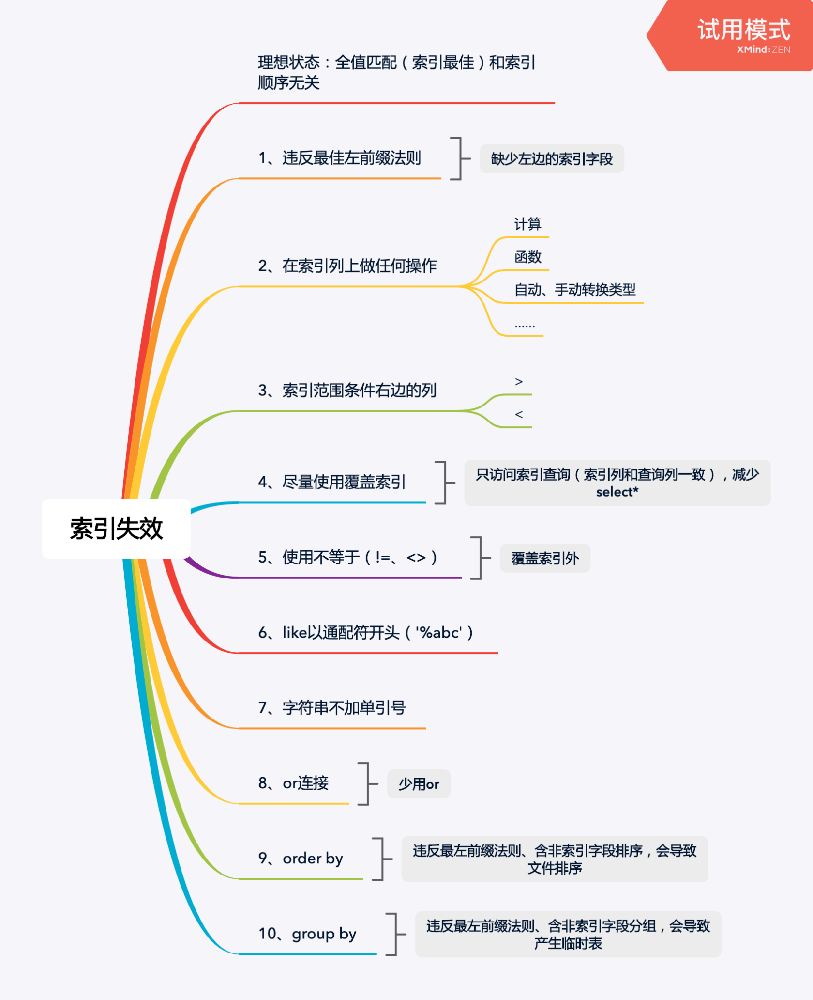

## 一、准备工作，准备sql

这里我使用的mysql版本是 8.0.19。

```sql
CREATE TABLE `student`  (
    `id` int(11) NOT NULL AUTO_INCREMENT,
    `name` varchar(20),
    `age` int(11),
    `address` varchar(25),
    `crtdate` timestamp,
    PRIMARY KEY (`id`) USING BTREE
);
insert into student(name,age,address,crtdate) values('张三', 15, '山东青岛', now());
insert into student(name,age,address,crtdate) values('李四', 17, '山东济南', now());
insert into student(name,age,address,crtdate) values('王五', 18, '山东潍坊', now());

-- 创建复合索引
alter table student add index idx_stu_nameAgeAddr(name,age,address);
 
```

## 二、索引是什么、使用explain关键字来解析sql使用索引情况

explain如何使用，请阅读这篇文章：

[MySQL中的索引和Explain的用法](https://willje.github.io/posts/mysql/mysql%E4%B8%AD%E7%9A%84%E7%B4%A2%E5%BC%95%E5%92%8Cexplain%E7%9A%84%E7%94%A8%E6%B3%95/)

## 三、索引的使用与失效场景

### 使用全部复合索引（索引正常使用）

之前创建了name、age、address三个字段的复合索引，查询条件根据这三个字段，是可以直接使用索引的。

```sql
-- sql贴在这里了
explain select * from student where name='张三' and age=15 and address = '山东青岛';
```

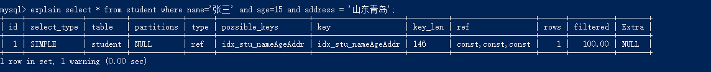

### 最佳左前缀法则

**如果索引了多列，要遵循最左前缀法则。指的是查询从索引的最左前列开始并且不跳过索引中的列。**

```sql
-- sql贴在这里了
explain select * from student where name='张三' and age=15;
explain select * from student where name='张三';
explain select * from student where age=15 and address = '山东青岛';
explain select * from student where name='张三' and address = '山东青岛';
```

以下这两种查询都是没问题的，因为遵守最佳左前缀法则，条件字段从左到右，从第一个索引字段name开始并且也不跳过索引中间的列：

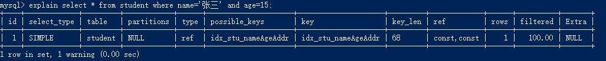

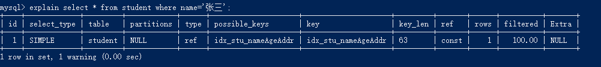

以下会造成索引完全失效，因为没有使用复合索引的第一列name：

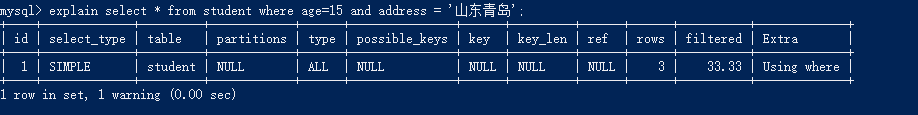

以下会造成索引部分失效，第一个条件name是走索引的，但是address因为跳过了age所以address这个字段索引失效：

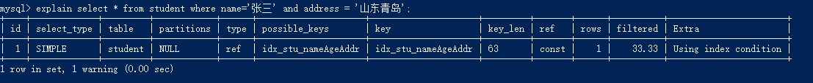

### 在索引列上做任何操作

（计算、函数、自动或手动类型转换），会导致索引失效而转向全表扫描。

```sql
-- sql贴这里了
explain select * from student where left(name,1)='张';
```

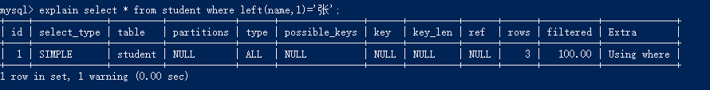

索引列上使用了表达式，如where substr(name, 1, 3)='张小四'、where num = num +1，表达式是一大忌讳，再简单的表达式mysql也会造成索引失效。

有时数据量不是大到严重影响速度时，一般可以先查出来，比如先查询所有订单记录的数据，再在程序中筛选。

### 字符串不加单引号

```sql
explain select * from student where name = '123';
explain select * from student where name = 123;
```

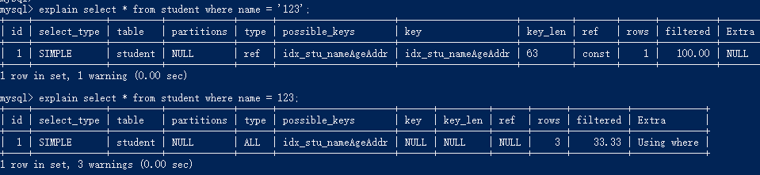

### 使用索引中范围条件右边的列。

（范围条件之后的索引全失效，但是范围条件之前的和范围条件的还是用到索引的。）

```sql
-- sql贴这里了
explain select * from student where name='张三';
explain select * from student where name='张三' and age=15;
explain select * from student where name='张三' and age=15 and address = '山东青岛';
explain select * from student where name='张三' and age>15 and address = '山东青岛';
```

很显然，最后一条sql，只有name、age走了索引，但是address失效了。

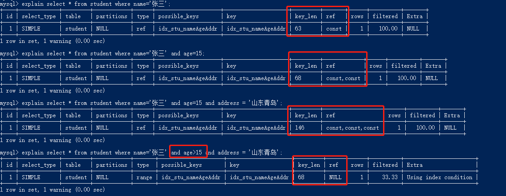

### 尽量使用覆合索引

（只访问索引的查询（索引列和查询列一致）），减少select *。

我们都知道，Extra中出现using index是好现象，对查询效率会增强。

而且有范围查询时，不用*的时候，key_len会更小，这意味着会增加查询效率。

```sql
explain select * from student where name='张三' and age=15 and address = '山东青岛';
explain select name,age,address from student where name='张三' and age=15 and address = '山东青岛';

explain select * from student where name='张三' and age>15 and address = '山东青岛';
explain select name,age,address from student where name='张三' and age>15 and address = '山东青岛';
```

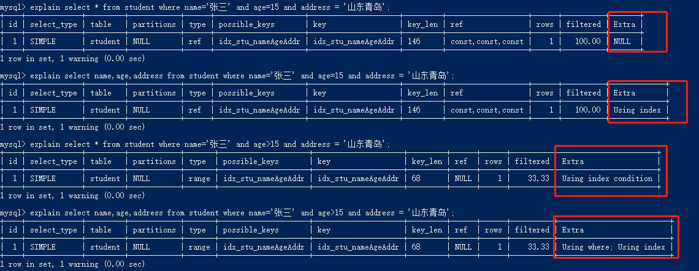

### 使用不等于（!= 或者 <>）

```sql
-- sql贴这里了
explain select * from student where name='张三';
explain select * from student where name!='张三';
explain select * from student where name<>'张三';
```

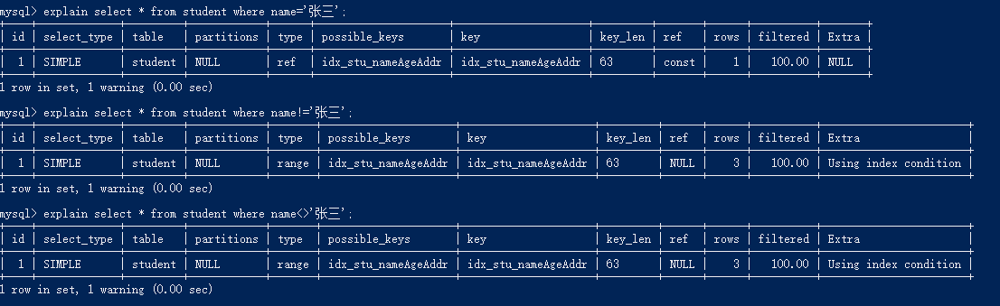

### is not null也无法使用索引

```sql
-- sql贴这里了
explain select * from student where name='张三';
explain select * from student where name is null;
explain select * from student where name is not null;
```

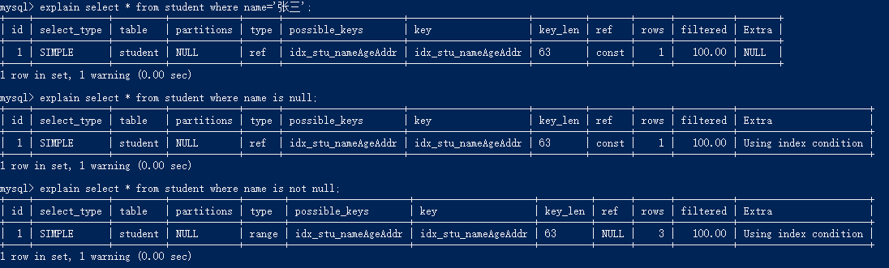

### like以通配符开头（'%abc...'）会导致索引失效。

like以通配符开头会导致索引失效，但是通配符放在后面索引就会正常使用。

```mysql
-- sql在这里
explain select * from student where name='张三';
explain select * from student where name like '%张';
explain select * from student where name like '张%';
explain select * from student where name like '%张%';
```

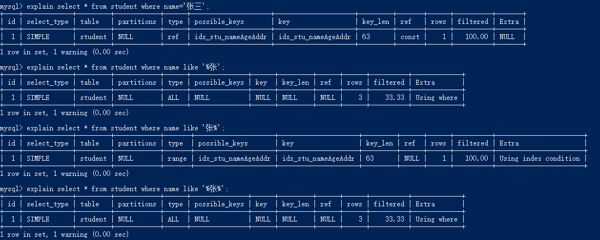

但是，这种情况like前面使用通配符，也是会走索引的：（select查询的字段刚好是复合索引的字段，所以为什么在查询的时候不建议使用*）

```sql
 explain select name,age,address from student where name like '%张%';
```

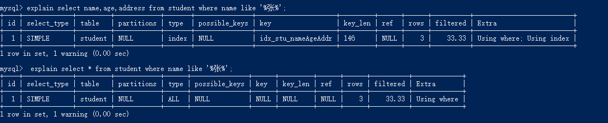

### 少用or，用它来连接时会索引失效。

```sql
explain select * from student where name='张三' or age=15;
```


### 关于in关键字

in关键字在mysql中是个很神奇的存在

```sql
-- 主键
explain select * from student where id in (1,2);
explain select * from student where id in (1,2,3,4,5,6,7,8,9);

-- 复合索引
explain select * from student where name in ('李四');
explain select * from student where name in ('李四', '王五');
```

我们可以看到，in使用关键字少的时候，会走索引的，但是内容较多，就会造成索引失效

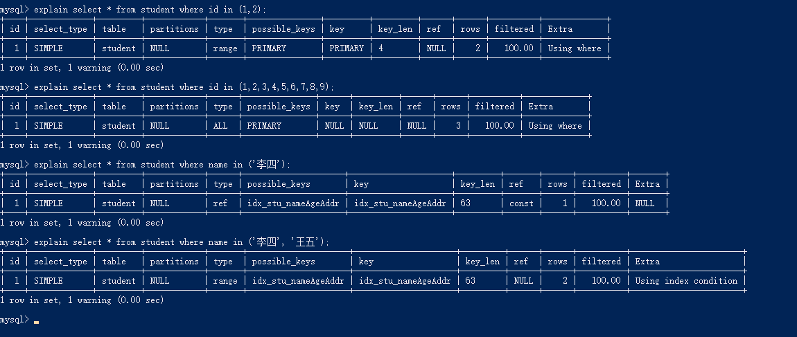

## 四、总结

最后在网上看到一个顺口溜，如下：

> 全值匹配我最爱，最左前缀要遵守；
>
> 带头大哥不能死，中间兄弟不能断；
>
> 索引列上少计算，范围之后全失效；
>
> LIKE百分写最右，覆盖索引不写星；
>
> 不等空值还有or，索引失效要少用。