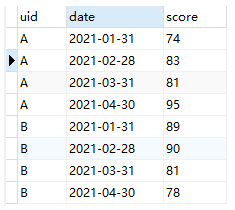
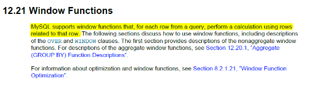
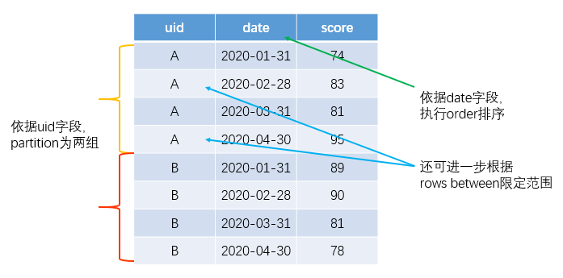
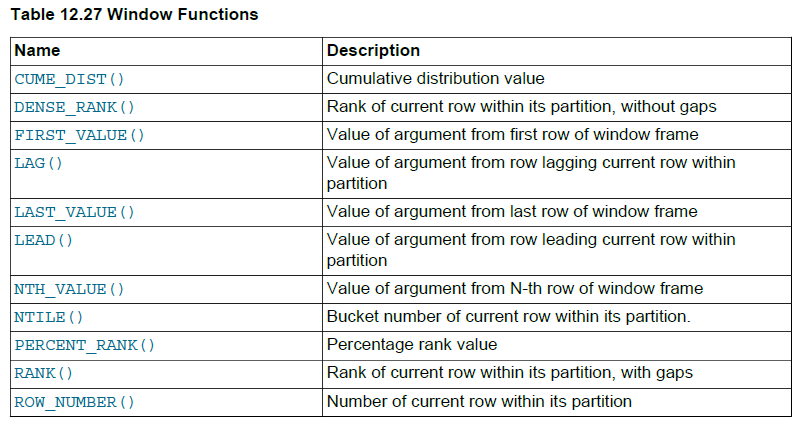
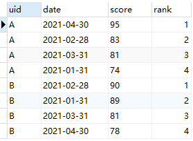
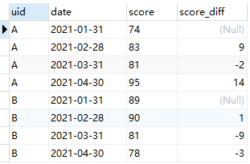
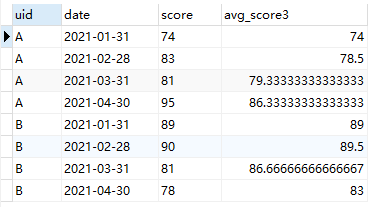

## 模拟问题描述

给定一组中学生的历次语文月考成绩表（每名学生含有 4 次成绩），需要实现以下 3 个需求：

- 对每名学生的 4 次成绩表分别进行排序，排序后每人的成绩排名 1-2-3-4
- 求每名学生历次月考成绩的变化幅度，即本月较上个月的成绩差值
- 求每名学生历次月考成绩中近 3 次平均分

数据表样例如下：

[](https://cdn.error.work/imgur/sVCYSXT.png)

## 窗口函数介绍

在分析上述需求之前，首先对窗口函数进行介绍。何为窗口函数呢？既然窗口函数这个名字源于数据库，那么我们就援引其在数据库中的定义。下图源于 MySQL8.0 的官方文档，从标黄高亮的一句介绍可知：窗口函数是用与当前行有关的数据行参与计算。这个翻译可能有些蹩脚，但若能感性理解窗口函数的话，其实反而会觉得其概括的比较传神。

[](https://cdn.error.work/imgur/cXePdn3.png)


当然，为了形象表达上述定义所言何物，这里还是进一步给出一些配套插图以便于理解。在给出具体配图之前，首先要介绍与窗口函数相关的 3 个关键词：

- **partition by：**用于对全量数据表进行切分（与 SQL 中的 group by 功能类似，但功能完全不同），直接体现的是前面窗口函数定义中的“有关”，即切分到同一组的即为有关，否则就是无关；
- **order by：**用于指定对 partition 后各组内的数据进行排序；
- **rows between：**用于对切分后的数据进一步限定“有关”行的数量，此种情景下即使 partition 后分到一组，也可能是跟当前行的计算无关。

相应的，这 3 个关键字在前面的数据样表中可作如下配套解释：


[](https://cdn.error.work/imgur/viM0b12.png)


当然，到这里还不是很理解窗口函数以及相应的 3 个关键字也问题不大，后续结合前述的三个实际需求再返过来看此图多半会豁然开朗。

上面是窗口函数的逻辑解释，那么具体能用于实现什么功能呢？其实，窗口函数能实现什么功能则要取决于能搭配什么函数。仍然引用 MySQL8.0 官方文档中的一幅图例：


[](https://cdn.error.work/imgur/WvFJO1m.png)


其中，上表所述的窗口函数主要分为两大类：
排序类，包括 row_number、rank、dense_rank 等，也包括 percent_rank、cume_dist 等分布排序类
相对引用类，如 lag、lead、first_value、last_value、nth_value 等
除了这两类专用窗口函数之外，还有广义的聚合函数也可配套窗口函数使用，例如 sum、avg、max、min 等。

## SQL实现

既然窗口函数起源于数据库，那么下面就应用 SQL 予以实现。

> 注：以下所有 SQL 查询语句实现均基于 MySQL8.0。

### 求解每名同学历次成绩的排名

由于是区分每名同学进行排序，所以需要依据 uid 字段进行 partition；进一步地，按照成绩进行排序，所以 order by 字段即为 score；最后，由于是要进行排名，所以配套函数选择 row_number 即可。

查询语句及查询结果如下：

```sql
SELECT *, row_number() over(partition by uid order by score desc) as `rank` from score
```

[](https://cdn.error.work/imgur/tYRf4dF.png)

这里介绍一下其他的排名函数，具体可以参考这篇文章[sql排序之rank，row_number，dense_rank的区别](https://segmentfault.com/a/1190000018360484)。

排名是数据库中的一个经典题目，实际上又根据排名的具体细节可分为3种场景：

1. 连续排名，例如薪水3000、2000、2000、1000排名结果为1-2-3-4，体现同薪不同名，排名类似于编号
2. 同薪同名但总排名不连续，例如同样的薪水分布，排名结果为1-2-2-4
3. 同薪同名且总排名连续，同样的薪水排名结果为1-2-2-3

窗口函数中的排名函数共有row_number()不重复排序（对应到上面的第一种情况），rank()重复且跳数字排序（对应到上面的第二种情况），dense_rank()重复且不跳数字排序（对应到上面的第三种情况）。

### 求解每名同学历次月考成绩的差值，即本月成绩-上月成绩

首先，仍然是依据 uid 字段进行 partition；而后由于是要计算本月成绩与上月成绩的差值，所以此次的排序依据应该是 date；进一步地，由于要计算差值，所以需要对每次月考成绩计算其前一行的成绩（在按照 uid 进行切分并按照 date 排序后，上月成绩即为当前行的前一条记录），所以配套函数即为 lag。

给出具体实现 SQL 语句及查询结果如下：

```sql
SELECT *, score - lag(score) over(partition by uid order by date) as score_diff from score
```

[](https://cdn.error.work/imgur/wDWLQgI.png)

### 求解每名学生近 3 次月考成绩的平均分。

在前两个需求的基础上，易见，仍然是依据 uid 进行 partition、依据 date 进行排序，并选用 avg 聚合函数作为配套窗口函数。进一步地，由于此处限定计算近 3 次成绩的平均分，所以除了 partition 和 order by 两个关键字外，还需增加 rows between 的限定。

具体 SQL 语句和查询结果如下：

```
SELECT *, avg(score) over(partition by uid order by date rows between 2 preceding and current row) as avg_score3 from score
```

[](https://cdn.error.work/imgur/N8vM5rR.png)

值得指出的是，对于每名学生，当切分窗口不足指定窗口大小（即目标行数）时会按实际的数据进行聚合，例如学生 A，1 月 31 日对应的近 3 次平均分即为本月成绩自身；2 月 28 日对应近 3 次平均分即为本月成绩和上月成绩的平均分，而 3 月 31 日和 4 月 30 日计算的近 3 次平均分则为真正意义上的 3 次成绩均值。

## 参考资料

- [6种方案诠释MySQL通用查询策略](https://leetcode-cn.com/problems/nth-highest-salary/solution/mysql-zi-ding-yi-bian-liang-by-luanz/)

- [SQL、Pandas、Spark：窗口函数的3种实现](https://mp.weixin.qq.com/s/GUzwvCRkahRxCcOQ-mYV8g)

- 

  