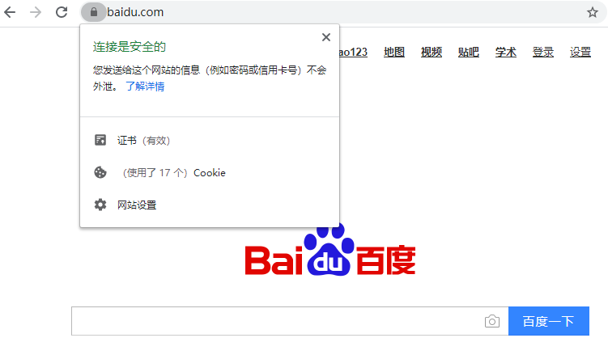

在正式开始讲解https之前我们还得先搞清楚两个概念：什么是对称加密，以及什么是非对称加密？

这两个概念都是属于加密学中的基础知识，其实非常好懂。

## 对称加密和非对称加密

对称加密比较简单，就是客户端和服务器共用同一个密钥，该密钥可以用于加密一段内容，同时也可以用于解密这段内容。对称加密的优点是加解密效率高，但是在安全性方面可能存在一些问题，因为密钥存放在客户端有被窃取的风险。

对称加密的代表算法有：AES、DES等。

而非对称加密则要复杂一点，它将密钥分成了两种：公钥和私钥。公钥通常存放在客户端，私钥通常存放在服务器。使用公钥加密的数据只有用私钥才能解密，反过来使用私钥加密的数据也只有用公钥才能解密。非对称加密的优点是安全性更高，因为客户端发送给服务器的加密信息只有用服务器的私钥才能解密，因此不用担心被别人破解，但缺点是加解密的效率相比于对称加密要差很多。

非对称加密的代表算法有：RSA、ElGamal等。

掌握了这两个概念之后，我们就可以开始学习https了。这里先提前抛出一个问题，同时也是面试时可能经常会问到的一个问题：https为了保证数据传输的安全，使用的是对称加密还是非对称加密呢？

学完本篇文章之后你就能知道答案了。

首先我们来看一下，传统的http方式在网络传输时存在哪些问题。

## HTTP有哪些问题

由于我们在传输数据时信息都是明文的，因此很容易出现数据被监听和窃取的情况。示意图如下：

另外，传输的数据还有可能被一些别有用心的人篡改，导致浏览器与网站收发的内容不一致。示意图如下：

也就是说，使用http传输数据至少存在着数据被监听以及数据被篡改这两大风险，因此http是一种不安全的传输协议。

那么解决方案大家肯定都知道是使用https，但是我们先尝试着自己思考一下该如何保证http传输的安全性，进而也就能一步步地理解https的工作原理了。

## 工作原理

### 使用对称加密通信

既然数据以明文的形式在网络上传输是不安全的，那么我们显然要对数据进行加密才行。刚才提到了，加密方式主要有两种，对称加密和非对称加密。对称加密的

优点是加解密效率高，而我们在网络上传输数据是非常讲究效率的，因此这里很明显应该使用对称加密。示意图如下：

可以看到，由于我们在网络上传输的数据都是密文，所以不怕被监听者获取到，因为他们无法得知原文是什么。而浏览器收到密文之后，只需要使用和网站相同的

密钥来对数据进行解密就可以了。

这种工作机制看上去好像确实保证了数据传输的安全性，但是却存在一个巨大的漏洞：浏览器和网站怎样商定使用什么密钥呢？

这绝对是一个计算机界的难题，浏览器和网站要使用相同的密钥才能正常对数据进行加解密，但是如何让这个密钥只让它们俩知晓，而不被任何监听者知晓呢？你

会发现不管怎么商定，浏览器和网站的首次通信过程必定是明文的。这就意味着，按照上述的工作流程，我们始终无法创建一个安全的对称加密密钥。

### 引入非对称加密

所以，只使用对称加密看来是永远无法解决这个问题了，这个时候我们需要将非对称加密引入进来，协助解决无法安全创建对称加密密钥的问题。

那么为什么非对称加密就可以解决这个问题呢？我们还是通过示意图的方式来理解一下：

可以看到，如果我们想要安全地创建一个对称加密的密钥，可以让浏览器这边来随机生成，但是生成出来的密钥不能直接在网络上传输，而是要用网站提供的公钥

对其进行非对称加密。由于公钥加密后的数据只能使用私钥来解密，因此这段数据在网络上传输是绝对安全的。而网站在收到消息之后，只需要使用私钥对其解

密，就获取到浏览器生成的密钥了。

另外，使用这种方式，只有在浏览器和网站首次商定密钥的时候需要使用非对称加密，一旦网站收到了浏览器随机生成的密钥之后，双方就可以都使用对称加密来

进行通信了，因此工作效率是非常高的。

### 引入CA机构获取网站公钥

那么，上述的工作机制你认为已经非常完善了吗？其实并没有，因为我们还是差了非常关键的一步，浏览器该怎样才能获取到网站的公钥呢？虽然公钥是属于公开

的数据，在网络上传输不怕被别人监听，但是如果公钥被别人篡改了怎么办？示意图如下：

也就是说，只要我们从网络上去获取任何网站的公钥，就必然存在着公钥被篡改的风险。而一旦你使用了假的公钥来对数据进行加密，那么就可以被别人以假的私

钥进行解密，后果不堪设想。

方案设计到这里好像已经进入了死胡同，因为无论如何我们都无法安全地获取到一个网站的公钥，而我们显然也不可能将世界上所有网站的公钥都预置在操作系统

当中。

这个时候，就必须引入一个新的概念来打破僵局了：CA机构。

CA机构专门用于给各个网站签发数字证书，从而保证浏览器可以安全地获得各个网站的公钥。那么CA机构是如何完成这个艰巨的任务的呢？下面开始一步步解

析。

首先，我们作为一个网站的管理员需要向CA机构进行申请，将自己的公钥提交给CA机构。CA机构则会使用我们提交的公钥，再加上一系列其他的信息，如网站域

名、有效时长等，来制作证书。

证书制作完成后，CA机构会使用自己的私钥对其加密，并将加密后的数据返回给我们，我们只需要将获得的加密数据配置到网站服务器上即可。

然后，每当有浏览器请求我们的网站时，首先会将这段加密数据返回给浏览器，此时浏览器会用CA机构的公钥来对这段数据解密。

如果能解密成功，就可以得到CA机构给我们网站颁发的证书了，其中当然也包括了我们网站的公钥。你可以在浏览器的地址栏上，点击网址左侧的小锁图标来查

看证书的详细信息，如下图所示。

得到了公钥之后，接下来的流程就和刚才示意图中所描述的一样了。

而如果无法解密成功，则说明此段加密数据并不是由一个合法的CA机构使用私钥加密而来的，有可能是被篡改了，于是会在浏览器上显示一个著名的异常界面，

如下图所示。

那么你可能会问了，有了CA机构之后就真的安全了吗？我们在浏览器端要使用CA机构的公钥来解密数据，那么又该如何安全地获取到CA机构的公钥呢？

这个问题就很好解决了，因为世界上的网站是无限多的，而CA机构总共就那么几家。任何正版操作系统都会将所有主流CA机构的公钥内置到操作系统当中，所以

我们不用额外获取，解密时只需遍历系统中所有内置的CA机构的公钥，只要有任何一个公钥能够正常解密出数据，就说明它是合法的。

Windows系统的内置证书如下：

但是即使使用CA机构的公钥能够正常解密出数据，目前的流程也还是存在问题的。因为每一家CA机构都会给成千上万的网站制作证书，假如攻击者知道abc.com

使用的是某家CA机构的证书，那么他也可以同样去这家CA机构申请一个合法的证书，然后在浏览器请求abc.com时对返回的加密证书数据进行替换。示意图如

下：

可以看到，由于攻击者申请的证书也是由正规CA机构制作的，因此这段加密数据当然可以成功被解密。

也正是因为这个原因，所有CA机构在制作的证书时除了网站的公钥外，还要包含许多其他数据，用来辅助进行校验，比如说网站的域名就是其中一项重要的数

据。

同样是刚才的例子，如果证书中加入了网站的域名，那么攻击者就只能无功而返了。因为，即使加密数据可以被成功解密，但是最终解密出来的证书中包含的域名

和浏览器正在请求的域名对不上，那么此时浏览器仍然会显示异常界面。示意图如下：

好了，方案设计到这里，其实我们的网络传输就已经做到足够的安全了。当然，这其实也就是https的工作原理。

那么回到一开始的问题：https使用的是对称加密还是非对称加密呢？答案也很明显了，https使用的是对称加密与非对称加密相结合的方式。

## 参考资料

- [写一篇最好懂的https讲解](https://mp.weixin.qq.com/s/DGIkZT26CBafJzpQgrqqdQ)

