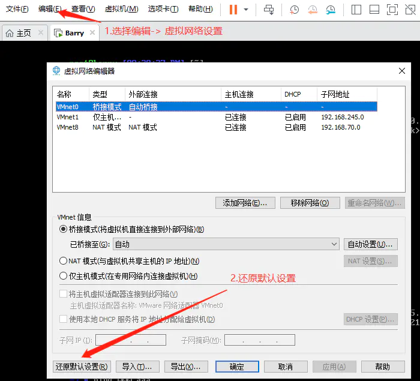
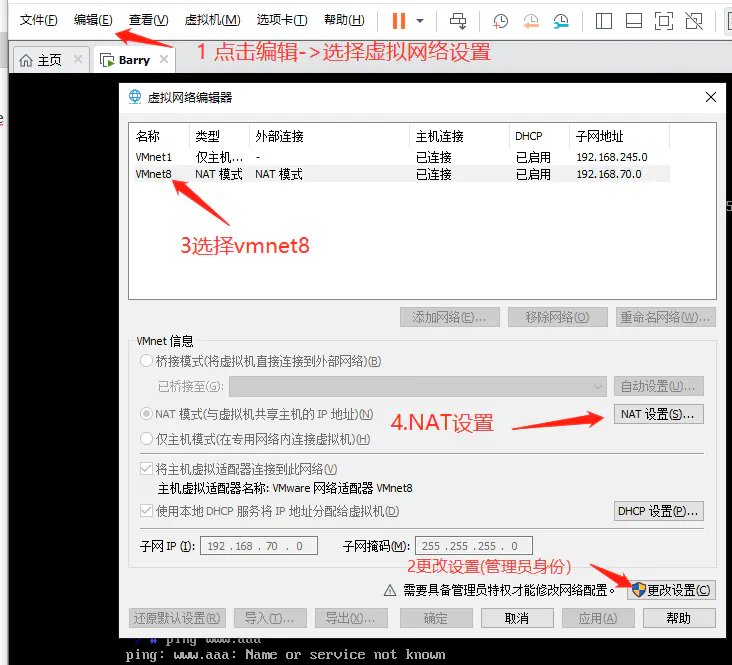
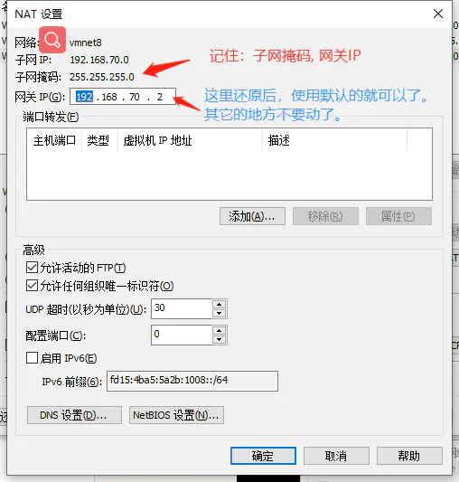
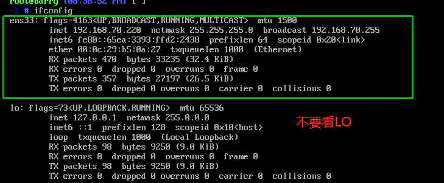
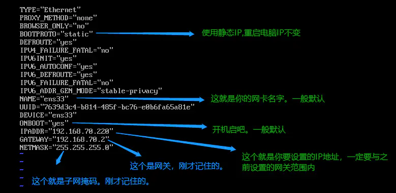
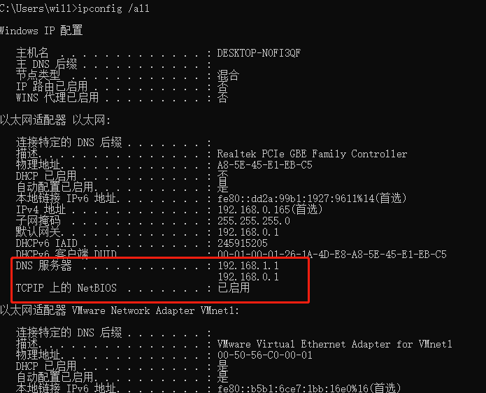

## 第一步：重置虚拟网络设置

VMWARE->编辑->虚拟网络编辑器->  还原默认设置



## NAT设置

记住： 子网掩码和网关IP。 还原后的默认值即可以





## 设置静态IP

`vi /etc/sysconfig/network-scripts/ifcfg-ens33`
 `ifcfg-ens33` 这个名字，每个人的电脑网卡不一样，可以从ifconfig 查看到。






这里还要设置DNS，直接取物理机的DNS即可；通过

```shell
ifconfig /all
```



重启网络服务

```shell
systemctl restart network
```

