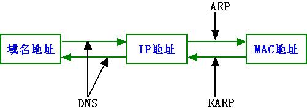
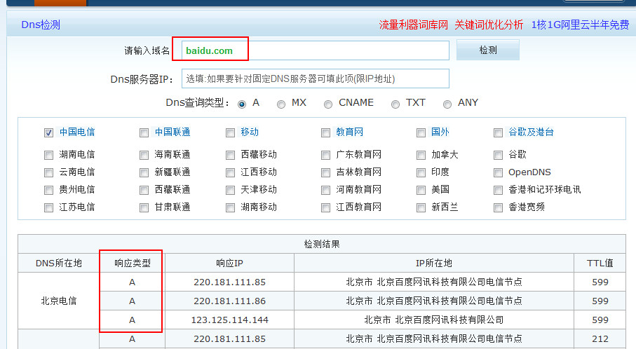

## 什么是域名解析

域名解析就是国际域名或者国内域名以及中文域名等域名申请后做的到IP地址的转换过程。IP地址是网路上标识您站点的数字地址，为了简单好记，采用域名来代替ip地址标识站点地址。域名的解析工作由DNS服务器完成。

## 什么是A记录

A (Address) 记录是用来指定主机名（或域名）对应的IP地址记录。用户可以将该域名下的网站服务器指向到自己的web server上。同时也可以设置您域名的二级域名。

## 什么是 CNAME

**即：别名记录。**这种记录允许您将多个名字映射到另外一个域名。通常用于同时提供WWW和MAIL服务的计算机。例如，有一台计算机名为“host.mydomain.com”（A记录）。它同时提供WWW和MAIL服务，为了便于用户访问服务。可以为该计算机设置两个别名（CNAME）：WWW和MAIL。这两个别名的全称就http://www.mydomain.com/和“mail.mydomain.com”。实际上他们都指向“[host.mydomain.com](http://host.mydomain.com/)”。

------

## CNAME和 A记录区别

#### A记录是解析域名到IP，Cname是解析域名到另外一个域名。

A记录就是把一个域名解析到一个IP地址（Address，特制数字IP地址），而CNAME记录就是把域名解析到另外一个域名。其功能是差不多，CNAME将几个主机名指向一个别名，其实跟指向IP地址是一样的，因为这个别名也要做一个A记录的。但是使用CNAME记录可以很方便地变更IP地址。如果一台服务器有100个网站，他们都做了别名，该台服务器变更IP时，只需要变更别名的A记录就可以了。

一台服务器可以布置多个网站，也可以有多个域名

如：域名A—–>A记录—–>真正的服务器（IP）

域名B（也叫A别名）

域名C（也叫A别名）

如果B，C此时也是通过A记录的形式到真正的服务器，那么哪一天真正的服务器修改了，A,B，C都得修改。

而如果把B，C都解析到A，那么如果修改的话，只需要修改A即可。

如何做呢？把B，C通过Cname解析到A即可。

------

## 为什么要有CNAME

#### 1. 降低多域名、多服务器、多业务的运维成本

通过将域名CNAME到新的地址后，降低权威DNS配置的复杂性，将变化频繁的配置（比如说A记录、MX记录）、功能业务（智能多线、CDN分发）等切割分离，出现故障后排查简单明了，是谁的问题就是谁的问题，而且权威DNS更新后在全球同步是需要时间的，所以在调整上越少越好，目前行业竞争激烈，保证好的用户体验以及网站的高可用性非常重要。

#### 2. 多个域名、多种业务解析到同一个主机，同时不影响搜索引擎收录。

有多个域名（www、mail、news）服务要对应同一个公网服务器，服务器对外的域名是host.aaaabb.aaaa.aaaa.com.cn（可能公网IP后面对应着服务器集群，而且公网IP有可能会变化），这是一个典型的应用场景，通过将这些域名的CNAME指向host.aaaabb.aaaa.aaaa.com.cn就可以实现这个需求，而且不必去关心CNMAE后服务器的结构和变化，对于业主的维护来说非常简单，同时不影响到搜索引擎对你原域名的收录。

#### 3. 解决多线以及CDN分发加速问题。

对于多线问题，通过CNAME后，可以在CNAME上做智能DNS，电信的用户走电信的链路、联通的用户走联通的链路，提升用户体验，节约链路成本，对于CDN的分发加速，大多数是通过CNAME加个GSLB（全球负载均衡）来实现，把你的域名CNAME到CDN厂家给你的域名上，剩余的事情就不用操心了，当然也可以自建CDN，自己搭一个GSLB做调度分发。

#### 4. 解决高并发下性能负载问题。

其实业务分离、CDN分发已经无形解决了一部分负载问题，大的网站并发是很厉害的，为了在解析环节不出问题，就需要买付费DNS，造成成本增高，并且不方便维护，这时你可以CNAME到某一个域名，设置CNAME后域名的NS为自己搭建的DNS，还有种方式可以直接配置forword，这样可以把智能解析的业务压力放在你自己的DNS上，应用场景是灵活千变万化的，万变不离其宗。

## 参考资料

[网络基础知识之————A记录和CNAME记录的区别](https://www.cnblogs.com/tinywan/p/6207336.html)

[域名解析cname和A记录](https://driverzhang.github.io/post/%E5%9F%9F%E5%90%8D%E8%A7%A3%E6%9E%90cname%E5%92%8Ca%E8%AE%B0%E5%BD%95/)