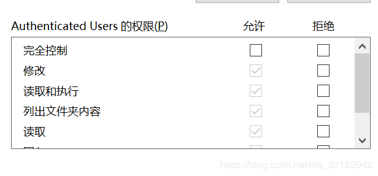
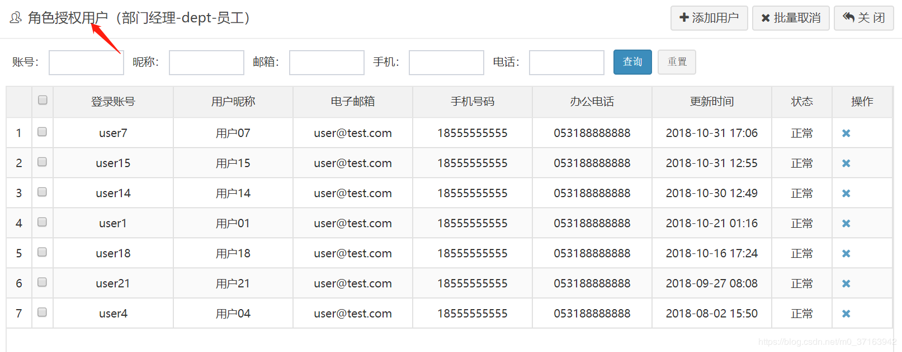
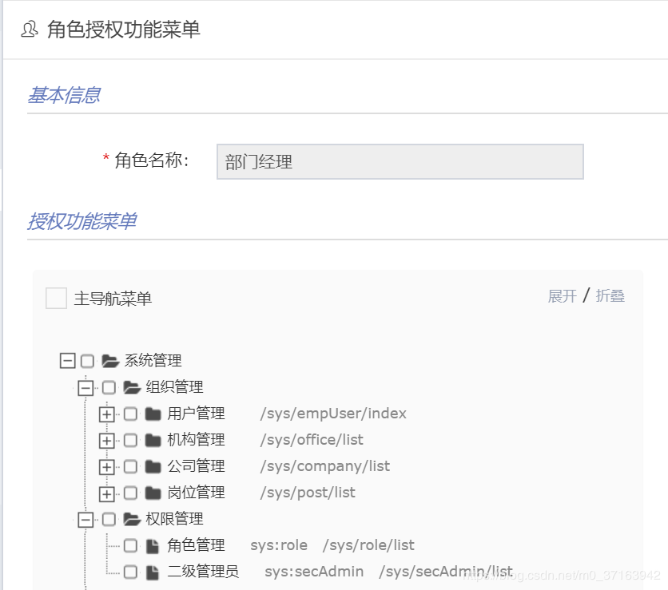

# 权限系统的设计模式 ACL RBAC ABAC

## **ACL**（Access Control List）:访问权限列表 如：

 

user1-->AC1

user1-->AC2

user2-->AC1  此时权限汇总成一个列表

这种设计最常见的应用就是文件系统的权限设计，如微软的NTFS

对权限控制比较分散，不便于管理，比如无法简单地将一组文件设置统一的权限开放给指定的一群用户

## **RBAC**(Role Base Access Control):基于角色的权限控制

与ACL 对比 RBAC不用给用户单个分配权限，只用指向对应的角色就会有对应的权限，而且分配权限和收回权限都很方便

如菜单权限的设计：用户与角色关联，角色与菜单关联

 

## **ABAC（Attribute Base Access Control）** 基于属性的权限控制

不同于常见的将用户通过某种方式关联到权限的方式，ABAC则是通过动态计算一个或一组属性来是否满足某种条件来进行授权判断（可以编写简单的逻辑）。属性通常来说分为四类：用户属性（如用户年龄），环境属性（如当前时间），操作属性（如读取）和对象属性（如一篇文章，又称资源属性），所以理论上能够实现非常灵活的权限控制，几乎能满足所有类型的需求。

例如规则：“允许所有班主任在上课时间自由进出校门”这条规则，其中，“班主任”是用户的角色属性，“上课时间”是环境属性，“进出”是操作属性，而“校门”就是对象属性了。为了实现便捷的规则设置和规则判断执行，ABAC通常有配置文件（XML、YAML等）或DSL配合规则解析引擎使用。XACML（eXtensible Access Control Markup Language）是ABAC的一个实现，但是该设计过于复杂，我还没有完全理解，故不做介绍。

总结一下，ABAC有如下特点：

1. 集中化管理
2. 可以按需实现不同颗粒度的权限控制
3. 不需要预定义判断逻辑，减轻了权限系统的维护成本，特别是在需求经常变化的系统中
4. 定义权限时，不能直观看出用户和对象间的关系
5. 规则如果稍微复杂一点，或者设计混乱，会给管理者维护和追查带来麻烦
6. 权限判断需要实时执行，规则过多会导致性能问题

既然ABAC这么好，那最流行的为什么还是RBAC呢？

我认为主要还是因为大部分系统对权限控制并没有过多的需求，而且ABAC的管理相对来说太复杂了。[Kubernetes便因为ABAC太难用，在`1.8`版本里引入了RBAC的方案](https://link.jianshu.com/?t=http://blog.kubernetes.io/2017/04/rbac-support-in-kubernetes.html)。

> ABAC有时也被称为PBAC（Policy-Based Access Control）或CBAC（Claims-Based Access Control）。

## casbin

https://github.com/casbin/casbin

一个支持ACL、RBAC和ABAC的权限管理框架，使用go语言编写