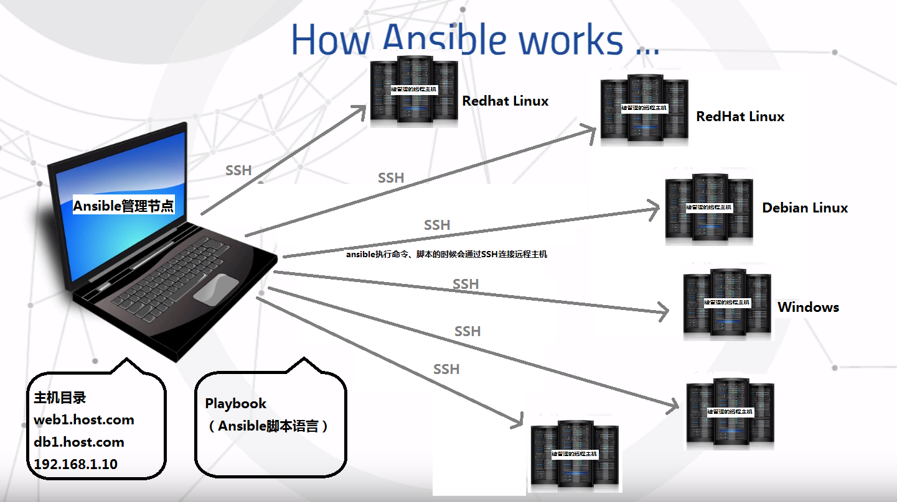

# Ansible

## 什么是Ansible?

Ansilbe是一个部署一群远程主机的工具。远程的主机可以是远程虚拟机或物理机， 也可以是本地主机。

## Ansible能做什么？

Ansilbe通过SSH协议实现远程节点和管理节点之间的通信。理论上说，只要管理员通过ssh登录到一台远程主机上能做的操作，Ansible都可以做到。

包括：

- 拷贝文件
- 安装软件包
- 启动服务
- …

## Ansible的架构

Ansilbe管理员节点和远程主机节点通过ssh协议进行通信。所以Ansible配置的时候只需要保证从Ansible管理节点通过SSH能够连接到被管理的远程的远程节点即可。。但是SSH必须配置为公钥认证登录方式

## 连接方式SSH

在管理员节点安装Ansible，编写脚本。在管理节点执行命令或者脚本时，通过SSH连接被管理的主机。 被管理的远程节点不需要进行特殊安装软件。

Ansible可以同时管理Redhat系的Linux，Debian系的Linux，以及Windows主机。管理节点只在执行脚本时与远程主机连接，没有特别的同步机制，所以断电等异常一般不会影响ansbile。

# Ansible Tower的架构

## 为什么要有Ansbile Tower

Ansilbe Tower一款针对企业用户的收费软件。

在上一节的Ansible架构中和下一章Ansbile的安装中会讲到，每一台被ansible远程管理的主机，都需要配置基于key的ssh连接。个人用户管理几台虚拟机和远程主机不会有什么问题，但是对于企业级用户，则满足不了业务和安全上的需求。

- 首先，每增加一台主机，都需要手工配置一下ssh连接，企业级的pc主机成百上千，每个管理员都需要在自己的电脑上配置所有的ssh连接，无疑工作量巨大。
- 还有，在安全方面如果管理员能够拿到ssh key，或者拷贝给别人，对于生产环境来说无疑是最大的安全隐患。

## Ansible Tower能做什么

Ansile Tower则是针对企业级用户的，中心化ansible管理节点。它向管理员提供 Web 页面接口，来运行ansible脚本playbook。

- 管理员在ansible tower上使用和分享主机的ssh key，但是不能查看和拷贝key文件。
- 登录ansible tower的所有管理员可以共享playbook脚本，减少重复工作。
- 此外ansible还可以收集和展现所有主机的playbook的执行状况，便于统计和分析主机的状态。

说了这么多，看下面这张架构图就清晰了：

## 参考资料

[ Ansible入门](https://getansible.com/README)

