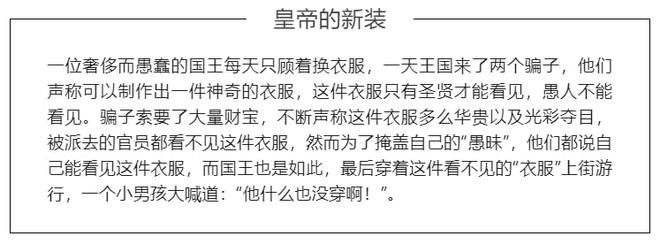

最近看到李永乐的视频[
你真的看懂《皇帝的新装》了吗？心知肚明和说出来有啥区别 ](https://www.youtube.com/watch?v=b7NZfkqFc6k)

受益非浅，于是记录一下。

什么是《皇帝的新装》，来自于著名作家安徒生的童话，

### 红眼睛、蓝眼睛

我们首先来讨论一个逻辑问题，这个问题最早是由华裔数学家陶哲轩提出的。

一个村子中有100个人，其中95个人的眼睛是蓝色的，5个人的眼睛是红色的。村子里有一个奇怪的规矩：虽然每个人都能看到其他人的眼睛是什么颜色，但是不知道自己眼睛的颜色，村子里也绝对禁止讨论有关眼睛颜色的任何话题。**一旦因为某些原因——例如照镜子，一个人知道了自己眼睛的颜色，他必须在第二天中午到村子里的广场上自杀**。

有一天，村子里来了一个外乡人，这个外乡人在村子里度过了一段愉快的时光。临走前，村子举办舞会欢送这个外乡人。外乡人说：我这几天非常开心，最让我开心的是：**我在村子里发现了和我一样的红眼睛的人**。

说到这句话，村子里的空气凝固了。外乡人立刻感觉到自己讨论眼睛的颜色违背了村子的风俗，于是尴尬的离开了村子。不过他回头一想：其实自己也没说出什么，因为村子里有5个红眼睛的人，就算他不说，每个人也都能看到村子里有红眼睛的人。自己并没有带来什么新的信息。这样一想，外乡人的负罪感就轻了一些。

结果，到了第五天，村子里的**五个红眼睛的人到村子中的广场上，集体自杀了**。

### 这是为什么？

为什么到了第五天，红眼睛的人会集体自杀呢？他们是如何知道自己眼睛颜色的？让我们一步步来讨论这个逻辑。

首先我们假设：**村子里只有1个红眼睛的人和99个蓝眼睛的人**。红眼睛的人会看到99个蓝眼睛的人，但是不知道自己的眼睛是什么颜色。当外乡人说出：村子里有红眼睛的人这句话时，他立刻会想到：**村子里其他人都是蓝眼睛，那唯一一个红眼睛的人只能是自己**，于是，第二天中午，这个红眼睛的人就会在广场上自杀。

我们继续想：**假如村子里有2个红眼睛的人A和B**，以及和98个蓝眼睛的人。A和B都会看到98个蓝眼睛人和1个红眼睛人，但他不知道自己的眼睛什么颜色。当外乡人说：村子里有红眼睛的人这句话时，A村民就会想到：**假如自己不是红眼睛，那么B将看到99个人都不是红眼睛，于是B立刻会知道自己是红眼睛，这个倒霉蛋明天中午就会自杀了。**同样，B也会这样想：A会在明天中午自杀。

然而，到了第二天中午，A和B都没有自杀。这时他们猛然反应过来：**自己的想法是错的，村子里不可能只有一个红眼睛。那么除了对方以外，另外一个红眼睛的人一定是自己了。**于是，到了第三天中午，两个人就都会在广场上自杀…

按照这种逻辑，如果村子里有5个红眼睛的人，从那天夜里开始数，到了第五天中午，这五个人就都会在村中广场上自杀。幸好，外乡人没有说村子里有蓝眼睛的人，否则这个村子就一个人都剩不下了。

### 共有知识和公共知识

如果我们回过头来再去思考问题本身：每一个村民的确早就知道其他人眼睛的颜色，也都知道村子里有红眼的人，外乡人的确并没有说出什么新花样。为什么他说出了一句每个人都知道的话，却有这么大的杀伤力呢？

经济学家威廉.阿瑟.刘易斯提出了一个概念：共有知识（Mutual knowledge）和公共知识（Commonknowledge），恰好可以解释这个问题。

**共有知识（Mutual knowledge）**：每个人都知道，但不确定别人是否知道，也不确定别人是否知道自己知道。例如：一个警察抓住了一个罪犯，警察认定罪犯有罪，罪犯当然也知道自己有罪。但是罪犯认为：只要自己不承认，警察就不能确定自己有罪，此时有罪这件事就是共有知识。

**公共知识（Commonknowledge）**：不光每个人都知道，而且每个人都知道其他人也知道。假如刚才的罪犯招供了，在认罪书上签字，那么无论是警察还是罪犯不光知道了犯罪的事实，而且知道这个事实对方也都知道了，于是共有知识就变成了公共知识。

我们再举一个例子：假如有一个男孩和一个女孩，他们彼此爱慕，但是又羞于说出口。从两个人的言谈举止，两人都知道自己爱对方，对方也爱自己，但他们无法确定对方是否也跟自己一样知道这件事，此时相爱就是共有知识。一旦有一方表白，另一方接受，不光每个人都知道彼此相爱，而且也知道了对方也知道这件事，共有知识就变成了公共知识。

实际上，一件事情要变为公共知识，它的严格定义是一个无限嵌套的过程：

1.大家都知道这件事

2.大家都知道{大家都知道这件事}

3.大家都知道{大家都知道{大家都知道这件事}

4.…

> 如果一件事情只满足条件1，它就是共有知识，满足所有条件时，才能变为公共知识。从共有知识变为公共知识只需要简单的一个步骤：**公开的讨论**。

例如：刚才的逻辑问题中，“村子里有红眼睛的人”这件事每个人都心知肚明，但是因为没有经过讨论，它只是共有知识——每个人并不清楚其他人是否知道这件事，也不知道其他人是否知道自己知道这件事。

当外乡人说出了那句“村子里有红眼睛的人”之后，每个村民都知道了：不光自己知道村子里有红眼睛的人，所有其他人也都知道这件事，而且其他人也知道我自己知道这件事…共有知识就变成了公共知识。一句简单的话，改变了整个村子的知识构成。

### 呐喊的力量

我们再来研究一下《皇帝的新装》这篇童话。当皇帝穿上骗子的“衣服”在街上游行时，所有人都看到了皇帝是赤身裸体的，但是没有人说出来，此时“皇帝没穿衣服”就是共有知识。当一个小男孩说：“可是皇帝什么都没穿呀”的时候，所有人都开始小声嘀咕，最终每个人都知道：不光我知道“皇帝没穿衣服”，所有人都知道“皇帝没穿衣服”，共有知识就变成了公共知识。

共有知识和公共知识的作用是不一样的，从共有知识变为公共知识的方法就是讨论。鲁迅写了一篇文集《呐喊》，**大家只有把心知肚明的事情说出来，这件事才能影响社会。**

例如股票市场上有些垃圾股，虽然公司盈利能力很差，但是股价长期维持在高位。每一个购买这只股票的投资者可能都知道这是一个垃圾股，但是他们并不清楚别人是否也知道这件事。于是他们期待着也许有更傻的人来接盘。也许有一天，一篇报道突然揭露了这只股票是垃圾股的事实，结果每个人都知道：不光自己知道它是垃圾股，所有人都知道它是垃圾股了，再也不会有人接盘了。于是股价就一落千丈。

再比如市场上有很多智商税的产品，每天宣称自己有多么大的作用，但实际上它可能什么用都没有。你知道，我知道，大家都知道，此时“垃圾产品”这件事就是共有知识。但是除非有一天，有人喊出了这句话：“这是一个垃圾产品，大家不要买！”，共有知识才能变成公共知识。所以，这个产品的厂商会非常害怕这件事，他们会想尽一切办法让这样的声音消失，不让共有知识变成公共知识。

在很多年前，有两个科学家：哥白尼和布鲁诺，他们说：地球是围绕太阳转的。这件事其实很多科学家都知道。但是只有当他们把这件事呐喊出来，共有知识变成了公共知识之后，真理才能真正的深入人心。